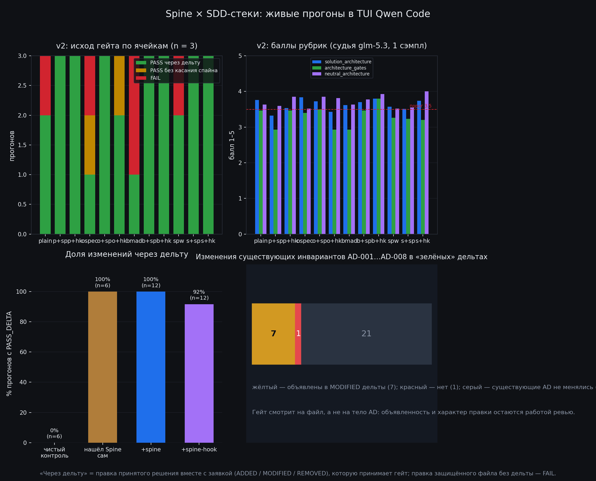

# Spine × SDD-стеки — живые прогоны в TUI Qwen Code

[](#три-числа-которые-стоит-унести)
[-2ea043)](docs/02-preregistration-v2.md)
[](#три-числа-которые-стоит-унести)
[](DATA-LICENSE)

**Что даёт контур архитектурного контроля, подключённый к уже выбранному SDD-стеку?**
Ответ получен экспериментом: 68 живых прогонов Qwen Code в роли solution-архитектора банка,
факторная сетка «4 стека × 3 режима Spine», единый гейт, слепой судья и полные артефакты
каждого прогона — в этом репозитории.

<p align="center">
  
</p>

> **English abstract.** A live, pre-registered benchmark of architectural control in coding
> agents. 68 sessions of Qwen Code acting as a bank solution architect on a brownfield case
> (`sbp-gateway`, SBP subscriptions). Factor: *stack* {plain, OpenSpec, BMAD, superpowers} ×
> *Spine mode* {none, advisory MCP+skills, blocking Stop-hook}. Headline: connecting the
> architecture-control layer raises the share of changes made through the accepted process
> (`PASS_DELTA`) from **50 % to 100 %** (pooled Fisher p = 0.0028) without degrading judged
> content quality — while 24 of 29 "green" deltas silently rewrote existing invariants.
> Every raw artifact, transcript and screenshot is included. Docs are in Russian.

---

## Три числа, которые стоит унести

| | без Spine | + Spine (советующий) | + Spine (блокирующий хук) |
|---|---|---|---|
| **Изменение внесено принятым способом** (PASS_DELTA) | 6 / 12 | **12 / 12** | 11 / 12 |
| Провал гейта (FAIL) | 5 / 12 | 0 | 0 |
| «Зелёный» гейт без касания принятой архитектуры | 1 / 12 | 0 | 1 / 12 |

Пул по четырём стекам: **23/24 против 6/12, точный тест Фишера p = 0.0028.**

И рядом — то, что делает результат честным, а не рекламным:

> **24 из 29 «зелёных» дельт изменили существующие инварианты** AD-001…AD-008,
> и `delta_guard` этого не увидел: он проверяет изменение на уровне файла, а дельта
> декларирует, что «существующие AD не меняются». Контур даёт дисциплину процесса —
> он не даёт гарантии сохранности смысла принятых решений.

---

## Что именно измерялось

Поле — один и тот же brownfield-кейс: платёжный шлюз СБП (C2B-приём) и изменение
«СБП-подписки» (рекуррентные списания по согласию плательщика). Задание `TASK.md`
одинаково для всех ячеек, роль — solution-архитектор банка, хост — Qwen Code 0.24.6
в живом TUI (tmux), решатель — `deepseek-flash` (DeepSeek-V4.1-Flash), судья — `glm-5.3`
(другое семейство).

| Фактор | Уровни |
|---|---|
| Стек | `plain`, `openspec`, `bmad`, `superpowers` |
| Режим Spine | нет · `+spine` (MCP-сервер и скиллы) · `+spine-hook` (блокирующий Stop-хук) |

12 ячеек × 3 повтора = **36 прогонов основного анализа**; плюс пилот (12), плюс две волны v1
(12 и 8) — итого **68 живых сессий**, и все они лежат здесь.

**Детерминированный слой** (без LLM, единая линейка): `arch-be gate` и класс исхода
`PASS_DELTA / PASS_UNTOUCHED / FAIL`, `delta_guard`, анти-ослабление правил, линтер спайна,
трассировка, `contract-diff`, правки защищённых файлов, состав SKIP, счётчик срабатываний хука.
**Смысловой слой**: рубрики Spine (`solution_architecture`, `architecture_gates`, …)
и нейтральная рубрика, написанная **не** автором Spine (ISO/IEC/IEEE 42010, arc42, ADR по Nygard).

---

## Что здесь есть для архитектора

| Раздел | Зачем |
|---|---|
| [`docs/01-method.md`](docs/01-method.md) | дизайн, метрики, решающие правила, почему именно так |
| [`docs/02-preregistration-v2.md`](docs/02-preregistration-v2.md) | пререгистрация со sha256 всех входов и 18 объявленными отклонениями |
| [`docs/03-preflight.md`](docs/03-preflight.md) | преднастройка: тест Stop-хука на незакоммиченной работе, форматы гейта |
| [`docs/04-pilot.md`](docs/04-pilot.md) | пилот: тайминги, работа хука, найденные утечки |
| [`docs/05-corrections-to-v1.md`](docs/05-corrections-to-v1.md) | **11 исправлений к первому отчёту** — что было интерпретировано неверно |
| [`docs/06-findings.md`](docs/06-findings.md) | находки об инструментах: F1–F9 и что они значат на практике |
| [`docs/07-limitations.md`](docs/07-limitations.md) | ограничения: где числам нельзя верить |
| [`docs/08-series-map.md`](docs/08-series-map.md) | карта серии: v1 → CALM → v2, что чем отличается |
| [`results/manifest.csv`](results/manifest.csv) | **все 68 прогонов** одной таблицей: класс гейта, рубрики, стена, файлы |
| [`results/runs/`](results/runs) | по каждому прогону: метрики, оценка судьи, транскрипт и **артефакты агента** |
| [`evidence/`](evidence) | кадры живого TUI из каждого прогона (сняты из панели tmux, не из X) |
| [`harness/`](harness) | весь код прогона: драйвер TUI, установка стеков, скоринг, статистика |
| [**Релиз v2.0**](https://github.com/romannekrasovaillm/spine-sdd-bench/releases/tag/v2.0) | отчёт Word и PDF одним файлом — если хочется читать не с экрана |

---

## Пять выводов, которые можно применять завтра

1. **Контур контроля работает как фактор, а не как украшение.** Добавление Spine переводит
   в «принятый способ» все четыре стека: BMAD 1/3→3/3, superpowers 2/3→3/3, OpenSpec 1/3→3/3,
   голый агент 2/3→3/3. Это не эффект одного удачного стека.
2. **Блокирующий хук не обязателен.** Советующий режим (MCP + скиллы, без хука) дал 12/12;
   хук — 11/12 и заметно дороже по времени. Дисциплину даёт доступ к процессу, а не наказание.
3. **Содержание не проседает.** Средние баллы по рубрикам при включении Spine не падают:
   `neutral_architecture` даже растёт (3.58 → 3.70 → 3.90). «Контроль убивает качество» —
   не подтверждается.
4. **Гейт надо читать трёхзначно.** Из 12 прогонов без Spine один был «зелёным», но
   **не касался принятой архитектуры** (`PASS_UNTOUCHED`): изменение жило вне решения.
   PASS/FAIL скрывает этот класс — отсюда трёхзначный `gate_class`.
5. **Слепая зона — смысл, а не процесс.** 24 из 29 зелёных дельт переписывали существующие
   инварианты. Контур ловит способ изменения и не ловит подмену смысла: это работа
   смысловых рубрик и человека, и об этом гейт честно пишет в паспорте вердикта.

---

## Как читать репозиторий за 10 минут

1. **`charts/dashboard.png`** — вся картина на одном экране.
2. **`results/manifest.csv`** — откройте в таблице, отсортируйте по `gate_class`: видно,
   что `FAIL` и `PASS_UNTOUCHED` встречаются ровно в ячейках без Spine.
3. **`results/runs/v2/bmad-r1/`** против **`results/runs/v2/bmad+spine+r1/`** — один и тот же
   стек, два режима: сравните `score.json` (класс гейта) и `artifacts/` (что реально написал агент).
4. **`evidence/v2/`** — кадры живого TUI: видно вызовы MCP-инструментов Spine, работу Stop-хука
   и плашку прогона.
5. **`docs/05-corrections-to-v1.md`** — если вы читали первый отчёт: там сказано, какие выводы
   пришлось снять.

---

## Честные ограничения (читать до цитирования)

- **n = 3 на ячейку вместо 6.** По таблице мощности руководства подтверждающие тесты H1
  при таком n недооценены; поэтому в отчёте есть и per-stack тесты (незначимые), и пул
  (p = 0.0028) как исследовательский результат.
- **Судья — LLM, 1 сэмпл на критерий** (латентность `glm-5.3` на досье — 250–500 с).
- **Слепота судьи по фактору Spine нарушена:** в проверке он угадал инструмент 4/6 (67 % при
  случайном уровне 20 %), всегда отвечая «E». Рубричные сравнения «со Spine / без Spine»
  помечены как ненадёжные; детерминированный результат от судьи не зависит.
- **`adr_quality` и `macedo_dimensions` не оценены** в основном прогоне (бюджет судейского
  времени) и в таблицах стоят как «—».
- **32 из 36 прогонов** имеют хотя бы одно обращение к путям вне своей ячейки по детектору
  `contamination()`; часть срабатываний — шум регулярного выражения, но в 2 из 12 пилотных
  ячеек агент действительно читал исходники Spine (`~/spine-bank/src`). На основной прогон
  клон Spine убран из `$HOME` агента, рабочие каталоги обезличены.
- **X11-снимки основного прогона вышли чёрными** (дисплей уходил в затемнение), поэтому
  доказательства — покадровые снимки панели tmux: они воспроизводят содержимое TUI дословно
  и от состояния экрана не зависят.

Полный список отклонений от пререгистрации — в `docs/02-preregistration-v2.md`, раздел
`DEVIATIONS` (18 пунктов с причинами). Мы публикуем их, а не прячем: без этого числа выше
означали бы не измерение, а рекламу.

---

## Воспроизведение

```bash
# 1. хост и инструменты
npm i -g @qwen-code/qwen-code@0.24.6          # автообновление выключить
curl -L -o ~/.local/bin/arch-be \
  https://github.com/romannekrasovaillm/spine-bank/releases/latest/download/arch-be-core-linux-x86_64
chmod +x ~/.local/bin/arch-be

# 2. содержание: кейс + задание
#    кейс — «кейсы/sbp-gateway» из spine-bank, задание — kit/TASK.md
# 3. установка 12 ячеек факторной сетки (проверяется verify_install)
python3 harness/bench/bench.py install --conditions "$(cat harness/conditions.txt)" --reps 3
# 4. живые прогоны в TUI (tmux), решатель — deepseek-flash
python3 harness/bench/bench.py run  --conditions "$(cat harness/conditions.txt)" --reps 3 --parallel 6
# 5. скоринг: детерминированный слой + судья glm-5.3
python3 harness/bench/bench.py score --conditions "$(cat harness/conditions.txt)" --reps 3
# 6. сводки и отчёт
python3 harness/kit/report_v2.py results/live.jsonl
python3 harness/bench/report_v2_docx.py
```

Полный код с комментариями — в `harness/`; рубрики (включая нейтральную) — в
`harness/kit/rubrics/`.

---

## Лицензии и цитирование

- Код (`harness/`): **MIT** — см. [`LICENSE`](LICENSE).
- Данные, тексты, артефакты прогонов и изображения: **CC BY 4.0** — см.
  [`DATA-LICENSE`](DATA-LICENSE).
- Цитирование: [`CITATION.cff`](CITATION.cff).

Артефакты прогонов созданы моделью-решателем и содержат её ошибки; они опубликованы как есть,
чтобы результат можно было проверить, а не поверить.
