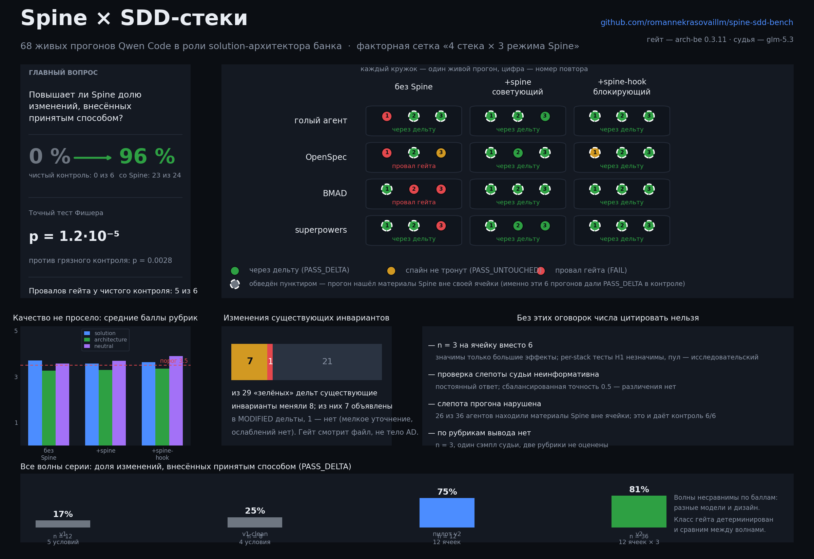

# Spine × SDD-стеки — живые прогоны в TUI Qwen Code

[](#три-числа-которые-стоит-унести)
[-2ea043)](docs/02-preregistration-v2.md)
[](#три-числа-которые-стоит-унести)
[](DATA-LICENSE)

**Что даёт контур архитектурного контроля, подключённый к уже выбранному SDD-стеку?**
Ответ получен экспериментом: 68 живых прогонов Qwen Code в роли solution-архитектора банка,
факторная сетка «4 стека × 3 режима Spine», единый гейт, слепой судья и полные артефакты
каждого прогона — в этом репозитории.

<p align="center">
  
</p>

<sub>Одна картинка — весь эксперимент: эффект контура на матрице 12 ячеек, чистый контроль
против загрязнённого, баллы рубрик, изменения существующих AD (8 из 29, из них 7 объявлены)
и все четыре волны серии. Подробная разбивка —
[`charts/dashboard.png`](charts/dashboard.png), сырые данные — [`results/manifest.csv`](results/manifest.csv).</sub>

> **English abstract.** A live, pre-registered benchmark of architectural control in coding
> agents. 68 sessions of Qwen Code acting as a bank solution architect on a brownfield case
> (`sbp-gateway`, SBP subscriptions). Factor: *stack* {plain, OpenSpec, BMAD, superpowers} ×
> *Spine mode* {none, advisory MCP+skills, blocking Stop-hook}. Headline: access to the
> architecture-control process makes an agent change the accepted architecture the accepted way
> — **23 of 24** runs with Spine, versus **0 of 6** clean control runs (Fisher p = 1.2e-5,
> exploratory). The six passing control runs had all found Spine material outside their sandbox,
> so the run was not blind; wave v2.1 re-runs the control inside a filesystem sandbox.
> **8 of 29** passing deltas modified existing invariants — all in Spine cells, 7 of 8 declared
> in the delta's `MODIFIED` section, none weakening. Judged content quality: **no conclusion**
> (n = 3, one judge sample, blindness test uninformative). Every raw artifact, transcript and
> screenshot is included. Docs are in Russian.

---

## Три числа, которые стоит унести

| | без Spine,<br>чистые | без Spine,<br>нашли Spine сами | + Spine<br>(советующий) | + Spine<br>(хук) |
|---|---|---|---|---|
| **Изменение внесено принятым способом** (PASS_DELTA) | **0 / 6** | 6 / 6 | **12 / 12** | 11 / 12 |
| Провал гейта (FAIL) | 5 / 6 | 0 / 6 | 0 | 0 |
| «Зелёный» гейт без касания принятой архитектуры | 1 / 6 | 0 / 6 | 0 | 1 / 12 ¹ |

¹ `openspec+spine-hook` r1 — сбой среды: MCP-сервер Spine в сессии не поднялся, агент записал в память `spine-cli-unavailable` и спайн не трогал. Без этой ячейки хук даёт 11/11 (анализ чувствительности).

Пул по ITT: **23/24 против 6/12, p = 0.0028**. Против **чистого** контроля: **23/24 против 0/6, p = 1.2·10⁻⁵**. Оба теста исследовательские, вне пререгистрации.

И рядом — то, что делает результат честным, а не рекламным:

> **8 из 29 «зелёных» дельт изменили существующие инварианты** AD-001…AD-008 — все в ячейках
> со Spine. В 7 из 8 изменения перечислены в разделе `MODIFIED` дельты; по сути это расширение
> области действия (новые `Binds`, правило распространено на мандаты), ослаблений нет.
> `delta_guard` проверяет изменение на уровне файла, поэтому объявленность и характер правки
> остаются работой ревью. Первая публикация называла 24 из 29 — это была ошибка подсчёта
> (граница последнего AD-блока захватывала хвост файла), см. [`docs/06-corrections-to-v2.md`](docs/06-corrections-to-v2.md).

---

## Что показали прогоны

> Доступ агента к процессу Spine почти детерминированно приводит к изменению принятой
> архитектуры через дельту: 23 из 24 прогонов со Spine. Доступ может быть штатным (MCP и скиллы)
> или случайным (найденный вне песочницы `arch-be` и его материалы — 6 из 6). Без такого
> доступа — 0 из 6. Блокирующий хук сверх советующего режима долю не повышает и примерно
> вдвое удлиняет сессию (медиана 990 с против 536 с). Существующие инварианты меняли 8 из 29
> зелёных дельт, почти всегда с явной записью в `MODIFIED`; это расширение области действия,
> а не ослабление. О качестве содержания пакета эти данные ничего не говорят. Контроль был
> загрязнён, а слепота прогона нарушена, поэтому волна v2.1 перезапускается в файловой песочнице.

---

## Что именно измерялось

Поле — один и тот же brownfield-кейс: платёжный шлюз СБП (C2B-приём) и изменение
«СБП-подписки» (рекуррентные списания по согласию плательщика). Задание `TASK.md`
одинаково для всех ячеек, роль — solution-архитектор банка, хост — Qwen Code 0.24.6
в живом TUI (tmux), решатель — `deepseek-flash` (DeepSeek-V4.1-Flash), судья — `glm-5.3`
(другое семейство).

| Фактор | Уровни |
|---|---|
| Стек | `plain`, `openspec`, `bmad`, `superpowers` |
| Режим Spine | нет · `+spine` (MCP-сервер и скиллы) · `+spine-hook` (блокирующий Stop-хук) |

12 ячеек × 3 повтора = **36 прогонов основного анализа**; плюс пилот (12), плюс две волны v1
(12 и 8) — итого **68 живых сессий**, и все они лежат здесь.

**Детерминированный слой** (без LLM, единая линейка): `arch-be gate` и класс исхода
`PASS_DELTA / PASS_UNTOUCHED / FAIL`, `delta_guard`, анти-ослабление правил, линтер спайна,
трассировка, `contract-diff`, правки защищённых файлов, состав SKIP, счётчик срабатываний хука.
**Смысловой слой**: рубрики Spine (`solution_architecture`, `architecture_gates`, …)
и нейтральная рубрика, написанная **не** автором Spine (ISO/IEC/IEEE 42010, arc42, ADR по Nygard).

---

## Что здесь есть для архитектора

| Раздел | Зачем |
|---|---|
| [`docs/01-method.md`](docs/01-method.md) | дизайн, метрики, решающие правила, почему именно так |
| [`docs/02-preregistration-v2.md`](docs/02-preregistration-v2.md) | пререгистрация со sha256 всех входов и 18 объявленными отклонениями |
| [`docs/03-preflight.md`](docs/03-preflight.md) | преднастройка: тест Stop-хука на незакоммиченной работе, форматы гейта |
| [`docs/04-pilot.md`](docs/04-pilot.md) | пилот: тайминги, работа хука, найденные утечки |
| [`docs/05-corrections-to-v1.md`](docs/05-corrections-to-v1.md) | **11 исправлений к первому отчёту** — что было интерпретировано неверно |
| [`docs/06-corrections-to-v2.md`](docs/06-corrections-to-v2.md) | **исправления к v2**: ошибка подсчёта инвариантов, чистое окно контроля, разбор слепоты |
| [`docs/07-findings.md`](docs/07-findings.md) | находки об инструментах: F1–F14 и что они значат на практике |
| [`docs/08-limitations.md`](docs/08-limitations.md) | ограничения: где числам нельзя верить |
| [`docs/09-series-map.md`](docs/09-series-map.md) | карта серии: v1 → CALM → v2 → v2.1 |
| [`harness/recheck_v2.py`](harness/recheck_v2.py) | одна команда, воспроизводящая все числа ревью на опубликованных данных |
| [`results/manifest.csv`](results/manifest.csv) | **все 68 прогонов** одной таблицей: класс гейта, рубрики, стена, файлы |
| [`results/runs/`](results/runs) | по каждому прогону: метрики, оценка судьи, транскрипт и **артефакты агента** |
| [`evidence/`](evidence) | кадры живого TUI из каждого прогона (сняты из панели tmux, не из X) |
| [`harness/`](harness) | весь код прогона: драйвер TUI, установка стеков, скоринг, статистика |
| [`charts/`](charts) | одна витрина (`hero.png`) и детальный дашборд (`dashboard.png`) |
| [**Релиз v2.0**](https://github.com/romannekrasovaillm/spine-sdd-bench/releases/tag/v2.0) | отчёт Word и PDF одним файлом — если хочется читать не с экрана |

---

## Пять выводов, которые можно применять завтра

1. **Дело в доступе к процессу, а не в конкретном стеке.** Со Spine изменение принятым
   способом внесли BMAD 3/3, superpowers 3/3, OpenSpec 3/3 и голый агент 3/3; **чистый
   контроль — 0/6, против 0/6 (p = 1.2·10⁻⁵)**. Доступ может быть штатным (MCP и скиллы)
   или случайным: 6 из 6 прошедших контрольных прогонов сами нашли материалы Spine вне
   своей песочницы.
2. **Блокирующий хук не обязателен.** Советующий режим (MCP + скиллы, без хука) дал 12/12;
   хук — 11/12 и заметно дороже по времени. Дисциплину даёт доступ к процессу, а не наказание.
3. **По рубрикам вывода нет.** `neutral_architecture` растёт (3.58 → 3.70 → 3.90),
   `solution_architecture` падает (3.70 → 3.57 → 3.63). При n = 3, одном сэмпле судьи
   и неинформативной проверке слепоты это шум, а не результат. Утверждать «контроль
   не портит содержание» по этим данным нельзя.
4. **Гейт надо читать трёхзначно.** Зелёный гейт без касания принятой архитектуры
   (`PASS_UNTOUCHED`) — отдельный класс: изменение живёт вне решения. PASS/FAIL его скрывает,
   отсюда трёхзначный `gate_class`.
5. **Гейт видит способ, а не содержание изменения.** Существующие AD меняли 8 из 29 дельт,
   и почти всегда это объявленное расширение области действия, а не подмена смысла. Проверять,
   что именно изменилось в теле AD, — работа ревью и смысловых рубрик: гейт смотрит на файл
   и на наличие дельты.

---

## Как читать репозиторий за 10 минут

1. **`charts/hero.png`** (выше) — весь эксперимент на одном экране; детальная разбивка — `charts/dashboard.png`.
2. **`results/manifest.csv`** — откройте в таблице, отсортируйте по `gate_class`: видно,
   что `FAIL` и `PASS_UNTOUCHED` встречаются ровно в ячейках без Spine.
3. **`results/runs/v2/bmad-r1/`** против **`results/runs/v2/bmad+spine+r1/`** — один и тот же
   стек, два режима: сравните `score.json` (класс гейта) и `artifacts/` (что реально написал агент).
4. **`evidence/v2/`** — кадры живого TUI: видно вызовы MCP-инструментов Spine, работу Stop-хука
   и плашку прогона.
5. **`docs/05-corrections-to-v1.md`** — если вы читали первый отчёт: там сказано, какие выводы
   пришлось снять.

---

## Честные ограничения (читать до цитирования)

- **n = 3 на ячейку вместо 6.** По таблице мощности руководства подтверждающие тесты H1
  при таком n недооценены; поэтому в отчёте есть и per-stack тесты (незначимые), и пул
  (p = 0.0028) как исследовательский результат.
- **Судья — LLM, 1 сэмпл на критерий** (латентность `glm-5.3` на досье — 250–500 с).
- **Проверка слепоты судьи неинформативна:** судья все 6 раз ответил одинаково, сбалансированная
  точность 0.5 — различения нет ни в одну сторону. Утверждение «судья видит журнал MCP-вызовов»
  данными не подтверждается (журналов MCP в досье — 0 из 110).
- **`adr_quality` и `macedo_dimensions` не оценены** в основном прогоне (бюджет судейского
  времени) и в таблицах стоят как «—».
- **Слепота прогона нарушена.** 26 из 36 агентов обращались к материалам Spine вне своей
  ячейки (реальный `$HOME` оператора: `arch-be`, `~/.arch-harness`, `~/.arch-ml`), 15 видели
  имя условия в сообщении baseline-коммита, 3 читали файлы харнесса, 2 открывали мета-файлы
  своей ячейки. Все 6 прошедших гейт прогонов без Spine — из числа нашедших Spine сами.
  Поэтому волна v2.1 перезапускает контроль в файловой песочнице.
- **X11-снимки основного прогона вышли чёрными** (дисплей уходил в затемнение), поэтому
  доказательства — покадровые снимки панели tmux: они воспроизводят содержимое TUI дословно
  и от состояния экрана не зависят.

Полный список отклонений от пререгистрации — в `docs/02-preregistration-v2.md`, раздел
`DEVIATIONS` (18 пунктов с причинами). Мы публикуем их, а не прячем: без этого числа выше
означали бы не измерение, а рекламу.

---

## Воспроизведение

```bash
# 1. хост и инструменты
npm i -g @qwen-code/qwen-code@0.24.6          # автообновление выключить
curl -L -o ~/.local/bin/arch-be \
  https://github.com/romannekrasovaillm/spine-bank/releases/latest/download/arch-be-core-linux-x86_64
chmod +x ~/.local/bin/arch-be

# 2. содержание: кейс + задание
#    кейс — «кейсы/sbp-gateway» из spine-bank, задание — kit/TASK.md
# 3. установка 12 ячеек факторной сетки (проверяется verify_install)
python3 harness/bench/bench.py install --conditions "$(cat harness/conditions.txt)" --reps 3
# 4. живые прогоны в TUI (tmux), решатель — deepseek-flash
python3 harness/bench/bench.py run  --conditions "$(cat harness/conditions.txt)" --reps 3 --parallel 6
# 5. скоринг: детерминированный слой + судья glm-5.3
python3 harness/bench/bench.py score --conditions "$(cat harness/conditions.txt)" --reps 3
# 6. сводки и отчёт
python3 harness/kit/report_v2.py results/live.jsonl
python3 harness/bench/report_v2_docx.py
```

Полный код с комментариями — в `harness/`; рубрики (включая нейтральную) — в
`harness/kit/rubrics/`.

---

## Лицензии и цитирование

- Код (`harness/`): **MIT** — см. [`LICENSE`](LICENSE).
- Данные, тексты, артефакты прогонов и изображения: **CC BY 4.0** — см.
  [`DATA-LICENSE`](DATA-LICENSE).
- Цитирование: [`CITATION.cff`](CITATION.cff).

Артефакты прогонов созданы моделью-решателем и содержат её ошибки; они опубликованы как есть,
чтобы результат можно было проверить, а не поверить.
