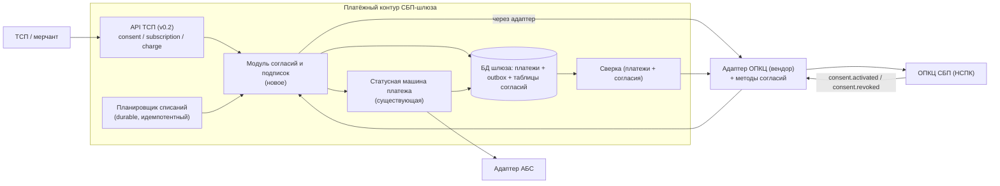
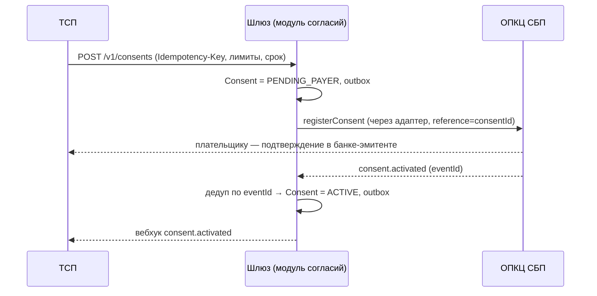
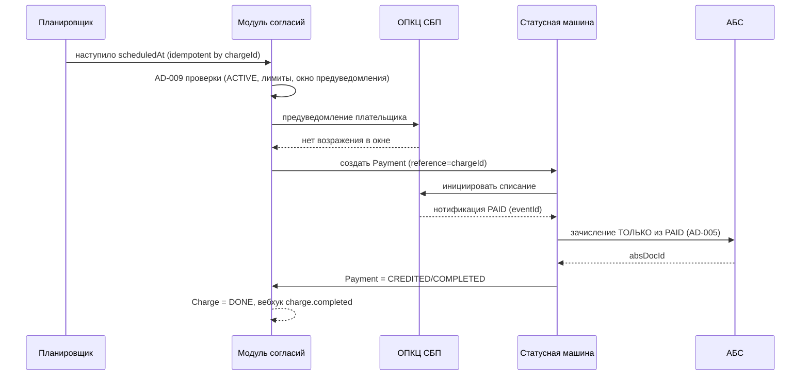

# Solutioning addendum — Рекуррентные C2B-списания (подписки СБП)

- Status: Предложение (на архитектурное решение A3)
- Маршрут: **Critical** (Architecture Significance Score 11/15; сработал forcing-триггер `security_boundary_change`)
- Дата: 2026-09-28
- Owner: solution-architect (платёжный контур)
- Дельта изменения: `changes/sbp-recurrent-c2b/DELTA.md`; решение: `docs/adr/ADR-008-...md`
- Надстройка над принятым решением: `docs/solutioning.md` (не изменяется; дополняется настоящим документом)

## 1. Задача бизнеса

ТСП (онлайн-кинотеатры, ЖКХ, связь) просят **рекуррентные C2B-списания по согласию плательщика** — подписки СБП: клиент один раз даёт согласие в своём банке, далее ТСП списывает регулярно (ежемесячно/по тарифу) без повторного сканирования QR. Сегодня каждый платёж требует QR и активного действия клиента, поэтому подписочные модели (Кинопоиск, ЖКХ, мобильная связь) в СБП-приёме банка не обслуживаются.

## 2. Оценка значимости и маршрута

`significance_score` (15 канонических триггеров) → **11/15, маршрут Critical**.

| Триггер | Значение | Почему |
|---|---|---|
| `security_boundary_change` | **true (forcing)** | Меняется модель авторизации: раньше платёж невозможен без активного действия плательщика в каждой операции; теперь инициатор списания — ТСП по хранимому мандату. Это новая граница «кто может двигать деньги плательщика» |
| `criticality_or_exception` | true (forcing) | Платёжный контур, КИИ, 161-ФЗ |
| `api_contract_change` | true | Новые ресурсы consent/subscription/charge в API ТСП |
| `data_contract_change` | true | Новые данные (согласие, расписание, ПДн плательщика) |
| `consistency_model_change` | true | Согласованность «согласие ↔ списание ↔ НСПК»; гонка отзыва согласия с летящим списанием |
| `cross_domain_integration` | true | Домен ТСП ↔ банк плательщика через ОПКЦ |
| `domain_ownership_change` | true | Истина о согласии — у ОПКЦ/банка плательщика, не у шлюза |
| `new_component` | true | Новый ограниченный модуль «согласия и подписки» внутри шлюза |
| `new_datastore` | false | Согласия/расписания — **таблицы в существующей БД шлюза** (та же транзакция с outbox, AD-002); отдельного хранилища нет, RPO=0 наследуется |
| `significant_nfr` | true | Новые NFR: массовые списания, окна предуведомления, задержка распространения отзыва |
| `rto_rpo_targets` | true | RPO=0 распространяется на согласия и расписания |
| `financial_impact` | true | Финансовое действие без присутствия плательщика |
| `new_vendor` | false | Тот же вендор транспорта ОПКЦ; контракт расширяется |
| `trust_zone_change` | false | Сознательно **не** вводим новую trust-зону: модуль живёт внутри платёжного контура (AD-006 сохраняется) |
| `irreversible_migration` | false | Изменение additive, без миграции существующих данных; откат — фиче-флаг |

**Следствие маршрута:** полный Solutioning (этот документ + ADR-008 + NFR), обязательная человеческая точка **A3** (ратификация инвариантов и модели согласия), walking skeleton до массовой генерации, evidence-гейты A4/A5. Дельта (`changes/sbp-recurrent-c2b/DELTA.md`) используется как носитель изменения истины, но её одной недостаточно.

## 3. Влияние на принятую архитектуру

| Инвариант | Влияние | Комментарий |
|---|---|---|
| AD-001 Изоляция платёжного контура | **Сохраняется** | Модуль согласий — внутри СБП-шлюза; выход к ОПКЦ только через адаптер |
| AD-002 Единый источник истины платежа | **Сохраняется + расширяется** | Каждое списание — обычный платёж в той же статусной машине. Добавляется вторая (нефинансовая) машина состояний согласия |
| AD-003 Идемпотентность | **Расширяется** | Ключ `chargeId` для списаний; повторный запуск планировщика дубль не создаёт |
| AD-004 Единственный адаптер ОПКЦ | **Сохраняется + расширяется** | Рекуррентный протокол — внутри адаптера; контракт адаптера дополняется методами согласий |
| AD-005 Зачисление только из PAID | **Сохраняется без изменений** | Действующее согласие **не** даёт права зачислить до `PAID`. Это ключевой анти-соблазн: «согласие есть — можно списать сразу» — запрещено |
| AD-006 Trust-зоны | **Сохраняется** | Новая зона не вводится; расширяется минимизация ПДн (данные плательщика в согласии) |
| AD-007 НПС/КИИ/ПДн | **Сохраняется + расширяется** | Согласие — новый объект ПДн и аудита; все переходы согласия — в неизменяемый лог |
| AD-008 Стратегия (гибрид) | **Сохраняется** | Логика согласий/подписок — собственная разработка ядра; протокольная часть — вендорский адаптер |
| **AD-009 (новый)** | Добавляется | Списание только по действующему согласию и в его пределах |
| **AD-010 (новый)** | Добавляется | Истина о согласии — у ОПКЦ; шлюз ведёт сверяемую копию |

Что **не** меняется: существующий путь одноразового платежа (QR/ссылка), возвраты-сага, trust-зоны, стратегия гибрида, АБС-интеграция. Рекуррентное списание переиспользует их целиком.

## 4. Архитектура решения

### 4.1 Модель предметной области (новые сущности)

```
Consent (согласие/мандат)
  consentId, tspId, payerRef (минимизированный токен/маска),
  mandateTextVersion (версия текста мандата, который подтвердил плательщик),
  purpose, maxAmountPerCharge, maxAmountPerPeriod+period, frequency,
  validFrom, validUntil,
  status: CREATED → PENDING_PAYER → ACTIVE → SUSPENDED → REVOKED | EXPIRED | REJECTED
        ^ истина статуса — ОПКЦ; локально — сверяемая копия (AD-010)
```
`payerRef` заполняется так: если ТСП знает плательщика — передаёт токен/маску в запросе; иначе плательщик идентифицируется банком-эмитентом в момент подтверждения, а шлюз получает только `consentUrl`-маршрут и результат. Полные ПДн плательщика в шлюзе не хранятся.

```
Subscription (подписка ТСП)
  subscriptionId, tspId, consentId, planRef, schedule, status: DRAFT|ACTIVE|PAUSED|CANCELLED

Charge (рекуррентное списание)  ──1:1──►  Payment (существующая статусная машина)
  chargeId, subscriptionId, consentId, amount, scheduledAt,
  dedupKey = (subscriptionId, scheduledAt)   # уникальность слота (AD-009)
  status: PLANNED → NOTIFIED → INITIATED → DONE | SKIPPED | FAILED
                                  └─► paymentId (CREATED→…→COMPLETED)
```

Ключевой принцип: **`Charge` — это обёртка авторизации, `Payment` — это движение денег.** Списание материализуется в `Payment` только после проверок AD-009 и только через существующий путь `PAID → CREDITED`.

### 4.2 Контейнеры (изменение относительно принятой схемы)



Новая trust-зона не вводится (AD-006). Планировщик и модуль согласий — компоненты платёжного контура.

### 4.3 Поток: создание и активация согласия



### 4.4 Поток: рекуррентное списание (счастливый путь)



### 4.5 Гонки и деградация (вне счастливого пути)

- **Отзыв согласия во время летящего списания (гонка).** Истина — ОПКЦ (AD-010). **Резервная политика (до получения регламента ОПКЦ):** если отзыв известен до материализации `Charge→Payment` — списание не создаётся; если `Payment` уже создан (деньги инициированы) — платёж **доводится** до терминального состояния (отмена «летящей» проводки небезопасна), а при необходимости средства возвращаются плательщику возвратом-сагой (ADR-005). Отмена летящего платежа возможна только если протокол НСПК это прямо разрешает. **Владелец политики:** архитектор платёжного контура + юристы; финализируется по документации НСПК `[ТРЕБУЕТ ПРОВЕРКИ]`. Поведение покрывается тестом на оба порядка событий.
- **ОПКЦ недоступен.** Новые инициации списаний не выполняются (нет подтверждения согласия); уже начатые платежи идут существующим путём; alert, сверка добирает.
- **Пропущенное плановое окно (catch-up).** Если `scheduledAt` прошёл, пока ОПКЦ был недоступен: в пределах **grace-окна** (baseline — до конца периода согласия, значение согласуется с бизнесом) шлюз после восстановления инициирует списание повторно с новым предуведомлением; за grace-окном — `charge.skipped` + алерт, списание переносится на следующий период (без «догоняющих» списаний задним числом). **Владелец:** продукт + архитектор; согласуется с регламентом ОПКЦ.
- **Плановое массовое окно (ЖКХ 1–10, связь).** Планировщик + очередь с load leveling; лимиты на ТСП; приоритет критичным направлениям.
- **Потеря события `consent.activated`.** Ежечасная сверка согласий подтягивает статус (R8).

## 5. Рассмотренные альтернативы (сводка; полное обоснование — ADR-008)

| Вариант | Плюсы | Минусы | Вердикт |
|---|---|---|---|
| **A. Согласие как отдельный ресурс, истина у ОПКЦ; списание = обычный платёж под проверкой AD-009** | Регуляторно корректно; переиспользует статусную машину и PAID-инвариант; отзыв работает | Новый ресурс и сверка; нужен протокол НСПК | **Выбран** |
| B. Флаг «подписка» на ТСП + расписание, без ресурса согласия | Проще | Нет места для лимитов/отзыва; недоказуемость авторизации; регуляторный риск | Отвергнут |
| C. Шлюз — источник истины о согласии | Проще локально | Плательщик отзывает согласие в своём банке; ложные `ACTIVE` → незаконные списания | Отвергнут |
| D. Авто-отправка ссылки/QR перед каждым платежом (deep-link) | Без нового мандата | Всё ещё требует действия клиента — не решает задачу | Отвергнут (оставлен для ТСП без согласия) |
| E. Массовые списания без предуведомления | Проще, быстрее | Нарушение прав плательщика и регламента ОПКЦ | Отвергнут |

## 6. Изменения контрактов (обратно совместимо)

Контракт ТСП: **v0.1 → v0.2 только добавлением** (`openapi/tsp-api.yaml`, `docs/contracts/tsp-api.md`).

- Новые пути: `POST/GET /v1/consents`, `POST /v1/consents/{id}/revoke`, `POST/GET/PATCH/DELETE /v1/subscriptions`, `POST/GET /v1/subscriptions/{id}/charges`.
- Новые схемы: `Consent`, `ConsentRequest`, `Subscription`, `SubscriptionRequest`, `Charge`.
- Новые вебхук-события: `consent.activated`, `consent.revoked`, `charge.completed`, `charge.failed`, `charge.skipped`.
- **Не меняется:** пути `/v1/payments*`, схемы `PaymentRequest`/`Payment`, перечисление `Payment.status`, коды ошибок. Существующие потребители не затронуты.
- Проверка: `openapi_lint` PASS + `contract_diff v0.1→v0.2` без CD-* breaking.

## 7. Измеримые NFR (полный вид — `docs/nfr.md`, раздел «Рекуррентные списания»)

Регистрация согласия p95 < 500 мс · распространение `ACTIVE` от события ОПКЦ p95 ≤ 30 с · точность запуска списания ±60 с (p99) · окно предуведомления ≥ регламент ОПКЦ (baseline 24 ч), 100 % списаний · массовое окно 2000 списаний/мин без потерь и дублей · остановка ожидающих списаний при отзыве p95 ≤ 60 с · двойное списание 0 · списание без действующего согласия 0 · сверка согласий ежечасная, расхождений 0.

## 8. Критерии приёмки и план отката

Полный вид — `docs/ACCEPTANCE.md` и `docs/ROLLBACK.md`. Кратко: негативные сценарии (нет/отозвано/просрочено согласие, превышение лимита, повтор планировщика, отказ ОПКЦ) должны блокировать или идемпотентно гасить списание; откат — фиче-флаг + заморозка новых согласий без отмены летящих платежей.

## 9. Что остаётся на решение человека-архитектора (A3)

Полный список — `docs/DECISION.md`, поле `decided_by` намеренно пустое. Кратко:

1. **Ратифицировать ADR-008** (Proposed → Accepted) и инварианты **AD-009/AD-010** (Proposed → Adopted).
2. **Подтвердить модель авторизации** (списание без присутствия плательщика по хранимому мандату) с юридической службой: правовое основание рекуррентного списания и окно отзыва `[РЕШЕНИЕ ЧЕЛОВЕКА]`.
3. **Согласовать с НСПК** состав рекуррентного протокола (сроки/формат предуведомления, поведение при отзыве во время платежа) — внешний вход `[ТРЕБУЕТ ПРОВЕРКИ]`; до этого протокольные детали не реализуются (AD-008).
4. **Утвердить коммерческие лимиты** (на ТСП/период) и модель комиссии — влияет на модель данных лимитов.
5. **Утвердить расширение RFP** на методы согласий в вендорском адаптере (объём/стоимость).
6. **Утвердить резервную политику гонки отзыва** и catch-up пропущенного окна (владельцы: архитектор+юристы; продукт) — §4.5, до получения регламента ОПКЦ.
7. **Утвердить сроки хранения/уничтожения ПДн** плательщика в согласии и снимок текста мандата (152-ФЗ) — юристы/ИБ.
8. **Принять A3-запись** (`choice`, `rationale`, `rejected`, `expiry`, `decided_by`) — гейт намеренно красный по `a3_not_signed` до человеческой подписи.

## 10. Открытые вопросы

- Точный рекуррентный протокол НСПК (поля, тайминги, событийная модель) `[ТРЕБУЕТ ПРОВЕРКИ]`.
- Требования к предуведомлению (канал, срок, язык) — регулятор/НСПК.
- Поведение при отзыве согласия в момент инициации платежа — регламент ОПКЦ (есть резервная политика §4.5).
- Значение grace-окна catch-up и допустимость «догоняющих» списаний — регулятор/бизнес.
- Нужен ли отдельный статус `SUSPENDED` (пауза ТСП) или достаточно `PAUSED` подписки.
- Формат `schedule` (реестр строк vs RRULE) и сроки хранения ПДн согласия (152-ФЗ).
