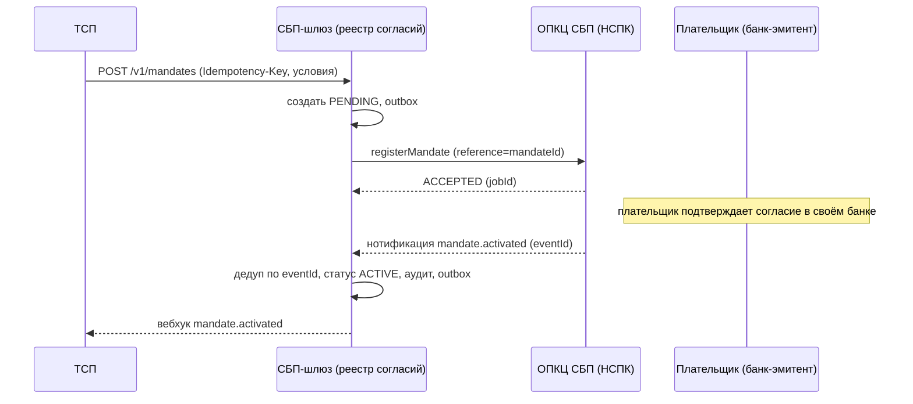
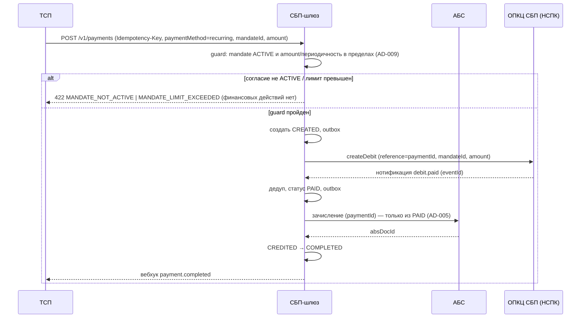

# Solutioning изменения — Рекуррентные C2B-списания (подписки СБП)

Изменение поверх принятого решения «Платёжный шлюз СБП (C2B-приём)». Маршрут — **Critical** (см. §1), поэтому изменение проходит полный Solutioning, а не только дельту.

---

## 1. Оценка значимости и маршрута

**Инструмент**: `significance_score` → `route = Critical`, `score = 11/15`.

Сработавшие триггеры (11): `criticality_or_exception` (финансы/КИИ/регуляторика), `financial_impact`, `security_boundary_change` (списание без участия клиента + хранение доказательств согласия), `api_contract_change`, `data_contract_change`, `new_component` (контур согласий), `new_datastore` (реестр согласий), `cross_domain_integration` (банк плательщика через НСПК), `consistency_model_change` (согласованность согласий шлюз ↔ НСПК), `significant_nfr`, `rto_rpo_targets` (RPO=0 для согласий).

**Почему глубокое проектирование:**

- **Необратимость в деньгах.** Списание инициируется без клиента; ошибка = несанкционированное списание, а не «лишний QR». Цена ошибки — возвраты, диспуты, регуляторный инцидент.
- **Правовое основание.** Согласие — финансовый документ; его форма, хранение и доказуемость — регуляторное требование, а не UX-деталь.
- **Критический триггер** `criticality_or_exception` сам по себе переводит маршрут в Critical независимо от суммы баллов.
- **Обязательная человеческая точка A3.** Выбор «расширять ядро vs отдельный сервис vs вендор» и политика отзыва/возвратов — управленческие развилки, их не решает агент.
- **Внешние входы.** Протокол НСПК по подпискам и поддержка вендором — блокирующие зависимости, помечены `[ТРЕБУЕТ ПРОВЕРКИ]`.

**Что это значит для процесса:** полный Solutioning (этот документ + ADR-008 + NFR), walking skeleton до массовой генерации, evidence-гейты A4/A5, ратификация ADR-008 человеком (A3).

---

## 2. Влияние на принятую архитектуру

### 2.1 Затронутые инварианты (AD-001..AD-008)

| Инвариант | Затронут? | Что меняется / что сохраняется |
|---|---|---|
| **AD-001** Изоляция платёжного контура | **Расширяется** | Реестр согласий входит в изолированный платёжный контур; взаимодействие с НСПК/АБС — по-прежнему только через адаптеры. Принцип не меняется |
| **AD-002** Единый источник истины | **Расширяется** | Платёж/списание — та же статусная машина; согласие — **отдельный** автомат с теми же правилами атомарности/outbox/аудита. Новый источник истины не создаётся |
| **AD-003** Идемпотентность | **Расширяется** | Idempotency-Key для регистрации согласия и инициации списания; дедуп событий НСПК по `eventId` — на события согласий/списаний. Принцип не меняется |
| **AD-004** Единственный адаптер ОПКЦ | **Расширяется** | Новые операции протокола (согласия, списания) — только через адаптер; ядро протокол-независимо. Принцип не меняется |
| **AD-005** Зачисление только из подтверждённого статуса | **Усиливается** | Согласие **не** основание зачисления. Зачисление — только из подтверждённого НСПК `PAID` каждого списания, как для одиночного платежа |
| **AD-006** Trust-зоны и сегментация | **Расширяется** | Согласия и доказательства — чувствительные данные в платёжном контуре; требования хранения/шифрования/аудита усиливаются, зоны не меняются |
| **AD-007** НПС/КИИ/ПДн | **Расширяется** | Правовое основание и срок хранения согласий (152-ФЗ/161-ФЗ), аудит жизненного цикла согласия. Обязательность мер не меняется |
| **AD-008** Гибрид [ADOPTED] | **Сохраняется** | Новые транспортные операции — уровень вендорского адаптера; поддержка подписок становится обязательным требованием к вендору. Ядро контрактно-независимо |

**Добавляются инварианты** (Proposed, ADR-008):

- **AD-009** Согласие плательщика — единственное основание рекуррентного списания (проверка `ACTIVE` + лимитов до инициации и до зачисления; отзыв немедленно блокирует новые списания).
- **AD-010** Согласие неизменяемо и аудируемо (условия иммутабельны; изменение — новое согласие; доказательство хранится и аудируется).

### 2.2 Что НЕ меняется

- Топология изоляции (AD-001) и trust-зоны (AD-006) — контуры те же.
- Статусы платежа наружу (`CREATED…REFUNDED`) и семантика вебхуков платежей — без изменений.
- Правило зачисления (AD-005) и модель с АБС (ADR-005) — без изменений; списание переиспользует зачисление по `paymentId`.
- Стратегия реализации (AD-008, гибрид) и граница «ядро ↔ адаптер» — без изменений.
- Вне-scope остаются: C2C, выплаты B2C/B2B (статус диспутов — см. HUMAN-DECISIONS).

---

## 3. Компоненты и потоки

### 3.1 Компоненты (приращение к C4 исходного решения)

- **Реестр согласий (mandate store)** — новый модуль в платёжном контуре: состояние согласия, условия (иммутабельные), доказательство, аудит. Собственная таблица в БД шлюза.
- **Статусная машина** — без новых состояний платежа; добавляется guard согласия перед инициацией списания.
- **Адаптер ОПКЦ** — новые операции/события (согласия, списания), протокол НСПК `[ТРЕБУЕТ ПРОВЕРКИ]`.
- **API ТСП** — новые пути `/v1/mandates*`, расширение платежа опциональными полями.
- **Сверка** — расширяется на объекты согласий и рекуррентных списаний.

### 3.2 Поток: регистрация и активация согласия



### 3.3 Поток: рекуррентное списание



### 3.4 Поток: отзыв согласия

```mermaid
sequenceDiagram
    participant P as Плательщик / ТСП
    participant N as ОПКЦ СБП (НСПК)
    participant G as СБП-шлюз
    participant T as ТСП

    P->>N: отзыв согласия (в банке плательщика)
    N-->>G: нотификация mandate.revoked (eventId)
    G->>G: дедуп, статус REVOKED, аудит, outbox; новые списания заблокированы
    G-->>T: вебхук mandate.revoked
    Note over G: уже подтверждённые списания — по политике (HUMAN-DECISIONS)
```

---

## 4. Данные: модель согласия

| Поле | Смысл | Иммутабельно |
|---|---|---|
| `mandateId` | Идентификатор согласия (сквозной со сверкой) | — |
| `tspId` | ТСП-получатель | да |
| `payerRef` | Обезличенный идентификатор плательщика (без ПДн в открытом виде) | да |
| `maxAmountPerDebit` | Лимит суммы одного списания (копейки) | да |
| `period` | Периодичность: `DAILY/WEEKLY/MONTHLY/ON_DEMAND` | да |
| `maxTotalAmount` | Общий лимит по согласию | да |
| `validUntil` | Срок действия согласия | да |
| `status` | `PENDING/ACTIVE/SUSPENDED/REVOKED/EXPIRED` | нет (жизненный цикл) |
| `consentEvidence` | Доказательство согласия (квитанция/артефакт от НСПК `[ТРЕБУЕТ ПРОВЕРКИ]`), шифровано в покое | да |
| `createdAt/activatedAt/revokedAt` | Метки жизненного цикла | нет |
| `prevMandateId` | Ссылка на предыдущее согласие при изменении условий | да |

Изменение любого иммутабельного условия = **новое согласие** (`prevMandateId`), старое переводится в `REVOKED/EXPIRED` по политике. Хранение — по требованию регулятора (срок уточняет ИБ/юридическая служба, `[ТРЕБУЕТ ПРОВЕРКИ]`).

---

## 5. Безопасность и соответствие

- **Согласие = сильная авторизация**: списание возможно только при `ACTIVE`-согласии и в пределах лимитов (AD-009); проверка — до вызова ОПКЦ и до зачисления.
- **Доказательство согласия** шифруется в покое, доступ — привилегированный контур, маскирование в логах; журналирование доступа (ADR-006).
- **Аудит**: каждое изменение состояния согласия и каждое списание — в неизменяемый аудит-лог (AD-010, AD-007).
- **Отзыв**: приоритетный, идемпотентный; распространение на шлюз по SLА (см. NFR §).
- **ПДн**: минимизация — храним `payerRef`, а не реквизиты плательщика.

---

## 6. Внешние зависимости (gaps)

| Gap | Что закроет | Владелец |
|---|---|---|
| Протокол НСПК по подпискам (поля, коды, форма согласия) `[ТРЕБУЕТ ПРОВЕРКИ]` | Документация НСПК по договору | Проектный офис / НСПК |
| Поддержка подписок вендором транспорта | RFP: новый обязательный критерий | Проектный офис / закупки |
| Правовая форма и срок хранения доказательства согласия | ИБ + юридическая служба | ИБ / комплаенс |
| Категория КИИ и состав мер для контура согласий | ИБ/КИИ | ИБ |
| Политика при отзыве (судьба подтверждённых списаний) | Решение архитектора/бизнеса | Архитектор + бизнес |

---

## 7. Handoff исполнителям (после A3)

Постановка — `changes/sbp-recurring-c2b/TASK.md` (формат `.arch-handoff`: epic-context, инварианты, критерии приёмки, headless JSON-контракт). Инварианты AD-009/AD-010 передаются **дословно** из `ARCHITECTURE-SPINE.md`. Реализация начинается после:
1. ратификации ADR-008 (A3);
2. получения документации НСПК и подтверждения поддержки подписок вендором;
3. фиксации контрактов `tsp-api` (0.2.0) и `opkc-adapter` как v1.0-draft.

Приоритет handoff — walking skeleton: согласие (мок НСПК) → списание → зачисление (мок АБС) → вебхук, с негативными сценариями (см. ACCEPTANCE.md).
