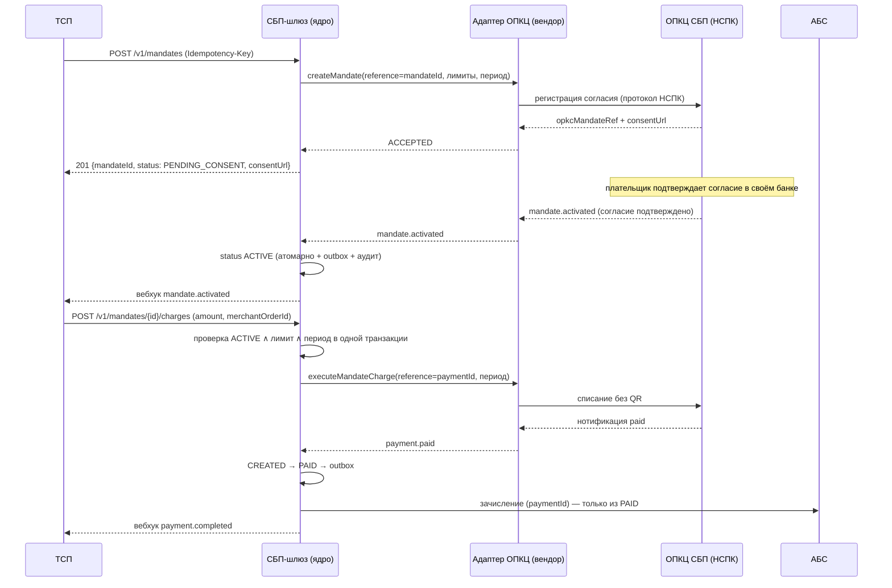

# Архитектурное решение: подписки СБП (рекуррентные C2B-списания по согласию плательщика)

- Версия пакета: 1.0 (2026-09-28)
- Статус: **на архитектурное решение (A3 изменения)**
- Автор: solution-architect (платёжный контур)
- Основание: бизнес-запрос ТСП (онлайн-кинотеатры, ЖКХ, связь) на рекуррентные списания
- Изменяемое решение: «Платёжный шлюз СБП (C2B-приём)» — `ARCHITECTURE-SPINE.md` (AD-001…AD-008), ADR-001…007, `docs/solutioning.md`, `docs/nfr.md`, `openapi/tsp-api.yaml`
- Решение: `docs/adr/ADR-008-podpiski-sbp-rekurrentnye-c2b-spisaniya-po-soglasiyu-platelschika.md`
- Сопутствующие: `docs/spec/mandate-lifecycle.md`, `docs/contracts/tsp-api.md` (v0.2), `docs/contracts/opkc-adapter.md` (v0.2), `docs/rfp/vendor-rfp.md`

---

## 1. Оценка значимости изменения и маршрута

Изменение возвращает решение, ранее **явно отложенное**: автоплатежи в базовом решении вынесены в roadmap вне scope (`docs/solutioning.md` §1). Поэтому «насколько глубокое проектирование нужно» определяется не объёмом кода, а новым классом финансового действия — **списанием без действия плательщика**.

| Измерение | Оценка (0–3) | Почему |
|---|---|---|
| Новизна домена | 2 | Появляется агрегат «мандат/согласие» — понятийно новый для шлюза, хотя переиспользует конвейер платежа |
| Неопределённость внешнего протокола | 3 | Семантика согласий/мандатов в протоколе НСПК не раскрыта публично — `[ТРЕБУЕТ ПРОВЕРКИ]`; зависит от вендора транспорта (ADR-007) |
| Финансовый риск | 3 | Безлюдные списания: двойное списание, списание сверх лимита, списание без согласия — прямые денежные и репутационные потери |
| Регуляторика и защита плательщика | 3 | Согласие, уведомление до списания, право отзыва, ПДн (152-ФЗ), НПС (161-ФЗ), КИИ (187-ФЗ) |
| Влияние на принятые инварианты и контракты | 2 | Затрагивает статусную машину, ТСП-API, контракт адаптера; при этом все изменения аддитивны |

**Итог: 13/15 → критический маршрут (Critical).** Базовое изменение оценивалось в 11/15; подписки выше за счёт безлюдности финансового действия и регуляторных требований к согласию.

**Маршрут проектирования.** Нужно полное проектирование (а не «малая фича по образцу»):
1. Новый ADR с альтернативами и обратимостью — **ADR-008** (готов).
2. Спецификация жизненного цикла мандата и расширения статусной машины — `docs/spec/mandate-lifecycle.md` (готов).
3. Аддитивные изменения контрактов — ТСП-API v0.2, адаптер ОПКЦ v0.2, OpenAPI v0.2.0-draft (готовы).
4. Измеримые NFR — `docs/nfr.md` §7 (готовы).
5. Повторные гейты **A1–A5** для изменения и **обязательное человеческое решение A3** — семантика мандатов и требования к вендору до реализации транспортного слоя (ADR-007/AD-008).

Глубокое проектирование обязательно, потому что цена ошибки — не дефект UI, а несанкционированное списание реальных денег; при этом сэкономить на проектировании нельзя даже частично: без документации НСПК по согласиям функция не может быть доведена до боевого включения.

## 2. Влияние на принятую архитектуру

### 2.1 Наследуемые инварианты (AD-001…AD-008) — статус

| Инвариант | Затронут? | Как |
|---|---|---|
| AD-001 изоляция платёжного контура | Нет (усиливается) | Списание идёт через тот же шлюз и те же адаптеры; прямой доступ к АБС/ОПКЦ не появляется |
| AD-002 единый источник истины — статусная машина | Да, **аддитивно** | Платёж-списание — та же машина; добавлен переход `CREATED → PAID` без QR (T13). Мандат — отдельный агрегат со своей атомарной машиной переходов |
| AD-003 идемпотентность | Да, **расширяется** | Добавлен ключ идемпотентности списания: `Idempotency-Key` + (`mandateId`, период/`merchantOrderId`) |
| AD-004 единственный адаптер ОПКЦ | Да, **аддитивно** | Контракт адаптера дополнен операциями/событиями мандата; второго пути к НСПК нет |
| AD-005 зачисление только из `PAID` | **Нет — сохраняется полностью** | Ключевой инвариант: списание под мандатом тоже зачисляется только из подтверждённого `PAID` |
| AD-006 trust-зоны и сегментация | Да, **аддитивно** | Мандаты обслуживаются в тех же зонах, но агрегат хранит реквизиты плательщика (ПДн) — новая поверхность минимизации/шифрования/срока хранения |
| AD-007 соответствие НПС/КИИ/ПДн | Да, **усиливается** | Согласие и его доказательство, уведомление до списания, право отзыва, обязательный антифрод — новые требования; аудит всех решений по списанию |
| AD-008 стратегия реализации (гибрид) [ADOPTED] | Да, **наследуется** | Операции мандата — в том же вендорском транспорте; реализация — только после контракта с вендором и документации НСПК |

**Ни один наследуемый инвариант не ослабляется и не переписывается.** AD-009…AD-016 — новые, дополняющие; конфликта с родительскими нет.

### 2.2 Что меняется

- **Новый агрегат** «мандат»: состояние, лимиты (разовый и суммарный), период, подтверждённые условия и доказательство согласия, `opkcMandateRef`, аудит, сверка (AD-009, AD-015).
- **Статусная машина платежа**: новый переход `CREATED → PAID` (без `QR_ISSUED`) и признак `paymentOrigin=mandate` (AD-010). Судьба незавершённых списаний при отзыве — AD-012.
- **Единый инициатор зачисления**: зачисление инициируется одним владельцем через атомарный claim по `paymentId`; сверка дозапускает тот же путь (AD-013).
- **Наблюдаемость списаний**: статус/сверка адресуются по ключу списания, а не по `qrId`; отсутствие подтверждения = «не оплачено» (AD-014).
- **Обязательный антифрод и уведомление до списания** (fail-closed) (AD-016).
- **ТСП-API**: новые ресурсы `/v1/mandates*` и списания; `Payment` получает опциональные `paymentOrigin`, `mandateId`; новые события вебхуков и коды ошибок.
- **Контракт адаптера ОПКЦ**: операции `createMandate`/`getMandateStatus`/`revokeMandate`/`executeMandateCharge`/`getMandateChargeStatus`/`cancelMandateCharge` и события `mandate.*`.
- **NFR**: раздел §7 (лимиты, отзыв, идемпотентность списания, регресс QR).
- **Сверка**: добавляются открытые состояния мандата и расхождения «у ОПКЦ отозван — у нас активен».

### 2.3 Что не меняется

- QR-приём (динамический/статический QR, ссылки), возвраты, нотификации — поведение и контракты сохранены.
- Зачисление в АБС — только из `PAID`; адаптеры АБС и ОПКЦ остаются единственными точками выхода.
- Outbox, DLQ, сверка с НСПК/АБС, trust-зоны, СКЗИ/HSM, аудит — без изменений механики.
- Стратегия ADR-007 (гибрид) и граница «ядро ↔ вендорский транспорт» — без изменений.

## 3. Архитектурное решение, альтернативы, последствия, обратимость

### 3.1 Решение (кратко)

1. **Универсальный мандат** (согласие с лимитом разового списания, общим лимитом и периодом) — единый агрегат состояния в БД шлюза.
2. **Списание — обычный платёж** существующей статусной машины (`paymentOrigin=mandate`, без QR); зачисление только из `PAID`.
3. **Биллинг и расписание — у ТСП** (merchant-initiated); банк не хранит календарь списаний.
4. **Проверка «действующий мандат ∧ лимит ∧ период ∧ владелец»** под блокировкой/версией мандата в одной транзакции с созданием платежа; отзыв/приостановка немедленно запрещают новые списания и сериализуются с созданием списания.
5. **Отзыв и незавершённые списания:** незавершённые (не-`PAID`) списания отменяются в ОПКЦ; подтверждённое списание исполняется, а компенсацию возвратом инициирует **шлюз** (AD-012).
6. **Единый инициатор зачисления** и атомарный claim по `paymentId`; сверка не зачисляет в обход (AD-013). **Статус/сверка списания — по ключу списания, не по `qrId`** (AD-014).
7. **Согласие — только подтверждённое,** с доказательством и аудитом; **антифрод и уведомление до списания обязательны** (fail-closed) (AD-015, AD-016).
8. **Контракты — аддитивно**, `/v1` сохранён.
9. **Транспорт мандатов — вендору** в границах ADR-007; до контракта с вендором и документации НСПК реализация не начинается.

### 3.2 Рассмотренные альтернативы

| Вариант | Плюсы | Минусы | Вердикт |
|---|---|---|---|
| **Универсальный мандат + merchant-initiated списание** | Одна модель на все сегменты; переиспользование конвейера, адаптеров, идемпотентности, сверки; ответственность за расписание у ТСП; аддитивно и обратимо | Новый агрегат и контракты; ТСП реализует свой планировщик | **Выбран** |
| Отдельный сервис подписок со своей БД и финансовым контуром | Изоляция, независимый релиз | Второй источник истины и второй финансовый путь — нарушение AD-001/002/004/005; удвоение сверки | Отклонён |
| Биллинговый шедулер в банке | «Подписка из коробки», удобно ТСП | Банк берёт на себя биллинг и ответственность за ошибочные списания; рост ПДн/регуляторики; ТСП теряют контроль | Отложен (Deferred) |
| Полностью вендорское решение подписок | Быстрый старт | Противоречит ADR-007; vendor lock-in; слабый контроль аудита | Отклонён |
| Статус-кво (каждый платёж через QR) | Ничего не меняем | Задача бизнеса не решена | Отклонён |

### 3.3 Последствия

**Положительные:** подписки для трёх сегментов на единой модели; минимальный объём нового кода (агрегат мандата + валидация лимитов); нулевое влияние на QR-приём; сохранение всех принятых инвариантов.

**Отрицательные:** новый агрегат и его сверка — эксплуатационная нагрузка; прямая зависимость от неизвестной семантики протокола НСПК и от вендора транспорта; безлюдные списания повышают требования к лимитам, уведомлениям и антифроду; рост контрактной поверхности ТСП-API.

### 3.4 Обратимость

**reversible до боевого включения, costly после.** Все изменения аддитивны, функцию можно не включать (per-ТСП фиче-флаг). После появления активных мандатов вывод функции требует управляемого отзыва согласий; обратной миграции данных не требуется (мандаты — история, платежи — источник истины).

## 4. Изменения контрактов без поломки потребителей

Принцип: **только аддитивно, `/v1` сохраняется**, новые поля — опциональны, старые потребители не затрагиваются.

| Контракт | Изменение | Совместимость |
|---|---|---|
| `openapi/tsp-api.yaml` v0.2.0-draft | Новые пути `/v1/mandates`, `/v1/mandates/{id}`, `/suspend`, `/resume`, `/revoke`, `/charges`; схемы `MandateRequest`, `Mandate`, `MandateChargeRequest`, `Problem`; в `Payment` — опциональные `paymentOrigin`, `mandateId` | Обратно совместимо: новые пути и опциональные поля; существующие пути/схемы не тронуты |
| `docs/contracts/tsp-api.md` v0.2 | §3.6–§3.9 (мандаты/списания), новые коды ошибок (`MANDATE_NOT_ACTIVE`, `MANDATE_LIMIT_EXCEEDED`, `MANDATE_EXPIRED`, `MANDATE_CHARGE_CONFLICT`), новые вебхук-события `mandate.*` | Новые ошибки/события; ТСП обязаны игнорировать неизвестные типы событий — зафиксировано в §5 |
| `docs/contracts/opkc-adapter.md` v0.2 | Операции и события мандата (§3–§4), идемпотентность списания по (`mandateRef`, период) (§5), требование к вендору (§8) | Внутренний контракт ядро↔транспорт; допсоглашение с вендором, ядро контрактно-независимо (AD-008) |
| `docs/rfp/vendor-rfp.md` | Критерий допуска G8, сценарии POC P9/P10, риск «протокол не поддерживает мандаты» | Закупочный документ, не рантайм-контракт |

**Правила совместимости:** версии, ломающие контракт, — только в `/v2` с поддержкой ≥ 6 мес.; добавление опциональных полей и новых событий не требует новой версии; потребители обязаны игнорировать неизвестные события и обрабатывать их идемпотентно по `eventId`.

## 5. Измеримые NFR нового функционала

Полный набор — `docs/nfr.md` §7. Ключевые (все проверяемы тестом/метрикой):

| Метрика | Цель |
|---|---|
| Списаний после отзыва мандата | 0; запрет новых списаний p99 < 2 с от нотификации/обнаружения сверкой |
| Двойные списания по (мандат, период) | 0 (идемпотентность) |
| Списание сверх `maxAmountPerCharge` | 0 |
| Latency «списание по мандату» | p95 < 1 с, p99 < 3 с (без ОПКЦ) |
| Уведомление плательщика до списания | 100 % с соблюдением регламентного срока `[ТРЕБУЕТ ПРОВЕРКИ]` |
| Расхождения сверки мандатов с ОПКЦ | 0; стоп-сигнал «отозван у ОПКЦ — активен у нас», устранение ≤ 15 мин |
| Пропускная способность списаний | 200 TPS sustained, пик 500 TPS, ×2 горизонтально |
| Регресс QR-приёма | p95 не хуже baseline + ≤ 5 %; доступность ≥ 99,95 % сохраняется |
| Аудит мандатов/списаний | 100 % переходов и решений по списанию в неизменяемом аудит-логе |

## 6. Критерии приёмки и план отката

### 6.1 Критерии приёмки (включая негативные)

| # | Критерий | Проверка |
|---|---|---|
| AC-1 | Мандат создаётся и активируется; повтор создания с тем же `Idempotency-Key` → тот же `mandateId` | Тест API + тест идемпотентности |
| AC-2 | Списание активного мандата проходит `CREATED → PAID → CREDITED → COMPLETED` и доходит до ТСП вебхуком | E2E на моке |
| AC-3 | **Негативный:** `amount > maxAmountPerCharge` → `422 MANDATE_LIMIT_EXCEEDED`, платёж не создан | Граничный тест |
| AC-4 | **Негативный:** мандат не `ACTIVE`/просрочен → `422`, платёж не создан | Тест состояний |
| AC-5 | **Негативный:** повтор списания за период/`merchantOrderId` → тот же `paymentId`, второй проводки нет | Тест повторной доставки |
| AC-6 | **Негативный:** после отзыва мандата — 0 списаний; отзыв идемпотентен | Тест «отзыв → списание» |
| AC-7 | **Негативный:** без подтверждения ОПКЦ зачисления нет (AD-005) | Тест недостижимости из `CREATED` |
| AC-8 | Отзыв при недоступном ОПКЦ: локальный запрет действует, расхождение закрывается сверкой | Chaos-тест |
| AC-9 | Существующие QR-сценарии проходят регресс без изменений | Регрессионный набор |
| AC-10 | Выключение подписок (фиче-флаг) не влияет на QR-приём | Тест фиче-флага |
| AC-11 | **Гонка отзыва:** отзыв между созданием списания и `paid` → списание отменено в ОПКЦ; если `paid` уже подтверждён — зачислено и компенсировано возвратом шлюза (AD-012) | Chaos/гонка-тест |
| AC-12 | **Нет двойного зачисления:** одновременные конвейер и сверка дают ровно одну проводку (атомарный claim, AD-013) | Конкурентный тест |
| AC-13 | **Сверка видит списание без `qrId`** по ключу `reference`; отсутствие подтверждения не приводит к зачислению (AD-014) | Тест сверки |
| AC-14 | **Fail-closed:** при недоступности антифрода или отсутствии подтверждения уведомления до списания — списание отклоняется (AD-016) | Негативный тест |
| AC-15 | **Согласие:** активация без подтверждённых условий/доказательства невозможна; запрошенные ≠ подтверждённые (AD-015) | Негативный тест |

### 6.2 План отката

- **До боевого включения:** откат = не включать. Все изменения аддитивны и обратимы; ничего не мигрируется.
- **После включения:** (1) per-ТСП kill-switch — запрет новых списаний без остановки обработки уже начатых; (2) управляемый отзыв активных мандатов через ОПКЦ; (3) rolling-откат релиза; (4) данные не откатываются (мандаты — история, платежи — источник истины, сверка закрывает расхождения).
- **Сигналы-триггеры отката:** инцидент двойного списания; доля отказов списаний выше согласованного порога; расхождение сверки мандатов; регуляторное замечание; рост жалоб плательщиков.
- **Владелец решения об отказе:** владелец продукта + архитектор; исполнение — дежурная смена по runbook. **Критерий успешного отката:** 0 новых списаний, все спорные мандаты приостановлены/отозваны, сверка без открытых расхождений, QR-приём без деградации. RTO ≤ 1 ч.

## 7. Что остаётся на решение человека-архитектора и почему

| # | Вопрос | Почему только человек |
|---|---|---|
| 1 | Семантика протокола мандатов/согласий НСПК и подтверждение поддержки вендором | Внешний вход `[ТРЕБУЕТ ПРОВЕРКИ]`; агент не может получить и проверить документ НСПК. Влияет на достижимость функции и границы ADR-007 |
| 2 | Юридическая модель согласия: форма, доказательство для споров, требования 152-ФЗ/161-ФЗ, обязательность и срок уведомления до списания | Требует юристов/комплаенс и ответственности за регуляторное решение |
| 3 | Модель биллинга: оставить расписание у ТСП (текущий выбор) или вводить банковский шедулер | Пересмотр ответственности и регуляторной поверхности — управленческое решение |
| 4 | Политика риск-контроля: обязательный антифрод на создание мандата и каждое списание, пороги/velocity, поведение при недоступности ОПКЦ (fail-closed) | Требует риск-аппетита банка; значения зависят от регламента НСПК |
| 5 | Категорирование нового агрегата и ПДн для КИИ, состав мер ФСТЭК; **срок хранения реквизитов плательщика в мандате** | Требует ИБ/КИИ банка |
| 6 | Комиссионная модель подписок и её отражение в отчётности | Бизнес-решение, влияет на отчётность ЦБ/НСПК |
| 7 | Подтверждение бюджета/сроков допсоглашения с вендором транспорта | Закупочное решение |
| 8 | Владелец проверки «уведомление плательщика до списания» и форма подтверждения (регламент НСПК) — шлюз исполняет, политика утверждается на A2 | Протокольная семантика `[ТРЕБУЕТ ПРОВЕРКИ]`; без неё проверка не может быть финализирована |

## 8. Расхождения с принятыми ранее решениями (обязательное поле)

| Расхождение | Тип | Разрешение |
|---|---|---|
| Автоплатежи были вне scope (`docs/solutioning.md` §1) | **Намеренное расширение scope**, не конфликт | Scope обновлён (§1), Deferred пересмотрен, решение вынесено как ADR-008; AD-ID сохранены |
| AD-002 описывал `QR_ISSUED` как обязательный шаг | **Аддитивное расширение** | Новый переход T13 и AD-010; инвариант «зачисление только из PAID» сохранён |
| Банковский биллинг-шедулер | **Отложено** | В Deferred spine с условием возврата |
| Приостановка мандата (`SUSPENDED`) как состояние протокола | **Уточнение, не конфликт** | `SUSPENDED` — локальный обратимый запрет шлюза, в ОПКЦ не передаётся (не подменяется необратимым `revokeMandate`); зафиксировано в ADR-008/контракте адаптера |

Наследуемые инварианты (AD-001…AD-008) **не ослаблены и не переписаны**. Иных конфликтов с принятыми решениями нет.

## 9. Допущения и открытые вопросы

**Допущения ([ASSUMPTION]):** согласие фиксируется в банке плательщика через ОПКЦ, шлюз хранит агрегат и opaque `opkcMandateRef`; списание не требует действия плательщика, но требует подтверждения до зачисления (как `PAID`); требование уведомления до списания существует и срок задаётся регламентом НСПК.

**Открытые вопросы:** семантика протокола мандатов НСПК; срок/канал уведомления до списания; лимиты; идемпотентность списания на стороне ОПКЦ; необходимость банковского шедулера. Полный список — memlog прогона (`.memlog.md`) и `docs/contracts/tsp-api.md` §7.
