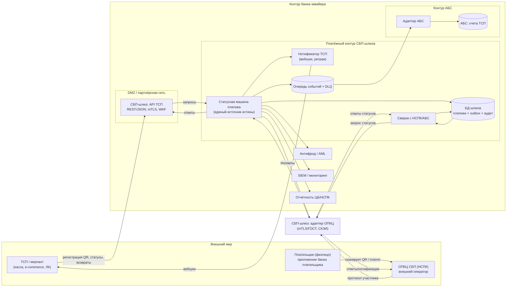
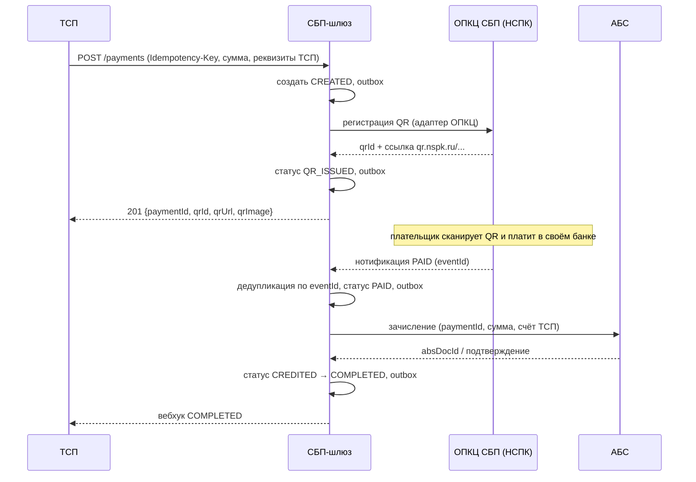
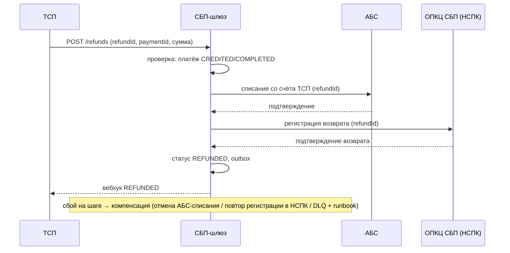

# Solutioning — Платёжный шлюз СБП (C2B-приём)

Маршрут: **Critical** (значимость 11/15). Настоящий документ — полный Solutioning: контекст, компоненты, потоки, разбиение на ADR, NFR, план гейтов A0–A5, план отката, gaps.

## 1. Контекст и границы

Банк — участник СБП (эквайер/агент ТСП) принимает C2B-платежи от ТСП. Внешние системы: **ОПКЦ СБП (АО «НСПК»)** — операционный/клиринговый центр, **Банк России** — расчёты по корсчетам. Внутренние: **АБС** (счета ТСП), **антифрод/AML**, **SIEM**, **отчётность** (ЦБ/НСПК).

Подключение банка — по порядку ЦБ РФ (cbr.ru/PSystem/payment_system/actions/): договор с ПБР + СКЗИ → присоединение к Правилам ОПКЦ СБП → доработка ПО по документации Портала поддержки НСПК → тестовые испытания → активация. **Документация НСПК — внешний вход**: точный протокол получается по договору, публично не раскрыт (все протокольные детали помечены `[ТРЕБУЕТ ПРОВЕРКИ]` до получения).

Сценарии C2B в scope: динамический QR, статический QR/наклейка, кассовые ссылки, оплата по ссылке в e-commerce, возвраты. Roadmap (вне scope): C2C, выплаты B2C/B2B, диспуты, автоплатежи.

## 2. Компоненты (C4 — контейнеры)



## 3. Статусная модель платежа

```
CREATED ──► QR_ISSUED ──► PAID ──► CREDITED ──► COMPLETED
   │            │          │            │
   ▼            ▼          ▼            ▼
 FAILED      EXPIRED    FAILED      REFUNDED (через сагу возврата)
```

- `PAID` — подтверждённый НСПК статус; **только из него** разрешено зачисление (AD-005).
- Переходы — атомарные транзакции «статус + outbox + аудит» (AD-002).
- Повторные нотификации идемпотентны (AD-003).

## 4. Ключевые потоки

### 4.1 Оплата динамическим QR (счастливый путь)



### 4.2 Возврат (сага)



## 5. Разбиение на решения (ADR)

| Решение | ADR | Spine |
|---|---|---|
| Топология: выделенный компонент + outbox | ADR-001 | AD-001, AD-002 |
| Статусная машина + идемпотентность | ADR-002 | AD-002, AD-003 |
| Транспорт к ОПКЦ: изолированный адаптер, mTLS/ГОСТ, СКЗИ | ADR-003 | AD-004 |
| Нотификации: at-least-once, дедуп, DLQ, сверка | ADR-004 | AD-003 |
| АБС: зачисление из PAID, возвраты-сага | ADR-005 | AD-005 |
| НПС/КИИ/ПДн: trust-зоны, ГОСТ | ADR-006 | AD-006, AD-007 |
| Стратегия реализации (гибрид) — **A3 принято 2026-08-15** | ADR-007 (Accepted) | AD-008 [ADOPTED] |

## 6. NFR

Полный набор с измеримыми целями — `docs/nfr.md`. Ключевое: доступность ≥ 99,95 %; RPO=0; RTO ≤ 1 ч; регистрация QR p95 < 500 мс; sustained 200 TPS / пик 500 TPS; сверка с НСПК ежечасная, с АБС суточная; двойных зачислений — 0.

## 7. Гейты и критерии приёмки

- **A0 (readiness)**: ADR-001..007 заполнены, spine пролинтован, gaps зафиксированы. Критерий: PASS.
- **A1 (Spec)**: контракт API ТСП (v0.1 — `docs/contracts/tsp-api.md`), таблица переходов статусной машины (`docs/spec/state-machine.md`), контракт адаптера ОПКЦ (`docs/contracts/opkc-adapter.md` — ядро↔транспорт, основа RFP), RFP-пакет по вендору (`docs/rfp/vendor-rfp.md`), NFR финализированы.
- **A2 (Plan)**: разбивка на задачи, walking skeleton определён (сквозной путь: ТСП → шлюз → мок НСПК → АБС-мок → нотификация).
- **A3 (человеческое решение)**: стратегия реализации (ADR-007) — **обязательно до реализации транспорта**.
- **A4 (conformance)**: fitness-проверки spine-инвариантов, нагрузочные тесты (NFR), тесты идемпотентности, ИБ-аудит.
- **A5 (post-deploy drift)**: сверка с НСПК/АБС в проде, SLO-отчёт через 30 дней, проверка отсутствия дрейфа от spine.

## 8. План отката

- **До боевой эксплуатации**: откат = не включать. Все работы обратимы (ADR-007 reversible).
- **После включения**: фиче-флаг на приём новых ТСП; мгновенный stop-new (запрет регистрации новых QR) без остановки обработки уже открытых операций; откат релиза — rolling; данные не мигрируются обратно (шлюз остаётся источником истины до полной сверки с АБС).
- **Аварийный сценарий**: DLQ → дежурная смена по runbook; сверка компенсирует потерянные нотификации; RTO ≤ 1 ч.

## 9. Gaps и внешние входы

| Gap | Что закроет | Владелец |
|---|---|---|
| Точный протокол НСПК (поля, тайминги, TLS-профили) | Документация НСПК по договору (Портал поддержки) | Проектный офис / НСПК |
| Регламенты НСПК (таймауты, сроки уведомлений, доступность) | Документация НСПК, правила ОПКЦ СБП | Проектный офис |
| Номер/редакция Положения ЦБ о защите информации при переводах | ИБ/комплаенс банка | ИБ |
| Контракт АБС на зачисление/списание (идемпотентность, SLA) | Интервью с владельцем АБС | Архитектор + АБС |
| Категория объекта КИИ, состав мер ФСТЭК | ИБ/КИИ банка | ИБ |
| Выбор конкретного вендора транспорта ОПКЦ | RFP по критериям ADR-007 (сертификаты ФСТЭК, тестовый контур, SLA, референсы) | Проектный офис / закупки |

## 10. Открытые вопросы

1. Объём первой волны: только C2B-приём или сразу C2C/выплаты? (влияет на состав адаптеров, но не на ядро).
2. Требования бизнеса к комиссиям и тарифам ТСП (влияет на модель отчётности).
3. Лимиты/пороги для AML-интеграции.
4. Доступность АБС в ночные окна (влияет на SLA зачисления).

## 11. Изменения поверх решения: подписки СБП (ADR-008, изменение `add-sbp-subscriptions`)

**Маршрут изменения: Critical** (значимость 10/15; сработали `security_boundary_change`, `financial_impact`, `api_contract_change`, `data_contract_change`, `new_component`, `new_datastore`, `cross_domain_integration`, `significant_nfr`, `rto_rpo_targets`, `criticality_or_exception`). Полный пакет — `openspec/changes/add-sbp-subscriptions/` (proposal, design, spec, tasks); решение — `docs/adr/ADR-008-…`; дельта спайна — `changes/add-sbp-subscriptions/DELTA.md`.

Суть: ТСП инициируют рекуррентные C2B-списания по заранее оформленному согласию плательщика (мандат) без QR на каждый платёж. Реализация — новый модуль «реестр мандатов» внутри платёжного контура при переиспользовании платёжного агрегата (`initiationType=MANDATE`).

### 11.1 Влияние на принятую архитектуру

- **Не меняются**: AD-001 (изоляция), AD-004 (единственный адаптер ОПКЦ), AD-005 (зачисление только из `PAID`), AD-006 (trust-зоны), AD-008 (стратегия «гибрид»).
- **Расширяются**: AD-002 (автомат мандата — такой же атомарный переход «статус + outbox + аудит»), AD-003 (новый ключ идемпотентности списания), AD-007 (объём ПДн и номенклатура финансовых переходов).
- **Добавляются**: AD-009 (реестр мандатов; согласие — проекция подтверждённого ОПКЦ; fail-closed), AD-010 (одно списание на период подписки).
- **Документы**: `docs/spec/state-machine.md` §7 (модель мандата, переходы T13–T15), `docs/nfr.md` §7, `docs/contracts/tsp-api.md` (§3.6–3.9, §4–6) и `openapi/tsp-api.yaml` 0.2 (аддитивно; `contract_diff`: breaking 0), `docs/contracts/opkc-adapter.md` §3–5, §8–9.

### 11.2 Критерии приёмки (EARS)

Позитивные:

- **When** ТСП создаёт мандат с валидными лимитами и уникальным `Idempotency-Key`, the шлюз SHALL вернуть мандат в состоянии `PENDING` и зарегистрировать его в ОПКЦ.
- **When** ОПКЦ подтверждает согласие событием `mandate.activated` с новым `eventId`, the шлюз SHALL перевести мандат в `ACTIVE` атомарно с outbox и аудит-логом.
- **When** ТСП инициирует списание по мандату в состоянии `ACTIVE` в пределах лимитов, the шлюз SHALL создать платёж `initiationType=MANDATE` и зарегистрировать списание в ОПКЦ.
- **When** ОПКЦ подтверждает списание, the шлюз SHALL перевести платёж в `PAID` и SHALL инициировать зачисление в АБС только из этого состояния.
- **When** списание достигло `COMPLETED`, the шлюз SHALL доставить ТСП событие с `paymentId`, `mandateId`, `invoiceId` и `eventId`.

Негативные:

- **When** ТСП повторяет заявку на списание с тем же `invoiceId` (в том числе с другим `Idempotency-Key`), the шлюз SHALL вернуть существующее списание и SHALL NOT выполнить второе финансовое действие.
- **When** мандат находится в `REVOKED`, `EXPIRED` или в неподтверждённом состоянии, the шлюз SHALL отклонить списание и SHALL NOT изменить состояние платежа (fail-closed).
- **When** сумма или частота списания превышает лимиты мандата, the шлюз SHALL отклонить запрос и SHALL NOT регистрировать списание в ОПКЦ.
- **When** заявка на списание и подтверждение отзыва мандата обрабатываются одновременно, the шлюз SHALL отдать приоритет подтверждённому отзыву и SHALL NOT инициировать новое списание.
- **When** вызов АБС на зачисление не удался, the платёж SHALL остаться в `PAID`, SHALL быть виден в отчёте незавершённых операций и сверке, зачисление SHALL быть гарантировано повторной попыткой.
- **When** адаптер ОПКЦ повторно доставляет событие с тем же `eventId`, the шлюз SHALL проигнорировать его и SHALL NOT изменить состояние.
- **When** сверка обнаруживает расхождение состояния мандата с ОПКЦ, the шлюз SHALL остановить списания по мандату и SHALL создать инцидент по runbook.

Регресс и откат:

- **When** выполняется оплата динамическим QR после внедрения подписок, the все переходы `T1–T12` SHALL выполняться как до изменения, а платёж SHALL NOT получить `initiationType=MANDATE`.
- **When** активирован режим `stop-new`, the шлюз SHALL отклонять создание новых мандатов и новых списаний, продолжая обработку уже принятых списаний до терминального состояния.
- **Критерий успешного отката**: после `stop-new` новые списания не создаются (проверяется тестом), уже принятые списания доходят до терминального состояния, сверка с ОПКЦ и АБС даёт 0 расхождений, а существующие QR-платежи не затронуты.

### 11.3 План отката (сводка)

1. До A3: откат = ничего не делать (правок боевого кода нет).
2. Сигналы отката: двойное списание > 0; списание по отозванному/неизвестному мандату > 0; лаг активации/отзыва выше SLO; всплеск жалоб плательщиков; расхождения мандатов с ОПКЦ.
3. Шаги: `stop-new` → доведение принятых списаний → откат релиза rolling → при необходимости массовое прекращение мандатов с уведомлением → сверка до нуля расхождений.
4. Владелец решения об откате: владелец продукта + дежурный SRE + архитектор (4-eyes для финансовых действий).
5. Не откатывается: оформленные согласия и проведённые списания (возврат — только сагой возврата).
6. Репетиция отката обязательна на A4 (evidence `rollback_rehearsal` — PASS на том же baseline, что план отката).

### 11.4 Что остаётся на решение человека-архитектора

Подпись A3 по ADR-008; ратификация AD-009/AD-010; юридическая модель согласия и ПДн; договорная модель с ТСП; протокольные детали сервиса подписок НСПК `[ТРЕБУЕТ ПРОВЕРКИ]`; продуктовые политики (лимиты, первое списание, dunning); change request к вендору транспорта; числа пиковой нагрузки; границы волны 1 (диспуты остаются в `Deferred`); категорирование КИИ. Полный перечень с обоснованием — `openspec/changes/add-sbp-subscriptions/design.md`.
