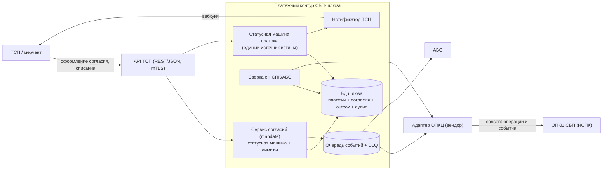
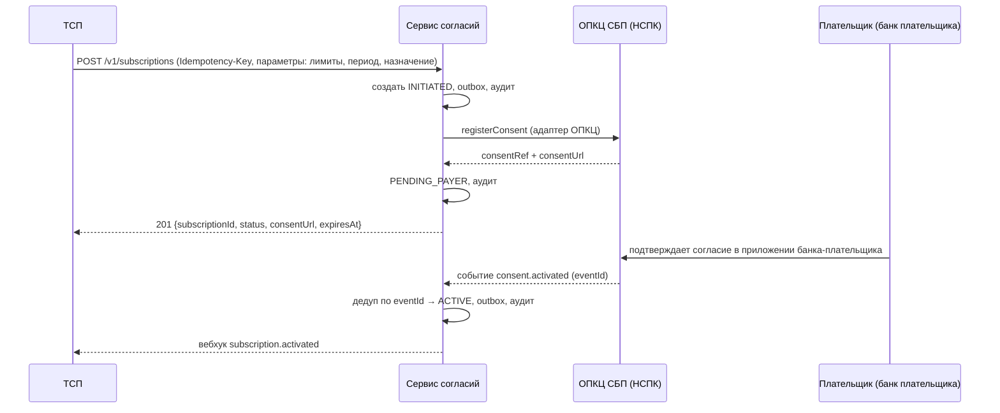
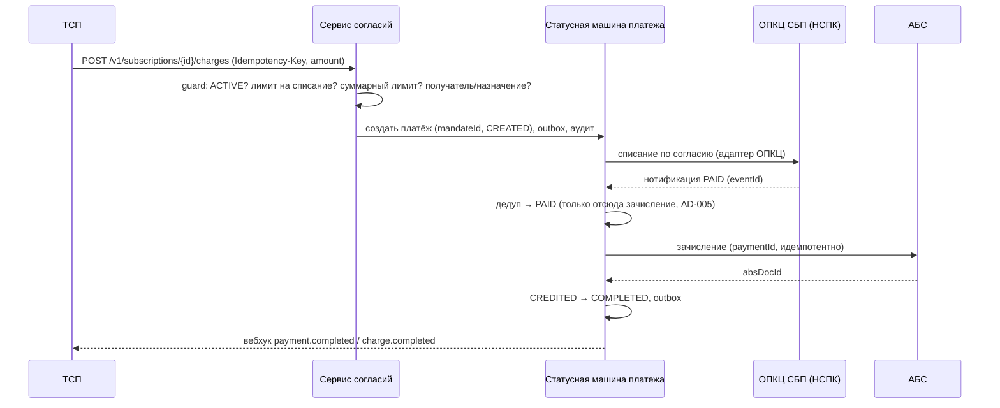

# Solutioning изменения: рекуррентные C2B-списания СБП (подписки)

- Status: Proposed (готовится к архитектурному решению A3)
- Date: 2026-09-28
- Owner: solution-architect (платёжный контур)
- База: принятое решение `docs/solutioning.md` + `ARCHITECTURE-SPINE.md` (AD-001..AD-008)
- Связанные артефакты: `docs/adr/ADR-008-*.md`, `docs/spec/subscriptions.md`, `docs/nfr.md` §7,
  `openapi/tsp-api.yaml` v0.2.0, `changes/sbp-recurring-subscriptions/DELTA.md`

> Документ описывает **изменение поверх принятого решения**, а не систему целиком (brownfield).
> Рекуррентность не переписывает платёжное ядро: она добавляет над ним сущность «согласие
> плательщика» и способ инициировать платежи без QR.

---

## 1. Оценка значимости и маршрут

**Score: 9/15 → маршрут Critical.** Расчёт: `arch-be control score` (детерминированно).

| Триггер | Значение | Обоснование |
|---|---|---|
| `security_boundary_change` | **да** | Появляется безакцептное списание: деньги списываются без действия клиента по ранее данному согласию — меняется граница авторизации |
| `financial_impact` | да | Повторяющиеся финансовые операции с реальными деньгами |
| `criticality_or_exception` | да | Платёжный контур банка, объект КИИ (ADR-006) |
| `api_contract_change` | да | Новые методы и события контракта ТСП и контракта адаптера ОПКЦ |
| `data_contract_change` | да | Новая сущность «согласие» (mandate) со своим жизненным циклом |
| `consistency_model_change` | да | Согласованность «согласие ↔ списание», конкурентность отзыва и списания |
| `significant_nfr` | да | Новые бюджеты (активация согласия, распространение отзыва) |
| `rto_rpo_targets` | да | RPO=0 и RTO ≤ 1 ч распространяются на согласия и списания |
| `new_component` | да | Новый логический сервис «согласия/подписки» в контуре шлюза |
| `new_datastore`, `new_vendor`, `trust_zone_change`, `domain_ownership_change`, `cross_domain_integration`, `irreversible_migration` | нет | Новых хранилищ/зон/вендоров и необратимых миграций не вводим |

**Следствие маршрута (Critical):** полный Solutioning (этот документ + ADR + NFR), **обязательная
человеческая точка A3** (ADR-008), walking skeleton по новому функционалу до массовой реализации,
evidence-гейты A4/A5. Обратимость на старте — reversible, что снижает цену ошибки решения, но не
отменяет A3: регуляторный и финансовый blast radius высок.

---

## 2. Влияние на принятую архитектуру

### 2.1 Что **не меняется** (несущие решения сохраняются)

- **AD-001 (изоляция).** Логика согласий — внутри СБП-шлюза; прямых обращений к АБС/ОПКЦ вне
  адаптеров не появляется.
- **AD-004 (единственный адаптер ОПКЦ).** Протокол НСПК по-прежнему знает только адаптер;
  consent-операции добавляются как методы **внутреннего** контракта `opkc-adapter.md`.
- **AD-005 (зачисление только из `PAID`).** Ключевой инвариант **усилен**: согласие не является
  основанием для зачисления; каждое списание зачисляется только по подтверждённому НСПК `PAID`.
- **AD-008 (гибрид).** Ядро (включая согласия) — собственная разработка; вендор получает лишь
  расширение транспортного контракта.
- **ADR-007 (стратегия A3).** Не пересматривается; расширяется scope RFP (consent-операции).

### 2.2 Что **меняется / затрагивается**

| Инвариант | Статус | Что именно |
|---|---|---|
| AD-002 (единый источник истины, атомарные переходы) | **расширяется** | Добавляется вторая статусная машина — согласия; её переходы тоже атомарны («статус + outbox + аудит») |
| AD-003 (идемпотентность) | **расширяется** | Идемпотентность создания согласия (`Idempotency-Key`), инициирования списания (ключ → тот же `chargeId`), consent-событий (`eventId`), отзыва (`reference`) |
| AD-006/AD-007 (НПС, КИИ, ПДн) | **расширяется** | Новый класс ПДн (идентификатор согласия плательщика), аудит согласий, требования к хранению |
| AD-009 (новый) | **добавляется** | Списание только по согласию в состоянии `ACTIVE` и в пределах параметров |
| AD-010 (новый) | **добавляется** | Согласие — доказуемая запись с неизменяемым аудитом и минимизацией ПДн |
| Deferred (спайн) | **корректируется** | «Автоплатежи» переходят из roadmap в scope; планировщик списаний на стороне шлюза — в Deferred |

### 2.3 Новые/затронутые компоненты

Новое: **сервис согласий** (собственная разработка, в контуре шлюза) — владелец состояния согласия,
лимитов и аудита. Он не ведёт деньги: финансы — по-прежнему на статусной машине платежа.

---

## 3. Ключевые потоки

### 3.1 Оформление согласия

### 3.2 Списание по согласию (счастливый путь)

### 3.3 Отзыв согласия и конкурентность со списанием

Отзыв (плательщик в своём банке, банк-эквайер или НСПК) → событие `consent.revoked` → согласие
`REVOKED`, **новые списания блокируются**. Семантика «списания в полёте»:

- списание, **уже подтверждённое НСПК как `PAID`** до вступления отзыва в силу, доводится до
  зачисления (оно было авторизовано согласием на момент инициирования);
- списание, инициированное **после** `REVOKED`, отклоняется с кодом `SUBSCRIPTION_REVOKED`,
  платёж не создаётся;
- «неопределённое» состояние (запрос ушёл, ответа нет) разрешается сверкой с НСПК, а не догадкой.

Точная таблица переходов и запретов — `docs/spec/subscriptions.md`.

---

## 4. Изменения контрактов (без поломки потребителей)

Все изменения **аддитивны** (расширение, не замена):

- `openapi/tsp-api.yaml` **0.1.0 → 0.2.0**: новые пути `/v1/subscriptions`,
  `/v1/subscriptions/{id}`, `/v1/subscriptions/{id}/charges`, `/v1/subscriptions/{id}/revoke`;
  новые схемы `SubscriptionRequest`, `Subscription`, `SubscriptionChargeRequest`,
  `SubscriptionCharge`; в `Payment` — **опциональное** поле `subscriptionId`; новые вебхук-события
  `subscription.activated`, `subscription.revoked`, `charge.completed`.
- Существующие потребители не затронуты: ни один существующий путь/поле/обязательность не
  изменены и не удалены. Проверка — `contract_diff` v0.1→v0.2 = 0 breaking changes; `openapi_lint` PASS.
- Ошибки: новые коды `SUBSCRIPTION_NOT_ACTIVE` (409), `SUBSCRIPTION_LIMIT_EXCEEDED` (422),
  `SUBSCRIPTION_REVOKED` (409) в RFC 9457 удлиняют каталог, общий контракт ошибок не меняется.
- `docs/contracts/opkc-adapter.md` — **внутренний контракт** расширяется consent-операциями
  (`registerConsent`, `getConsentStatus`, `revokeConsent`; события `consent.activated`,
  `consent.rejected`, `consent.revoked`) — это изменение scope RFP вендора (ADR-007), не контракта ТСП.

Детали — `docs/contracts/tsp-api.md` §8 и `openapi/tsp-api.yaml`.

---

## 5. Измеримые NFR

Полный набор — `docs/nfr.md` §7. Ключевое для нового функционала: активация согласия p95 ≤ 30 с;
инициирование списания p95 ≤ 500 мс; блокировка новых списаний после отзыва ≤ 60 с (сквозное
≤ 5 мин); двойных списаний — 0; сверка согласий с НСПК ежедневно, расхождений — 0; доступность
сервиса согласий ≥ 99,95 %; ПДн плательщика в шлюзе — только референс.

---

## 6. Критерии приёмки (EARS)

- When ТСП инициирует списание по согласию не в состоянии `ACTIVE`, the шлюз shall отклонить
  запрос с `SUBSCRIPTION_NOT_ACTIVE` и не создавать платёж.
- When сумма списания превышает лимит на списание или суммарный лимит согласия, the шлюз shall
  отклонить запрос с `SUBSCRIPTION_LIMIT_EXCEEDED`.
- When плательщик отзывает согласие, the сервис согласий shall перевести согласие в `REVOKED` и
  заблокировать новые списания в пределах NFR §7.
- When нотификация НСПК `PAID` по списанию получена повторно с тем же `eventId`, the шлюз shall
  не изменять состояние и не зачислять повторно.
- If согласие отозвано, then списание, подтверждённое НСПК как `PAID` до отзыва, shall быть
  доведено до `CREDITED`/`COMPLETED` (авторизовано до отзыва).
- When два списания инициируются с одним `Idempotency-Key`, the шлюз shall вернуть тот же
  `chargeId` и не создать второе списание.
- When согласие создаётся/активируется/отзывается, the сервис согласий shall записать неизменяемую
  аудит-запись с параметрами согласия.
- While согласие находится в состоянии `ACTIVE`, the сверка shall не реже одного раза в сутки
  подтверждать его статус у НСПК.
- Where контракт `openapi/tsp-api.yaml`, the `contract_diff` v0.1→v0.2 shall не показывать ни одного
  ломающего изменения.

Негативные сценарии (обязательны к тестам): отказ соседа (НСПК недоступна — новые списания
fail-closed, приём разовых платежей не деградирует), гонка отзыва и списания, дубль нотификации,
превышение лимитов, попытка списания при `SUSPENDED`/`EXPIRED`/`REJECTED`.

---

## 7. План отката

- **До боевой эксплуатации:** откат = не включать. Фиче-флаг `subscriptions_enabled` по умолчанию
  **выключен**; изменения контракта аддитивны; данные не мигрируются.
- **После включения (инкрементально):**
  1. сигнал отката — двойное списание, списание без действующего согласия, неблокировка отзыва,
     расхождение сверки по согласиям;
  2. **stop-new-charges**: фиче-флаг запрещает инициирование новых списаний, **не трогая** уже
     начатые операции и возможность отзыва согласий;
  3. откат релиза — rolling; согласия остаются читаемыми и отзываемыми (шлюз — источник истины до
     сверки с НСПК); обратной миграции данных нет;
  4. инцидент → DLQ/runbook, сверка компенсирует потерянные нотификации; RTO ≤ 1 ч.
- **Владелец решения об откате:** solution-architect платёжного контура + дежурная смена; критерий
  успешного отката — новые списания прекращены, разовые платежи и отзыв согласий работают,
  расхождений сверки — 0.
- Репетиция отката — на гейте A4 (`arch-be control gate A4 --rehearse`).

---

## 8. Что остаётся на решение человека-архитектора (A3) и почему

| # | Решение | Почему человек, а не агент |
|---|---|---|
| 1 | **Подписать ADR-008** (выбор модели «согласие как сущность») | A3 — единственная обязательная человеческая точка; агент оставляет решение `Proposed` |
| 2 | **Расписать AD-009/AD-010 в спайне** (изменение защищённого файла) | Изменение спайна — связывающее для всех исполнителей, требует архитектурного согласия |
| 3 | **Модель инициирования списаний**: ТСП-инициируемые (рекомендовано) vs планировщик шлюза | Зависит от регламента НСПК и бизнес-модели тарификации; влияет на контракт ТСП |
| 4 | **Обязательность предварительного уведомления плательщика перед списанием** | Регуляторное требование (ЦБ/НСПК) — только комплаенс/юристы |
| 5 | **Лимиты и срок согласия** (максимум на списание, суммарный, TTL) | Значения задаёт регламент НСПК `[ТРЕБУЕТ ПРОВЕРКИ]` и продуктовая политика |
| 6 | **Хранение доказательства согласия**: только референс vs полный слепок | Баланс «доказуемость ↔ минимизация ПДн» (152-ФЗ) — ИБ/юридическая функция |
| 7 | **Scope RFP вендора**: принять расширение контракта consent-операциями | Коммерческое/контрактное решение (ADR-007, закупки) |
| 8 | **Семантика отзыва при списании «в полёте»** (какой момент считать «вступлением отзыва») | Может регулироваться НСПК; финансово значимо |
| 9 | **Уникальность списания на период** (запрещать ли второе списание за тот же период при разных `Idempotency-Key`) | Влияет на guard'ы и на риск двойного списания; зависит от продуктовой модели и правил НСПК |

Открытые внешние входы, блокирующие финализацию: документация/регламент НСПК по автоплатежам
`[ТРЕБУЕТ ПРОВЕРКИ]`; требования ЦБ к уведомлению перед списанием; подтверждение вендором
consent-операций контракта адаптера.

---

## 9. Прослеживаемость (для readiness-гейта)

| Требование (дельта) | Инвариант | Критерий приёмки | Артефакт |
|---|---|---|---|
| Согласие — первоклассная сущность | AD-002, AD-010 | аудит-запись на каждый переход | `docs/spec/subscriptions.md` |
| Списание только по `ACTIVE` и в лимитах | AD-009 | EARS §6 (отказ при `REVOKED`/лимите) | `docs/spec/subscriptions.md`, ADR-008 |
| Зачисление только из `PAID` | AD-005 | повтор `PAID`/повтор запроса — без двойного зачисления | `docs/spec/state-machine.md` |
| Аддитивный контракт ТСП | AD-003, AD-006 | `contract_diff` = 0 breaking | `openapi/tsp-api.yaml` v0.2.0 |
| Аудит и ПДн согласия | AD-010, AD-007 | аудит 100 %, ПДн минимизированы | `docs/nfr.md` §7 |
