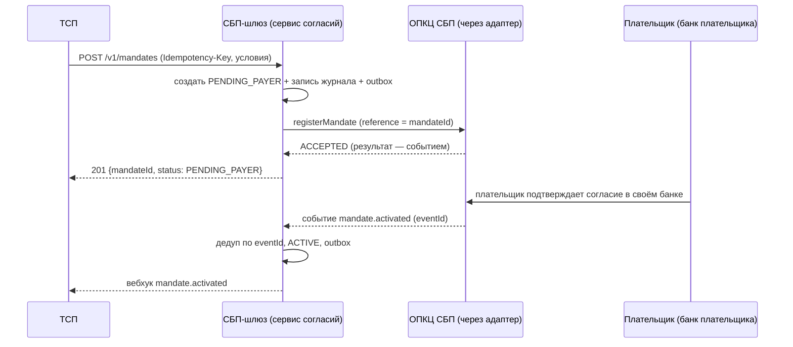
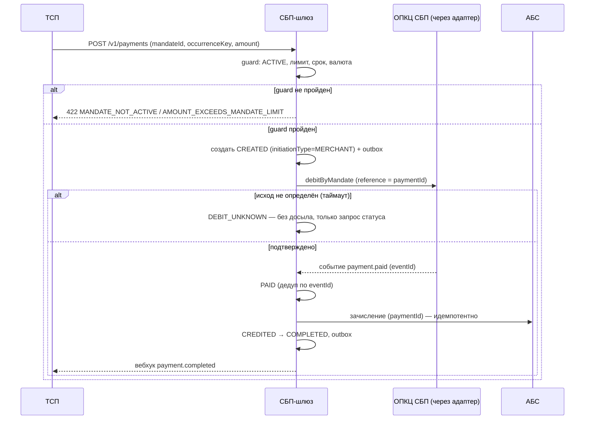
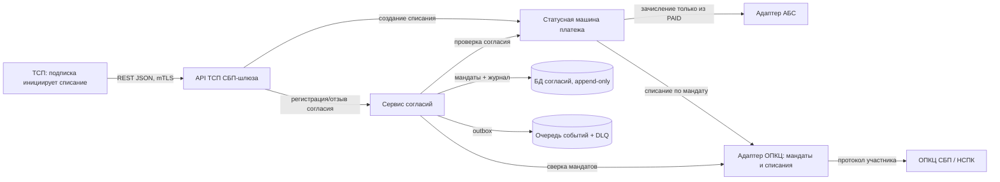

# Спецификация: рекуррентные C2B-списания по согласию плательщика (подписки СБП)

- Status: Draft (для ревью на гейте A1 изменения; решение — ADR-008, ADR-009)
- Owner: solution-architect (платёжный контур)
- Related: ADR-008, ADR-009, ADR-002, ADR-003, ADR-005, AD-002, AD-003, AD-005, AD-009, AD-010, AD-011
- Изменение: `changes/subscriptions-c2b/DELTA.md`

Документ описывает **изменение** поверх принятого решения `docs/solutioning.md`: новый агрегат «Согласие плательщика» и регулярное списание как обычный платёж. Существующие потоки QR/одноразовой оплаты и сага возврата не меняются.

## Проблема

Сегодня каждый C2B-платёж требует QR и действия клиента: для регулярных платежей (месячная подписка, ЖКХ, связь) это неприемлемо. Нужны рекуррентные списания по одному согласию плательщика — при том что цена ошибки выросла: двойное списание или списание после отзыва — это прямой ущерб счёту физлица и регуляторный риск. Спецификация фиксирует модель согласия, правила списания и ключи идемпотентности так, чтобы независимые исполнители реализовали совместимую модель и не изобрели своих правил на стыках.

## 1. Границы изменения

**В scope:** регистрация и жизненный цикл согласия плательщика; регулярное списание по действующему согласию (инициатива ТСП); отзыв согласия и немедленная остановка списаний; идемпотентность серии; сверка мандатов; аудит и ПДн-минимизация; расширение API ТСП и внутреннего контракта адаптера ОПКЦ.

**Вне scope (Deferred):** банковский планировщик серии (вариант C ADR-008); изменение сумм по инициативе банка; уведомления плательщику через каналы банка плательщика (кроме того, что даёт ОПКЦ); диспуты; C2C и выплаты.

## 2. Агрегат «Согласие плательщика» (мандат)

### 2.1 Атрибуты

| Поле | Смысл | Изменяемость |
|---|---|---|
| `mandateId` | внутренний id согласия (шлюз) | неизменяем |
| `tspId` | ТСП-получатель | неизменяем |
| `payerRef` | обезличенная ссылка на плательщика (без реквизитов) | неизменяем |
| `opkcMandateRef` | ссылка на согласие в ОПКЦ (сквозная для сверки) | неизменяем после регистрации |
| `maxAmountPerDebit` | верхняя граница одного списания (копейки) | неизменяем |
| `currency` | валюта | неизменяем |
| `periodicity` | периодичность (`MONTHLY`, `WEEKLY`, `ON_DEMAND`) | неизменяем |
| `validFrom` / `validUntil` | окно действия согласия | неизменяем |
| `status` | см. §2.2 | только через переходы |
| `supersedes` | предыдущее согласие (при изменении условий) | заполняется при создании |
| `revocation` | время/инициатор/причина отзыва (append-only) | только добавление |

Реквизиты счёта плательщика в шлюзе **не хранятся** (ADR-009 §3): они остаются в ОПКЦ и банке плательщика.

### 2.2 Статусы и переходы

| № | From | To | Триггер | Guard | Действие |
|---|---|---|---|---|---|
| M1 | — | `PENDING_PAYER` | `POST /v1/mandates` (новый `mandateId`) | валидный запрос, ТСП активен, условия корректны | запись согласия (append-only) + outbox «регистрация в ОПКЦ» |
| M2 | `PENDING_PAYER` | `ACTIVE` | подтверждение плательщика (событие ОПКЦ) | `opkcMandateRef` получен | фиксация ссылки, outbox-вебхук `mandate.activated` |
| M3 | `PENDING_PAYER` | `REJECTED` | отказ плательщика / ОПКЦ | — | причина, вебхук `mandate.rejected` |
| M4 | `PENDING_PAYER` | `EXPIRED` | TTL ожидания подтверждения | подтверждение не получено | закрытие в ОПКЦ (по протоколу), вебхук `mandate.expired` |
| M5 | `ACTIVE` | `SUSPENDED` | приостановка (ТСП/банк/ОПКЦ) | — | новые списания запрещены, вебхук `mandate.suspended` |
| M6 | `SUSPENDED` | `ACTIVE` | возобновление | согласие не отозвано и не истекло | вебхук `mandate.activated` |
| M7 | `ACTIVE` / `SUSPENDED` | `REVOKED` | отзыв плательщиком или ТСП | — | **немедленный запрет новых списаний**, append-only запись отзыва, вебхук `mandate.revoked` |
| M8 | `ACTIVE` / `SUSPENDED` | `EXPIRED` | наступил `validUntil` | — | запрет новых списаний, вебхук `mandate.expired` |

### 2.3 Запрещённые переходы (инварианты)

- **Списание создаётся только из `ACTIVE`** (AD-009). Из `PENDING_PAYER`, `SUSPENDED`, `REVOKED`, `EXPIRED`, `REJECTED` — недостижимо.
- `REVOKED` и `EXPIRED` — терминальные: переходов нет; повторный отзыв идемпотентен.
- Условия согласия после `PENDING_PAYER` иммутабельны (ADR-009 §1): изменение — только новое согласие с `supersedes`.
- Переходы согласия — атомарные транзакции «статус + outbox + аудит» по аналогии с платежом (AD-002), что расширяет область действия AD-002 на агрегат согласия.

## 3. Регулярное списание

1. Регулярное списание — **обычный платёж** в смысле ADR-002: та же статусная машина, тот же outbox, та же сверка. Переходы — `docs/spec/state-machine.md` §7.
2. Инициатор — ТСП (`initiationType=MERCHANT`); `mandateId` обязателен, `occurrenceKey` — метка периода серии (например `2026-10`).
3. Зачисление возможно **только из `PAID`** (AD-005). Наличие действующего согласия или наступление периода **не является** основанием для зачисления.
4. Ключ идемпотентности серии — (`mandateId`, **нормализованный период**). Шлюз не доверяет `occurrenceKey` как источнику уникальности: для `MONTHLY`/`WEEKLY` ожидаемая метка периода выводится из `periodicity` и текущей даты, несовпадение → `422 OCCURRENCE_OUT_OF_PERIOD`; уникальность обеспечивается по нормализованному периоду, поэтому второй успешный дебет за период отклоняется независимо от написания метки → `422 OCCURRENCE_ALREADY_DEBITED`. Для `ON_DEMAND` уникальность — по паре (`mandateId`, `occurrenceKey`) плюс лимит частоты. Повторный запрос с тем же ключом возвращает тот же `paymentId` без нового вызова ОПКЦ и без второго зачисления.
5. Проверки на каждом списании (guard, отказ — до вызова ОПКЦ): согласие `ACTIVE`; `now ∈ [validFrom, validUntil]`; `amount ≤ maxAmountPerDebit`; валюта совпадает; период серии ещё не списан успешно. Нарушение → `422` с кодом из `docs/contracts/tsp-api.md` §8.3, платёж **не создаётся**.
6. Неопределённый исход обращения к ОПКЦ (таймаут) → внутреннее состояние `DEBIT_UNKNOWN`: **повторная отправка запрещена**, разрешён только запрос статуса; терминальный статус закрывает операцию (AD-011). Это отличие от одноразового QR-потока, где ретрай опирался на идемпотентность адаптера: для списания с чужого счёта досыл при неизвестном исходе недопустим.

## 4. Потоки

### 4.1 Регистрация согласия

### 4.2 Регулярное списание по согласию

## 5. Контейнеры (C4, изменение)

Доверительная граница не меняется: внешний канал остаётся только через адаптер ОПКЦ; сервис согласий живёт внутри платёжного контура (AD-001, AD-006).

## 6. NFR

Новые измеримые цели — `docs/nfr.md`, раздел «Рекуррентные списания (подписки СБП)». Ключевое: двойных списаний — 0; списаний после отзыва — 0; обработка отзыва p95 < 60 с; burst «платёжный день» 1000 TPS в течение 1 ч с удержанием p95-бюджета и нулевым ростом DLQ.

## 7. Исполняемые проверки (обязательный первый шаг реализации)

Инварианты этого изменения проверяются **поведением**, а не упоминанием. Тесты генерируются из библиотеки шаблонов реестра правил (см. навык `fitness-functions`); до применения шаблона реестр `CONSTRAINTS.yaml` содержит только звенья трассировки:

| Инвариант | Шаблон | Команда применения |
|---|---|---|
| AD-009 (списание только из действующего согласия) | `consent-before-auto-action` | `arch-be rules template apply consent-before-auto-action --ad AD-009 --dir .` |
| AD-011 (неопределённый исход — без досыла) | `unknown-outcome-no-resend` | `arch-be rules template apply unknown-outcome-no-resend --ad AD-011 --dir .` |
| AD-010 (согласие неизменяемо) | `append-only-journal` | `arch-be rules template apply append-only-journal --ad AD-010 --dir .` |
| Идемпотентность серии (AD-003 на списании) | `idempotency-key` | `arch-be rules template apply idempotency-key --ad AD-009 --dir .` |

После применения шаблонов печатается фрагмент правила со свободным `C-NNN`; он вносится в `.arch-handoff/CONSTRAINTS.yaml` дельтой, и `arch-be rules template verify --dir .` подтверждает «зубы» (тест падает на нарушающей реализации).

## Критерии приёмки

- When ТСП вызывает `POST /v1/mandates` с корректными условиями, the шлюз shall создать согласие в `PENDING_PAYER` и вернуть `201` с `mandateId` (p95 < 500 мс, без учёта времени ОПКЦ).
- When приходит повторный `POST /v1/mandates` с тем же `Idempotency-Key`, the шлюз shall вернуть тот же `mandateId`, не создав второго согласия и второго вызова ОПКЦ.
- When плательщик подтверждает согласие, the шлюз shall перевести его в `ACTIVE` и доставить вебхук `mandate.activated` по at-least-once.
- When приходит запрос списания с `mandateId` в статусе `ACTIVE`, суммой в пределах `maxAmountPerDebit` и внутри окна действия, the шлюз shall создать платёж с `initiationType=MERCHANT` и ключом (`mandateId`, `occurrenceKey`).
- If запрос списания приходит для согласия не в `ACTIVE`, then the шлюз shall ответить `422 MANDATE_NOT_ACTIVE` и не создавать платёж и не обращаться в ОПКЦ (AD-009).
- If `amount` превышает `maxAmountPerDebit`, then the шлюз shall ответить `422 AMOUNT_EXCEEDS_MANDATE_LIMIT`.
- When приходит повторный запрос списания с той же парой (`mandateId`, `occurrenceKey`), the шлюз shall вернуть тот же `paymentId` без второго вызова ОПКЦ и без второго зачисления (AD-003, AD-009).
- When приходит списание за период, уже успешно списанный по этому согласию (в том числе под другой записью `occurrenceKey`), the шлюз shall ответить `422 OCCURRENCE_ALREADY_DEBITED` и не создавать второе списание (AD-009).
- If `occurrenceKey` не соответствует ожидаемому периоду для данной `periodicity`, then the шлюз shall ответить `422 OCCURRENCE_OUT_OF_PERIOD`: ключ серии нормализуется шлюзом, а не принимается на веру от ТСП.
- When согласие отозвано, the шлюз shall запретить создание любых новых списаний по нему немедленно; уже начатые операции обрабатываются по §3.6 (AD-009).
- When ответ ОПКЦ на списание не определён (таймаут), the шлюз shall не отправлять списание повторно и держать операцию в `DEBIT_UNKNOWN` до терминального статуса или сверки (AD-011).
- When приходит повторная нотификация об оплате с уже обработанным `eventId`, the шлюз shall не изменить состояние и не создать вторую проводку в АБС (AD-003).
- While действует согласие, the шлюз shall хранить реквизиты плательщика вне своего контура и не выводить ПДн в логи и метки метрик (AD-007).
- When нагрузка «платёжного дня» достигает 1000 TPS в течение часа, the шлюз shall удержать p95-бюджет списания и не допустить роста DLQ (NFR, `docs/nfr.md`).

## Риски

- **Внешняя зависимость по протоколу.** Рекуррентные операции НСПК не описаны в полученной документации `[ТРЕБУЕТ ПРОВЕРКИ]`; до её получения контракт адаптера — гипотеза, а сроки зависят от вендора. Митигация: гипотезу проверить на моках, контракт адаптера — в RFP; при несоответствии — эскалация ADR-007.
- **Несовершенная идемпотентность вендора.** Если адаптер не гарантирует идемпотентность по `reference`, досыл может дать двойное списание. Митигация: AD-011 (без досыла при неизвестном исходе) + сверка + требование к вендору в RFP; остаточный риск принимает архитектор (см. A3).
- **Пик «платёжного дня».** Массовые списания ЖКХ/связи приходятся на начало месяца; всплеск может превысить принятые 500/1000 TPS, вызвать рост DLQ и лаг нотификаций. Митигация: бюджет burst, level-loading через очередь, приоритеты, load shed (см. `docs/nfr.md`).
- **Отзыв не успел.** Между отзывом в ОПКЦ и его обработкой в шлюзе может возникнуть окно, в котором списание уже инициировано. Митигация: отзыв как приоритетное событие, DEBIT_UNKNOWN-путь, обработка таких операций по runbook; требуется решение комплаенса по окну.
- **Рост объёма правово значимых данных.** Мандаты и журнал живут годами; без стратегии архивирования растут стоимость и время сверки. Митигация: сроки хранения от комплаенса, архив и партиционирование.
- **Дрейф документации и контракта.** Проза `docs/contracts/tsp-api.md`, `openapi/tsp-api.yaml` и спецификация могут разойтись. Митигация: openapi — машинный источник, `openapi_lint`/`contract_diff` в гейте; проза синхронизируется в той же дельте.

## Открытые вопросы (решение человека-архитектора)

1. Инициирует ли списания только ТСП (выбранный вариант A) или требуется банковский планировщик (вариант C) — влияет на состав компонентов и лимиты.
2. Поддерживает ли выбранный вендор рекуррентные операции в адаптере; если нет — пересмотр ADR-007 (см. expiry).
3. Канал отзыва согласия плательщиком (мобильный банк / ОПКЦ / ЛК ТСП) и требования к окну «отзыв → остановка списаний».
4. Сроки хранения согласий и состав ПДн (комплаенс/ИБ).
5. Лимиты согласия и антифрод-пороги для серии списаний.
6. Целевой burst «платёжного дня» и приоритеты нагрузки — согласуется с бизнесом.
