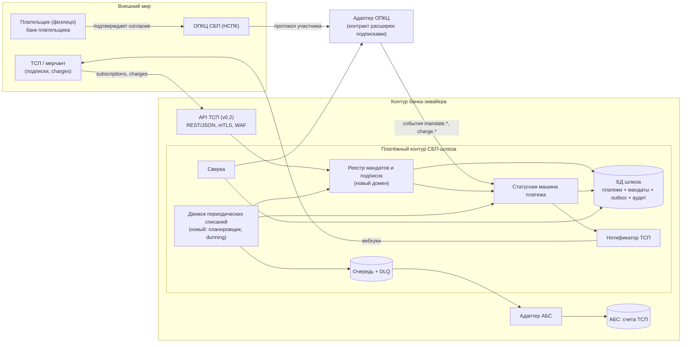
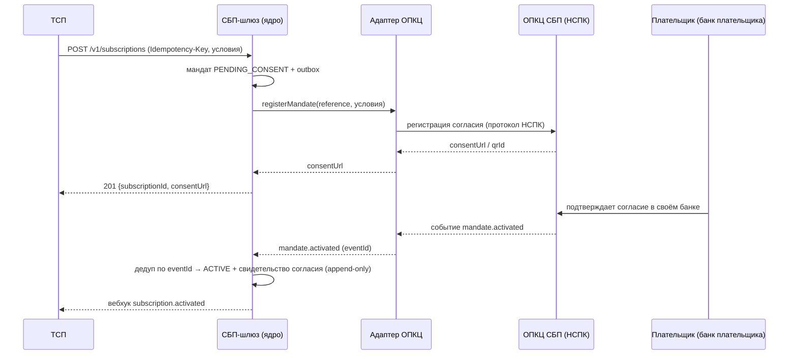
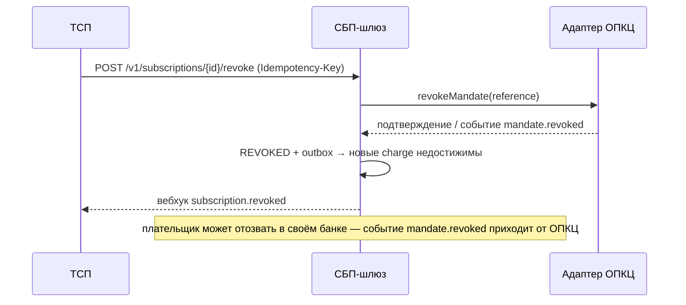

# DESIGN — дельта решения: СБП-подписки (рекуррентные C2B-списания)

Solutioning-дельта к принятому решению (`docs/solutioning.md`). Маршрут — **Critical**, поэтому объём соответствует полному Solutioning, а не короткой дельте. Документ отвечает на вопросы: что именно проектируется, как устроено, какие стыки появляются и какие остаются открытыми. Альтернативы и последствия — в ADR-008/ADR-009; NFR — в `NFR.md`; приёмка и откат — в `ACCEPTANCE.md`.

## 1. Контекст и границы

**В scope дельты:**
- мандат плательщика (согласие) как единственный источник разрешения на рекуррентное списание;
- подписка: создание, подтверждение, активация, пауза/возобновление, отзыв;
- плановые списания по расписанию (фиксированная сумма);
- списания по запросу ТСП в пределах мандата (переменная сумма — ЖКХ, связь);
- переиспользование существующего финансового пути charge → `PAID` → АБС → возврат;
- аддитивное расширение API ТСП (v0.2) и контракта адаптера ОПКЦ.

**Вне scope (не меняется / Deferred):**
- C2C-переводы, выплаты B2C/B2B (roadmap прежнего initiative);
- диспуты/претензии по подпискам — **Deferred** (вернуть при требовании бизнеса/регулятора; см. `A3-DECISION.md`);
- изменение финансовых инвариантов: зачисление только из `PAID`, RPO=0, RTO ≤ 1 ч — сохраняются;
- собственный протокол НСПК — по-прежнему только внутри адаптера и только по документации `[ТРЕБУЕТ ПРОВЕРКИ]`.

## 2. Компоненты (C4 — контейнеры, дельта выделена)



Новые элементы (выделить в реализации): **реестр мандатов/подписок**, **движок периодических списаний**; расширены: API ТСП, контракт адаптера ОПКЦ, модель платежа (`origin`, `subscriptionId`, `chargeId`), сверка.

## 3. Доменные сущности и статусные модели

- **Mandate (мандат)** — согласие плательщика: `payerRef`, `tspId`, режим суммы (фиксированная/переменная), лимиты, расписание/период, срок действия, канал и время подтверждения, ссылка ОПКЦ.
- **Subscription (подписка)** — управляемая ТСП привязка мандата к услуге; автомат: `PENDING_CONSENT → ACTIVE ⇄ PAUSED → REVOKED` (+ `FAILED_CONSENT`, `EXPIRED`).
- **Charge (списание)** — единичное списание в рамках мандата; `chargeId = f(subscriptionId, periodStart | billingReference)`; материализуется как платёж (`origin=SUBSCRIPTION`) и далее идёт по существующему финансовому пути.

Полные таблицы переходов, запрещённые переходы и идемпотентность — `docs/spec/subscription-state-machine.md`.

## 4. Ключевые потоки

### 4.1 Регистрация согласия (мандата)



### 4.2 Плановое списание

```mermaid
sequenceDiagram
    participant S as Планировщик
    participant G as СБП-шлюз (ядро)
    participant A as Адаптер ОПКЦ
    participant N as ОПКЦ / банк плательщика
    participant B as АБС
    participant T as ТСП

    S->>G: тик (leader/lease, шардинг по подпискам, джиттер)
    G->>G: chargeId = f(sub, period); проверка мандата ACTIVE
    G->>G: платёж CREATED (origin=SUBSCRIPTION) + outbox
    G->>A: initiateCharge(reference = chargeId)
    A->>N: списание по мандату
    N-->>A: событие charge.paid
    A-->>G: charge.paid (eventId)
    G->>G: дедуп по eventId → PAID
    G->>B: зачисление (paymentId, идемпотентно)
    B-->>G: absDocId
    G->>G: CREDITED → COMPLETED + outbox
    G-->>T: вебхук charge.completed
    Note over G: UNKNOWN/таймаут → разрешение сверкой, без слепого повтора
```

### 4.3 Отзыв согласия



## 5. Стыки и границы

| Стык | Характер | Изменение | Идемпотентность |
|---|---|---|---|
| ТСП → API ТСП | внешний, REST/mTLS | аддитивно v0.2 | `Idempotency-Key` на всех POST |
| Ядро → адаптер ОПКЦ | внутренний REST + очередь | новые операции/события | по `reference` (paymentId/chargeId/subscriptionId) |
| Адаптер → НСПК | внешний протокол | только внутри адаптера | по протоколу `[ТРЕБУЕТ ПРОВЕРКИ]` |
| Адаптер → ядро (события) | очередь, at-least-once | новые события mandate.*/charge.* | дедуп по `eventId` |
| Ядро → АБС | очередь + адаптер | без изменения контракта зачисления | по `paymentId`/`chargeId` |
| Плательщик → банк плательщика | вне банка-эквайера | подтверждение/отзыв согласия | не в нашей зоне |

Обновлённые контракты: `openapi/tsp-api.yaml`, `docs/contracts/tsp-api.md` (v0.2), `docs/contracts/opkc-adapter.md` (подписочные операции и события).

## 6. Альтернативы (сводка)

- **ADR-008** — модель мандата: мандат в шлюзе (выбрано) против доверия ТСП, карточного рекуррента, ссылок-напоминаний, полностью вендорского модуля.
- **ADR-009** — исполнение списаний: детерминированный ключ + единственный писатель + очередь (выбрано) против per-node cron, внешнего планировщика, синхронного batch, event-driven без ключа.

Полные таблицы «плюсы/минусы/почему отвергнут», последствия и обратимость — в самих ADR.

## 7. Безопасность, ПДн, комплаенс

- Мандат хранит ПДн плательщика и свидетельство согласия — новый класс данных: минимизация, шифрование в покое, маскирование в логах, журналирование доступа (расширение ADR-006).
- Свидетельство согласия — `append-only`, связано с `chargeId`; хранение и экспорт в SIEM (AD-007).
- Доступ операторов к ручным операциям (dunning, разбор UNKNOWN) — привилегированный контур, 4-eyes (ADR-006).
- Каналы к ОПКЦ — без изменений: сертифицированные СКЗИ/ГОСТ (ADR-003).
- Регуляторные детали (сроки хранения согласия, предварительное уведомление плательщика, лимиты) — `[ТРЕБУЕТ ПРОВЕРКИ]`, закрываются ИБ/комплаенсом (см. `A3-DECISION.md`).

## 8. Наблюдаемость и эксплуатация

Метрики: запланировано/создано/успешно/отклонено `charge`; **дубли = 0**; лаг планировщика; глубина DLQ; доля dunning; время распространения отзыва; доля charges без свидетельства согласия (должно быть 0). Алерты по порогам — `NFR.md`. Переключатель **stop-new-charges** — `ACCEPTANCE.md`.

## 9. Откат

Сводка и сигналы — `DELTA.md`; пошаговый план, критерий успешного отката и владелец решения — `ACCEPTANCE.md`.

## 10. Пробелы и открытые вопросы

1. Протокол подписок/автоплатежей НСПК (схема согласия, тайминги, предуведомление, лимиты) — `[ТРЕБУЕТ ПРОВЕРКИ]`.
2. Поддержка подписочных операций вендором транспорта — подтвердить; иначе срабатывает условие пересмотра ADR-007.
3. Контракт АБС для переменных сумм/частичных возвратов charge.
4. Политика dunning (число попыток, окна, уведомления) — бизнес-решение (A3).
5. Диспуты по подпискам — Deferred или в scope (A3).
6. Отсутствие каталога `model/` — трассировка/количественные NFR-проверки недоступны механически.
