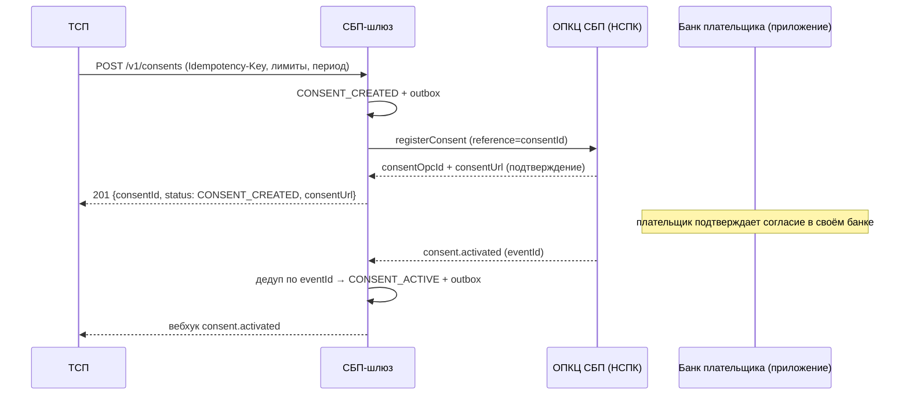
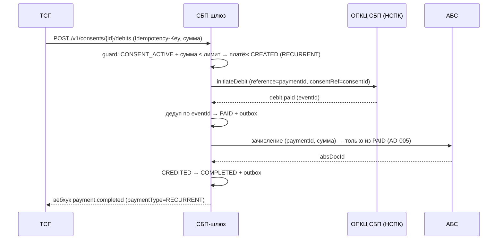
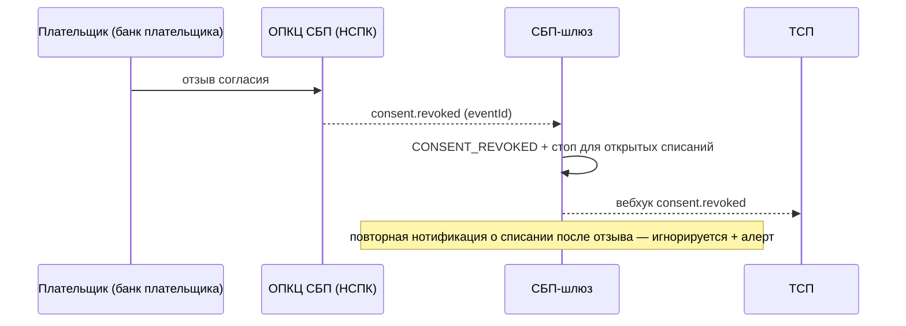

# Solutioning — Рекуррентные C2B-списания по согласию плательщика (СБП-подписки)

- Статус: Draft (пакет на архитектурное решение; гейт A1 → A3)
- Owner: solution-architect (платёжный контур)
- Связано: ADR-008, AD-009 (spine), ADR-002/003/004/005/007
- Дочерний пакет родительской инициативы «Платёжный шлюз СБП (C2B-приём)» (`docs/solutioning.md`). **Заменяет** строку «автоплатежи — вне scope» в roadmap родительского solutioning.

## 1. Оценка значимости и маршрута

Значимость **9/15, маршрут Critical-feature**. Полное проектирование (не one-pager), потому что: новая финансовая сущность (согласие) со своей статусной машиной; новый вид отказа с прямым финансовым/регуляторным ущербом (двойное списание, списание после отзыва); сквозное изменение двух контрактов (API ТСП + адаптер ОПКЦ) и RFP вендора; внешний вход `[ТРЕБУЕТ ПРОВЕРКИ]` (протокол рекуррентных операций НСПК); смена профиля нагрузки (batch-волны). Гейт A3 (человеческое решение по модели согласия) обязателен **до** реализации транспорта (аналог ADR-007). Подробно — `docs/adr/ADR-008-rekurrentnye-c2b-spisaniya-po-soglasiyu-platelshchika.md`.

## 2. Влияние на принятую архитектуру (инварианты AD-001…AD-008)

| Инвариант | Затронут? | Что меняется / что нет |
|---|---|---|
| AD-001 Изоляция платёжного контура | **Не изменён** | Согласие и дебет живут внутри СБП-шлюза; обращений к АБС/ОПКЦ мимо адаптеров не добавляется |
| AD-002 Единый источник истины (статусная машина) | **Расширен** | Добавляется второй источник истины — машина согласия. Переходы согласия так же атомарны (статус + outbox + аудит). Платёжная машина не меняется |
| AD-003 Идемпотентность | **Расширен** | Идемпотентность распространяется на согласия/дебеты (`Idempotency-Key`, `eventId`, `reference`). Правило «повтор не меняет завершённое состояние» — без изменений |
| AD-004 Единственный адаптер ОПКЦ | **Не изменён** | Протокол НСПК по рекурренту остаётся внутри адаптера; внутренний контракт — единственный интерфейс |
| AD-005 Зачисление только из `PAID` | **Не изменён** | Дебет использует ту же машину: `CREATED → PAID → CREDITED`. Guard «зачисление только из PAID» действует дословно |
| AD-006 Trust-зоны и сегментация | **Не изменён** | Новые потоки идут по тем же зонам/СЗИ; ключевой материал — СКЗИ/HSM |
| AD-007 Соответствие НПС/КИИ/ПДн | **Усилен** | Согласие = волеизъявление + ПДн: явная фиксация, отзыв в один шаг, срок хранения, аудит (152-ФЗ/161-ФЗ). Требует отдельного ИБ-ревью на A4 |
| AD-008 Стратегия реализации (гибрид) | **Расширен (не пересмотрен)** | Вендорский адаптер должен поддержать рекуррентные операции — расширяет RFP и контракт с вендором; принцип «ядро контрактно-независимо от транспорта» не меняется |

**Новый инвариант:** AD-009 (Proposed) — «списание только из `CONSENT_ACTIVE`» (см. `ARCHITECTURE-SPINE.md`).

**Что не меняется:** статусная модель платежа, зачисление из `PAID`, outbox/DLQ/сверка, mTLS/ГОСТ, trust-зоны, гибридная стратегия. Рекуррентный дебет — это тот же платёж с `paymentType=RECURRENT`, не новая платёжная сущность.

## 3. Новые компоненты и потоки

Компоненты — без новых контейнеров: реестр согласий (БД шлюза), машина согласия (в статусной машине), расширение адаптера ОПКЦ и API ТСП. Диаграмма контейнеров родительского solutioning остаётся валидной; меняются методы и события на существующих стыках.

### 3.1 Регистрация согласия

### 3.2 Рекуррентное списание (дебет)

### 3.3 Отзыв согласия

## 4. Изменения контрактов

- **API ТСП** (`openapi/tsp-api.yaml`, `docs/contracts/tsp-api.md`): новые методы `POST/GET /v1/consents`, `POST /v1/consents/{id}/revoke`, `POST/GET /v1/consents/{id}/debits`; опциональные поля `paymentType`/`consentId` в платеже; новые события вебхуков `consent.*`. Всё **аддитивно и обратно совместимо** (путь `/v1`, существующие методы не меняются).
- **Адаптер ОПКЦ** (`docs/contracts/opkc-adapter.md`): операции `registerConsent`, `revokeConsent`, `initiateDebit`, `getConsentStatus`; события `consent.activated/revoked/expired/rejected`, `debit.paid/debit.rejected`. Идемпотентность по `reference` — обязательно (расширение RFP).
- **RFP вендора** (`docs/rfp/vendor-rfp.md`): добавить требование поддержки рекуррентных операций и тестового контура с сценариями `consent.*`/`debit.*`.

## 5. NFR для рекуррентных списаний

Полная таблица — `docs/nfr.md` §7. Ключевые измеримые цели, специфичные для подписок:

| Метрика | Цель |
|---|---|
| Двойное списание по одному согласию/событию | **0** (идемпотентность дебета) |
| Списание после отзыва/истечения согласия | **0** (guard AD-009, fitness-тест) |
| Регистрация согласия (без НСПК) | p95 < 1 c |
| Инициация списания (без НСПК) | p95 < 500 мс |
| Распространение отзыва до стопа списаний | p95 < 5 c от события |
| Batch-нагрузка (ЖКХ/связь, начало месяца) | 1000 TPS на 1 мин, sustained 200 TPS |
| Сверка согласий с НСПК | ежедневная; расхождений — 0 |
| Отчёт по неоконченным согласиям/дебетам | доступен всегда |

## 6. Критерии приёмки (гейты)

- **A1 (Spec)**: ADR-008 + машина согласия + контракты (API ТСП и адаптер ОПКЦ) + NFR §7 заполнены; fitness-правила для AD-009 определены.
- **A3 (человеческое решение)**: утверждена модель согласия (см. §7) — **до** реализации транспорта.
- **A4 (conformance)**: (1) fitness-тест «недостижимость списания из `CONSENT_REVOKED`/`EXPIRED`/`SUSPENDED`»; (2) тест идемпотентности дебета (повторный `Idempotency-Key` и повторный `eventId` → один `paymentId`, ноль дублей); (3) тест отзыва: после `consent.revoked` входящее `debit.paid` игнорируется; (4) нагрузка batch-профиля (NFR §7); (5) ИБ-ревью согласий как ПДн.
- **A5 (post-deploy)**: SLO-отчёт за 30 дней; сверка согласий/дебетов с НСПК — 0 расхождений; отсутствие дрейфа от spine (AD-009).

## 7. План отката

- **До боевой эксплуатации**: фича за feature-флагом; откат = выключить флаг, существующие one-off платежи не затронуты. Все изменения аддитивны и обратимы.
- **После включения**: мгновенный **stop-new** — запрет новых согласий и новых списаний (флаг), без остановки обработки уже открытых дебетов; отзыв релиза — rolling. Исполненные списания — обычные платежи, корректируются только возвратом (ADR-005). Записи согласий — ПДн, «удаление» не допускается; применяется политика хранения/обезличивания.
- **Триггеры отката**: (1) любой дубль списания в проде; (2) списание после отзыва согласия; (3) расхождение сверки согласий с НСПК > 0 по завершённым операциям; (4) недоступность вендорского рекуррентного транспорта сверх SLA.
- **Владелец решения об откате**: product-owner + владелец платёжного контура (4-eyes для ручных операций — AD-006).
- **Аварийный сценарий**: DLQ + runbook; сверка компенсирует потерянные нотификации; RTO ≤ 1 ч (как у родителя).

## 8. Gaps и внешние входы

| Gap | Что закроет | Владелец |
|---|---|---|
| Протокол рекуррентных операций НСПК (токены, лимиты, роли, тайминги) | Документация НСПК по договору `[ТРЕБУЕТ ПРОВЕРКИ]` | Проектный офис / НСПК |
| Поддержка рекуррента вендорским адаптером + тестовый контур | RFP-обновление, контракт с вендором | Проектный офис / закупки |
| Модель подтверждения согласия в банке плательщика (UX, сроки) | Регламент НСПК + банк плательщика | Продукт / НСПК |
| Правовая допустимость списаний по согласию (161-ФЗ, 152-ФЗ, отзыв, хранение) | Заключение ИБ/комплаенс | ИБ / комплаенс |
| Политика лимитов согласий (maxPerDebit/maxTotal/период) и их enforce-точка | Бизнес-требования + регламент НСПК | Бизнес + архитектор |

## 9. Что остаётся на решение человека-архитектора

1. **Где источник истины согласия — шлюз, НСПК или оба.** ADR-008 фиксирует шлюз как источник истины для ТСП-facing состояния; но кто технически владеет согласием в НСПК и какие гарантии даёт банк плательщика — зависит от протокола НСПК (внешний вход). Это влияет на сверку и на гарантию «списание после отзыва = 0».
2. **Точка enforcement лимитов** (шлюз / НСПК / оба) и модель частичного отказа (отказ одного списания ≠ отзыв согласия). Влияет на AD-009 и на поведение при `debit.rejected`.
3. **Разграничение ответственности с банком плательщика** за подтверждение и отзыв согласия — наш шлюз (эквайер) не владеет UX плательщика, это внешняя зависимость, которую нужно зафиксировать в SLA.
4. **Batch-окна нагрузки** (ЖКХ/связь) — решение по capacity и по приоритизации очередей списаний против one-off платежей.
5. **Правовой/регуляторный вердикт** по 161-ФЗ/152-ФЗ и тарифной модели подписок (комиссии) — вне полномочий solution-архитектора.
6. **Формальная ратификация ADR-008 и AD-009** (гейт A3) — как для ADR-007.

Эти пункты — **обязательные человеческие решения**, потому что зависят от внешнего входа (протокол/регламент НСПК), от полномочий бизнеса/комплаенс и от поведения банка плательщика, которое наш контур не контролирует. До их закрытия пакет выходит на гейт A1 (Spec), но **не** на реализацию транспорта.
