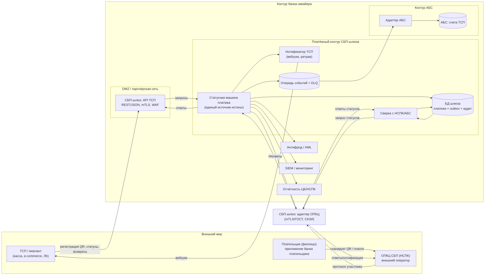
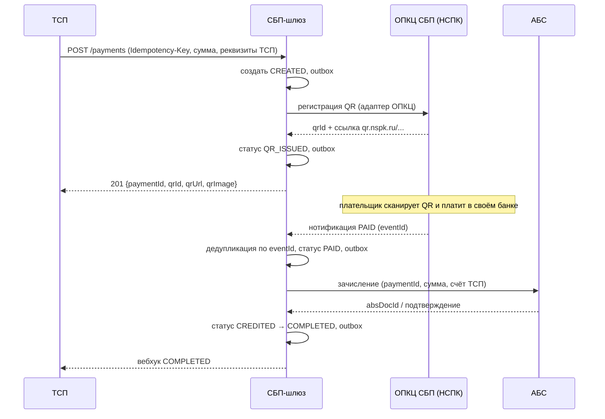
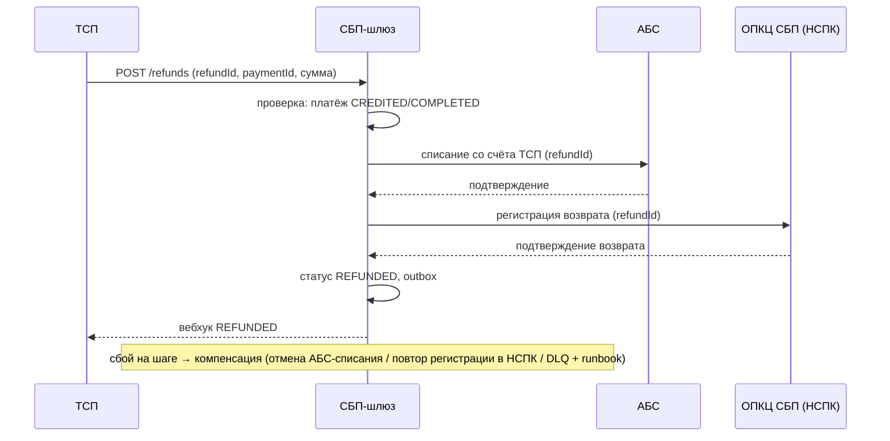
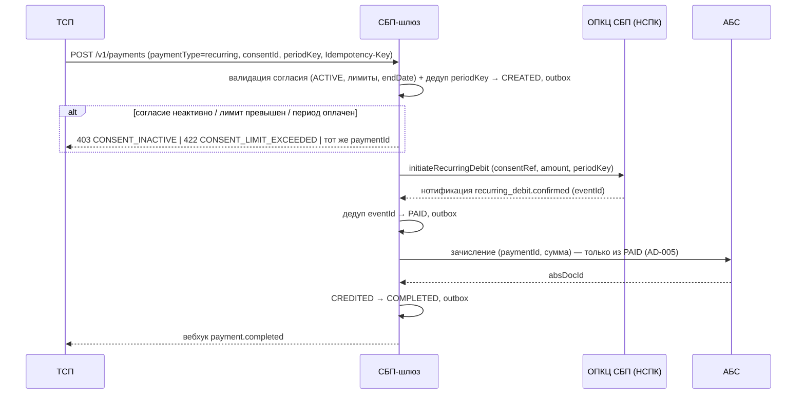

# Solutioning — Платёжный шлюз СБП (C2B-приём)

Маршрут: **Critical** (значимость 11/15). Настоящий документ — полный Solutioning: контекст, компоненты, потоки, разбиение на ADR, NFR, план гейтов A0–A5, план отката, gaps.

## 1. Контекст и границы

Банк — участник СБП (эквайер/агент ТСП) принимает C2B-платежи от ТСП. Внешние системы: **ОПКЦ СБП (АО «НСПК»)** — операционный/клиринговый центр, **Банк России** — расчёты по корсчетам. Внутренние: **АБС** (счета ТСП), **антифрод/AML**, **SIEM**, **отчётность** (ЦБ/НСПК).

Подключение банка — по порядку ЦБ РФ (cbr.ru/PSystem/payment_system/actions/): договор с ПБР + СКЗИ → присоединение к Правилам ОПКЦ СБП → доработка ПО по документации Портала поддержки НСПК → тестовые испытания → активация. **Документация НСПК — внешний вход**: точный протокол получается по договору, публично не раскрыт (все протокольные детали помечены `[ТРЕБУЕТ ПРОВЕРКИ]` до получения).

Сценарии C2B в scope: динамический QR, статический QR/наклейка, кассовые ссылки, оплата по ссылке в e-commerce, возвраты. Рекуррентные C2B-списания (подписки/автоплатежи по согласию плательщика) — выведены из roadmap в scope изменением ADR-008 (см. §11). Roadmap (вне scope): C2C, выплаты B2C/B2B, диспуты.

## 2. Компоненты (C4 — контейнеры)



## 3. Статусная модель платежа

```
CREATED ──► QR_ISSUED ──► PAID ──► CREDITED ──► COMPLETED
   │            │          │            │
   ▼            ▼          ▼            ▼
 FAILED      EXPIRED    FAILED      REFUNDED (через сагу возврата)
```

- `PAID` — подтверждённый НСПК статус; **только из него** разрешено зачисление (AD-005).
- Переходы — атомарные транзакции «статус + outbox + аудит» (AD-002).
- Повторные нотификации идемпотентны (AD-003).

## 4. Ключевые потоки

### 4.1 Оплата динамическим QR (счастливый путь)



### 4.2 Возврат (сага)



## 5. Разбиение на решения (ADR)

| Решение | ADR | Spine |
|---|---|---|
| Топология: выделенный компонент + outbox | ADR-001 | AD-001, AD-002 |
| Статусная машина + идемпотентность | ADR-002 | AD-002, AD-003 |
| Транспорт к ОПКЦ: изолированный адаптер, mTLS/ГОСТ, СКЗИ | ADR-003 | AD-004 |
| Нотификации: at-least-once, дедуп, DLQ, сверка | ADR-004 | AD-003 |
| АБС: зачисление из PAID, возвраты-сага | ADR-005 | AD-005 |
| НПС/КИИ/ПДн: trust-зоны, ГОСТ | ADR-006 | AD-006, AD-007 |
| Стратегия реализации (гибрид) — **A3 принято 2026-08-15** | ADR-007 (Accepted) | AD-008 [ADOPTED] |

## 6. NFR

Полный набор с измеримыми целями — `docs/nfr.md`. Ключевое: доступность ≥ 99,95 %; RPO=0; RTO ≤ 1 ч; регистрация QR p95 < 500 мс; sustained 200 TPS / пик 500 TPS; сверка с НСПК ежечасная, с АБС суточная; двойных зачислений — 0.

## 7. Гейты и критерии приёмки

- **A0 (readiness)**: ADR-001..007 заполнены, spine пролинтован, gaps зафиксированы. Критерий: PASS.
- **A1 (Spec)**: контракт API ТСП (v0.1 — `docs/contracts/tsp-api.md`), таблица переходов статусной машины (`docs/spec/state-machine.md`), контракт адаптера ОПКЦ (`docs/contracts/opkc-adapter.md` — ядро↔транспорт, основа RFP), RFP-пакет по вендору (`docs/rfp/vendor-rfp.md`), NFR финализированы.
- **A2 (Plan)**: разбивка на задачи, walking skeleton определён (сквозной путь: ТСП → шлюз → мок НСПК → АБС-мок → нотификация).
- **A3 (человеческое решение)**: стратегия реализации (ADR-007) — **обязательно до реализации транспорта**.
- **A4 (conformance)**: fitness-проверки spine-инвариантов, нагрузочные тесты (NFR), тесты идемпотентности, ИБ-аудит.
- **A5 (post-deploy drift)**: сверка с НСПК/АБС в проде, SLO-отчёт через 30 дней, проверка отсутствия дрейфа от spine.

## 8. План отката

- **До боевой эксплуатации**: откат = не включать. Все работы обратимы (ADR-007 reversible).
- **После включения**: фиче-флаг на приём новых ТСП; мгновенный stop-new (запрет регистрации новых QR) без остановки обработки уже открытых операций; откат релиза — rolling; данные не мигрируются обратно (шлюз остаётся источником истины до полной сверки с АБС).
- **Аварийный сценарий**: DLQ → дежурная смена по runbook; сверка компенсирует потерянные нотификации; RTO ≤ 1 ч.

## 9. Gaps и внешние входы

| Gap | Что закроет | Владелец |
|---|---|---|
| Точный протокол НСПК (поля, тайминги, TLS-профили) | Документация НСПК по договору (Портал поддержки) | Проектный офис / НСПК |
| Регламенты НСПК (таймауты, сроки уведомлений, доступность) | Документация НСПК, правила ОПКЦ СБП | Проектный офис |
| Номер/редакция Положения ЦБ о защите информации при переводах | ИБ/комплаенс банка | ИБ |
| Контракт АБС на зачисление/списание (идемпотентность, SLA) | Интервью с владельцем АБС | Архитектор + АБС |
| Категория объекта КИИ, состав мер ФСТЭК | ИБ/КИИ банка | ИБ |
| Выбор конкретного вендора транспорта ОПКЦ | RFP по критериям ADR-007 (сертификаты ФСТЭК, тестовый контур, SLA, референсы) | Проектный офис / закупки |
| Протокол НСПК для согласий и рекуррентных списаний (поля, семантика `initiateRecurringDebit`/`registerConsent`, события `consent.*`) | Документация НСПК по договору [ТРЕБУЕТ ПРОВЕРКИ] | Проектный офис / НСПК |
| Политика лимитов/velocity для рекуррентного канала (пороги AML, правила отзыва) | Решение AML/комплаенс банка | AML/ИБ |

## 10. Открытые вопросы

1. Объём первой волны: только C2B-приём или сразу C2C/выплаты? (влияет на состав адаптеров, но не на ядро).
2. Требования бизнеса к комиссиям и тарифам ТСП (влияет на модель отчётности).
3. Лимиты/пороги для AML-интеграции.
4. Доступность АБС в ночные окна (влияет на SLA зачисления).

## 11. Изменение: рекуррентные C2B-списания (подписки СБП)

### 11.1 Маршрут и значимость

**Critical, score 6** (триггеры `api_contract_change`, `consistency_model_change`, `data_contract_change`, `financial_impact`, `new_component`, `new_datastore`). Финансовое влияние максимально: списание **без действия плательщика** на каждую операцию — ошибка есть регуляторный (161-ФЗ) инцидент. Требуется полный Solutioning: ADR-008, spine AD-009, NFR §7, контракты v0.2. **Человеческая точка A3 — обязательна до реализации.**

### 11.2 Влияние на принятую архитектуру

Меняется (аддитивно):

- **Новый доменный объект** — согласие плательщика (consent) со своей статусной машиной и хранилищем в БД шлюза.
- **Новый логический компонент** — менеджер согласий (внутри ядра, не отдельный сервис): валидация согласия, enforcement лимитов, дедупликация периода.
- **Расширение статусной машины платежа**: рекуррентный платёж идёт `CREATED → PAID → CREDITED → COMPLETED` **без `QR_ISSUED`** (QR не выпускается).
- **Расширение адаптера ОПКЦ**: операции `registerConsent`/`getConsentStatus`/`cancelConsent`/`initiateRecurringDebit` и события `consent.*`/`recurring_debit.*` (всё `[ТРЕБУЕТ ПРОВЕРКИ]` до документации НСПК).

Не меняется (инварианты наследуются без правок): AD-001 (изоляция), AD-002 (outbox/единый источник истины), AD-003 (идемпотентность), AD-004 (единственный адаптер ОПКЦ), AD-005 (зачисление только из `PAID`), AD-006/AD-007 (trust/НПС), AD-008 (гибрид). Все существующие разовые потоки нетронуты.

### 11.3 Статусная машина согласия

```
PENDING ──► ACTIVE ──► CANCELLED | EXPIRED | REVOKED | FAILED
```

- `PENDING` — создано, ждёт подтверждения плательщиком в приложении своего банка (через НСПК).
- `ACTIVE` — единственное состояние, из которого разрешены рекуррентные списания (AD-009).
- `CANCELLED` (отзыв плательщиком/ТСП), `EXPIRED` (по `endDate`), `REVOKED` (AML/ИБ), `FAILED` (НСПК отклонил регистрацию) — терминальные, новых списаний нет.

### 11.4 Поток (рекуррентное списание)



### 11.5 Критерии приёмки (EARS, гейт A4)

- **When** ТСП инициирует рекуррентное списание с неактивным/истёкшим согласием, **the** шлюз **shall** вернуть `403 CONSENT_INACTIVE`, не создав платёж и не вызвав НСПК.
- **When** `amount` превышает `maxAmountPerDebit` или лимит периода, **the** шлюз **shall** отклонить `422 CONSENT_LIMIT_EXCEEDED` **до** вызова НСПК.
- **When** ТСП повторяет `POST` с тем же `consentId + periodKey` (в т.ч. с новым `Idempotency-Key`), **the** шлюз **shall** вернуть существующий `paymentId` без второго списания.
- **When** приходит дубль нотификации НСПК (`eventId`), **the** шлюз **shall** проигнорировать его (состояние не меняется, двойного зачисления нет).
- **When** согласие отозвано (`CANCELLED`/`REVOKED`), **the** шлюз **shall** блокировать новые списания и доставить ТСП вебхук `consent.revoked` за p95 < 5 с.
- **When** рекуррентный платёж подтверждён НСПК (`PAID`), **the** шлюз **shall** зачислить средства только из `PAID` (AD-005) и довести до `COMPLETED`/вебхука.
- **When** рекуррентный платёж проходит, **the** шлюз **shall** не выпускать QR и не достигать состояния `QR_ISSUED` (fitness-тест).
- **When** существующий ТСП разового платежа шлёт `POST /v1/payments` без `paymentType`, **the** шлюз **shall** вести себя как раньше (обратная совместимость, `paymentType=one_time`).

### 11.6 План отката

- **До включения в бой**: откат = не включать фиче-флаг рекуррентных списаний. Разовая ветка (`one_time`) не затронута — риск отката нулевой.
- **После включения**: фиче-флаг на рекуррентный канал (per-ТСП). Мгновенный `stop-new` — запрет новых согласий и новых рекуррентных списаний — без остановки разовых платежей и без прерывания уже инициированных рекуррентных операций (они завершаются штатно или через сверку).
- **Сигнал отката**: `списанное без активного согласия > 0`, `двойное списание периода > 0`, `превышение лимита > 0`, всплеск AML-инцидентов по рекуррентному каналу. Владелец решения — платёжный архитектор + AML.
- **Механика**: откат релиза — rolling; данные согласий не мигрируются обратно (шлюз остаётся источником истины согласия до полной сверки с НСПК); отозванные/истёкшие согласия не реактивируются.
- **Аварийный сценарий**: DLQ рекуррентных списаний → дежурная смена по runbook; сверка согласий с НСПК (ежечасная) компенсирует потерянные нотификации.

### 11.7 Что остаётся на решение человека-архитектора (и почему)

1. **Точный протокол НСПК по согласиям/рекуррентным списаниям** — внешний вход `[ТРЕБУЕТ ПРОВЕРКИ]`. Без него `initiateRecurringDebit`/`registerConsent`/события `consent.*` — нормализованная проекция, поля не пинятся. *Почему человек:* документ выдаётся по договору, агент его не имеет.
2. **Политика лимитов и AML для канала «без действия плательщика»** — пороги сумм, velocity, правила отзыва (`REVOKED`), нужно ли дополнительное подтверждение для подписок сверх порога. *Почему человек:* регуляторное решение владельца AML/комплаенс, не техническое.
3. **Merchant-driven vs bank-driven подтверждение бизнесу** — рекомендован merchant-driven (ADR-008), но если бизнесу нужен банковский планировщик (автопродление без участия ТСП) — это меняет scope. *Почему человек:* продуктовое решение о модели подписки и ответственности за биллинговый цикл.
4. **Семантика `periodKey`** — что считать периодом (календарный месяц, 30 дней, биллинговый цикл ТСП) и как реагировать на несовпадение суммы при повторе. *Почему человек:* контрактное соглашение с ТСП, влияет на ложные блокировки/дубли.
5. **Стратегия сглаживания пика «день списаний»** (NFR §7, бимодальный профиль) — расписание ТСП vs admission control/очередь. *Почему человек:* продуктово-операционный компромисс latency vs гарантии.
6. **Пробное/нулевое списание при активации согласия** (token verification) — требует ли НСПК тестовый дебит на момент `PENDING→ACTIVE`. *Почему человек:* зависит от протокола НСПК и политики банка.
