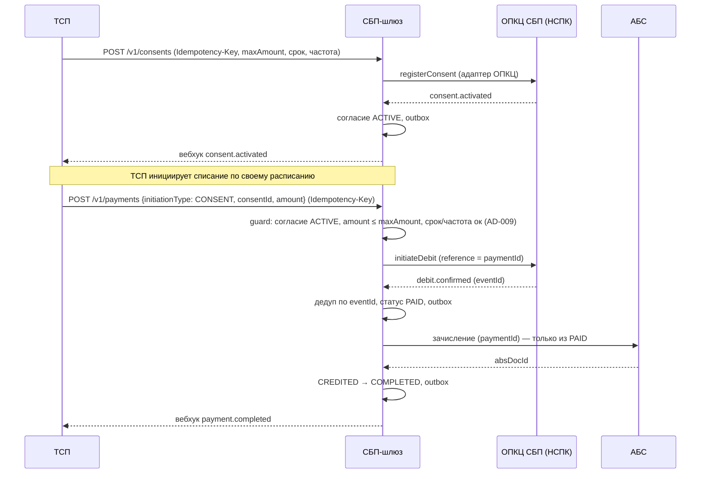

# Solutioning — Рекуррентные C2B-списания по согласию (подписки СБП)

Пакет изменения поверх принятого решения «Платёжный шлюз СБП (C2B-приём)». Назначение — вынести изменение на архитектурное решение (A3) и передать исполнителям. Кода не содержит.

- Дата: 2026-09-28
- Статус: Proposed (ожидает человеческого решения)
- Связано: ADR-008 (новый), ADR-002, ADR-004, ADR-005, AD-009 (новый)

## 1. Оценка значимости и маршрут

**Значимость: Critical** (~10/15). Ниже базового C2B-приёма (11/15), т.к. переиспользуется готовый фундамент (шлюз, статусная машина, адаптер, АБС, trust-зоны), но выше порога Architectural:

- финансовое влияние — новый способ списания средств клиента;
- новый объект с жизненным циклом (согласие) и новый тип инициации платежа;
- расширение контракта адаптера ОПКЦ — зависимость от вендора (ADR-007);
- регуляторный профиль: согласие и ПДн (161-ФЗ, 152-ФЗ, 115-ФЗ), риск несанкционированных списаний.

**Маршрут: глубокое проектирование (architectural).** Причины:

1. Затрагивает **принятую** статусную машину платежа (ADR-002) — требуется обобщение, а не новый изолированный код.
2. Добавляет сущность с собственным автоматом (согласие) — отдельная спецификация.
3. Меняет **контракт API ТСП** (аддитивно) и **внутренний контракт адаптера** — интерфейсы, на которые опираются потребители и вендор.
4. Вводит новый spine-инвариант (AD-009) — изменение архитектурного «позвоночника».

Без глубокого проектирования нельзя гарантировать «списание только по активному согласию» и «зачисление только из `PAID`» на новом типе инициации.

## 2. Влияние на принятую архитектуру

| Инвариант | Влияние |
|---|---|
| AD-001 Изоляция контура | **Без изменений** — логика согласий/списаний остаётся внутри шлюза |
| AD-002 Единый источник истины | **Расширяется** — Rule не меняется (атомарный переход + outbox + аудит), но появляется второй автомат (согласие) и второй тип инициации у платёжного автомата |
| AD-003 Идемпотентность | **Rule без изменений**; расширяются ключи: `consentId`, `reference` списания |
| AD-004 Единственный адаптер ОПКЦ | **Rule без изменений**; расширяется контракт адаптера (consent/debit-операции) |
| AD-005 Зачисление из PAID | **Без изменений** — списание тоже зачисляется только из `PAID` |
| AD-006 Trust-зоны | **Без изменений** |
| AD-007 НПС/КИИ/ПДн | **Усиливается** — новый ПДн-объект (согласие), требования к отзыву/лимитам, AML-мониторинг серий списаний |
| AD-008 Гибрид | **Rule без изменений**; расширяются обязательства вендора (consent/debit в RFP) |

**Новый инвариант AD-009** (Proposed, ADR-008): списание только по активному согласию; проверка лимитов до списания; списание после отзыва невозможно.

**Что НЕ меняется:** топология шлюза, trust-зоны, криптография, зачисление из `PAID`, возвраты-сага, модель «ядро контрактно-независимо от транспорта».

## 3. Архитектурное решение

Полное решение с альтернативами, последствиями и обратимостью — **`docs/adr/ADR-008-rekurrentnye-spisaniya-po-soglasiyu-podpiski-sbp.md`**. Кратко:

- **Согласие — отдельный объект** с автоматом (`PENDING_APPROVAL → ACTIVE`, терминальные `EXPIRED`/`REVOKED`/`SUSPENDED`) и неизменяемыми параметрами (максимум, срок, частота).
- **Списание = платёж** с `initiationType=CONSENT`, путь `CREATED → PAID → CREDITED → COMPLETED` (без `QR_ISSUED`), те же идемпотентность/зачисление-из-PAID/возвраты.
- **Pull-модель**: ТСП инициирует каждое списание; планировщик на стороне шлюза — deferred.
- **Контракты расширяются аддитивно** (см. §4).

Ключевой поток (списание по согласию):

## 4. Изменения контрактов

Полностью — `docs/contracts/tsp-api.md` (новые §3.6, §5) и `openapi/tsp-api.yaml`. Принцип: **аддитивно, без поломки существующих потребителей** (`/v1`, опциональные поля, новая мажорная версия не требуется).

- Новый ресурс `/v1/consents`: `POST /v1/consents` (запрос согласия), `GET /v1/consents/{consentId}` (статус), `POST /v1/consents/{consentId}/revoke` (отзыв ТСП).
- `POST /v1/payments` расширяется опциональными полями `initiationType` (`QR`|`CONSENT`, по умолчанию `QR`) и `consentId` (обязателен при `CONSENT`). Отсутствие полей = прежнее поведение QR.
- Новые вебхук-события: `consent.activated`, `consent.revoked`, `consent.expired`; `payment.*` переиспользуется для списаний.

## 5. Измеримые NFR

Полный набор — в `docs/nfr.md` (новый раздел 7). Ключевое:

- Списание по согласию: p95 < 500 мс (шлюз, без учёта НСПК/АБС); подтверждение списания p95 < 60 с.
- Регистрация согласия: p95 < 1 с (без учёта НСПК); распространение отзыва p95 < 5 с.
- **Списание после отзыва — 0** (fitness-тест); **двойное списание при повторе — 0** (идемпотентность).
- Принудительная проверка лимитов согласия до списания — 100 %.
- Доступность/надёжность/наблюдаемость — на уровне базового шлюза (99,95 %, RPO=0, trace id 100 %).

## 6. Критерии приёмки и план отката

**Приёмка (гейты A4/A5 подписок):**

- Сквозной сценарий: согласие создано → активировано → списание → `PAID` → зачисление → вебхук `payment.completed`.
- Негативные: списание при `REVOKED`/`EXPIRED`/`SUSPENDED` отклоняется; превышение `maxAmount`/срока/частоты отклоняется; повторный запрос списания возвращает тот же `paymentId` (без дубля); отзыв после `PAID` не отменяет зачисление, но блокирует новые списания.
- NFR-пороги раздела 7 `docs/nfr.md` (лаги, отсутствие двойных списаний, лимиты).
- Fitness: AD-009 (списание только из `ACTIVE`), AD-005 (зачисление только из `PAID`) — зелёные.

**План отката:**

- Фиче-флаг «подписки» на приём новых согласий и списаний: выключение = полный откат функционала без влияния на QR-платежи.
- «Stop-new»: запрет новых согласий/списаний без остановки уже открытых операций (аналог базового плана отката).
- Откат релиза — rolling; данные согласий не мигрируются обратно (остаются в БД, но не используются).
- Сигналы отката: расхождение состояний согласий в сверке (`ACTIVE` у нас vs `REVOKED` у НСПК), всплеск отклонений списаний, `DLQ > 0` по событиям `consent.*`. Владелец решения — дежурная смена + владелец продукта «Подписки».

## 7. На решение человека-архитектора

1. **Стратегическое размещение**: подписки — продолжение текущего initiative (feature-spine) или новый initiative (изменение родительского spine). Рекомендация — feature-spine под текущим initiative; конфликт эскалируется владельцу spine.
2. **Pull vs push** подтверждается бизнесом: дефолт — pull (ТСП инициирует); push-планировщик возвращается только при явном требовании.
3. **Ратификация ADR-008 и AD-009** (Proposed → Accepted на A3).
4. **Протокол НСПК** `[ТРЕБУЕТ ПРОВЕРКИ]`: точный порядок регистрации согласия, семантика лимитов/частоты, где хранится согласие — закрывается документацией НСПК.
5. **RFP/вендор**: включить consent/debit-операции и их идемпотентность в требования к транспортному адаптеру (расширение ADR-007) — решение закупок/проектного офиса.
6. **Комплаенс**: правовое основание хранения ПДн согласия (152-ФЗ), сроки хранения, AML-пороги для серий списаний — ИБ/комплаенс.

## Созданные и изменённые файлы пакета

- Создан: `docs/adr/ADR-008-rekurrentnye-spisaniya-po-soglasiyu-podpiski-sbp.md`
- Создан: `docs/spec/consent-state-machine.md`
- Создан: `docs/solutioning-recurring.md` (этот документ)
- Изменён: `docs/contracts/tsp-api.md`, `openapi/tsp-api.yaml`, `docs/nfr.md`, `ARCHITECTURE-SPINE.md`, `docs/solutioning.md`, `README.md`
