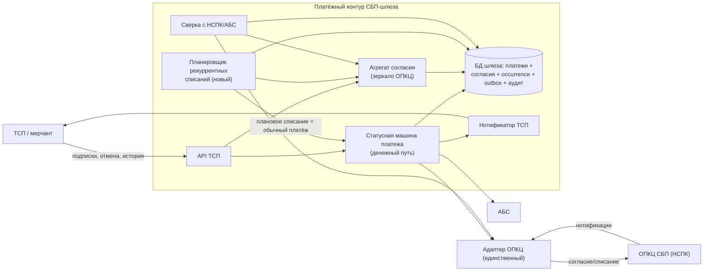
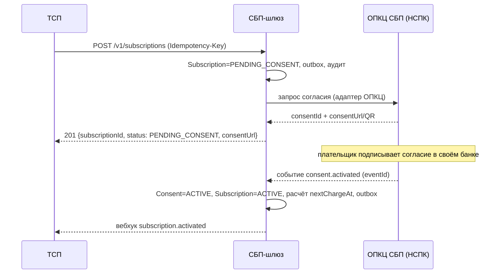
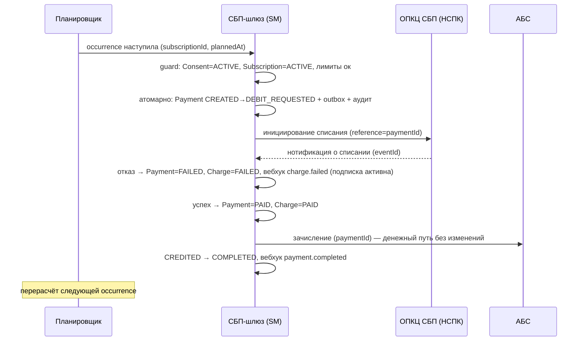

# Solutioning изменения — Подписки СБП (рекуррентные C2B-списания по согласию плательщика)

- Status: Draft (пакет изменения; выносится на архитектурное решение A3 изменения)
- Owner: solution-architect (платёжный контур)
- База: принятое решение `docs/solutioning.md` (тег `accepted`), ADR-001…007, `ARCHITECTURE-SPINE.md` (AD-001…AD-008)
- Связано: `docs/adr/ADR-008-podpiski-sbp-rekurrentnye-c2b-spisaniya.md`

Настоящий документ — пакет изменения поверх принятого решения. Он **не переписывает** принятые документы: новое решение оформлено отдельным ADR-008 (Proposed), новые инварианты — блоками AD-009/AD-010 spine (Proposed), контракт и NFR расширены аддитивными дополнениями. Это принятый в репозитории способ изменения принятого решения (новый ADR + Proposed-блок spine + аддитивные дополнения).

---

## 1. Бизнес-задача и границы

**Задача.** ТСП (онлайн-кинотеатры, ЖКХ, связь) просят рекуррентные C2B-списания по согласию плательщика — «подписки СБП»: постоянные или регулярные списания без повторного сканирования QR и без активного действия клиента каждый раз.

**Почему сейчас это изменение, а не «ещё один метод API».** В принятом решении (`docs/solutioning.md` §1) автоплатежи отнесены к roadmap и **вне scope**; каждый платёж предполагает QR и действие клиента. Перевод автоплатежей в scope — смена границ, а не расширение набора методов:

- появляется **новый источник переходов состояния** — время/расписание, а не внешнее событие (планировщик);
- появляется **новый агрегат** — согласие плательщика (юридически значимое, с ПДн и собственным жизненным циклом);
- меняется **профиль внешней интеграции** — у ОПКЦ появляются операции автоплатежа (расширение контракта адаптера и требований к вендору);
- появляются **новые регуляторные аспекты** — правила уведомления плательщика о списании и отзыва согласия, хранение доказательства воли плательщика.

**В scope изменения:** подписки с регулярным списанием фиксированной суммы (дневное/недельное/месячное расписание), жизненный цикл согласия, плановое списание как обычный платёж, отмена/отзыв, история списаний, вебхуки.

**Вне scope (остаётся roadmap):** C2C, выплаты B2C/B2B, диспуты/претензии, переменная сумма списания по факту потребления, мультивалютность, «пороговое пополнение» и иные не-календарные триггеры списания.

---

## 2. Оценка значимости и маршрута

**Маршрут: Critical, значимость 13/15** (выше исходных 11/15: изменение добавляет новый агрегат, новый источник переходов и расширяет внешнюю/регуляторную поверхность).

| Критерий (0–3) | Оценка | Обоснование |
|---|---|---|
| Влияние на бизнес-модель и клиентов | 3 | Три сегмента (кино, ЖКХ, связь) получают новый продукт; меняется клиентский путь платежа |
| Финансовый риск | 3 | Списания инициируются без действия плательщика: риск неверного/двойного/позднего списания и жалоб плательщиков |
| Интеграционная и внешняя сложность | 2 | Тот же единственный адаптер ОПКЦ, но расширяется протоколом автоплатежа; внешняя документация НСПК и поддержка вендора |
| Регуляторика / ИБ / ПДн | 3 | Юридически значимое согласие плательщика, правила уведомления и отзыва, 152-ФЗ, аудит для ЦБ/НСПК |
| Глубина изменения архитектуры | 2 | Новый агрегат и планировщик, но денежный путь переиспользуется без изменений |

**Вывод по маршруту: требуется глубокое проектирование** (не «быстрое расширение API»):

1. Архитектурное решение с альтернативами — ADR-008 (готовится, Proposed).
2. Спецификация новых статусных моделей — `docs/spec/subscription-lifecycle.md`.
3. Изменение контрактов — аддитивно (`docs/contracts/tsp-api-subscriptions.md`, `openapi/tsp-api.yaml`).
4. Измеримые NFR — `docs/nfr-subscriptions.md`.
5. Критерии приёмки и план отката — §8, §9 настоящего документа.
6. **Эскалация на уровень родительской инициативы**: смена границ (roadmap → scope) должна быть подтверждена на уровне initiative «Подключение банка к СБП», а не только feature-spine.

---

## 3. Влияние на принятую архитектуру

### 3.1 Что НЕ меняется (переиспользуется как есть)

- **Денежный путь:** `PAID → CREDITED → COMPLETED` и вся логика зачисления/возвратов (ADR-002, ADR-005).
- **AD-005 (зачисление только из `PAID`)** — без изменений; списания по подписке не создают исключений.
- **Изоляция платёжного контура и RPO=0** (AD-001): новые данные (согласия, occurrence) — в БД шлюза, в тех же транзакционных границах.
- **Единственный адаптер ОПКЦ** (AD-004): протокол автоплатежа по-прежнему знает только адаптер.
- **Trust-зоны** (AD-006): планировщик размещается в платёжном контуре, новых доверенных зон не появляется.
- **Стратегия гибрида** (AD-008): ядро (включая подписки) — собственная разработка; транспорт — вендорский.

### 3.2 Какие инварианты затронуты

| Инвариант (spine) | Влияние | Характер |
|---|---|---|
| AD-002 (единый источник истины, атомарность) | Требуется атомарность и для переходов, инициируемых **планировщиком** (не только событиями ОПКЦ/ТСП); канонический список состояний расширяется одним состоянием `DEBIT_REQUESTED` | Расширение (допустимо по Reversibility ADR-002) |
| AD-003 (идемпотентность) | Новые ключи: `Idempotency-Key` подписок, `occurrence = (subscriptionId, plannedAt)`, `consentId`, `eventId` согласия | Расширение |
| AD-004 (единственный адаптер ОПКЦ) | Контракт адаптера расширяется операциями автоплатежа; требования RFP к вендору расширяются | Расширение |
| AD-005 (зачисление только из `PAID`) | **Не изменяется** | Без изменений |
| AD-006 (trust-зоны) | Планировщик — новый компонент платёжного контура; ПДн плательщика по согласию — новые требования 152-ФЗ | Расширение |
| AD-007 (НПС/КИИ/ПДн) | Согласие — юридически значимое доказательство, неизменяемый аудит, правила уведомления/отзыва | Расширение |
| AD-008 (гибрид) | Ограничение сохраняется; операции автоплатежа входят в контракт адаптера и в требования к вендору | Ограничение сохраняется |
| AD-009, AD-010 | **Новые** инварианты (согласие-агрегат; идемпотентность planning-occurrence) | Новое |

### 3.3 Что появляется нового

- Новые агрегаты: `Consent`, `Subscription`, `Charge` (см. `docs/spec/subscription-lifecycle.md`).
- Новый компонент ядра: **планировщик рекуррентных списаний** (критичный для доступности — см. NFR §1).
- Новые операции контракта адаптера ОПКЦ (согласие/инициирование списания/отмена) — `docs/contracts/opkc-adapter.md` (обновление до v0.2).
- Новые методы, поля, коды ошибок и вебхуки API ТСП — аддитивно.

---

## 4. Компоненты и потоки

Добавление к C4-диаграмме принятого решения: новый узел `SCHED` (планировщик списаний) и новый агрегат согласия в БД шлюза. Существующие узлы не меняются.

### 4.1 Оформление подписки и согласия

### 4.2 Плановое списание

---

## 5. Архитектурное решение

Полное решение, альтернативы, последствия и обратимость — в `docs/adr/ADR-008-podpiski-sbp-rekurrentnye-c2b-spisaniya.md` (Status: Proposed). Кратко выбранный вариант — `consent-aggregate-plus-scheduler`:

- согласие плательщика — отдельный агрегат-зеркало СБП с fail-safe сверкой;
- подписка — расписание и лимиты поверх согласия;
- каждое плановое списание — обычный `Payment` в существующей статусной машине (денежный путь неизменен);
- планировщик рекуррентных списаний — новый компонент ядра с идемпотентностью по `occurrence`.

---

## 6. Изменения контрактов (без поломки существующих потребителей)

- Текст контракта: `docs/contracts/tsp-api-subscriptions.md` (v0.2-draft, аддитивно).
- Машинный контракт: `openapi/tsp-api.yaml` (`info.version: 0.2.0-draft`).

Гарантии совместимости:

1. Существующие методы и обязательные поля — без изменений.
2. **`Payment.status` не получает новых значений**: внутреннее `DEBIT_REQUESTED` наружу показывается как `CREATED`; детальный статус плановой попытки доступен только в API подписок.
3. Новые поля в существующих схемах — только опциональные (`source`, `subscriptionId`, `chargeId`).
4. Новые методы — под новыми путями (`/v1/subscriptions…`); новые коды ошибок и вебхуки — расширяемые справочники.
5. Ломающие изменения — только через `/v2` (период поддержки ≥ 6 мес.); для данного изменения `/v2` **не требуется**.

Контракт адаптера ОПКЦ (`docs/contracts/opkc-adapter.md`) расширяется операциями автоплатежа (v0.2) — затрагивает RFP вендора (`docs/rfp/vendor-rfp.md`): поддержка автоплатежа становится обязательным критерием допуска.

---

## 7. Измеримые NFR нового функционала

Полный набор — `docs/nfr-subscriptions.md`. Ключевое:

- точность инициирования списания ≥ 99,9 % в окне `plannedAt + 0…60 с`; пропущенных occurrence без исхода — 0;
- 0 вторых `Payment` по одной `occurrence` при рестарте/реплее планировщика;
- доступность планировщика ≥ 99,95 %;
- прекращение будущих списаний после подтверждения отзыва согласия — 0 новых occurrence;
- двойное списание/зачисление — 0;
- списания сверх лимитов согласия — 0;
- сверка согласий с ОПКЦ ежечасная, расхождений — 0; fail-safe 100 %;
- 100 % переходов согласия/подписки/списания — в неизменяемом аудит-логе.

---

## 8. Критерии приёмки

**Позитивные (проверяемы тестом/командой):**

- П1. Оформление подписки → согласие → `subscription.activated` → первое плановое списание → `PAID → CREDITED → COMPLETED` → вебхук `payment.completed`. (Сквозной сценарий на моках ОПКЦ/АБС.)
- П2. Отмена подписки ТСП: будущие списания прекращаются, `CANCELLED`, вебхук `subscription.cancelled`.
- П3. История списаний (`GET /v1/subscriptions/{id}/charges`) отражает ровно один исход на каждую occurrence.

**Негативные (обязательны):**

- Н1. Повторный запуск/реплей планировщика по одной occurrence → **одно** списание (0 дублей).
- Н2. Отказ списания (недостаток средств) → `Charge=FAILED`, подписка остаётся `ACTIVE`, вебхук `charge.failed`, политика ретраев соблюдена.
- Н3. Отзыв согласия плательщиком → все связанные подписки прекращены, **0** новых списаний; гонка с уже `INITIATED`/`PAID` обработана по утверждённой политике.
- Н4. Списание сверх лимита согласия → отклонено (`AMOUNT_EXCEEDS_CONSENT_LIMIT`), `Charge=SKIPPED`/`FAILED`, деньги не двигаются.
- Н5. ОПКЦ недоступен в момент `plannedAt` → попытка не теряется (отложена/`SKIPPED` по политике), зафиксирована и видна в сверке; **0** «пропавших» без исхода.
- Н6. Повторная доставка нотификации о списании (тот же `eventId`) → состояние не меняется, второго зачисления нет.
- Н7. Расхождение сверки согласий «локально `ACTIVE`, в ОПКЦ `REVOKED`» → списания немедленно остановлены (fail-safe).
- Н8. Существующий потребитель API v0.1 (только QR-платежи) — не ломается: те же методы/поля/enum `Payment.status`.

**Критерий успешного отката:** см. §9 (обязательное условие — 0 «осиротевших» плановых occurrence и 0 списаний после отзыва/отключения).

---

## 9. План отката

**Обратимость (согласована с ADR-008):** reversible до боевого включения; costly после старта боевых подписок. Откат не мигрирует данные обратно — шлюз остаётся источником истины по occurrence и зеркалу согласий до полной сверки.

**Сигналы-триггеры (любой из них):**

- > 0 подтверждённых двойных списаний по одной occurrence;
- расхождения сверки согласий с ОПКЦ не устраняются регламентно;
- зафиксированы списания после подтверждённого отзыва согласия;
- недоступность/деградация планировщика выводит шлюз за принятые NFR;
- отзыв поддержки автоплатежа вендором/НСПК; предписание регулятора.

**Владелец решения об откате:** архитектор платёжного контура совместно с бизнесом/CIO и ИБ (решение A3-уровня изменения). Технический исполнитель — дежурная смена по runbook.

**Шаги отката:**

1. **Stop-new:** выключить фиче-флаг оформления новых подписок (приём обычных QR-платежей не затрагивается).
2. **Остановка планировщика** для выбранных подписок (или глобально) — новые occurrence не инициируются; уже `INITIATED`/`PAID` доводятся штатным денежным путём (не бросаются).
3. **Управляемое сворачивание активных подписок:** по решению бизнеса/юристов — либо honor до конца оплаченного периода, либо массовая отмена с уведомлением плательщика; каждое действие аудируется.
4. **Сверка после отката:** 0 occurrence без исхода; 0 списаний после отключения; согласия, помеченные отменёнными на стороне СБП, приведены в соответствие.
5. **Разбор причин и решение** о возврате функционала — через новый ADR (пересмотр ADR-008 по его `expiry`).

**Критерий успешного отката:** ни одной «осиротевшей» плановой occurrence; ни одного списания после отключения/отзыва; балансы и сверка сходятся; обычный C2B-приём не деградирован.

---

## 10. Что остаётся на решение человека-архитектора (и почему)

1. **Ратификация ADR-008 и смена границ инициативы.** Автоплатежи были roadmap вне scope (`docs/solutioning.md` §1); перевод в scope — изменение родительской инициативы, а не feature-spine (spine прямо запрещает локальное переопределение родительских ограничений). Решение A3-уровня: архитектор + бизнес/CIO.
2. **Поддержка автоплатежа вендором транспорта.** Действующий RFP предполагает транспорт к ОПКЦ без автоплатежа. Нужно решение: расширение требований RFP, повторный отбор или подтверждение от НСПК/вендора. Внешний вход — вне полномочий агента [ТРЕБУЕТ ПРОВЕРКИ].
3. **Документация НСПК по автоплатежу** (протокол согласия, окна уведомления о списании, тайминги отзыва, лимиты, кардинальность «согласие ↔ подписки»). Без неё часть спецификации остаётся `[ТРЕБУЕТ ПРОВЕРКИ]`.
4. **Бизнес-политика обработки отказанного списания** (глубина ретраев, dunning, авто-приостановка) — влияет на H3/H5 и на метрики NFR §3.
5. **Политика гонки «отзыв согласия ↔ инициированное списание»** (довести vs возврат) — юридически значимо, требует бизнеса и юристов; технически зафиксировано как `[ТРЕБУЕТ ПРОВЕРКИ]`.
6. **Регуляторно-правовая модель согласия** (161-ФЗ/НПС, 152-ФЗ: объём ПДн, срок и форма хранения доказательства воли плательщика) — ИБ/юристы банка.
7. **Выразительность расписания и модель пропущенного окна** («догнать» vs `SKIPPED`) — продукт; влияет на публичный контракт.
8. **Продуктовые развилки API** (метод паузы/возобновления подписки; видимость предварительного уведомления плательщика для ТСП) — продукт.

Почему это на человека: это решения о **границах, регуляторике, вендоре и деньгах плательщика**, требующие внешних входов, юридической/регуляторной ответственности и бизнес-воли — они не выводятся из кода и не могут быть приняты агентом.

---

## 11. Gaps и внешние входы

| Gap | Что закроет | Владелец |
|---|---|---|
| Протокол автоплатежа НСПК (согласие, списание, отзыв, уведомление) | Документация НСПК по договору | Проектный офис / НСПК |
| Поддержка автоплатежа вендором транспорта | Ответ вендоров / расширение RFP | Проектный офис / закупки |
| Правовая модель согласия и хранения доказательства | Юристы + ИБ банка | Юристы / ИБ |
| Бизнес-политика ретраев, dunning, гонки отзыва | Решение бизнеса | Бизнес / владелец продукта |
| Модель расписания и пропущенного окна | Продукт + НСПК | Продукт |
| Кардинальность «согласие ↔ подписки» | Документация НСПК | Проектный офис / НСПК |

---

## 12. Артефакты изменения

| Артефакт | Тип | Назначение |
|---|---|---|
| `docs/adr/ADR-008-podpiski-sbp-rekurrentnye-c2b-spisaniya.md` | новый | Архитектурное решение: альтернативы, последствия, обратимость |
| `docs/spec/subscription-lifecycle.md` | новый | Статусные модели согласия/подписки/списания, запреты, идемпотентность |
| `docs/contracts/tsp-api-subscriptions.md` | новый | Дополнение контракта API ТСП v0.2 (аддитивно) |
| `docs/nfr-subscriptions.md` | новый | Измеримые NFR нового функционала |
| `openapi/tsp-api.yaml` | изменение | Машинный контракт v0.2.0-draft (аддитивно) |
| `ARCHITECTURE-SPINE.md` | изменение | Новые инварианты AD-009/AD-010 (Proposed) + карта влияния |
| `README.md` | изменение | Индекс/статус изменения |
| `docs/contracts/opkc-adapter.md` | изменение | Операции автоплатежа §10 (v0.2, draft, аддитивно) |
| `docs/rfp/vendor-rfp.md` | изменение | Обязательный критерий G8 «поддержка автоплатежа» (аддитивно) |

Изменения принятых файлов сделаны аддитивно (новые разделы/дополнения), без переписывания ратифицированных текстов — в соответствии с принятым в репозитории способом.
