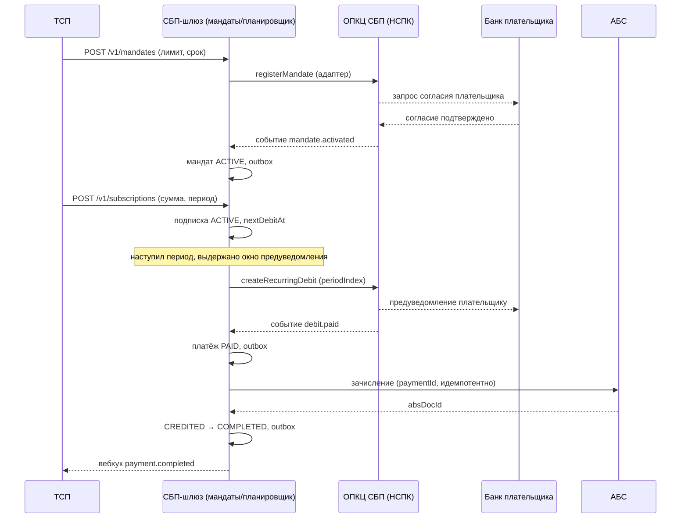

# Solutioning-Δ — Рекуррентные C2B-списания (подписки СБП)

- Status: Proposed (выносится на человеческое решение A3; см. `docs/adr/ADR-008`)
- Date: 2026-09-29
- Owner: solution-architect (платёжный контур)
- База: `docs/solutioning.md` (принятое решение C2B-приём)
- Связано: ADR-008, ADR-001..ADR-007, `ARCHITECTURE-SPINE.md` (AD-001..AD-010)

Документ — пакет изменения **поверх** принятого решения: оценка значимости и маршрута, влияние на инварианты, архитектурное решение (ADR-008), изменения контрактов, NFR, критерии приёмки и откат, handoff исполнителям и список решений, остающихся человеку-архитектору.

## 1. Оценка значимости и маршрута

Рубрика сопоставима с оценкой базового решения (`docs/solutioning.md`: 11/15, маршрут Critical). Оценка критерия — 0..3, где выше = глубже проектирование и выше цена ошибки.

| Критерий | Оценка | Обоснование |
|---|---|---|
| Внешняя интеграция | 3 | Новый сервис в протоколе НСПК (согласие, списание, предуведомление), тестовые испытания, внешний вход `[ТРЕБУЕТ ПРОВЕРКИ]` |
| Финансовое влияние | 3 | Массовые автосписания без действия плательщика; ошибка = двойное/потерянное списание, претензии, регуляторный риск |
| Регуляторика / ПДн / КИИ | 3 | Согласие плательщика (152-ФЗ), предуведомление (правила СБП/НПС), аудит, возможный пересмотр объекта КИИ |
| Глубина изменения ядра | 3 | Новый источник истины, две новые машинки состояний, новый триггер платежа; затрагивает `[ADOPTED]` AD-008 |
| Обратимость | 2 | costly: полностью обратимо до включения, сложно после начала автосписаний |
| **Итого** | **14 / 15** | **Critical** |

**Маршрут и почему именно он.** Изменение не является bounded: оно (а) меняет внешний интерфейс, от которого зависят потребители (API ТСП), (б) вводит новую подсистему и новый триггер движения денег, (в) затрагивает ратифицированное решение AD-008, (г) имеет регуляторный контур (согласие, предуведомление, ПДн). Поэтому требуется:

1. новое архитектурное решение — ADR-008 (Status: Proposed) и человеческое решение A3 до начала реализации;
2. ревью ИБ/КИИ и юристов (согласие, ПДн, предуведомление);
3. изменение контрактов по правилам версионирования (аддитивно, без поломки потребителей);
4. обновление RFP/контракта вендорского адаптера ОПКЦ (расширение протокола подписками);
5. **эскалация на родительский spine**: сервис рекуррентных списаний расширяет scope отцовской инициативы «Подключение банка к СБП (эквайринг C2B)»; требуется ратификация родительского уровня либо выделение нового initiative (см. §8).

## 2. Влияние на принятую архитектуру

### 2.1 Существующие инварианты AD-001..AD-008

| Инвариант | Статус | Что меняется / что нет |
|---|---|---|
| AD-001 Изоляция платёжного контура | Сохраняется; binds расширяются | Реестр мандатов и планировщик — внутри платёжного контура; АБС/ОПКЦ по-прежнему только через адаптеры (включая операции подписок). Rule не меняется |
| AD-002 Единый источник истины — статусная машина платежа | Расширяется по scope | Деньги по-прежнему в одной SM платежа (не форкается). Добавляются ещё два источника истины — мандат и подписка — с той же дисциплиной «смена состояния + outbox + аудит в одной транзакции». Rule не меняется |
| AD-003 Идемпотентность финансовых операций | Усиливается | Новые ключи: `Idempotency-Key` для мандата/подписки, `(subscriptionId, periodIndex)` для списания, `eventId` для событий мандата/списания. Rule не меняется |
| AD-004 Единственный адаптер ОПКЦ | Сохраняется | Новые операции/события идут через тот же адаптер; второй канал к НСПК не создаётся. Binds расширяются |
| AD-005 Зачисление только из подтверждённого статуса | Сохраняется критически | Автосписание **не** даёт права зачислять «по расписанию»: `CREDITED` достижим только из подтверждённого НСПК `PAID`. Добавляется fitness на рекуррентный путь. Rule не меняется |
| AD-006 Trust-зоны и сегментация | Сохраняется | Новых сетевых зон нет — компоненты размещаются в существующем платёжном контуре; доступ внутренних сервисов — mTLS/RBAC |
| AD-007 Соответствие НПС, КИИ и ПДн | Расширяется по scope | Добавляются: согласие плательщика (152-ФЗ), предуведомление (правила СБП/НПС), аудит жизненного цикла мандата; возможен пересмотр категории объекта КИИ |
| AD-008 Стратегия реализации — гибрид `[ADOPTED]` | Затрагивается на границе | Вендорский транспортный адаптер обязан реализовать операции подписок → расширяется scope RFP/контракта и, возможно, сертификации. Сам выбор гибрида не пересматривается; ядро остаётся контрактно-независимым. Пересмотр AD-008 — отдельное решение A3 |

### 2.2 Новые инварианты (предлагаются в spine как Proposed)

Добавляются в `ARCHITECTURE-SPINE.md` как AD-009 и AD-010 (аддитивно, без правки действующих блоков):

- **AD-009. Рекуррентное списание только по действующему мандату.** Binds: реестр мандатов, планировщик списаний, адаптер ОПКЦ, статусная машина. Prevents: списание без действующего согласия; зачисление без подтверждённого НСПК статуса списания; списание после отзыва/истечения мандата. Rule: списание инициируется только при мандате в состоянии `ACTIVE` и в пределах согласованных лимита/срока; зачисление — только из подтверждённого НСПК `PAID` (AD-005 сохраняется).
- **AD-010. Мандат плательщика — отдельный источник истины.** Binds: БД мандатов, outbox, аудит, планировщик. Prevents: расхождение «шлюз считает согласие действующим, плательщик отозвал»; неатомарные переходы жизненного цикла мандата; дубли списаний за период. Rule: изменение состояния мандата/подписки и запись события — в одной локальной транзакции; активация/отзыв мандата подтверждаются ОПКЦ; каждое списание идемпотентно по `(subscriptionId, periodIndex)`.

### 2.3 Что остаётся неизменным

- Одноразовый C2B-приём (динамический/статический QR, ссылка) и возвраты — семантика и потоки `docs/solutioning.md` §4 не меняются.
- Статусная модель платежа: набор финансовых состояний и переходы `QR_ISSUED`-пути сохраняются; рекуррентный путь лишь добавляет переходы без `QR_ISSUED`.
- Транзакционный outbox, at-least-once + дедуп + DLQ + сверка, «зачисление из PAID», идемпотентность вызовов АБС, сага возвратов.
- Trust-зоны и единственность адаптера ОПКЦ; контрактная независимость ядра от транспорта.
- Существующие методы API ТСП `/v1` — только аддитивные изменения.

## 3. Архитектурное решение (ADR-008) — выжимка

Полный текст — `docs/adr/ADR-008-rekurrentnye-c2b-spisaniya-podpiski-sbp.md`. Ключевое:

- **Мандат** (согласие) и **подписка** (расписание) — новые first-class сущности в платёжном контуре, отдельные конечные автоматы в БД шлюза.
- **Деньги — по существующей SM платежа**: рекуррентное списание = платёж с новым триггером, путь `CREATED → PAID → CREDITED → COMPLETED`; `CREDITED` только из `PAID`.
- **Планировщик списаний** создаёт не более одного платежа на период, идемпотентно по `(subscriptionId, periodIndex)`, с соблюдением окна предуведомления и лимитов мандата.
- **Адаптер ОПКЦ расширяется** операциями/событиями подписок (протокол — внешний вход).
- **Отзыв мандата** немедленно прекращает будущие списания; реконсиляция и аудит расширяются на мандаты/списания.

Поток успешного автосписания:

Отказ списания (например, недостаток средств): `N-->>G: событие debit.rejected` → платёж `FAILED`, вебхук `payment.failed` с `reasonCode`; политика ретраев периода — продуктовое решение (§8).

## 4. Изменения контрактов (обратно совместимые)

Правило неизменно (см. `docs/contracts/tsp-api.md` §6): аддитивные поля — совместимы; ломающие изменения — только в новой версии пути. Здесь все изменения аддитивны, версия API ТСП повышается с `0.1` до `0.2` (minor).

### 4.1 API ТСП (новая версия контракта — 0.2)

Новые методы (все `POST` требуют `Idempotency-Key`):

| Метод | Назначение |
|---|---|
| `POST /v1/mandates` | Создать мандат (согласие плательщика); возвращает `mandateId`, статус `PENDING_CONSENT` и (при необходимости) ссылку/QR для подтверждения плательщиком |
| `GET /v1/mandates/{mandateId}` | Статус мандата: `PENDING_CONSENT / ACTIVE / SUSPENDED / REVOKED / EXPIRED / REJECTED` |
| `POST /v1/mandates/{mandateId}/revoke` | Отзыв мандата со стороны ТСП (идемпотентно) |
| `POST /v1/subscriptions` | Создать расписание по `mandateId` (сумма, период, даты, ретраи) |
| `GET /v1/subscriptions/{subscriptionId}` | Статус и параметры подписки, `nextDebitAt` |
| `POST /v1/subscriptions/{subscriptionId}/{pause\|resume\|cancel}` | Управление расписанием |
| `GET /v1/subscriptions/{subscriptionId}/debits` | Список списаний (платежей) с их статусами и `periodIndex` |

Аддитивные поля в существующих схемах (опциональные → совместимо):

- `Payment`: `debitType` (`one_off | recurring`), `mandateId?`, `subscriptionId?`, `periodIndex?`.
- Новые схемы: `Mandate`, `MandateRequest`, `Subscription`, `SubscriptionRequest`, `Debit`.

Новые типы вебхуков (ADR-004: at-least-once, ретраи, DLQ, дедуп по `eventId`):

- `mandate.activated`, `mandate.revoked`, `mandate.expired`, `subscription.cancelled`;
- результат списания доставляется существующими `payment.completed` / `payment.failed` (с `reasonCode`); отдельный тип события не вводится.

**Никакие существующие поля, коды ошибок и типы событий не удаляются и не меняют смысл.** `Payment.status` enum не расширяется: промежуточное состояние автосписания до подтверждения НСПК остаётся `CREATED` (детали — в `docs/spec/state-machine.md` §6). Обновлённый машинный контракт — `openapi/tsp-api.yaml` (version `0.2.0`).

### 4.2 Контракт адаптера ОПКЦ (ядро ↔ транспорт)

Аддитивно (детали протокола НСПК — внешний вход `[ТРЕБУЕТ ПРОВЕРКИ]`):

- Синхронные операции: `registerMandate`, `getMandateStatus`, `revokeMandate`, `createRecurringDebit` (или `createPaymentLink` с признаком рекуррентности и ссылкой на мандат), при потребности — `getDebitStatus`.
- Асинхронные события: `mandate.activated`, `mandate.revoked`, `mandate.expired`, `debit.paid`, `debit.rejected`, при наличии в протоколе — `debit.preannounced`.
- Идемпотентность по `reference` распространяется на новые мутирующие операции (обязательное требование RFP, как в действующем контракте).

Эти пункты расширяют scope RFP и контракта с вендором (см. ADR-007, AD-008) — решение человека (§8).

## 5. NFR для нового функционала (измеримые)

Значения — baseline; финализируются по документации НСПК и по бизнесу. Дополняют `docs/nfr.md` (новый раздел).

| Метрика | Цель | Метод проверки |
|---|---|---|
| Latency API ТСП «создать мандат» | p95 < 500 мс (без ожидания подтверждения плательщика) | Нагрузочный тест, APM |
| Отклонение запуска списания от планового времени | p99 ≤ 60 с; пропущенных периодов — 0 | Метрика планировщика |
| Автосписание без действующего мандата | 0 инцидентов | Fitness-тест |
| Дубли списаний на `(subscriptionId, periodIndex)` | 0 | Тест повторного запуска планировщика |
| Зачисление автосписания после подтверждения НСПК | p95 < 60 с (SLA с АБС) | Метрика процесса |
| Предуведомление плательщика перед списанием | 100 % списаний уведомлены не позднее нормативного окна | Сверка/аудит событий |
| Прекращение будущих списаний после отзыва мандата | ≤ 5 мин от получения отзыва | Тест + метрика |
| Расхождения по мандатам/списаниям при сверке | 0 | Reconciliation-отчёт |
| Доступность реестра мандатов и планировщика | ≥ 99,95 % | SLO-отчёт |
| Аудит переходов мандата/подписки/списания | 100 %, журнал неизменяем | Аудит, SIEM |
| Масштаб рекуррентных операций | baseline согласовать (X мандатов, Y списаний/сутки) | Нагрузочный тест |

## 6. Критерии приёмки и план отката

### 6.1 Критерии приёмки (проверяемые)

Позитивные:

- Мандат создаётся и активируется по подтверждению ОПКЦ; подписка создаётся по `ACTIVE`-мандату; списание периода приводит к `PAID → CREDITED → COMPLETED` и вебхуку ТСП.
- Отзыв мандата прекращает будущие списания; истечение срока — аналогично.

Негативные (обязательны):

- **Дубль:** повторный запуск планировщика по тому же периоду не создаёт второе списание (идемпотентность по `(subscriptionId, periodIndex)`).
- **Запрет зачисления без PAID:** на рекуррентном пути `CREDITED` недостижим из `CREATED`/`FAILED` — fitness-тест AD-005.
- **Списание без мандата:** недостижимо (AD-009) — fitness-тест.
- **Отказ соседа:** недоступность адаптера ОПКЦ → списание не теряется (очередь/сверка); недоступность АБС → платёж остаётся `PAID`, зачисляется сверкой.
- **Недостаток средств:** `debit.rejected` → платёж `FAILED`, уведомление ТСП; ретрай — по политике.
- **Гонка «отзыв в момент списания»:** отзыв, поступивший до подтверждения, не допускает нового списания; по уже поданному — обработка по политике (§8).
- **Двойная доставка события:** дедуп по `eventId`, состояние не меняется.

### 6.2 План отката

- **До включения:** откат = не включать; все работы обратимы (согласуется с Reversibility ADR-008 = costly).
- **После включения:** фиче-флаг на уровне ТСП — прекращение создания новых мандатов/подписок; scheduler kill-switch — останов новых списаний без остановки одноразового приёма; откат релиза — rolling.
- **Действующие мандаты при откате:** управляемое сворачивание — `pause`/`cancel` расписаний, информирование ТСП и плательщиков; политика (немедленно vs доспарвка периода) — решение владельца (§8).
- **Данные:** обратная миграция не выполняется; шлюз остаётся источником истины до полной сверки с АБС/НСПК.
- **Сигналы-триггеры отката:** любое двойное списание; систематическая потеря предуведомлений; расхождение сверки по списаниям; деградация SLO планировщика.
- **Владелец решения об откате:** владелец продукта/CIO по представлению дежурной смены и архитектора (см. §8).

## 7. Handoff исполнителям (дистиллят)

> Полный handoff-пакет (`.arch-handoff/`) генерируется инструментом передачи после ратификации ADR-008 на A3; ниже — дистиллят, пригодный для постановки задач.

**Цель.** Дать ТСП рекуррентные C2B-списания по согласию плательщика: мандат + подписка + планировщик поверх существующей статусной машины платежа и существующего адаптера ОПКЦ.

**Обязательные инварианты (дословные Rule, не переизобретать):**

- AD-005: «Вызов АБС на зачисление возможен только из состояния `PAID` (подтверждённый НСПК статус).»
- AD-009 (новая): списание только по мандату `ACTIVE`; зачисление только из подтверждённого НСПК `PAID`.
- AD-010 (новая): смена состояния мандата/подписки + outbox + аудит — в одной локальной транзакции; списание идемпотентно по `(subscriptionId, periodIndex)`.
- AD-001: взаимодействие с АБС/ОПКЦ — только через адаптеры шлюза.
- AD-002/AD-003 (binds): атомарность перехода, идемпотентность повторных доставок.

**Запрещено менять:** ADR-007 и AD-008 (гибрид/`[ADOPTED]`), семантику ADR-005, существующие методы `/v1` API ТСП и `Payment.status` enum (только аддитивно). Конфликт с spine обязан останавливать работу и эскалироваться.

**Критерии приёмки:** см. §6.1 (включая негативные сценарии); NFR — §5.

**Контракт результата:** итог прогона завершается JSON-объектом `{"status": "complete|partial|blocked", "assumptions": [], "open_questions": [], "conflicts_with_prior_decisions": []}`; непустой `conflicts_with_prior_decisions` обязан останавливать и эскалировать; при `blocked` перечислить недостающие внешние входы (см. §9).

**План отката:** см. §6.2.

## 8. Что остаётся на решение человека-архитектора и почему

| # | Решение | Почему человеку, а не архитектору-агенту |
|---|---|---|
| 1 | Модель сервиса НСПК: кто инициирует согласие, точный протокол, окно предуведомления, лимиты, семантика отзыва | Внешний вход, недоступен публично `[ТРЕБУЕТ ПРОВЕРКИ]`; определяет детали контракта и тестовых испытаний |
| 2 | Влияние на AD-008/вендора: покрывает ли транспортный адаптер подписки, нужен ли re-RFP, пересмотр expiry AD-008 | Затрагивает ратифицированное решение и закупку — уровень A3/бизнес |
| 3 | Эскалация на родительский spine: расширение scope инициативы C2B или новый initiative | Локальное переопределение родительских ограничений запрещено; требуется решение родительского уровня |
| 4 | Продуктовая политика: ретраи при недостатке средств, grace-период, максимум периодов, лимиты сумм, частота предуведомлений | Баланс бизнес-риска и регуляторных требований — вне архитектурной компетенции |
| 5 | 152-ФЗ: правовое основание и место хранения согласия/ПДн плательщика | Юридическое решение (юристы/DPO/ИБ) |
| 6 | Обратимость и раскатка: фиче-флаг на ТСП, kill-switch, политика по действующим мандатам при откате | Определяет приемлемый бизнес-риск; согласуется с §6.2 |
| 7 | КИИ: пересмотр категории значимости объекта из-за нового сервиса | Категорирование и меры ФСТЭК — ИБ/КИИ банка |
| 8 | Возвраты по подпискам: возврат отдельного списания vs всей подписки, связь с сагой возвратов | Требует продуктовой и правовой определённости |
| 9 | Тарифы/комиссии ТСП за подписки | Коммерческое решение |

## 9. Gaps и внешние входы

| Gap | Что закроет | Владелец |
|---|---|---|
| Протокол НСПК по подпискам (операции, поля, тайминги, предуведомление, лимиты) | Документация НСПК по договору | Проектный офис / НСПК |
| Готовность вендорского адаптера к операциям подписок | Ответ вендора / re-RFP | Проектный офис / закупки |
| Правовое основание обработки согласия/ПДн плательщика | Юристы / DPO / ИБ | ИБ, юристы |
| Категорирование нового сервиса в КИИ | ИБ/КИИ банка | ИБ |
| Контракт АБС на массовые зачисления по расписанию (идемпотентность, SLA, окна доступности) | Интервью с владельцем АБС | Архитектор + АБС |
| Политика ретраев/grace при недостатке средств | Бизнес/владелец продукта | Бизнес |

## 10. Открытые вопросы (для A3)

1. Подтверждает ли НСПК сервис подписок и его протокол в требуемом объёме (согласие, предуведомление, отзыв)?
2. Кто владеет реестром согласий — банк-эквайер, НСПК или банк плательщика — и что из этого обязано хранить ядро?
3. Нужна ли отдельная версия контракта API ТСП (`/v2`) или достаточно аддитивного `0.2`?
4. Как соотносятся подписки с roadmap-пунктами «автоплатежи» (были вне scope) и не пора ли пересмотреть deferred-список spine?
5. Требуется ли отдельный initiative на родительском уровне для рекуррентных списаний?
