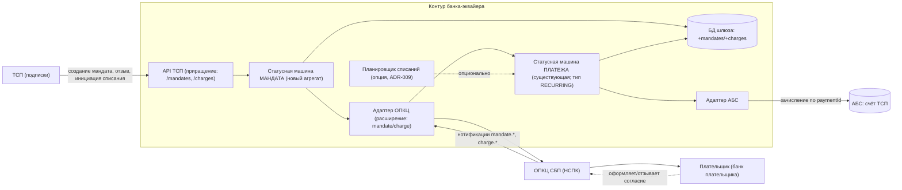
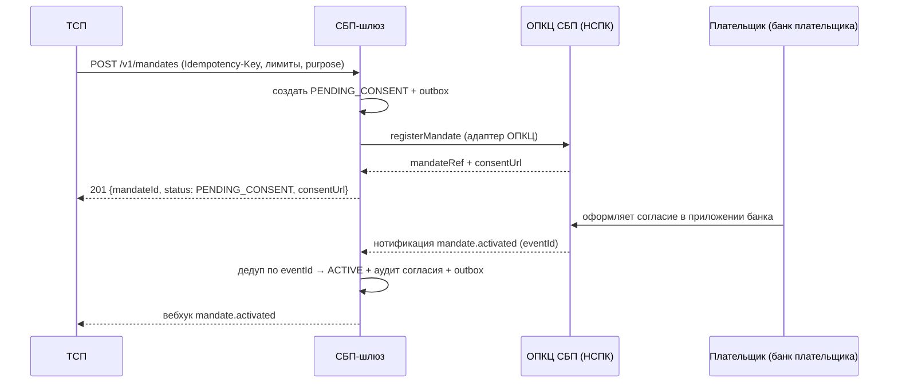
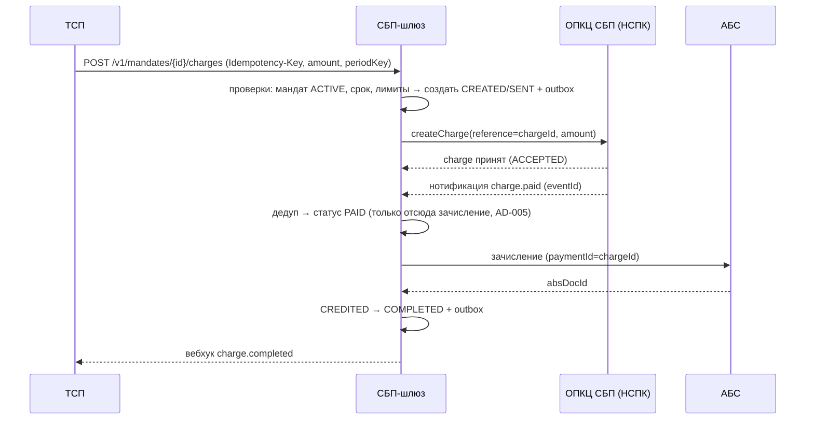

# Solutioning изменения — СБП-подписки (рекуррентные C2B-списания)

- Status: Draft (для архитектурного решения A3; после A3 — вход на гейт A1)
- Date: 2026-09-29
- Owner: solution-architect (платёжный контур) + владелец АБС + ИБ
- База: `docs/solutioning.md` (принятое решение C2B-приёма)
- Related: ADR-008, ADR-009, `docs/spec/subscription-state-machine.md`, AD-002, AD-003, AD-004, AD-005, AD-008

## 1. Контекст и границы

Исходный шлюз принимает C2B-платежи по инициативе плательщика (QR/ссылка): каждое списание требует сканирования/подтверждения клиентом. Бизнес (онлайн-кинотеатры, ЖКХ, связь) просит **рекуррентные списания по согласию плательщика** — списание инициирует ТСП, опираясь на ранее оформленное согласие (мандат), без повторного действия клиента.

Механика обеспечивается сервисом **«СБП-подписки»** ОПКЦ СБП (НСПК). Точный протокол (регистрация мандата, инициация списания, лимиты, отзыв, тайминги) — **внешний вход**: получается по договору, публично не раскрыт, все протокольные детали помечены `[ТРЕБУЕТ ПРОВЕРКИ]`. По принятой стратегии (AD-008) протокол НСПК знает только вендорский транспортный адаптер; ядро контрактно-независимо.

**В scope:** мандат (согласие) и его жизненный цикл; рекуррентное списание как платёж; зачисление/возвраты по списаниям; сверка; аудит; расширение контрактов.
**Вне scope:** C2C, выплаты B2C/B2B, диспуты, мультивалютность, изменение семантики существующих C2B-платежей.

## 2. Что переиспользуется без изменений

Изменение намеренно опирается на принятые механизмы, чтобы не размножать сущности и инварианты:

- **Статусная машина платежа** (ADR-002) — списание переиспользует пути через `PAID → CREDITED → COMPLETED` и терминальные статусы.
- **Транзакционный outbox + аудит** (ADR-001, AD-002) — те же атомарные переходы.
- **Идемпотентность** (ADR-003) — те же правила, расширенные ключами мандата/списания.
- **Адаптер ОПКЦ** (ADR-004, AD-008) — та же единственная точка знания протокола НСПК.
- **АБС-интеграция** (ADR-005) — тот же идемпотентный документ зачисления по `paymentId`; та же сага возвратов.
- **Нотификатор ТСП** (ADR-004) — те же вебхуки, ретраи, DLQ.
- **Trust-зоны и криптография** (ADR-006) — без новых зон.

## 3. Компоненты (приращение к C4)



Новые/изменённые элементы: **статусная машина мандата** (новый агрегат), **состояние `SENT`** в машине платежа для инициированного списания, **опциональный планировщик** (ADR-009), расширение адаптера и API.

## 4. Модель данных (приращение)

**Мандат (Mandate)** — согласие плательщика на рекуррентные списания в пользу ТСП.

| Поле | Смысл |
|---|---|
| `mandateId` | Идентификатор в шлюзе (сквозной для ТСП и сверки) |
| `mandateRef` | Идентификатор в ОПКЦ (сквозной для сверки) |
| `tspId` | ТСП-получатель |
| `payerRef` | Ссылка на плательщика (минимизация ПДн: не храним лишнего) |
| `maxAmountPerCharge` | Лимит на одно списание (копейки) |
| `maxAmountPerPeriod`, `periodType` | Лимит и период (день/месяц) — по протоколу НСПК `[ТРЕБУЕТ ПРОВЕРКИ]` |
| `validFrom`, `validUntil` | Срок действия согласия |
| `status` | `PENDING_CONSENT / ACTIVE / REVOKED / EXPIRED / REJECTED / SUSPENDED` |
| `purpose` | Назначение (для отчётности/аудита) |
| `consentEvidence` | Неизменяемая запись факта согласия (аудит, AD-007) |

**Списание (Charge)** — рекуррентный платёж по мандату. Хранится как платёж с типом `RECURRING` и ссылкой `mandateId`; имеет собственный `chargeId` и, при необходимости, ссылку на `paymentId` (при переиспользовании платёжной машины они совпадают 1:1). Ключ идемпотентности списания: `(mandateId, periodKey)` при инициации ТСП + `Idempotency-Key`.

## 5. Ключевые потоки

### 5.1 Оформление мандата



### 5.2 Рекуррентное списание (счастливый путь)



### 5.3 Отзыв мандата (и гонка с инициацией)

```mermaid
sequenceDiagram
    participant P as Плательщик
    participant N as ОПКЦ СБП (НСПК)
    participant G as СБП-шлюз
    participant T as ТСП

    P->>N: отзывает согласие
    N-->>G: нотификация mandate.revoked
    G->>G: статус REVOKED + аудит; новые списания запрещены (≤5 c)
    G-->>T: вебхук mandate.revoked
    Note over G,N: если списание уже инициировано — исход решает банк плательщика<br/>и/или НСПК; шлюз не делает второе списание; расхождения — сверка
```

### 5.4 Отказ списания

`charge.rejected` (недостаточно средств, превышен лимит, мандат отозван/истёк, отклонение банком плательщика) → списание в `FAILED`/`EXPIRED`, вебхук `charge.failed`, запись причины; повторные попытки (dunning) — политика, выносимая на A3.

## 6. Разбиение на решения (ADR)

| Решение | ADR | Что фиксирует | Статус |
|---|---|---|---|
| Мандат + списание как платёж; зачисление только из `PAID`; аудит согласия | ADR-008 | Ядро модели подписок | Proposed |
| Инициация списаний: ТСП / планировщик шлюза / гибрид | ADR-009 | Развилка, требующая человеческого решения | Proposed (A3) |

Расширения ADR-003/004/005 не оформляются отдельными ADR: они следуют из ADR-008 как аддитивное расширение существующих решений (новые методы контракта, новые ключи идемпотентности, новые события).

## 7. Альтернативы (сводно; детали — в ADR-008/009)

| Вариант | Итог |
|---|---|
| **A. Мандат + списание как платёж (выбран)** | Переиспользование платёжной машины и инвариантов; минимальный новый код; согласие как отдельный агрегат |
| B. Отдельная «машина подписок» со своими статусами и своей интеграцией АБС | Дублирование и риск рассинхрона с платежами; нарушает AD-002/AD-005 |
| C. Эмуляция подписок планировщиком поверх обычных C2B (каждое списание — с подтверждением клиента) | Не снимает действие клиента; не соответствует задаче; годен только как миграционный костыль |
| D. Полностью вендорские подписки | Vendor lock-in финансовой логики и согласий; ограниченный контроль аудита (см. ADR-007) |
| E. Мандат только в шлюзе как источник истины | Расхождение с банком плательщика/НСПК; несостоятельно юридически |

## 8. Последствия и обратимость (сводно)

**Положительные:** задача бизнеса закрывается в изоляции (AD-001); инварианты «зачисление только из `PAID`» и идемпотентность переносятся на списания без исключений; аудит согласия — основание для проверок регулятора; ядро остаётся контрактно-независимым от НСПК.

**Отрицательные:** новый агрегат и его жизненный цикл (сложность); рост ПДн-поверхности (согласие плательщика) → усиление контроля; зависимость от протокола НСПК (внешний вход, задержки); при выборе планировщика (ADR-009) — дополнительный компонент и идемпотентность по периодам; рост burst-нагрузки в биллинговые даты.

**Обратимость:** `reversible` до боевой эксплуатации (аддитивные контракты, фиче-флаг, отсутствие миграции существующих данных). После появления массовых действующих мандатов — `costly` (закрытие согласий требует взаимодействия с плательщиками через НСПК). Подробности — ADR-008 (Reversibility).

## 9. Гейты и критерии

- **A3**: ратификация ADR-008, выбор по ADR-009, ответы по повестке A3 (см. README §5).
- **A1**: финализация `docs/spec/subscription-state-machine.md` как v1.0-draft, контракты ТСП/адаптера v0.2, NFR §7.
- **A2**: инкремент walking skeleton (мандат на моке + списание через существующую машину) — `handoff/TASK.md`.
- **A4**: fitness-тесты (нет списания без активного мандата; нет двойных зачислений; зачисление только из `PAID`), нагрузочные тесты, ИБ-аудит согласий.
- **A5**: сверка мандатов/списаний, SLO-отчёт, контроль дрейфа.

Критерии приёмки и план отката — `acceptance-and-rollback.md`.

## 10. Gaps и внешние входы

| Gap | Что закроет | Владелец |
|---|---|---|
| Протокол НСПК по подпискам (поля мандата, лимиты, семантика отзыва, жизненный цикл списания, тайминги) `[ТРЕБУЕТ ПРОВЕРКИ]` | Документация НСПК по договору | Проектный офис / НСПК |
| Правовое основание и форма согласия, объём ПДн плательщика | ИБ/юристы/комплаенс банка | ИБ / юридический департамент |
| Поддержка протокола подписок вендорским адаптером | RFP/контракт с вендором (ADR-007, AD-008) | Проектный офис / закупки |
| Контракт АБС по массовым рекуррентным зачислениям (ливень биллинговых дат) | Интервью с владельцем АБС | Архитектор + АБС |
| Политика повторных попыток (dunning) и соотношение с НСПК | Бизнес + НСПК | Владелец продукта |

## 11. Открытые вопросы

1. Объём первой волны (пилот vs три вертикали) и приоритет вертикалей.
2. Нужен ли планировщик шлюза или достаточно ТСП-инициации (ADR-009).
3. Требования к ретраям/повторным попыткам при нехватке средств.
4. Модель тарифов/комиссий по рекуррентным списаниям (влияет на отчётность).
5. Лимиты и тайминги НСПК по подпискам `[ТРЕБУЕТ ПРОВЕРКИ]`.
