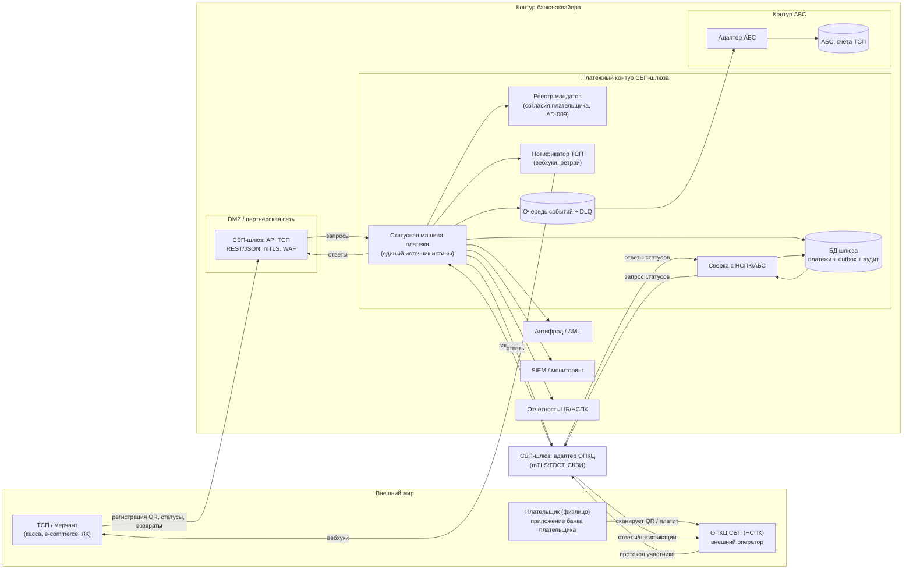
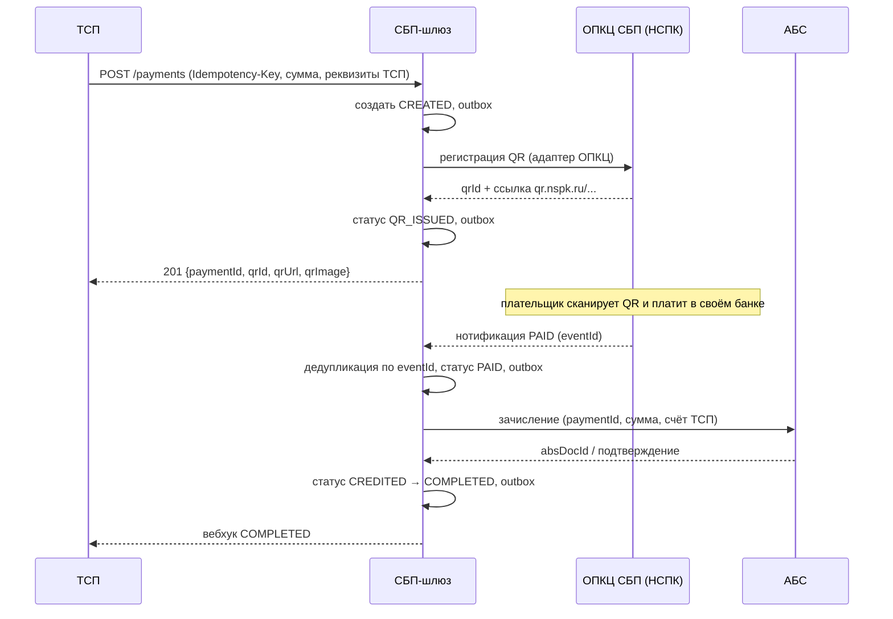
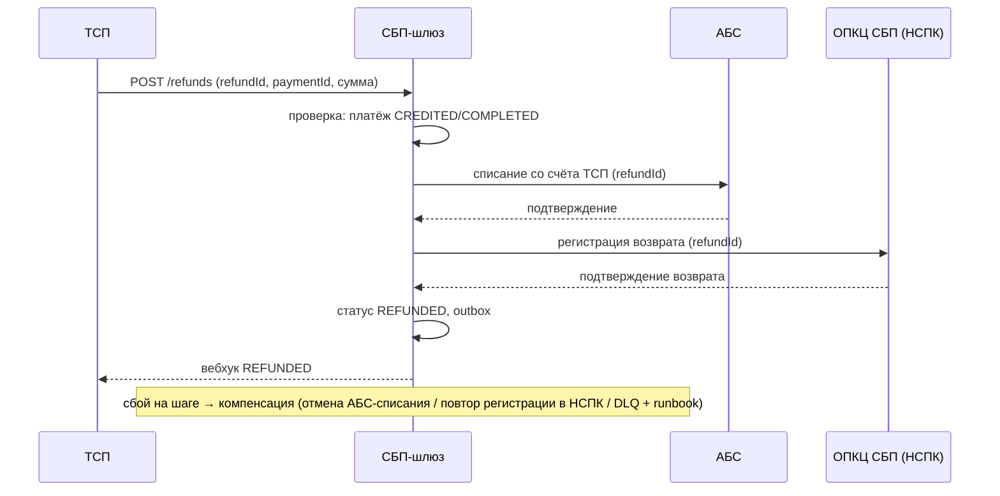

# Solutioning — Платёжный шлюз СБП (C2B-приём)

Маршрут: **Critical** (значимость 11/15). Настоящий документ — полный Solutioning: контекст, компоненты, потоки, разбиение на ADR, NFR, план гейтов A0–A5, план отката, gaps.

## 1. Контекст и границы

Банк — участник СБП (эквайер/агент ТСП) принимает C2B-платежи от ТСП. Внешние системы: **ОПКЦ СБП (АО «НСПК»)** — операционный/клиринговый центр, **Банк России** — расчёты по корсчетам. Внутренние: **АБС** (счета ТСП), **антифрод/AML**, **SIEM**, **отчётность** (ЦБ/НСПК).

Подключение банка — по порядку ЦБ РФ (cbr.ru/PSystem/payment_system/actions/): договор с ПБР + СКЗИ → присоединение к Правилам ОПКЦ СБП → доработка ПО по документации Портала поддержки НСПК → тестовые испытания → активация. **Документация НСПК — внешний вход**: точный протокол получается по договору, публично не раскрыт (все протокольные детали помечены `[ТРЕБУЕТ ПРОВЕРКИ]` до получения).

Сценарии C2B в scope: динамический QR, статический QR/наклейка, кассовые ссылки, оплата по ссылке в e-commerce, возвраты, **рекуррентные списания по согласию плательщика (подписки СБП)** — добавлены решением ADR-008 (блок AD-009, Proposed; требуют ратификации на A3). Roadmap (вне scope): C2C, выплаты B2C/B2B, диспуты.

## 2. Компоненты (C4 — контейнеры)



## 3. Статусная модель платежа

```
CREATED ──► QR_ISSUED ──► PAID ──► CREDITED ──► COMPLETED
   │            │          │            │
   ▼            ▼          ▼            ▼
 FAILED      EXPIRED    FAILED      REFUNDED (через сагу возврата)
```

- `PAID` — подтверждённый НСПК статус; **только из него** разрешено зачисление (AD-005).
- Переходы — атомарные транзакции «статус + outbox + аудит» (AD-002).
- Повторные нотификации идемпотентны (AD-003).

**Мандат (согласие плательщика) — второй агрегат** (ADR-008, AD-009; спецификация — `docs/spec/state-machine.md` §7–8):

```
PENDING_CONSENT ──► ACTIVE ──► REVOKED | EXPIRED
        │              ▲
        ▼              │
     REJECTED      SUSPENDED
```

- Списание по мандату возможно **только** из `ACTIVE` и в пределах лимитов/срока (AD-009).
- Рекуррентное списание порождает обычный платёж (`CREATED → PAID → CREDITED → COMPLETED`, без `QR_ISSUED`) — новая финансовая модель не вводится.
- Идемпотентность списания — по паре `(mandateId, billingKey)`; параметры согласия иммутабельны.

## 4. Ключевые потоки

### 4.1 Оплата динамическим QR (счастливый путь)



### 4.2 Возврат (сага)



### 4.3 Рекуррентное списание по согласию плательщика (подписка)

```mermaid
sequenceDiagram
    participant T as ТСП
    participant G as СБП-шлюз
    participant N as ОПКЦ СБП (НСПК)
    participant A as АБС

    T->>G: POST /v1/mandates (Idempotency-Key; payerRef, лимит, срок, период)
    G->>G: мандат PENDING_CONSENT, outbox
    G->>N: регистрация согласия (адаптер ОПКЦ)
    N-->>G: ожидание согласия плательщика (consentUrl)
    G-->>T: 201 {mandateId, PENDING_CONSENT, consentUrl}
    Note over N: плательщик один раз даёт согласие в своём банке
    N-->>G: нотификация mandate.activated
    G->>G: мандат ACTIVE, outbox; вебхук mandate.activated
    Note over T,N: далее — каждый период/событие биллинга
    T->>G: POST /v1/mandates/{id}/debits (billingKey, сумма ≤ лимита)
    G->>G: guard: ACTIVE, лимит, уникальность (mandateId, billingKey)
    G->>N: инициация списания по согласию
    G-->>T: 201 {paymentId, status CREATED}
    N-->>G: нотификация PAID (eventId)
    G->>G: дедупликация по eventId, статус PAID, outbox
    G->>A: зачисление (paymentId)
    A-->>G: absDocId
    G->>G: CREDITED → COMPLETED, outbox; вебхук payment.completed
    Note over N,G: отзыв/истечение согласия → мандат REVOKED/EXPIRED → новые списания недостижимы
```

## 5. Разбиение на решения (ADR)

| Решение | ADR | Spine |
|---|---|---|
| Топология: выделенный компонент + outbox | ADR-001 | AD-001, AD-002 |
| Статусная машина + идемпотентность | ADR-002 | AD-002, AD-003 |
| Транспорт к ОПКЦ: изолированный адаптер, mTLS/ГОСТ, СКЗИ | ADR-003 | AD-004 |
| Нотификации: at-least-once, дедуп, DLQ, сверка | ADR-004 | AD-003 |
| АБС: зачисление из PAID, возвраты-сага | ADR-005 | AD-005 |
| НПС/КИИ/ПДн: trust-зоны, ГОСТ | ADR-006 | AD-006, AD-007 |
| Стратегия реализации (гибрид) — **A3 принято 2026-08-15** | ADR-007 (Accepted) | AD-008 [ADOPTED] |
| Рекуррентные C2B-списания (подписки СБП): мандат + идемпотентность по периоду — **ожидает решения A3** | ADR-008 (Proposed) | AD-003, AD-005, AD-009 |

## 6. NFR

Полный набор с измеримыми целями — `docs/nfr.md`. Ключевое: доступность ≥ 99,95 %; RPO=0; RTO ≤ 1 ч; регистрация QR p95 < 500 мс; sustained 200 TPS / пик 500 TPS; сверка с НСПК ежечасная, с АБС суточная; двойных зачислений — 0.

Для рекуррентных списаний (расширение, `docs/nfr.md` §7): двойных списаний за период — 0; списаний без действующего согласия — 0; списаний сверх лимита согласия — 0; активация мандата после согласия p95 < 60 с; доля успешных списаний ≥ 95 % (baseline); пик «начала периода» ×2 к sustained без деградации разовых платежей.

## 7. Гейты и критерии приёмки

- **A0 (readiness)**: ADR-001..007 заполнены, spine пролинтован, gaps зафиксированы. Критерий: PASS.
- **A1 (Spec)**: контракт API ТСП (v0.1 — `docs/contracts/tsp-api.md`), таблица переходов статусной машины (`docs/spec/state-machine.md`), контракт адаптера ОПКЦ (`docs/contracts/opkc-adapter.md` — ядро↔транспорт, основа RFP), RFP-пакет по вендору (`docs/rfp/vendor-rfp.md`), NFR финализированы. **Расширение (ADR-008)**: контракт ТСП v0.2 (`tsp-api.md` §3.6–3.9, `openapi/tsp-api.yaml` 0.2.0), контракт адаптера v0.2 (рекуррентные методы/события), статусная машина мандата (`state-machine.md` §7–8), NFR `nfr.md` §7, дополнение RFP §12 — в объёме A1.
- **A2 (Plan)**: разбивка на задачи, walking skeleton определён (сквозной путь: ТСП → шлюз → мок НСПК → АБС-мок → нотификация); для расширения — сквозной путь «манд. ACTIVE → списание → зачисление → вебхук» на мок-адаптере.
- **A3 (человеческое решение)**: стратегия реализации (ADR-007) — **обязательно до реализации транспорта**; **решение по ADR-008** (механизм рекуррентных списаний, кто инициирует списание, правовая модель согласия) — обязательно до реализации подписок.
- **A4 (conformance)**: fitness-проверки spine-инвариантов, нагрузочные тесты (NFR), тесты идемпотентности, ИБ-аудит; для расширения — fitness AD-009 (недостижимость списания вне `ACTIVE`, уникальность `(mandateId, billingKey)`, запрет списания сверх лимита), негативные сценарии гонки «отзыв против списания» и регрессия совместимости контракта v0.1.
- **A5 (post-deploy drift)**: сверка с НСПК/АБС в проде, SLO-отчёт через 30 дней, проверка отсутствия дрейфа от spine.

## 8. План отката

- **До боевой эксплуатации**: откат = не включать. Все работы обратимы (ADR-007 reversible).
- **После включения**: фиче-флаг на приём новых ТСП; мгновенный stop-new (запрет регистрации новых QR) без остановки обработки уже открытых операций; откат релиза — rolling; данные не мигрируются обратно (шлюз остаётся источником истины до полной сверки с АБС).
- **Аварийный сценарий**: DLQ → дежурная смена по runbook; сверка компенсирует потерянные нотификации; RTO ≤ 1 ч.
- **Расширение (рекуррентные списания, ADR-008)**: отдельный фиче-флаг `recurring_enabled` (per-ТСП); откат = stop-new (новые мандаты и списания не создаются), активные мандаты переводятся в `REVOKED` по согласованию с ТСП и с уведомлением плательщиков, данные мандатов сохраняются для аудита и требований НПС; приём разовых QR-платежей не затрагивается производственно. Сигналы отката — детализация и владелец в `docs/changes/CR-001-rekurrentnye-c2b-spisaniya.md` §6.

## 9. Gaps и внешние входы

| Gap | Что закроет | Владелец |
|---|---|---|
| Точный протокол НСПК (поля, тайминги, TLS-профили) | Документация НСПК по договору (Портал поддержки) | Проектный офис / НСПК |
| Регламенты НСПК (таймауты, сроки уведомлений, доступность) | Документация НСПК, правила ОПКЦ СБП | Проектный офис |
| Номер/редакция Положения ЦБ о защите информации при переводах | ИБ/комплаенс банка | ИБ |
| Контракт АБС на зачисление/списание (идемпотентность, SLA) | Интервью с владельцем АБС | Архитектор + АБС |
| Категория объекта КИИ, состав мер ФСТЭК | ИБ/КИИ банка | ИБ |
| Выбор конкретного вендора транспорта ОПКЦ | RFP по критериям ADR-007 (сертификаты ФСТЭК, тестовый контур, SLA, референсы) | Проектный офис / закупки |
| Наличие и объём рекуррентного механизма в СБП (согласие, лимиты, период, списание, отзыв) | Документация НСПК по договору (Портал поддержки) | Проектный офис / НСПК |
| Правовая модель согласия плательщика и хранение ПДн плательщика (152-ФЗ), сроки хранения отзывов | Юридическая служба + ИБ/ПДн | Юристы + ИБ |
| Бизнес-профиль подписок (число мандатов, расписание, целевая успешность списаний, комиссии) | Владелец продукта ТСП-сервисов | Бизнес |

## 10. Открытые вопросы

1. Объём первой волны: только C2B-приём или сразу C2C/выплаты? (влияет на состав адаптеров, но не на ядро).
2. Требования бизнеса к комиссиям и тарифам ТСП (влияет на модель отчётности).
3. Лимиты/пороги для AML-интеграции.
4. Доступность АБС в ночные окна (влияет на SLA зачисления).
5. Механизм рекуррентных списаний: штатный механизм СБП или ограниченный вариант «внутри банка»; кто инициирует списание — ТСП или шлюз-планировщик (решение A3, ADR-008).
6. Маршрут расширения: считать его доработкой принятого решения (текущее предложение — ADR-008 + AD-009) или отдельным initiative с собственным spine (влияет на гейты и состав работ).
7. Нужен ли планировщик подписок в шлюзе (ответственность за расписание) и в какой волне — отдельный ADR.
8. Обязательность QR/действия клиента при первом согласии: как плательщик даёт согласие и подтверждает его — по документации НСПК [ТРЕБУЕТ ПРОВЕРКИ].
9. Комиссии и тарифы по подпискам (влияют на модель отчётности и на бизнес-кейс).
