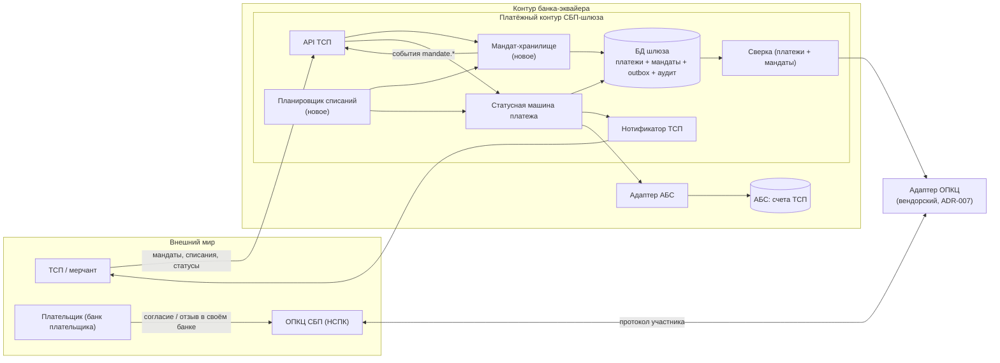
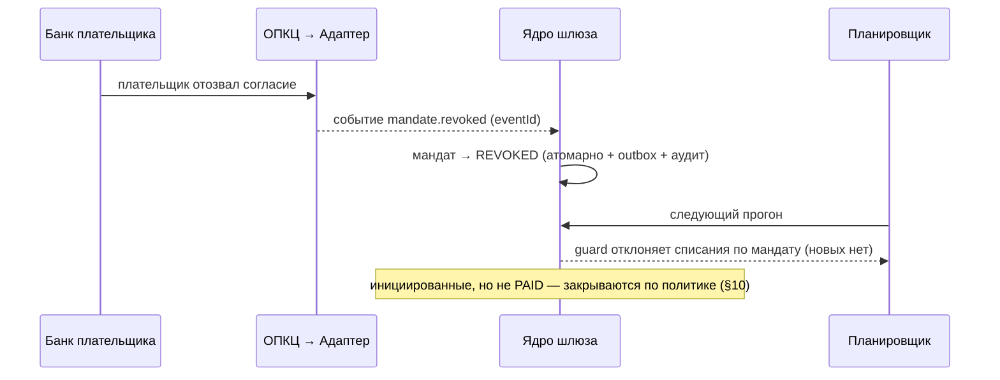

# Solutioning — Рекуррентные C2B-списания по подписке (изменение `sbp-recurring-c2b`)

- Status: Proposed (ожидает человеческого решения A3 по ADR-008/ADR-009)
- Owner: solution-architect (платёжный контур)
- Route: **Critical** (значимость 7/15 — см. §1)
- Delta: `changes/sbp-recurring-c2b/DELTA.md`
- Дополняет принятое решение `docs/solutioning.md` и spine `ARCHITECTURE-SPINE.md`; не заменяет их.

## 1. Оценка значимости и маршрут

Все 15 триггеров рассмотрены явно (значение и обоснование); машинный пересчёт:

```
arch-be control score --trigger ... → Score: 7 → маршрут Critical
```

| Триггер | Значение | Обоснование |
|---|---|---|
| new_component | **true** | Планировщик списаний и хранилище мандатов — новый модуль ядра шлюза (ADR-008) |
| new_datastore | false | Та же БД шлюза, новые таблицы; отдельного хранилища не вводится (ADR-008) |
| new_vendor | false | Новых вендоров нет; рекуррентные операции идут через существующий транспортный адаптер ОПКЦ (ADR-007) |
| domain_ownership_change | false | Владелец прежний — платёжный контур СБП-шлюза |
| cross_domain_integration | false | Интеграции внутри существующих контуров (ОПКЦ, АБС), новых стыков доменов нет |
| api_contract_change | **true** | Расширение API ТСП: новые методы мандатов/списаний, новые поля и события |
| data_contract_change | **true** | Новые сущности — мандат и плановое списание; новые поля в контрактах |
| security_boundary_change | false | Новых границ доверия нет; согласие и отзыв идут по существующему каналу ОПКЦ |
| trust_zone_change | false | Зоны доверия те же (ADR-006); сегментация не меняется |
| consistency_model_change | **true** | Мандат — длящееся состояние; идемпотентность планового списания по `(mandateId, periodKey)` |
| significant_nfr | **true** | Новые измеримые цели: лаг планировщика, немедленность отзыва, «ноль несанкционированных и двойных списаний» |
| rto_rpo_targets | false | Цели RPO=0 и RTO ≤ 1 ч распространяются на мандаты без изменения значений |
| irreversible_migration | false | Миграций данных нет, поток аддитивен (юридическая необратимость согласий — ADR-009, но это не миграция) |
| financial_impact | **true** | Реальные списания со счетов плательщиков по подпискам |
| criticality_or_exception | **true** | Платёжный/КИИ-контур, регуляторные обязательства (161-ФЗ, НПС) |

**Маршрут: Critical** (7 ≥ 5 и есть критический триггер `criticality_or_exception`). Следствие: полный Solutioning (spine + ADR + NFR), **обязательная человеческая точка A3**, walking skeleton до массовой генерации, evidence-гейты A4/A5. Дельты недостаточно — она используется лишь как принятый в репозитории механизм правки защищённых файлов.

### Почему не Fast/Standard

- Поток не «мелкая доработка»: он добавляет новый финансовый сценарий (списание без действия клиента) и новую длящуюся сущность (согласие).
- Ошибка необратима для плательщика (деньги списаны), а отзыв согласия — регуляторно значимое событие.
- Изменения затрагивают контракт API, статусную модель и spine — то есть распространяются на несколько команд.

## 2. Влияние на принятую архитектуру

### 2.1 Затронутые инварианты spine

| Инвариант | Статус в изменении | Что именно |
|---|---|---|
| AD-001 Изоляция платёжного контура | **не меняется**, расширяется периметр | Планировщик и хранилище мандатов живут внутри платёжного контура; обращения к ОПКЦ/АБС — только через адаптеры |
| AD-002 Единый источник истины (статус) | **расширяется** | Единым источником истины становится пара «мандат + платёж»; атомарность «статус + outbox + аудит» сохраняется |
| AD-003 Идемпотентность финансовых операций | **расширяется** | Добавляется ключ идемпотентности планового списания `(mandateId, periodKey)`; подтверждение/отзыв мандата — по `eventId` |
| AD-004 Единственный адаптер ОПКЦ | **не меняется** | Рекуррентные операции НСПК — внутри того же адаптера; наружу только нормализованные методы/события |
| AD-005 Зачисление только из `PAID` | **не меняется (подтверждается)** | Плановое списание — платёж; зачисление по нему всё так же возможно только из `PAID` |
| AD-006 Trust-зоны и ПДн | **не меняется по зонам, усиливается по ПДн** | Мандат — носитель ПДн; хранение токенизировано, аудит доступа |
| AD-007 НПС/КИИ/ПДн | **не меняется, расширяется** | Аудит покрывает согласия и списания; СКЗИ прежние |
| AD-008 Контрактно-независимое ядро | **не меняется** | Рекуррентные операции добавляются во внутренний контракт адаптера; ядро протокол НСПК не знает |
| AD-009 (новый) | **добавляется** | «Списание по подписке возможно только при действующем мандате и в пределах лимитов; одно плановое списание на период» |

### 2.2 Что НЕ меняется (явные запреты)

- Набор состояний платежа и семантика `PAID → CREDITED → COMPLETED` — без изменений (AD-005 остаётся якорем).
- Существующие методы API ТСП и существующие поля — без удаления, переименования и смены типа.
- Выбор стратегии реализации (ADR-007) и граница «ядро ↔ вендорский транспорт» (AD-008) — без изменений.
- Зоны доверия и модель СКЗИ/HSM (ADR-003, ADR-006) — без изменений.
- Ежечасная сверка с НСПК и суточная с АБС — сохраняются; добавляется сверка мандатов.

### 2.3 Границы и эскалация

Spine — уровень **feature** под родительским initiative «Подключение банка к СБП (эквайринг C2B)». Изменение вводит новые регуляторные обязательства (длящееся согласие, отзыв) и новый класс NFR, поэтому требует **ратификации на уровне initiative**: локальное переопределение родительских ограничений запрещено (правило spine). Это вынесено в §10 как решение человека.

## 3. Целевая архитектура (дельта к C4)



Ключевое: планировщик не ходит в АБС напрямую — он создаёт платёж, дальше работает существующий контур (`PAID → АБС → CREDITED → COMPLETED`).

### 3.1 Плановое списание (счастливый путь)

```mermaid
sequenceDiagram
    participant S as Планировщик
    participant G as Ядро шлюза (мандат+SM)
    participant N as Адаптер ОПКЦ → НСПК
    participant P as Банк плательщика
    participant A as АБС

    S->>G: подошёл periodKey по мандату ACTIVE
    G->>G: guard: ACTIVE, срок, лимиты; создать платёж origin=recurring (mandateId, periodKey)
    G->>N: инициировать списание по мандату (reference=paymentId)
    N->>P: предъявление списания
    P-->>N: подтверждение (или отклонение)
    N-->>G: нотификация payment.paid (eventId)
    G->>G: дедуп по eventId, статус PAID
    G->>A: зачисление (paymentId)
    A-->>G: absDocId → CREDITED → COMPLETED
    G-->>S: списание завершено
```

### 3.2 Отзыв согласия



### 3.3 Защита от дубля и несанкционированного списания

- **Детерминированный ключ** `(mandateId, periodKey)` + уникальный индекс в БД → второй платёж невозможен даже при двойном прогоне планировщика или рестарте.
- **Guard мандата на инициации**: проверка `ACTIVE`, срока и лимитов до создания списания; лимит `maxAmountPerPeriod` проверяется атомарно с созданием (включая ручные списания — иначе гонка).
- **Live-проверка статуса мандата** (`getMandateStatus`) как целевой режим перед инициацией — чтобы «ноль списаний после отзыва» выполнялся и при потере события `mandate.revoked` `[ТРЕБУЕТ ПРОВЕРКИ]` (частота/стоимость — по регламенту НСПК).
- **Граница необратимости — момент `PAID`.** Отзыв до инициации → списание не создаётся; отзыв после инициации, но до `PAID` → предъявление закрывается, денег не двинуто; отзыв после `PAID` → списание доводится до `COMPLETED`, возврат — существующей сагой (модель поддерживает оба варианта политики).
- **Без fallback** (принцип «избегаем запасных путей»): при ошибке инициации списание не подменяется другим каналом, а ретраится идемпотентно либо уходит в DLQ и видно в сверке — альтернативные пути списания запрещены (иначе финансовый риск).

## 4. Жизненные циклы

Полные статусные модели мандата и планового списания, запрещённые переходы, таблицы идемпотентности и правила сверки — `docs/spec/subscription-lifecycle.md`. Существующая статусная машина платежа (`docs/spec/state-machine.md`) не изменяется, кроме документированного расширения смысла `QR_ISSUED` для `origin=recurring`.

## 5. Контракты

Изменения API ТСП — **аддитивные**, без поломки существующих потребителей v0.1: новые методы (`/v1/mandates*`), новые опциональные поля (`origin`, `mandateId`, `periodKey`) и новые события вебхуков. Детали и анализ совместимости — `docs/contracts/tsp-api-recurring-c2b.md`; машинный контракт — `openapi/tsp-api.yaml` (v0.2.0). Внутренний контракт «ядро ↔ адаптер ОПКЦ» расширяется рекуррентными методами и событиями (`docs/contracts/opkc-adapter.md`).

## 6. NFR

Измеримые цели нового функционала — `docs/nfr-recurring-c2b.md`. Ключевое: лаг инициации планового списания p95 ≤ 5 мин; ноль двойных и ноль несанкционированных списаний; блокировка новых списаний после отзыва ≤ 60 с; сверка мандатов ежедневно; доля плановых списаний в бюджете throughput шлюза ограничена.

## 7. Критерии приёмки

Полный список — `changes/sbp-recurring-c2b/DELTA.md` (раздел «Критерии приёмки») и `docs/spec/subscription-lifecycle.md`. Обязательные негативные сценарии:

- списание без мандата / при `REVOKED` / при `SUSPENDED` / при истёкшем сроке — отклонено, денег не двинуто;
- превышение `maxAmountPerCharge` / `maxAmountPerPeriod` — отклонено;
- повтор планового списания за тот же `periodKey` (в т.ч. на второй ноде) — одно списание;
- повторная нотификация ОПКЦ с тем же `eventId` — состояние не меняется;
- отзыв → ноль новых списаний; инициированные, но не `PAID`, закрыты по политике;
- существующий потребитель API v0.1 продолжает работать (контрактный дифф без breaking changes).

## 8. План отката

- **До боевой эксплуатации**: откат = не включать; рекуррентный поток за фиче-флагом, по умолчанию выключен для всех ТСП.
- **После включения**: остановка планировщика (глобально или по ТСП) → новые списания прекращаются немедленно; уже начатые операции доводятся существующим контуром (шлюз остаётся источником истины); разовый C2B-приём не затрагивается.
- **Сигналы отката (триггеры)**: любое несанкционированное списание; двойное списание за период; отзыв, не заблокировавший списание. Реакция — немедленный stop-new + разбор инцидента.
- **Владелец решения об откате**: дежурный платёжный SRE совместно с архитектором; решение фиксируется в аудит-логе.
- **Критерий успешного отката**: новых списаний ноль, все мандаты в терминальном/замороженном статусе, сверка шлюз↔банк плательщика без расхождений, разовый C2B-приём работает.
- Данные не мигрируются обратно: мандаты и история списаний остаются в БД шлюза для аудита.

## 9. Что остаётся на решение человека-архитектора (A3)

1. **Протокольная реализуемость**: после получения документации НСПК подтвердить/пересмотреть ADR-008 и ADR-009 (модель мандата, события, лимиты). `[ТРЕБУЕТ ПРОВЕРКИ]`
2. **Политика лимитов и периодов**: `maxAmountPerCharge`/`maxAmountPerPeriod`, периодичность, поведение при попытке списать больше (коммерческое решение).
3. **Политика возврата для уже подтверждённого (`PAID`) списания при отзыве**: оставить как выполненное обязательство либо инициировать возврат существующей сагой — регуляторно-коммерческий выбор (модель поддерживает оба варианта). Отмена списания, ещё не подтверждённого банком плательщика (`до PAID`), определена спецификацией и человеческого выбора не требует.
4. **Периметр споров/претензий** по рекуррентным списаниям: сейчас `Deferred` в spine; повышение риска требует отдельного решения до боевого включения.
5. **Ратификация на уровне initiative**: изменение feature-spine с новыми регуляторными обязательствами — подтверждение родительским spine.
6. **Тарифы/комиссии за подписки** — влияют на отчётность (открытый вопрос исходного решения №2).
7. **Утверждение маршрута и человеческой точки**: маршрут Critical означает обязательный A3; финальное «идём/не идём» и вехи — за человеком.

## 10. Gaps и внешние входы

| Gap | Что закроет | Владелец |
|---|---|---|
| Протокол НСПК для рекуррентного C2B (мандаты, события, лимиты, сроки) | Документация НСПК по договору | Проектный офис / НСПК |
| Регуляторная форма согласия и порядок отзыва (редакция Положения ЦБ) | ИБ/комплаенс | ИБ |
| Готовность АБС к рекуррентным документам (идемпотентность, SLA) | Интервью с владельцем АБС | Архитектор + АБС |
| Процесс диспутов/претензий по рекуррентным списаниям | Бизнес + комплаенс | Продукт |
| Требования к хранению ПДн в мандатах (срок, токенизация) | ИБ/ПДн | ИБ |

## 11. Открытые вопросы

1. Поддерживает ли НСПК рекуррентный C2B в нужном виде и какие ограничения на суммы/период?
2. Кто и как инициирует отзыв на стороне ТСП (только плательщик через свой банк или и ТСП-подписка)?
3. Нужен ли «мгновенный» ручной запуск списания ТСП сверх расписания (dunning/повтор при неуспехе)?
4. Как отражать частично оплаченные/отклонённые плановые списания в отчётности ТСП?
5. Требуется ли отдельный API/канал для уведомления плательщика о предстоящем списании (регуляторно)?
