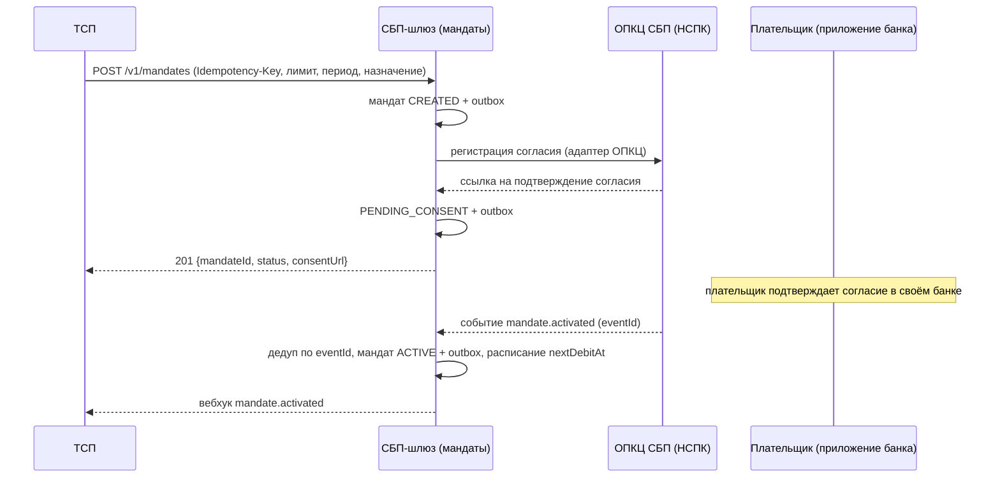
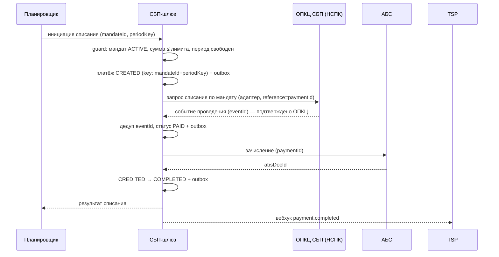

# Solutioning изменения — Рекуррентные C2B-списания по согласию плательщика (подписки СБП)

- Статус: Draft — пакет на архитектурное решение; реализация не начата
- Дата: 2026-09-28
- Владелец: solution-architect (платёжный контур)
- База: принятое решение «Платёжный шлюз СБП (C2B-приём)» — `docs/solutioning.md`, `ARCHITECTURE-SPINE.md` (AD-001..AD-008), `docs/adr/ADR-001..007`
- Решение изменения: `docs/adr/ADR-008-...-mandat-kak-otdelnyy-istochnik-istiny.md`
- Спецификация: `docs/spec/recurring-mandates.md`
- Дельта (правки спайна): `changes/recurring-c2b-mandates/DELTA.md`

Это **изменение поверх принятого решения**, а не новое решение. Ниже — оценка значимости, влияние на принятую архитектуру, дизайн, контракты, NFR, критерии приёмки, откат и точки человеческого решения.

---

## 1. Оценка значимости и маршрут

Architecture Significance Score по 15 каноническим триггерам (инструмент `significance_score`):

| Триггер | Сработал | Почему |
|---|---|---|
| `new_component` | **да** | новый логический компонент «менеджер согласий» + «планировщик списаний» |
| `cross_domain_integration` | **да** | новая межсистемная интеграция: протокол мандатов/списаний с ОПКЦ; канал выдачи согласия |
| `api_contract_change` | **да** | расширение API ТСП (`openapi/tsp-api.yaml`) и контракта адаптера ОПКЦ |
| `data_contract_change` | **да** | новая сущность данных (мандат) и события (`mandate.*`, списания) |
| `security_boundary_change` | **да** (форсирует Critical) | согласие плательщика и новый протокол — смена границы доверия, ПДн |
| `consistency_model_change` | **да** | второй источник истины (мандат) рядом с payment-FSM; согласованность «мандат ↔ списание» |
| `significant_nfr` | **да** | новые измеримые цели: пунктуальность планировщика, ноль дублей за период, распространение отзыва |
| `financial_impact` | **да** | новое движение денег (списание без действия клиента в момент списания) |
| `new_datastore` | нет | новый тип хранилища не вводится; новые таблицы в БД шлюза |
| `new_vendor` | нет | новый вендор не обязателен; возможно расширение существующего RFP транспорта (см. §9) |
| `domain_ownership_change` | нет | владелец домена прежний — платёжный контур шлюза |
| `trust_zone_change` | нет | trust-зоны ADR-006 сохраняются |
| `rto_rpo_targets` | нет | цели RPO=0/RTO≤1ч те же |
| `irreversible_migration` | нет | миграция не разрушающая (новые таблицы) |
| `criticality_or_exception` | нет | критичность контура определена ранее (Critical); исключения не запрашиваются |

**Score = 8/15 → маршрут Critical** (порог Standard ≤ 4), в том числе форсирующий триггер `security_boundary_change`.

**Почему нужен полный цикл проектирования (A0–A5), а не дельта:** изменение вводит новое финансовое действие, новый источник истины и новую границу доверия (согласие плательщика, ПДн), а также внешний протокол, публично не раскрытый. Это уровень полноценного Solutioning и человеческого решения A3, а не Fast/Standard-дельты (`delta-spec`: Critical Path дельтой не закрывается). Дельта здесь несёт только **правки спайна** (AD-009) с аудиторским следом.

**Механический auto-маршрут гейта** (`arch-be gate --route auto`) на этом изменении видит по git-диффу только `api_contract_change` (расширение `openapi/`) и потому покажет Fast — это известное ограничение детектора по диффу (новый финансовый эффект и ПДн по содержимому не детектируются). Ниже маршрут принят **Critical** осознанно, по смыслу; гейт вызван с явной проверкой (см. §7).

---

## 2. Влияние на принятую архитектуру

### 2.1 Инварианты spine: что затрагивается, что нет

| Инвариант | Статус | Что происходит |
|---|---|---|
| **AD-001** Изоляция платёжного контура | расширяется | «Менеджер согласий» и «планировщик» живут в том же изолированном контуре; вызовы ОПКЦ/АБС — только через адаптеры. Binds дополняется хранилищем мандатов. Текст правила не меняется |
| **AD-002** Единый источник истины | уточняется | Правило «смена финансового статуса + outbox — атомарно» распространяется и на мандат. Источник истины становится двойным: payment-FSM **и** mandate-FSM. Вносится перекрёстная ссылка на AD-009 |
| **AD-003** Идемпотентность | расширяется | Новые ключи: `eventId` (мандатные события), `(mandateId, periodKey)` для списания, `refundId` для возврата. Правило не меняется, множество ключей растёт |
| **AD-004** Единственный адаптер ОПКЦ | расширяется | Адаптер получает методы/события мандатов и списаний; ядро по-прежнему не знает протокола НСПК. Контракт адаптера расширяется аддитивно |
| **AD-005** Зачисление только из `PAID` | сохраняется | Рекуррентное списание — обычный платёж; `PAID` = подтверждённое ОПКЦ проведение (не факт отправки). Зачисление по-прежнему только из `PAID`. Добавляется путь `CREATED → PAID` (без QR) |
| **AD-006** Trust-зоны и сегментация | сохраняется | Зоны те же; расширяется состав данных в защищённом контуре (идентификатор плательщика, согласия) |
| **AD-007** НПС/КИИ/ПДн | расширяется | Периметр ПДн растёт (идентификатор плательщика, история согласий); требуются уведомления плательщика (регламент НСПК `[ТРЕБУЕТ ПРОВЕРКИ]`) |
| **AD-008** Гибрид, ядро независимо от транспорта | сохраняется/расширяется | Протокол мандатов остаётся внутри вендорского адаптера; ядро — контрактно-независимо. Расширяется внутренний контракт адаптера |
| **AD-009** Списание только по действующему мандату | **новый (Proposed)** | Ядро инварианта изменения: списание невозможно без мандата `ACTIVE`; идемпотентность по периоду; отзыв блокирует новые списания |

**Ключевой вывод:** ни один принятый инвариант не **нарушается**; часть расширяется, AD-002 уточняется, вводится один новый (AD-009). Финансовая семантика («деньги двигаются только по подтверждённому статусу и однократно») сохранена.

### 2.2 Компоненты: что меняется / добавляется / не меняется

| Компонент | Изменение |
|---|---|
| API ТСП (DMZ) | **меняется**: новые пути `/v1/mandates*`, поле `mandateId` в создании платежа — аддитивно, `/v1` |
| Ядро шлюза / payment-FSM | **почти без изменений**: новый путь инициации `CREATED → PAID` для мандатных списаний; финансовые переходы те же |
| Менеджер согласий (mandate-FSM) | **новый** логический компонент (может быть модулем ядра) |
| Планировщик списаний | **новый** логический компонент (расписание + инициация) |
| Хранилище | **меняется**: новые таблицы/коллекции (`mandate`, `mandate_consent`, `debit_schedule`, `debit`), схемы outbox/аудит расширяются типами событий |
| Outbox / нотификатор ТСП | **расширяется**: события `mandate.activated/revoked/expired`, `debit.*` |
| Адаптер ОПКЦ | **расширяется** (контракт): методы/события мандатов и списаний; протокол НСПК внутри вендора |
| Адаптер АБС | **не меняется**: зачисление по `paymentId`, списание по `refundId` |
| Сага возвратов | **не меняется** |
| Сверка | **расширяется**: сверка мандатов и расписаний с ОПКЦ + отчёт просроченных списаний |
| Trust-зоны, СКЗИ, SIEM | **не меняются** (состав данных растёт) |

### 2.3 Что явно НЕ меняется

- Модель зачисления (только из `PAID`) и идемпотентность вызовов АБС.
- Схема outbox и требование RPO=0.
- Статусы платежа, видимые ТСП (кроме аддитивного `paymentType`).
- Сага возвратов, сверка с АБС, trust-зоны, требования СКЗИ/КИИ.
- Состав C2B-сценариев первой волны (QR) — потребители v0.1 не затронуты.

---

## 3. Решение (кратко)

Решение зафиксировано в ADR-008. Суть: **мандат (согласие плательщика) — отдельная сущность с собственной статусной машиной**; платёжная статусная машина переиспользуется для каждого списания без QR; планировщик инициирует списания по расписанию; идемпотентность — по `(mandateId, periodKey)`; новое правило spine — AD-009. Альтернативы (серия QR силами ТСП, статусы подписки в payment-FSM, вендорский модуль, внешняя оркестрация планировщика) рассмотрены и отвергнуты в ADR-008.

Статусная машина мандата:

```
CREATED ──► PENDING_CONSENT ──► ACTIVE ──► EXPIRED
                  │                │  ▲
                  │                │  └── SUSPENDED (пауза ТСП/ОПКЦ)
                  ▼                ▼
              REJECTED          REVOKED
```

Терминальные: `REJECTED`, `EXPIRED`, `REVOKED`. Списание возможно **только** из `ACTIVE`.

### 3.1 Поток выдачи согласия



### 3.2 Поток рекуррентного списания



Отказ ОПКЦ: событие `payment.rejected` → списание `FAILED`; **мандат остаётся `ACTIVE`**, следующий период планируется по политике повторов (регламент НСПК `[ТРЕБУЕТ ПРОВЕРКИ]`).

Полная спецификация переходов, guard-условий и обработки повторных триггеров — `docs/spec/recurring-mandates.md`.

---

## 4. Изменения контрактов (без поломки потребителей)

| Артефакт | Изменение | Совместимость |
|---|---|---|
| `openapi/tsp-api.yaml` | версия `0.1.0 → 0.2.0`; новые пути `/v1/mandates`, `/v1/mandates/{mandateId}`, `/v1/mandates/{mandateId}/revoke`; поле `mandateId` (опц.) в PaymentRequest; `paymentType` (опц.) и `mandateId` в Payment; схема `Mandate` | **аддитивно**, `/v1` без breaking: новые пути + опциональные поля; существующие запросы/ответы не меняются |
| `docs/contracts/tsp-api.md` | новый раздел «Мандаты (рекуррентные списания)», новые коды ошибок, вебхуки `mandate.*` | обратно совместимо |
| `docs/contracts/opkc-adapter.md` | новые методы `registerMandate`, `getMandateStatus`, `revokeMandate`, `createDebit`; события `mandate.activated/rejected/expired/revoked`, `debit.confirmed/rejected` | внутренний контракт; аддитивно, идемпотентность по `reference` сохраняется |

Ключевые правила совместимости (сохраняются из v0.1): путь `/v1`; breaking-изменения — только в `/v2` с поддержкой ≥ 6 мес; добавление опциональных полей обратно совместимо. `POST /v1/payments` **без** `mandateId` ведёт себя ровно как прежде (QR-сценарий).

**Как проверено / будет проверено:** линт контракта (`openapi_lint`) — версионирование, идемпотентность mutating-endpoint'ов, ошибки RFC 9457; дифф версий (`contract_diff`) v0.1→v0.2 — ноль breaking-находок; при отсутствии двух версий в дереве — ревью аддитивности вручную (см. §7).

---

## 5. NFR нового функционала (измеримые)

Полные таблицы — `docs/nfr.md` §7. Ключевое:

| Метрика | Цель | Метод проверки |
|---|---|---|
| Пунктуальность планировщика | ≥ 99,9 % списаний инициированы в окне ±10 мин от `nextDebitAt` | метрика задержки планировщика |
| Инициация списания (шлюз, без ОПКЦ) | p95 < 500 мс | нагрузочный тест/APM |
| Активация мандата после подтверждения плательщика | p95 < 5 с | метрика процесса |
| Дубли за период `(mandateId, periodKey)` | **0** | тест повторной инициативы/гонки воркеров |
| Списание по недействующему мандату | **0** | fitness-тест (AD-009) |
| Блокировка после отзыва | 100 % — ни одно новое списание после события отзыва | тест «отзыв → следующая инициатива отклонена» |
| Догон после простоя планировщика | все пропущенные списания ≤ 1 ч после восстановления, без дублей | chaos-тест «останов/рестарт планировщика» |
| Сверка мандатов с ОПКЦ | ежечасная, расхождений по активным мандатам — 0 | reconciliation-отчёт |
| Масштаб | 50 000 активных мандатов, 100 000 списаний/сутки, допустим пик «первое число месяца» ×3 | нагрузочный тест |
| Доступность API мандатов | ≥ 99,95 % | SLO-отчёт |

RPO=0 (мандаты и согласия включены в критичные данные), RTO ≤ 1 ч — наследуются.

---

## 6. Критерии приёмки и план отката

### 6.1 Критерии приёмки (EARS + негативные сценарии)

Позитивные:

- **When** мандат находится в `ACTIVE`, the шлюз shall инициировать списание по `(mandateId, periodKey)` и довести платёж до `COMPLETED` (зачисление только из `PAID`).
- **When** ТСП повторно инициирует списание за тот же период, the шлюз shall вернуть существующее списание и **не** создать второй вызов ОПКЦ.
- **When** планировщик пропустил тик (простой/рестарт), the шлюз shall догнать все пропущенные списания в пределах политики, без дублей.

Негативные:

- **When** мандат не в `ACTIVE` (отозван/истёк/отклонён/приостановлен/не подтверждён), the шлюз shall **не** инициировать списание в ОПКЦ.
- **When** плательщик отзывает согласие, the шлюз shall заблокировать все новые списания по мандату и отменить запланированные, ещё не подтверждённые ОПКЦ.
- **When** два воркера планировщика одновременно берут одно и то же задание, the шлюз shall создать ровно одно списание (идемпотентность по периоду).
- **When** ОПКЦ отклоняет списание, the мандат shall остаться `ACTIVE`, а следующий период — планироваться.
- **When** ОПКЦ недоступен, the шлюз shall ретраить по политике и **не** помечать списание `FAILED` до исчерпания повторов; после восстановления дублей нет.
- **If** сумма/период списания выходят за пределы мандата, the шлюз shall отклонить инициацию (guard), не вызывая ОПКЦ.

Условия мандата (лимит, период, назначение) **иммутабельны** после `ACTIVE`; изменение требует нового согласия.

### 6.2 План отката

**До боевого включения** — откат = выключить фиче-флаг `recurring_enabled`; данные не накоплены; полностью обратимо.

**После включения** — «stop-new» через фиче-флаг (глобально и per-ТСП):

1. Запретить новые регистрации мандатов и новые постановки в расписание.
2. Остановить инициацию новых списаний; уже инициированные — дренировать идемпотентно (не бросать «в воздухе»).
3. Продолжать обслуживать: запросы статуса, обработку отзывов плательщика, возвраты (обязательства сохраняются).
4. Данные мандатов **не** удаляются и не мигрируются обратно (отзыв — прерогатива плательщика/регламента).

**Сигналы-триггеры отката:** любое двойное списание за период; списание по недействующему мандату; жалобы плательщиков выше порога; инцидент протокола мандатов у ОПКЦ/вендора; накопленный backlog пропущенных списаний сверх порога.

**Владелец решения об откате:** инцидент-командир совместно с solution-архитектором; при регуляторном риске — с ИБ/комплаенс. Обратимость согласована с ADR-008 (costly).

---

## 7. План гейтов для изменения

- **A0 (готовность пакета):** ADR-008 заполнен; спайн пролинтован; дельта покрывает правки спайна; spike-вопросы зафиксированы. Критерий: гейт репозитория зелёный.
- **A1 (Spec):** спека мандата (`docs/spec/recurring-mandates.md`), контракты (`openapi/tsp-api.yaml` + `docs/contracts/*.md`), NFR §7 — финализированы.
- **A2 (Plan):** walking skeleton рекуррентного пути на моках (мандат → планировщик → списание → зачисление → вебхук), задачи, тест-план негативных сценариев.
- **A3 (человек):** решения §«A3» ADR-008 (лимиты, канал согласия, повторы/уведомления, ПДн, поддержка вендором) — **до реализации транспортного слоя мандатов**.
- **A4 (conformance):** fitness AD-009 (ноль списаний без `ACTIVE`), тесты идемпотентности периода и гонки воркеров, chaos-тест планировщика, ИБ-аудит ПДн, линт/дифф контрактов.
- **A5 (post-deploy drift):** сверка мандатов с ОПКЦ в проде, SLO-отчёт, отчёт просроченных списаний, отсутствие дублей.

---

## 8. Gaps и внешние входы

| Gap | Что закроет | Владелец |
|---|---|---|
| Протокол мандатов/списаний НСПК (поля, тайминги, уведомления, повторы) | документация НСПК по договору | проектный офис / НСПК |
| Поддержка протокола мандатов вендором транспорта | расширение RFP (новый критерий допуска G8 «мандаты»), иначе пересмотр ADR-007 | закупки + архитектор |
| Лимиты/периоды/число мандатов, антифрод-правила | продукт + риск + комплаенс | продукт |
| Правовое основание и сроки хранения согласий (152-ФЗ), состав ПДн | ИБ/ДПО | ИБ |
| Требования к уведомлению плательщика до/после списания | регламент НСПК + юристы | комплаенс |

---

## 9. Что остаётся на решение человека-архитектора

Пункты 1–7 в ADR-008 §«A3». Кратко и почему:

1. **Допустимые сценарии, лимиты, периоды подписок** — коммерция и риск-аппетит; агент не выбирает.
2. **Канал выдачи согласия** (свой vs банк плательщика через ОПКЦ) — внешний регламент, знание документации НСПК.
3. **Политика повторов и уведомлений** — регуляторное требование, юридическая ответственность.
4. **Правовое основание и хранение согласий** — 152-ФЗ, зона ДПО/ИБ.
5. **Поддержка мандатов вендором транспорта** — закупочное/стратегическое решение (потенциально затрагивает ADR-007/AD-008).
6. **Размещение и HA-профиль планировщика** — эксплуатационное решение, зависит от регламента пинка НСПК.
7. **Ратификация AD-009 и перевод ADR-008 в Accepted** — только человек после A3.

Кроме того, человеку остаётся **подтвердить или отклонить mechanical auto-маршрут гейта**: детектор по диффу оценивает изменение как Fast (видит только `api_contract_change`), тогда как по смыслу маршрут Critical. Это расхождение «машина vs смысл» фиксируется явно (см. §1) и является предметом решения архитектора, а не подгонки инструмента.

---

## 10. Передача исполнителям (handoff) — следующий шаг, после A3

Настоящий пакет — вход на архитектурное решение, а не в реализацию. После ратификации ADR-008 / AD-009 (A3) и плана A2 исполнителям передаётся **handoff-пакет инкремента** (навык `handoff-packaging`):

1. Обновить `.arch-handoff/`: `ARCHITECTURE.md` (дистиллят 800–1500 токенов по смыслу — цель инкремента, стыки, инварианты AD-001..AD-009 дословно), `CONSTRAINTS.yaml` (уже расширен правилами), `TASK.md` (walking skeleton рекуррентного пути на моках), `MANIFEST.json`.
2. Инварианты передавать в форме `Rule` без пересказа; явный список запрещённых изменений (не трогать финансовую семантику AD-005, схему outbox, trust-зоны).
3. Контракт результата — headless JSON `{status, assumptions, open_questions, conflicts_with_prior_decisions}`; конфликт со спайном обязан останавливать работу.
4. Приёмка прогона — fitness AD-009, тесты идемпотентности периода/гонки, chaos планировщика, линт/дифф контрактов, рубрика handoff-качества (`RUBRIC.yaml`).

До A3 handoff-пакет инкремента не собирается: ADR-008 в статусе `Proposed`, часть входов — внешние (`[ТРЕБУЕТ ПРОВЕРКИ]`). Текущий `.arch-handoff/` в репозитории относится к принятому baseline (walking skeleton C2B-приёма) и не заменяется этим изменением.
