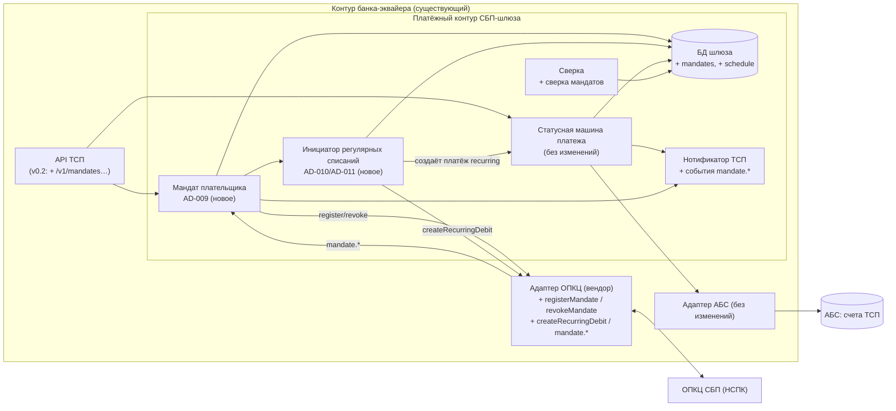
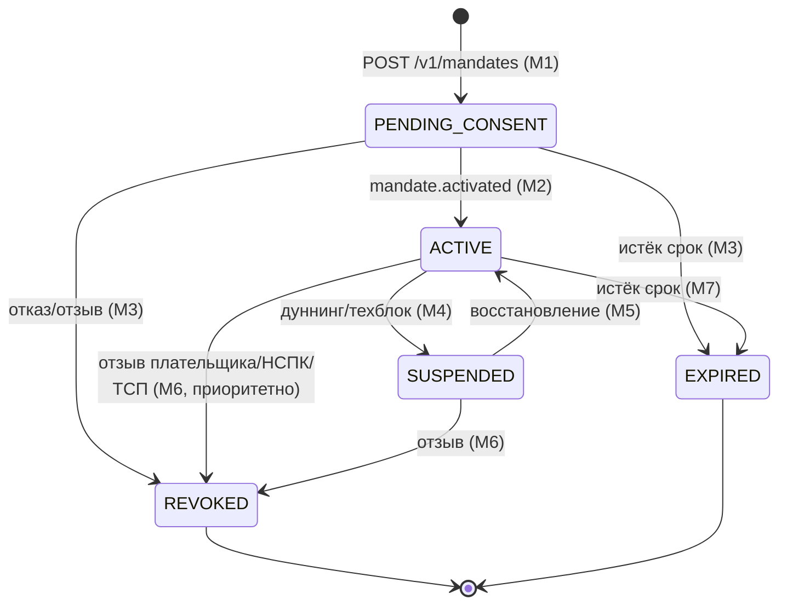
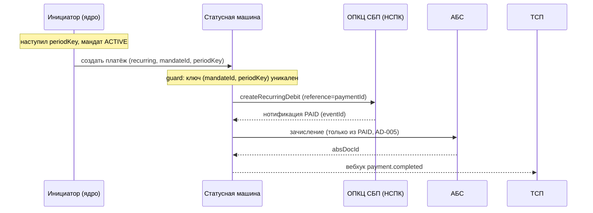

# 02. Влияние на принятую архитектуру

## 1. Принцип изменения

Изменение **аддитивное**: ядро принятого решения переиспользуется, инварианты не пересматриваются. Ни один новый инвариант не ослабляет и не противоречит `AD-001..AD-008`.

| Наследуемый инвариант | Как влияет изменение |
|---|---|
| **AD-001** Изоляция платёжного контура | **Без изменений.** Мандат и инициатор живут внутри ядра; новых прямых обращений к АБС/ОПКЦ мимо адаптеров не появляется |
| **AD-002** Единый источник истины (статус + outbox в одной транзакции) | **Усилен.** Мандат — второй агрегат с той же дисциплиной атомарных переходов «статус + outbox + аудит» |
| **AD-003** Идемпотентность финансовых операций | **Расширен.** К ключам `Idempotency-Key` и `eventId` добавляется натуральный ключ регулярного списания `(mandateId, periodKey)` |
| **AD-004** Единственный адаптер ОПКЦ | **Без изменений.** Протокол мандатов остаётся целиком внутри адаптера; ядро видит нормализованные операции/события |
| **AD-005** Зачисление только из подтверждённого `PAID` | **Без изменений — распространяется на регулярные списания.** Регулярное списание обязано дойти до НСПК-подтверждённого `PAID`; зачисление из `CREATED`/`QR_ISSUED` по-прежнему недостижимо |
| **AD-006** Trust-зоны и сегментация | **Без изменений.** Новых зон/каналов нет; усиление — приоритетная обработка отзыва и 4-eyes для ручных операций по мандатам |
| **AD-007** НПС/КИИ/ПДн | **Усилен по составу.** Добавляются ПДн плательщика (идентификаторы для сверки), доказательства согласия, уведомления; требования 152-ФЗ/161-ФЗ распространяются на мандат |
| **AD-008** Стратегия гибрид `[ADOPTED]` | **Без изменений по сути; расширяет RFP-скоуп.** Транспорт мандатов — у вендора; вендор обязан поддержать новые методы/события и идемпотентность по `reference`. Если вендор не может — эскалация изменения AD-008 (не локальное переопределение) |

## 2. Что меняется

### 2.1 Новые инварианты (spine, `AD-009..AD-012`)

- **AD-009. Мандат плательщика — отдельный источник истины в ядре шлюза.** Своя статусная машина (`PENDING_CONSENT → ACTIVE → SUSPENDED | REVOKED | EXPIRED`), атомарные переходы + outbox + аудит; списание только при `ACTIVE`; отзыв/приостановка приоритетны.
- **AD-010. Регулярное списание создаётся только через существующую статусную машину платежа.** Инициатор не пишет финансовый статус сам; создаёт платёж в `CREATED` тем же сервисным путём, что и API ТСП.
- **AD-011. Ровно одно успешное списание на период подписки.** Один объект списания на `(mandateId, periodKey)` (натуральный ключ, уникальный индекс, в одной транзакции с созданием); дуннинг — попытки внутри объекта; catch-up — не более одной попытки на просроченный период.
- **AD-012. Согласие, уведомление плательщика и отзыв — регуляторный контур.** Доказательство согласия — в неизменяемом аудите; уведомление в сроки по НПС/НСПК `[ТРЕБУЕТ ПРОВЕРКИ]`; отзыв необратим и не может быть отменён ТСП.

### 2.2 Новые элементы (контейнеры/данные)

### 2.3 Статусная машина мандата (новое состояние)

Полная таблица переходов — `docs/spec/state-machine.md` §7.

### 2.4 Регулярное списание в существующей машине платежа

## 3. Что **не** меняется (важно для оценки объёма)

- Статусная машина платежа (`docs/spec/state-machine.md` §1–6) и её переходы T1–T12.
- Правило AD-005 «зачисление только из `PAID`» — без исключений для подписок.
- Механика нотификаций НСПК (ADR-004): at-least-once, дедуп по `eventId`, DLQ, сверка.
- Интеграция с АБС (ADR-005) и сага возвратов — переиспользуются как есть.
- Trust-зоны, СКЗИ/HSM, mTLS/ГОСТ к НСПК (ADR-003/006) — новых каналов нет.
- Стратегия реализации (ADR-007): ядро собственное, транспорт вендорский — сохраняется.

## 4. Затронутые ADR (без переоткрытия)

| ADR | Влияние |
|---|---|
| ADR-001 (топология/outbox) | Без изменений; мандат и инициатор размещаются в той же топологии |
| ADR-002 (статусная машина) | Без изменений; мандат следует той же модели переходов |
| ADR-003 (транспорт ОПКЦ) | Расширяется состав методов/событий адаптера, транспорт не меняется |
| ADR-004 (нотификации/сверка) | Расширяется новыми событиями `mandate.*` и сверкой мандатов |
| ADR-005 (АБС) | Без изменений |
| ADR-006 (НПС/КИИ/ПДн) | Расширяется на ПДн плательщика и доказательства согласия |
| ADR-007 (гибрид) | Расширяется RFP-скоуп (mandate-протокол); constraints (1)–(4) сохраняются |

## 5. Сквозная идемпотентность (сводка ключей)

| Операция | Ключ идемпотентности | Введено |
|---|---|---|
| `POST /v1/payments` | `Idempotency-Key` | было |
| Нотификации НСПК | `eventId` | было |
| Подтверждение АБС | `paymentId` | было |
| Сага возврата | `refundId` | было |
| **Регистрация/отзыв мандата** | **`Idempotency-Key` + `mandateId`** | **новое** |
| **Объект регулярного списания** | **`(mandateId, periodKey)`** → `paymentId` → `reference` | **новое** |
| **Попытка дуннинга** | **`attemptRef`** (внутри объекта списания) | **новое** |
| **Нотификации мандата** | **`eventId`** | **новое (тот же механизм)** |

## 6. Конфликты и расхождения с принятыми решениями

- **Явных конфликтов с spine нет** — ни один `AD-001..008` не ослаблен.
- **Расширение scope (не конфликт):** `docs/solutioning.md` §1 относил автоплатежи к roadmap вне scope — обновлено: подписки входят в scope этим изменением.
- **Внешняя зависимость (не конфликт):** ADR-007/AD-008 требуют поддержки mandate-протокола вендором. При её отсутствии изменение AD-008 эскалируется наверх (родительский spine), локальное переопределение запрещено.
- **Открытый регуляторный вопрос:** если уведомление плательщика о списании по правилам НСПК выполняет не шлюз, объём `AD-012` уменьшается (см. `Deferred` spine и `07-human-decisions.md`).
