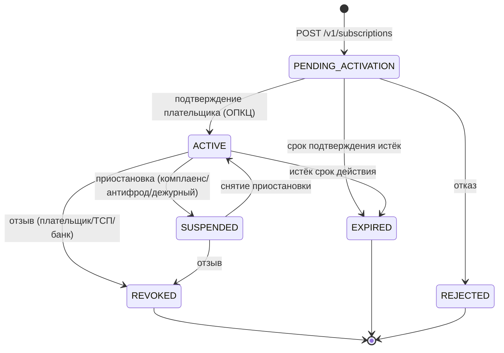

# Design

## Context

Принятое решение (baseline): `ARCHITECTURE-SPINE.md` (AD-001..AD-008), `docs/solutioning.md`, `docs/nfr.md`, `docs/adr/ADR-001..007`, `docs/contracts/*`, `docs/spec/state-machine.md`, `openapi/tsp-api.yaml` v0.1.0. Шлюз умеет разовые C2B-платежи: `POST /v1/payments` → QR → плательщик платит в своём банке → нотификация ОПКЦ `PAID` → зачисление в АБС → вебхук ТСП.

Мотив изменения — `proposal.md`. Здесь — как его спроектировать поверх действующего решения, не ломая его.

Ограничения, формирующие подход:
- Протокол подписок НСПК (поля, тайминги, идемпотентность списаний, поведение при отзыве) — внешний вход `[ТРЕБУЕТ ПРОВЕРКИ]`; протокольные детали не проектируются, только контракт ядро↔адаптер.
- Ядро контрактно-независимо от транспорта (AD-008/ADR-007): любая новая протокольная операция попадает в контракт адаптера ОПКЦ, а не в ядро.
- Рекуррентное списание — standing authority над деньгами плательщика, поэтому регуляторный (161-ФЗ, согласие и отзыв) и финансовый риск доминируют.

Принятый в репозитории способ изменения решения: дельта OpenSpec (этот change) + новые ADR (ADR-008..011, отдельные файлы, номера не переиспользуются) + Proposed-блоки спайна; действующие документы решения не переписываются — их обновляет `archive`/ратификация.

## Goals / Non-Goals

**Goals:**
- Спроектировать согласие плательщика и рекуррентное списание так, чтобы зачисление, идемпотентность и атомарность **переиспользовали** AD-002/AD-003/AD-005 без изменения их смысла.
- Дать архитектурный пакет для человеческого решения A3 и последующей передачи исполнителям (контракты, NFR, критерии приёмки, план отката, handoff).
- Сохранить полную обратную совместимость API ТСП.

**Non-Goals:**
- Реализация протокола подписок НСПК и выбор вендора (внешний вход; RFP-расширение — предмет A3).
- Изменение базовой статусной машины разового платежа, trust-зон (AD-006), правила AD-005.
- Диспуты/претензии по рекуррентным списаниям (остаются Deferred; возврат по требованию).
- Сплит-платежи, переменные тарифные планы, согласия для C2C (Deferred).
- Мультивалютность (вне scope, как и в baseline).

## Decisions

### D1. Значимость и маршрут — Critical (значимость 8/15)

Оценка по 15 триггерам Architecture Significance Score:

| # | Триггер | Применим | Обоснование |
|---|---|---|---|
| 1 | new_component | да | модуль согласий + планировщик рекуррентных списаний |
| 2 | new_datastore | нет | та же БД шлюза, новые таблицы |
| 3 | new_vendor | нет | тот же вендор транспорта; расширяется объём его контракта, не появляется новый вендор |
| 4 | domain_ownership_change | нет | владелец платёжного домена сохраняется |
| 5 | cross_domain_integration | да | новые стыки: антифрод/AML и комплаенс для рекуррентных операций |
| 6 | api_contract_change | да | аддитивное расширение API ТСП и контракта адаптера ОПКЦ |
| 7 | data_contract_change | да | новая модель данных согласий/списаний; сверка и отчётность |
| 8 | security_boundary_change | нет | границы доверия AD-006 не меняются (новая поверхность авторизации, но не новый рубеж сети) |
| 9 | trust_zone_change | нет | trust-зоны без изменений |
| 10 | consistency_model_change | да | связанные сущности «согласие↔списание↔платёж», гонка «отзыв↔списание» |
| 11 | significant_nfr | да | планировщик, латентность, доступность, burst плановых списаний |
| 12 | rto_rpo_targets | нет | RPO=0/RTO ≤ 1 ч сохраняются и распространяются на новые сущности |
| 13 | irreversible_migration | нет | миграции аддитивные и обратимые |
| 14 | financial_impact | да | реальные списания денег плательщика |
| 15 | criticality_or_exception | да | платёжный контур — Critical |

**Итог: 8/15 → маршрут Critical.** Причём Critical здесь **обязателен, а не выбран**: срабатывает `criticality_or_exception` (платежи). Следствие: полное Solutioning (spine + ADR + NFR), обязательная человеческая точка A3, walking skeleton до массовой генерации, evidence-гейты A4/A5. Дополнительно защищает от «Fast Path на standing authority» — это прямой регуляторный риск (антипаттерн из `significance-routing`). За счёт переиспользования AD-002/003/005 глубина **нового** проектирования меньше, чем у исходного шлюза: новыми являются согласие, планировщик и политика повторов, а платёжное ядро остаётся прежним.

### D2. Влияние на принятую архитектуру: какие инварианты затронуты

| Инвариант | Влияние | Что именно |
|---|---|---|
| AD-001 (изоляция контура) | без изменения текста | новые потоки тоже идут только через адаптеры шлюза; правило расширяется по охвату, не по формулировке |
| AD-002 (единый источник истины) | **расширяется (MODIFIED)** | источник истины покрывает и состояние согласия; переходы согласия — атомарно с outbox и аудитом |
| AD-003 (идемпотентность) | **расширяется** | ключи: `Idempotency-Key` (согласие/списание), `chargeId`, ключ планового запуска; повторные доставки не меняют завершённое состояние |
| AD-004 (единственный адаптер ОПКЦ) | **расширяется** | контракт адаптера получает операции согласий и события жизненного цикла; протокол НСПК по-прежнему знает только адаптер |
| AD-005 (зачисление только из `PAID`) | **переиспользуется без изменений** | списание порождает обычный платёж; зачисление возможно только из подтверждённого `PAID` |
| AD-006 (trust-зоны) | без изменений | новых зон нет; данные согласия классифицируются и защищаются в существующих зонах |
| AD-007 (НПС/КИИ/ПДн) | **расширяется** | аудит согласий и списаний; 161-ФЗ (согласие/отзыв), 152-ФЗ (данные плательщика) |
| AD-008 (гибрид, `[ADOPTED]`) | **затронут по объёму** | контракт вендора транспорта расширяется операциями согласий → пересмотр объёма и условий A3 |
| **AD-009 (новый, Proposed)** | добавляется | списание допустимо только в рамках действующего согласия и его лимитов |
| **AD-010 (новый, Proposed)** | добавляется | отзыв/истечение согласия авторитетно и необратимо прекращают будущие списания |
| **AD-011 (новый, Proposed)** | добавляется | повторные попытки списания детерминированы, ограничены и идемпотентны |

Формулировки новых блоков (предлагаются в `ARCHITECTURE-SPINE.md`, Status: Proposed). Привязка к ADR: AD-009 → ADR-008 (согласие как сущность), AD-010 → ADR-008 (отзыв), AD-011 → ADR-009 (повторы). ADR-010 (контракты) и ADR-011 (origin=MANDATE) новых spine-блоков не порождают — они расширяют действующие AD-004 и AD-002 соответственно:

```
## AD-009. Списание только в рамках действующего согласия
Binds: статусная машина согласия, модуль списаний, адаптер ОПКЦ
Prevents: списание без/вне согласия плательщика, превышение лимитов, «платежи из воздуха»
Rule: charge достижим только из состояния согласия `ACTIVE` и в пределах maxAmountPerCharge/maxAmountPerPeriod;
      fitness: недостижимость charge из PENDING_ACTIVATION/SUSPENDED/REVOKED/EXPIRED

## AD-010. Отзыв согласия прекращает будущие списания
Binds: модуль согласий, планировщик, адаптер ОПКЦ, аудит
Prevents: списания после отзыва плательщика; неидемпотентный отзыв; «зависший» планировщик
Rule: после фиксации отзыва/истечения не создаётся ни одного нового charge — списание с createdAt > revokedAt
      недопустимо (гонка разрешается в пользу отзыва); in-flight списание, подтверждённое ОПКЦ после отзыва,
      сохраняет PAID, помечается возвратным и нарушением не считается; отзыв идемпотентен; fitness проверяет
      отсутствие новых (CREATED) списаний с createdAt > revokedAt и наличие фиксации отзыва

## AD-011. Ограниченное идемпотентное повторение списаний
Binds: модуль списаний, планировщик, адаптер ОПКЦ
Prevents: неограниченные/скрытые повторы, двойное списание при повторном запуске планировщика
Rule: повторы — отдельные списания с детерминированным ключом (subscriptionId, periodKey, attemptNo) и общим
      пределом N; каждый повтор резервирует лимит заново; fitness: повторный запуск планировщика/повтор инициации
      не увеличивает число дебетов плательщика
```

Предлагаемые новые редакции действующих инвариантов (вносятся при ратификации вместе с AD-009..011):

```
## AD-002. Единый источник истины — статусная машина платежа
Rule: Изменение финансового статуса платежа, а также статуса согласия/списания, и запись исходящего события
      (outbox) + аудит выполняются в одной локальной транзакции. Статусная машина платежа расширена признаком
      origin: для origin=MANDATE переход CREATED→PAID выполняется без QR_ISSUED (см. ADR-011). Нарушение —
      дефект блокера (ревью + fitness).

## AD-003. Идемпотентность финансовых операций
Rule: Повторная доставка любого сообщения не изменяет завершённое состояние. Ключи идемпотентности расширены:
      Idempotency-Key (согласие/списание), eventId (нотификации ОПКЦ), paymentId/refundId (АБС),
      детерминированный ключ планового списания (subscriptionId, periodKey, attemptNo). Повторный запуск
      планировщика не создаёт второе списание. Fitness: тест «повтор → состояние и число дебетов не меняются».

## AD-004. Единственный адаптер ОПКЦ СБП
Rule: Протокол НСПК знает только адаптер ОПКЦ; внутренний контракт шлюза — единственный интерфейс для
      остальных компонентов. Контракт адаптера включает операции согласий (createMandate/cancelMandate/
      getMandateStatus), списаний (createCharge/getChargeStatus/cancelCharge) и события жизненного цикла
      согласия/списания. Fitness: отсутствие исходящих вызовов НСПК вне адаптера.
```

**Что не меняется:** базовая статусная машина разового платежа (`docs/spec/state-machine.md`), правило AD-005, trust-зоны AD-006, семантика outbox и зачисления в АБС, существующие методы и схемы API ТСП, контракт адаптера ОПКЦ в части разовых платежей.

### D3. Модель: согласие как сущность шлюза, списание как производный платёж

Выбрано (**ADR-008**): согласие плательщика — первоклассная сущность шлюза со своей статусной моделью; рекуррентное списание (`charge`) порождает обычный платёж принятой статусной машины.



Списание `charge` не имеет собственной финансовой истины: его статус — проекция статуса порождённого платежа (`CREATED→PAID→CREDITED→COMPLETED`, терминальное `FAILED`) плюс технический исход `CANCELLED` (отмена незавершённого списания при отзыве согласия). Нарушения лимитов не создают списание вовсе — они отклоняются на входе (`422`). Это ключевое решение: нет второй статусной машины для денег, нет второго источника истины.

Уточнение модели повторов (по итогам состязательного ревью): **одно списание = одна попытка = ровно один платёж** (`Charge.paymentId` единичен). Неуспешная попытка терминальна (платёж `FAILED`), а повтор — это **новое списание** с полями `retryOf`/`attemptNo`, а не «реанимация» того же платежа. Это не нарушает принятую статусную машину (терминальные состояния не переиспользуются) и делает каждый повтор идемпотентным по своему детерминированному ключу.

Режим согласия (`mode`) взаимоисключает инициаторов списаний: `PERIODIC` — списания создаёт только планировщик (ручной `createCharge` → `409 CHARGE_NOT_ALLOWED`); `ON_DEMAND` — только ТСП. Это закрывает риск двойного списания «планировщик + ТСП».

Платёж, порождённый списанием, помечается признаком `origin=MANDATE` и **не проходит QR-путь**: переход `CREATED → PAID` выполняется по подтверждению ОПКЦ о списании, без `QR_ISSUED`; далее `PAID→CREDITED→COMPLETED` как в принятой машине. Состояния `QR_ISSUED`/`EXPIRED` для такого платежа недостижимы (отказ → `FAILED`). Это расширение принятой статусной машины зафиксировано в ADR-011 и подлежит внесению в `docs/spec/state-machine.md` (задача 1.5): T4 входит в `PAID` из `QR_ISSUED` для QR-платежей; для `origin=MANDATE` добавляется переход `CREATED→PAID`.

Альтернативы:

| Вариант | Почему отвергнут |
|---|---|
| A. Расширить `Payment` флагом «рекуррентный» без сущности согласия | негде хранить лимиты, срок, состояние согласия и отзыв; отзыв плательщика не выражается; противоречит AD-010 |
| B. Согласие и планировщик целиком у вендора транспорта | состояние согласия вне источника истины (против AD-002), vendor lock-in, аудит для ЦБ затруднён (против AD-001/ADR-007) |
| C. Отдельный сервис подписок вне шлюза | второй источник истины, связь «платёж↔списание» через сеть → распределённая согласованность и саги там, где можно обойтись одной транзакцией |
| **D. Согласие — сущность шлюза, списание — производный платёж (выбрано)** | переиспользует AD-002/003/005, единый источник истины, минимум новых контрактов и распределённых переходов |

### D4. Планировщик и политика повторных попыток

Выбрано (**ADR-009**): планировщик живёт в контуре шлюза как единственный писатель (lease/single-writer); для согласий «по требованию» ТСП сам вызывает `POST .../charges`. Повторы при неуспехе — детерминированные и ограниченные.

| Вариант | Плюсы | Минусы / почему |
|---|---|---|
| A. Внешний крон/оркестратор вне шлюза | не трогает код шлюза | второй контур управления, leader election вне модели согласия, «кто главный» неочевиден; скрытые повторы |
| B. Планировщик в шлюзе, single-writer (выбрано) | единая модель, идемпотентность по ключу плана, аудит в одном месте | нужен механизм единственного писателя; риск двух лидеров снимается идемпотентностью charge |
| C. Только ТСП-инициатива | проще | не покрывает периодические сценарии ЖКХ/связи (ради них изменение и делается) |
| D. Неограниченные повторы | выше сбор | недопустимый финансовый/abuse-риск (против AD-011) |

Идемпотентность важнее «правильных выборов»: даже если планировщик запустится дважды, повторная инициация с тем же ключом плана `(subscriptionId, periodKey, attemptNo)` даёт один `chargeId` и одно списание (AD-003/AD-011). Это осознанный отказ от попытки гарантировать «ровно один лидер» — по канону «почти один лидер» и идемпотентный эффект надёжнее. Режим `mode` взаимоисключает планировщик и ручную инициацию (см. D3), поэтому два разных ключа не могут дать двойной дебет в одном периоде. Повтор при отказе — новое списание с `attemptNo+1` (D3), а не второй charge по «другому» ключу. Автоматические повторы применяются только к `PERIODIC` (инициатор — планировщик); для `ON_DEMAND` отклонённое списание терминально `FAILED`, а повтор инициирует ТСП — иначе на `ON_DEMAND` появился бы третий инициатор списаний, ломающий взаимоисключение режима.

### D5. Изменения контрактов без поломки потребителей

Принцип: **только аддитивно**, в пределах `/v1`. По правилам `docs/contracts/tsp-api.md` §6 добавление опциональных полей/новых ресурсов обратно совместимо и не требует `/v2`.

Изменения `openapi/tsp-api.yaml` (внесены аддитивно): добавляются пути `/v1/subscriptions`, `/v1/subscriptions/{subscriptionId}` (GET, DELETE), `/v1/subscriptions/{subscriptionId}/charges`, `/v1/subscriptions/{subscriptionId}/charges/{chargeId}` и схемы `SubscriptionRequest`, `Subscription`, `ChargeRequest`, `Charge`. Существующие пути и схемы `Payment`/`PaymentRequest` не изменяются; связь «списание→платёж» отдаётся через `Charge.paymentId`, а не добавлением полей в `Payment`.

Совместимость (разбор):

| Аспект | Влияние | Совместимо? |
|---|---|---|
| Существующие пути `/v1/payments`, `/v1/tsp` | не меняются | да |
| Схемы `Payment`, `PaymentRequest`, коды существующих ошибок | не меняются | да |
| Новые пути `/v1/subscriptions...` | новые ресурсы | да (аддитивно) |
| Поле `mode` (`ON_DEMAND`/`PERIODIC`) и `retryOf`/`attemptNo`/`periodKey` | только в новых схемах `Subscription*`/`Charge*` | да (поля новых ресурсов) |
| Ошибки новых методов (`409`, `422`, `404`) + схема `Problem` | только ответы новых методов | да |
| Новые коды ошибок (`SUBSCRIPTION_NOT_ACTIVE`, `CHARGE_NOT_ALLOWED`, `CHARGE_LIMIT_EXCEEDED`) | применяются только к новым методам | да |
| Новые типы вебхуков (`subscription.*`, `charge.*`) | приходят на тот же `webhookUrl` | **условно**: существующий потребитель обязан игнорировать неизвестные `type` (идемпотентность по `eventId` уже требуется контрактом); это фиксируется в приёмке |
| Версия контракта | остаётся `/v1`; версия `0.1.0` → `0.2.0` (аддитивно) | да |

Дельты контракта (фрагмент, добавляемый в `openapi/tsp-api.yaml`):

```yaml
paths:
  /v1/subscriptions:
    post:
      operationId: createSubscription
      parameters:
        - {in: header, name: Idempotency-Key, required: true, schema: {type: string}}
      requestBody:
        required: true
        content:
          application/json:
            schema: {$ref: '#/components/schemas/SubscriptionRequest'}
      responses:
        '201':
          description: Согласие зарегистрировано, ожидает подтверждения плательщика
          content:
            application/json:
              schema: {$ref: '#/components/schemas/Subscription'}
  /v1/subscriptions/{subscriptionId}:
    get:
      operationId: getSubscription
      parameters:
        - {in: path, name: subscriptionId, required: true, schema: {type: string}}
      responses:
        '200':
          description: Статус согласия
          content:
            application/json:
              schema: {$ref: '#/components/schemas/Subscription'}
    delete:
      operationId: revokeSubscription
      parameters:
        - {in: path, name: subscriptionId, required: true, schema: {type: string}}
      responses:
        '200':
          description: Согласие отозвано (идемпотентно)
          content:
            application/json:
              schema: {$ref: '#/components/schemas/Subscription'}
  /v1/subscriptions/{subscriptionId}/charges:
    post:
      operationId: createCharge
      parameters:
        - {in: path, name: subscriptionId, required: true, schema: {type: string}}
        - {in: header, name: Idempotency-Key, required: true, schema: {type: string}}
      requestBody:
        required: true
        content:
          application/json:
            schema: {$ref: '#/components/schemas/ChargeRequest'}
      responses:
        '201':
          description: Списание инициировано
          content:
            application/json:
              schema: {$ref: '#/components/schemas/Charge'}
  /v1/subscriptions/{subscriptionId}/charges/{chargeId}:
    get:
      operationId: getCharge
      parameters:
        - {in: path, name: subscriptionId, required: true, schema: {type: string}}
        - {in: path, name: chargeId, required: true, schema: {type: string}}
      responses:
        '200':
          description: Статус списания
          content:
            application/json:
              schema: {$ref: '#/components/schemas/Charge'}
components:
  schemas:
    SubscriptionRequest:
      type: object
      required: [tspId, currency, maxAmountPerCharge, maxAmountPerPeriod, mode, purpose]
      properties:
        tspId: {type: string}
        currency: {type: string, enum: [RUB]}
        mode: {type: string, enum: [ON_DEMAND, PERIODIC]}
        maxAmountPerCharge: {type: integer, description: Максимум одного списания, копейки}
        maxAmountPerPeriod: {type: integer, description: Максимум за период, копейки}
        period: {type: string, enum: [DAY, WEEK, MONTH, YEAR], description: Обязателен при mode=PERIODIC}
        maxChargesPerPeriod: {type: integer}
        validityDays: {type: integer}
        purpose: {type: string}
        merchantOrderId: {type: string}
        redirectUrl: {type: string}
    Subscription:
      type: object
      required: [subscriptionId, tspId, status, currency, mode]
      properties:
        subscriptionId: {type: string}
        mandateId: {type: string, description: Идентификатор согласия в ОПКЦ}
        status:
          type: string
          enum: [PENDING_ACTIVATION, ACTIVE, SUSPENDED, REVOKED, EXPIRED, REJECTED]
        mode: {type: string, enum: [ON_DEMAND, PERIODIC]}
        qrUrl: {type: string, description: Ссылка/QR для подтверждения согласия плательщиком}
        maxAmountPerCharge: {type: integer}
        maxAmountPerPeriod: {type: integer}
        maxChargesPerPeriod: {type: integer}
        period: {type: string}
        remainingAmountPerPeriod: {type: integer}
        remainingChargesPerPeriod: {type: integer}
        chargesCreated: {type: integer}
        activatedAt: {type: string, format: date-time}
        expiresAt: {type: string, format: date-time}
        revokedAt: {type: string, format: date-time}
        revocationReason: {type: string}
    ChargeRequest:
      type: object
      required: [amount]
      properties:
        amount: {type: integer, description: Сумма списания, копейки}
        merchantOrderId: {type: string}
        description: {type: string}
    Charge:
      type: object
      required: [chargeId, subscriptionId, paymentId, amount, status]
      properties:
        chargeId: {type: string}
        subscriptionId: {type: string}
        paymentId: {type: string, description: Платёж /v1/payments текущей попытки}
        amount: {type: integer}
        status:
          type: string
          enum: [CREATED, PAID, CREDITED, COMPLETED, REFUNDED, FAILED, CANCELLED]
        attemptNo: {type: integer, description: Номер попытки в группе повторов (с 1)}
        retryOf: {type: string, description: chargeId предыдущей попытки, если это повтор}
        periodKey: {type: string, description: Ключ периода для PERIODIC (например, 2026-10)}
        declinationCode: {type: string}
        createdAt: {type: string, format: date-time}
        completedAt: {type: string, format: date-time}
    Problem:
      type: object
      description: Problem Details (RFC 9457), как в docs/contracts/tsp-api.md §4
      required: [title, status, code]
      properties:
        type: {type: string}
        title: {type: string}
        status: {type: integer}
        detail: {type: string}
        code: {type: string}
        traceId: {type: string}
        idempotencyKey: {type: string}
```

Полная дельта контракта — в `openapi/tsp-api.yaml`; новые методы возвращают канонические ошибки (`409 IDEMPOTENCY_CONFLICT`/`SUBSCRIPTION_NOT_ACTIVE`/`CHARGE_NOT_ALLOWED`, `422 CHARGE_LIMIT_EXCEEDED`/`INVALID_REQUEST`, `404 NOT_FOUND`) в формате `Problem` (RFC 9457), совместимом с `docs/contracts/tsp-api.md` §4 (коды также добавлены в §4).

### D6. Измеримые NFR нового функционала

| Метрика | Цель | Метод проверки |
|---|---|---|
| Доступность функций согласий | ≥ 99,95 % (мес.) | uptime-мониторинг, синтетика на `createSubscription`/`createCharge` |
| Latency `createSubscription` | p95 < 500 мс (без ОПКЦ) | нагрузочный тест, APM |
| Latency `createCharge` | p95 < 700 мс (без ОПКЦ) | нагрузочный тест |
| Latency `getSubscription` | p95 < 300 мс | нагрузочный тест |
| Прекращение создания новых списаний (сторона шлюза) после фиксации отзыва | p95 ≤ 5 с, p99 ≤ 30 с | тест на гонку + метрика propagation-лага |
| Своевременность плановых списаний | инициация в пределах ±60 с от плана, p99 ≤ 5 мин | метрика планировщика |
| Списаний сверх лимитов | 0 (атомарная резервация при конкуренции) | тест на конкурентные запросы + сверка счётчиков |
| Дублей списаний при повторах/двух лидерах | 0 | тест повторной инициации и повторного запуска планировщика |
| Нотификация ТСП о списании | p95 < 5 с от события | метрика лага нотификатора |
| Плановый burst списаний | sustained 200 TPS, пик 500 TPS | нагрузочный тест |
| Сверка согласий/списаний с ОПКЦ | ежечасно; расхождений 0 | reconciliation-отчёт |
| RPO / RTO | RPO=0 / RTO ≤ 1 ч | chaos-тест, DR-учения |
| Наблюдаемость | 100 % согласий/списаний с trace id; алерт на отзыв-лаг и всплеск отказов | APM, мониторинг |

Цели значений — baseline; регламенты НСПК и SLA АБС могут быть строже `[ТРЕБУЕТ ПРОВЕРКИ]`.

### D7. Критерии приёмки (проверяемые, включая негативные)

Позитивные:
1. Согласие создано → подтверждено плательщиком → `ACTIVE`; ТСП получил `subscription.activated`.
2. Списание в пределах лимитов → платёж `PAID` → зачислен в АБС → `COMPLETED`; ТСП получил `charge.completed`.
3. Возврат по списанию выполняется принятой сагой возврата (ADR-005).

Негативные (обязательны):
4. Списание по не-`ACTIVE` согласию → `409 SUBSCRIPTION_NOT_ACTIVE`, дебета нет.
5. Списание сверх `maxAmountPerCharge`/лимита периода → `422 CHARGE_LIMIT_EXCEEDED`, дебета нет.
6. Повтор `createCharge` с тем же `Idempotency-Key` → тот же `chargeId`, одно списание.
7. Повторный запуск планировщика за тот же период → нет второго списания.
8. Отзыв во время инициации: новых списаний нет; уже подтверждённое ОПКЦ остаётся возвратным.
9. Отклонение списания банком плательщика → каждый повтор — отдельное списание (`retryOf`/`attemptNo`), после предела повторов группа `FAILED`; повторов сверх политики нет.
10. Канал к НСПК недоступен → списание не теряется (очередь/отказ по политике), согласие не повреждается, алерт.
11. Существующий ТСП без подписок: вызовы старых методов не изменились.
12. Ручная инициация при `mode=PERIODIC` → `409 CHARGE_NOT_ALLOWED`, списания нет.
13. Конкурентные списания: при одновременных запросах сверх лимита второе отклоняется (`422`), лимит периода не превышен.
14. Повтор при отказе: новый `chargeId`, платёж предыдущей попытки остаётся `FAILED` и не «реанимируется».
15. Платёж-производный списания: `origin=MANDATE`, переход `CREATED→PAID` без `QR_ISSUED`; состояния `QR_ISSUED`/`EXPIRED` недостижимы.
16. Отклонение в `ON_DEMAND`-согласии: автоматических повторов нет, списание `FAILED`, повтор — только по инициативе ТСП.

Критерий успешного отката (см. D8): после выключения флага новые списания не создаются, отзывы продолжают обрабатываться, расхождений с ОПКЦ и АБС — 0.

### D8. План отката

- **До боевой эксплуатации**: откат = не включать фиче-флаг подписок; миграции аддитивные, откат схемы не нужен.
- **После включения**:
  1. `stop-new-subscriptions` — мгновенно запретить создание новых согласий.
  2. `stop-new-charges` — остановить планировщик и отклонять новые списания; **отзыв согласий и обработка входящих нотификаций остаются включёнными всегда**.
  3. Уже подтверждённые ОПКЦ платежи завершаются и остаются возвратными; согласия переводятся в `SUSPENDED`/отменяются в ОПКЦ по протоколу.
  4. Данные согласий/списаний не удаляются: шлюз — источник истины до полной сверки с ОПКЦ/АБС.
- **Сигналы-триггеры отката**: инцидент двойного списания; списание сверх лимита; lag прекращения списаний после отзыва > порога; всплеск отказов списаний; расхождение сверки.
- **Владелец решения об откате**: дежурный архитектор/incident commander; остановка подписок для клиентов — совместно с бизнес-владельцем.
- Обратимость самого решения: **costly** (согласия — новый источник истины; сворачивание потребует переноса/закрытия согласий в ОПКЦ), см. ADR-008.

### D9. Что остаётся на решение человека-архитектора (A3) и почему

1. **Расширение объёма ADR-007 (гибрид) и RFP на операции согласий.** Почему человек: контрактно-коммерческое решение (новый объём вендора, стоимость, сроки, пересмотр A3 от 2026-08-15) и внешняя зависимость от НСПК — не выводится из кода.
2. **Бизнес-параметры и политика повторов** (значения лимитов по умолчанию, число/окно повторов, уведомления, тарифы). Почему человек: баланс сбора и риска злоупотреблений, клиентский опыт — бизнес-риск.
3. **Юридический контур согласия** (форма согласия по 161-ФЗ, SLA отзыва, обработка спорных рекуррентных списаний, классификация данных плательщика по 152-ФЗ). Почему человек: комплаенс/юр.
4. **Приоритет отзыва vs in-flight списание и наличие `cancelCharge` в протоколе НСПК** — предложен вариант «в пользу отзыва» + best-effort отмена отправленного списания с компенсацией возвратом; окончательно — после документации НСПК.
5. **Решение об идемпотентности списаний на стороне ОПКЦ** (гарантирует ли протокол НСПК; если нет — компенсация на ядре, фиксируется ADR). Почему человек: внешний вход и риск дублей у плательщика.
6. **Момент старта реализации транспорта** (по AD-008 транспорт начинается только после контракта и документации НСПК).

## Risks / Trade-offs

- [Протокол НСПК неизвестен] → контракт ядро↔адаптер нормализует операции; протокольные детали изолированы в адаптере (AD-004/AD-008), помечены `[ТРЕБУЕТ ПРОВЕРКИ]`.
- [Отзыв не успевает за in-flight списанием] → AD-010 разрешает гонку в пользу отзыва; подтверждённое ОПКЦ списание не откатывается и возвратно; propagation-лаг измеряется.
- [Два лидера планировщика / повторный запуск] → идемпотентность по ключу плана (AD-003/AD-011) важнее выбора лидера.
- [Неограниченные повторы как abuse-вектор] → AD-011: детерминированная ограниченная политика, перепроверка лимитов.
- [Новые события вебхуков ломают наивного потребителя] → требование «игнорировать неизвестные `type`» в критериях приёмки и в контракте.
- [Расширение объёма вендора тормозит программу] → параллельная разработка ядра на мок-адаптере (как в baseline handoff); kill-criteria RFP сохраняются.
- [Комплаенс-риск: standing authority] → полный Solutioning/Critical, аудит каждого перехода, 4-eyes на ручные операции, отзыв всегда доступен.
- [Локальная проверка лимитов расходится с ОПКЦ и плательщик всё равно списан] → проверка лимитов на ядре — это guard, а не единственная защита; авторитет по списанию остаётся у ОПКЦ/банка плательщика, расхождения ловит ежечасная сверка и счётчики сверяются с ОПКЦ (defense in depth).
- [Уже отправленное в ОПКЦ списание исполнено после отзыва] → best-effort `cancelCharge`; если отмена недоступна — компенсация возвратом; NFR отзыва (D6) покрывает только сторону шлюза, что зафиксировано в формулировке цели.
- [Двойной дебет «планировщик + ТСП»] → поле `mode` взаимоисключает инициаторов; ручная инициация при `PERIODIC` отклоняется `409`.

## Migration Plan

1. Ядро разрабатывается на мок-адаптере ОПКЦ (расширение существующего мока операциями согласий) — walking skeleton: ТСП → создание согласия → активация → списание → мок АБС → вебхук.
2. Реализуется модель согласий/списаний и планировщик в шлюзе; фиче-флаг `subscriptions`.
3. Fitnes-проверки инвариантов AD-009..AD-011 (тесты на фейках с нарушающей реализацией) добавляются в CONSTRAINTS.yaml при handoff.
4. После A3 и документации НСПК — реальный адаптер у вендора; PVT на тестовом контуре.
5. Пилот на ограниченном пуле ТСП → расширение. Откат — по D8.

## Open Questions

- Точный протокол подписок НСПК: поля, тайминги, поведение при отзыве, гарантии идемпотентности списаний `[ТРЕБУЕТ ПРОВЕРКИ]`.
- Поддерживает ли протокол НСПК расписание/автосписание на своей стороне, или планировщик остаётся исключительно на стороне шлюза (влияет на ADR-009, но не на ядро и не на контракт ядро↔адаптер).
- Инициация приостановки самим ТСП — вне первой волны (в первой волне приостановка: комплаенс/антифрод/дежурный); окончательный объём — на A3.
- Единый лимит на ТСП/плательщика дополнительно к лимитам согласия (антифрод) — уточняется с ИБ/AML.
- Поддерживает ли протокол НСПК отмену уже отправленного, но не исполненного списания (`cancelCharge`)? Если нет — компенсация только возвратом.
- Значение `mode` по умолчанию для новых ТСП, если не задано явно.
