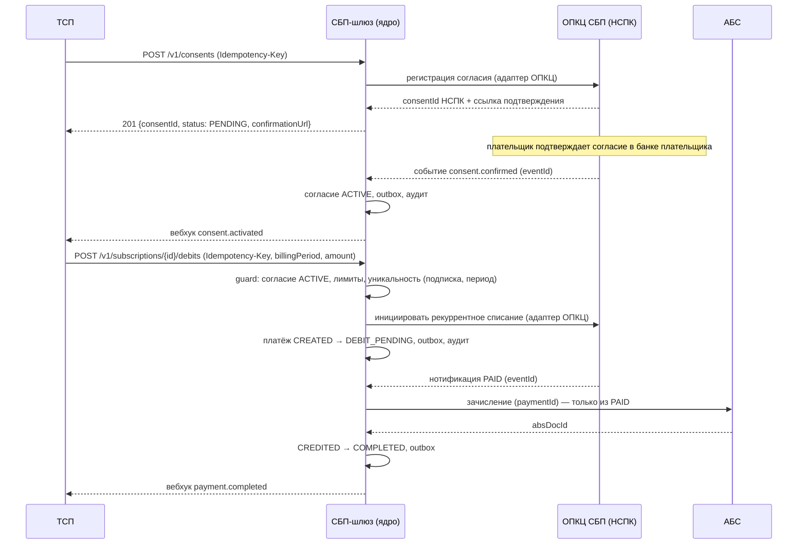
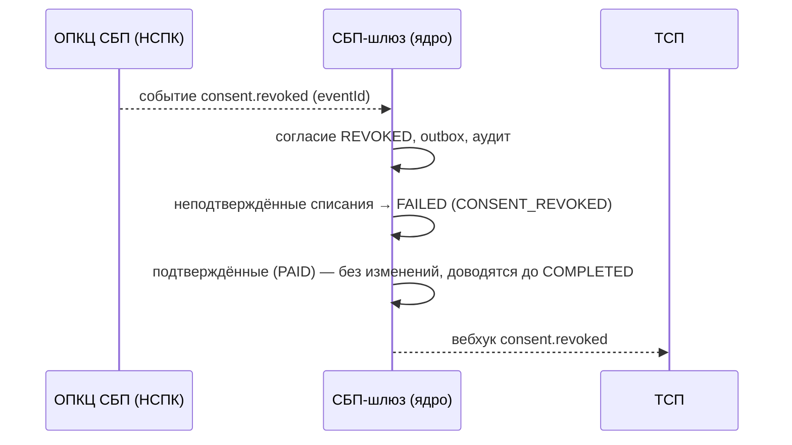

# Design

## Context

См. `proposal.md` — Why. Расширяем принятое решение (ADR-001…007) рекуррентным потоком поверх существующего ядра шлюза.

Ограничения, формирующие подход:

- Статусная машина платежа и outbox — единый источник истины (AD-002); рекуррентный поток обязан переиспользовать их, а не вводить второй механизм.
- Зачисление возможно только из `PAID` (AD-005); отзывы/компенсации — только через возврат-сагу (ADR-005).
- Ядро контрактно-независимо от транспорта НСПК (AD-008): протокол «подписки СБП» скрыт в адаптере ОПКЦ, все протокольные детали — `[ТРЕБУЕТ ПРОВЕРКИ]`.
- Реквизиты плательщика в шлюзе не хранятся; ПДн-профиль не расширяется.
- Потребители `/v1/payments` (ТСП) — внешние; контракт меняется только аддитивно (v0.1.0 → v0.2.0, путь `/v1` прежний).

## Goals / Non-Goals

**Goals:**

- Дать ТСП возможность списывать по подтверждённому согласию плательщика без его действия в каждом платеже.
- Гарантировать: нет списания без действующего согласия и вне лимитов; нет повторного списания за один расчётный период; нет зачисления вне `PAID`.
- Сохранить существующий QR-поток и его инварианты без изменений.
- Уложиться в маршрут Critical: решения (ADR-008/009), инварианты (AD-009/010), NFR, fitness, план отката.

**Non-Goals:**

- Шлюз НЕ становится биллинговым календарём: расписание периодов и суммы — на стороне ТСП; шлюз исполняет списание по запросу.
- Шлюз НЕ хранит и НЕ использует платёжные реквизиты плательщика; карточный рекуррент вне scope.
- НЕ реализуется реальный протокол НСПК по подпискам (внешний вход; на walking skeleton — мок).
- НЕ вводится отдельная статусная машина для рекуррента (см. Decisions).
- Диспуты/претензии, C2C/выплаты — по-прежнему вне scope (спайн, Deferred).

## Decisions

### D1. Источник мандата — согласие в СБП (НСПК); шлюз хранит проекцию

Решение и альтернативы — **ADR-008**. Кратко: единственный легитимный мандат — согласие, подтверждённое плательщиком в СБП; собственный мандат шлюза и карточный рекуррент отвергнуты (несанкционированные списания / недопустимый класс данных).

### D2. Списание — платёж с `initiationType = debit`; переиспользуем статусную машину

Решение — **ADR-008**, альтернатива «отдельная FSM» отвергнута (дублирование, расхождение аудита, нарушение AD-002). Расширение статусной машины — аддитивное:

```
Текущий QR-поток (без изменений):
CREATED ──► QR_ISSUED ──► PAID ──► CREDITED ──► COMPLETED
                                        │
                                        ▼
                                    REFUNDED / FAILED / EXPIRED

Новый рекуррентный поток (debit):
CREATED ──► DEBIT_PENDING ──► PAID ──► CREDITED ──► COMPLETED
   │             │                          │
   ▼             ▼                          ▼
 FAILED       FAILED                    REFUNDED
              (CONSENT_REVOKED,
               NSPK_REJECTED, EXPIRED)
```

Инвариант AD-005 не ослабляется: `DEBIT_PENDING` — состояние ожидания подтверждения НСПК, зачисление из него недостижимо.

### D3. Однократность успешного списания за период — нормализованный ключ + попытки

Решение — **AD-010**. Шлюз нормализует ключ периода по `periodicity` согласия (значение ТСП не доверенное — иначе ТСП обошёл бы дедупликацию, отправив две разные строки за один период) и хранит уникальность **успешного** списания на `(subscriptionId, periodKey)`; повторная инициация возвращает существующее незавершённое/успешное списание, а повтор после терминального `FAILED` создаёт новую попытку (счётчик попыток). Альтернатива «дисциплина ТСП» отвергнута (ретраи и дубли шедулера неизбежны); альтернатива «жёсткая уникальность без попыток» отвергнута — не давала бы повторить период после транзиентного отказа.

### D4. Политика отзыва — немедленный запрет новых, подтверждённые доводятся

Решение и альтернативы — **ADR-009**.

### D5. Планирование периодов — на стороне ТСП (шлюз не планировщик)

Шлюз исполняет списание по запросу ТСП (pull), не хранит бизнес-календарь. Альтернатива «шедулер в шлюзе» — отложена (см. Open Questions): требует владения тарифами/календарями всех ТСП и повышает blast radius платёжного контура.

### D6. Контракт — аддитивное расширение `/v1`

Новые пути согласий/подписок/списаний и опциональные поля; `Idempotency-Key` обязателен для новых `POST`; ошибки — RFC 9457 с новыми кодами (`CONSENT_NOT_ACTIVE`, `LIMIT_EXCEEDED`, `CONSENT_REVOKED`). Ломающих изменений нет (проверка — `contract_diff` v0.1 → v0.2).

### D7. Рекуррентное списание проходит существующие дополнительные контроли

Рекуррентное списание не создаёт отдельного «доверенного» пути: оно проходит те же антифрод/AML-контроли и передачу в SIEM по порогам, что и обычный платёж; отклонение контроля → `FAILED` без зачисления. Альтернатива «доверять платежам по согласию без контроля» отвергнута — рекуррентный канал не должен становиться обходным путём для мошенничества.

## Архитектура и потоки

Новые/изменённые компоненты (C4-контейнеры — дополнение к `docs/solutioning.md`):

- **Подсистема согласий и подписок** (ядро шлюза, собственная разработка): состояние согласия, лимиты, подписки; источник истины — БД шлюза (AD-002).
- **Адаптер ОПКЦ** (вендорский): новые операции — регистрация согласия, запрос статуса согласия, отзыв, инициирование рекуррентного списания; события `consent.*`. Все протокольные детали — внутри адаптера.
- **Статусная машина платежа**: новое состояние `DEBIT_PENDING`, тип инициации `debit`.
- **Нотификатор**: новые события `consent.*`.
- **Сверка**: согласия — ежечасная сверка с НСПК (как платежи, ADR-004).

Поток рекуррентного списания (счастливый путь):



Отзыв (конкурентный сценарий):



Данные (концептуально): `consent` (id, tspId, tspConsentRef НСПК, status, лимиты, срок, timestamps, audit), `subscription` (id, consentId, terms), расширение `payment` (`initiationType`, `consentId`, `subscriptionId`, `billingPeriod`), уникальный ключ `(subscriptionId, billingPeriod)`.

## Impact и маршрут (A0–A1)

- **Маршрут: Critical** (`arch-be control score` → 9/15: api_contract_change, data_contract_change, security_boundary_change, consistency_model_change, cross_domain_integration, significant_nfr, new_component, financial_impact, criticality_or_exception). Полное Solutioning + обязательная человеческая точка A3.
- **Затронуто (blast radius)**: API ТСП (аддитивно), статусная машина и БД шлюза, адаптер ОПКЦ (новые операции), нотификатор, сверка, отчётность. **Не затронуто**: QR-поток, АБС-интеграция (контракт прежний), trust-зоны, СКЗИ.
- **Инварианты**: AD-002/003/005 — расширяются без ослабления; аддитивно вводятся AD-009/AD-010. Пересмотра существующих AD-001/004/006/007/008 не требуется.

## Risks / Trade-offs

- Протокол подписок НСПК неизвестен `[ТРЕБУЕТ ПРОВЕРКИ]` → ядро контрактно-независимо (AD-008), интеграция проверяется на моке и тестовом контуре НСПК; риск сроков — внешний вход.
- Расширение статусной машины может задеть QR-путь → регрессионный набор ADR-002/005 обязателен (AC-09); новые переходы — только для `initiationType=debit`.
- Окно «отзыв ↔ подтверждённое списание» (ADR-009) → явная причина `CONSENT_REVOKED`, отчётность, информирование; не маскируется.
- Дубли списания при ретраях/шедулерах ТСП → уникальный ключ периода (AD-010) + property-тест.
- Лимиты согласия как источник злоупотреблений → серверная проверка (AD-009), алерты на серии отказов.
- Рост нагрузки от периодических списаний (ЖКХ/связь — массовые даты) → NFR throughput и защита от перегрузки по существующим механизмам шлюза.

## Migration Plan

1. Аддитивные изменения контракта и БД (обратно совместимы); новые таблицы, существующие — без изменения смысла полей.
2. Функционал за фиче-флагом на ТСП; пилот на одном-двух ТСП на тестовом контуре НСПК.
3. Walking skeleton (мок НСПК/АБС) → сквозной сценарий consent → debit → credit → revoke.
4. Включение по ТСП; QR-поток работает независимо.

**Rollback**: см. `ROLLBACK.md`. Кратко — флаг off (новые эндпоинты недоступны, согласия отзываются по runbook ≤ 4 ч), релиз rolling, откат данных не требуется (шлюз остаётся источником истины до сверки); существующий QR-поток не затронут.

## Open Questions

1. Кто владеет расписанием периодов (шедулер ТСП vs шлюз) — влияет на объём, не на инварианты; решается бизнесом/продуктом до массовой генерации (D5).
2. Точные лимиты (на списание, за период, срок согласия) и состав `reasonCode` — по документации НСПК и требованиям ИБ (внешний вход).
3. Нужно ли отдельное `SUSPENDED` (пауза) в первой волне или только `ACTIVE/REVOKED/EXPIRED` — влияет на API, не на инварианты.
4. Пороговые сценарии антифрод/AML для рекуррентных списаний — владелец ИБ.
