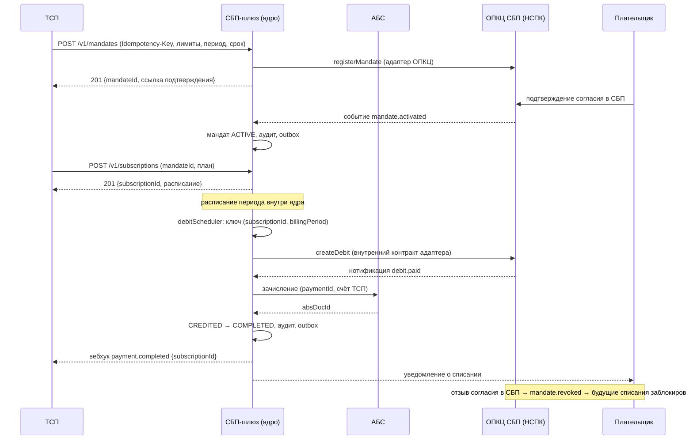

# Design

## Context

Изменение строится **поверх принятого решения** «Платёжный шлюз СБП (C2B-приём)»: инварианты `ARCHITECTURE-SPINE.md` AD-001…AD-008, решения `docs/adr/ADR-001…007` (ADR-007 Accepted/A3, AD-008 [ADOPTED]), дизайн `docs/solutioning.md`, NFR `docs/nfr.md`, контракты `docs/contracts/`, `openapi/tsp-api.yaml`. Мотивация — `proposal.md`; формат изменения относительно живой истины — `changes/sbp-subscriptions/DELTA.md`.

### Значимость и маршрут

`significant_score` (Spine MCP) по 15 триггерам: **8 сработало → маршрут Critical** (`security_boundary_change`, `financial_impact`, `criticality_or_exception`, `api_contract_change`, `data_contract_change`, `consistency_model_change`, `cross_domain_integration`, `significant_nfr`).

| Сработал | Почему |
|---|---|
| `security_boundary_change` | Меняется модель авторизации: деньги списываются без участия плательщика в момент операции, по ранее сохранённому согласию. Согласие — фактически платёжный мандат; появляется новая граница доверия вокруг его хранения, использования и отзыва. Триггер признан **спорным** (см. Open Questions). |
| `financial_impact` | Автоматическое списание средств со счёта плательщика. |
| `criticality_or_exception` | Платёжный контур, объект КИИ. |
| `api_contract_change` | Расширение контракта API ТСП и внутреннего контракта адаптера. |
| `data_contract_change` | Новые сущности: мандат, подписка, списание; персональные данные плательщика. |
| `consistency_model_change` | Новая сага «списание → зачисление», сверка согласий с СБП, отдельный источник истины по согласию. |
| `cross_domain_integration` | Новый тип взаимодействия с ОПКЦ (подписки) и участие банка плательщика. |
| `significant_nfr` | Новые бюджеты: пунктуальность расписания, обработка отзыва, уведомления, окна пиковых списаний. |

Не сработали: `new_component` (внутри существующего шлюза), `new_datastore` (та же БД, новые таблицы), `new_vendor` (вендор транспорта тот же), `domain_ownership_change`, `trust_zone_change` (новых зон нет), `rto_rpo_targets` (не меняются), `irreversible_migration` (аддитивно).

**Разрыв механики (находка для комитета).** Механический детектор по git-диффу (`significance_from_diff`) на этом изменении видит только `api_contract_change` (score 1 → Fast): он эвристичен по *путям* файлов, а архитектурные причины (смена модели авторизации, новые сущности, сага) в путях не видны. Классификация **Critical** получена по триггерам (`significance_score`, 8/15) и зафиксирована здесь и в `changes/sbp-subscriptions/DELTA.md`.

**Маршрут не закреплён в `ROUTE.lock` — сознательно.** На стадии решения у кейса нет типизированной модели `model/` и evidence-бандла; поэтому любой маршрут выше Fast переводит собственный гейт репозитория в `INCOMPLETE` (обязательные составляющие `trace_check`/`model_validate`/`nfr`/`evidence_verify` остаются без входа). Это ложная тревога, а не усиление контроля: гейт краснел бы на отсутствии артефактов, которых на этой стадии быть не должно. Выбор — (а) достроить типизированную модель и evidence-бандл и закрепить Critical, или (б) оставить механически Fast при явно записанной ручной классификации Critical — остаётся за человеком-архитектором (Open Questions). Маршрут Critical требует полного Solutioning, человеческой точки A3 и evidence-гейтов; этот пакет им соответствует, кроме ещё не собранного бандла.

### Влияние на принятые инварианты

| Инвариант | Статус | Что меняется |
|---|---|---|
| AD-001 Изоляция платёжного контура | **не меняется** | Операции мандата/списания идут теми же адаптерами; новых прямых путей к АБС/ОПКЦ нет. |
| AD-002 Статусная машина + атомарный outbox | **расширяется** | Добавляется машина подписки и триггер списания; правило атомарности перехода (статус + outbox + аудит) неизменно. |
| AD-003 Идемпотентность финансовых операций | **расширяется** | Новые ключи: `Idempotency-Key` (мандат, подписка), `(subscriptionId, billingPeriod)` (списание), `mandateId`+`revocationTimestamp` (отзыв). Правило неизменно. |
| AD-004 Единственный адаптер ОПКЦ | **не меняется** | Новые протокольные операции остаются внутри адаптера; расширяется только внутренний контракт. |
| AD-005 Зачисление только из `PAID` | **не меняется, усиливается** | Списание — это платёж и зачисляется только из подтверждённого `PAID`. Рекуррентность не создаёт обходного пути. Это якорь изменения. |
| AD-006 Trust-зоны и сегментация | **не меняется по правилу** | Новых зон нет; расширяется классификация данных (согласие + ПДн плательщика в существующем контуре, минимизация). |
| AD-007 Соответствие НПС/КИИ/ПДн | **расширяется** | События согласия и списания — финансовые и регуляторные (уведомление плательщика); каждое списание обязано быть аудируемо как санкционированное мандатом. |
| AD-008 Гибрид, ядро контрактно-независимо | **не меняется** | Новые операции протокола НСПК — ответственность вендорского адаптера; ядро зависит только от внутреннего контракта. **Риск:** вендор обязан поддержать операции подписок (ограничение ADR-007). |
| AD-009/010/011 (новые, Proposed) | **добавляются** | Мандат как источник права; ровно одно списание за период; отзыв и уведомления — обязательный контур. |

## Goals / Non-Goals

**Goals:**

- Дать ТСП регулярный приём C2B без действия клиента в каждой операции — в пределах согласия плательщика.
- Сохранить все финансовые инварианты базового решения (зачисление только из `PAID`, атомарность, идемпотентность, RPO=0).
- Расширить контракт API ТСП **аддитивно**, не сломав существующих потребителей.
- Дать плательщику работающий контур отзыва и уведомлений.

**Non-Goals:**

- C2C, выплаты B2C/B2B, диспуты/претензии — вне scope (roadmap родительского initiative).
- Полная реализация протокола НСПК для подписок — внешний вход `[ТРЕБУЕТ ПРОВЕРКИ]`; в этом change — контрактный уровень и границы.
- Смена топологии, trust-зон, стратегии реализации (ADR-007) — не пересматриваются.
- Частичные списания, multi-currency, изменение суммы внутри действующей подписки (см. Open Questions).

## Decisions

Полные таблицы альтернатив и последствий — в ADR (не дублируются здесь).

- **D1. Подписки — расширение существующего шлюза, а не новый сервис.** Мандат, подписка и списание разделяют статусную машину, outbox и сверку с платежом. → `ADR-008`.
- **D2. Мандат — источник истины права на списание; состояние мандата хранится в БД шлюза и сверяется с СБП.** Сверка согласий включена в существующий контур сверки. → `ADR-008`.
- **D3. Расписание и списание живут в ядре; ключ идемпотентности списания — `(subscriptionId, billingPeriod)`.** Ретраи транзиентных сбоев — только в одном слое (внутренний контракт адаптера), с задержкой и джиттером. → `ADR-009`.
- **D4. Отзыв мандата — жёсткий guard: списание с плановым временем позже времени отзыва невозможно (в т.ч. при ретрае и сверке).** Списание, подтверждённое ОПКЦ до фиксации отзыва, доводится и отражается в сверке как проведённое до отзыва; дорешать неопределённость отзывом — запрещено. → `ADR-009`.
- **D5. Списание использует существующую машину платежа без новых статусов наружу.** Отказ списания = `FAILED` + `errorCode`; технические подсостояния наружу не выставляются. Так сохраняется совместимость `Payment.status` и снимается соблазн «своего» статуса для подписок.
- **D6. Совместимость контракта — только аддитивная.** Новые пути и опциональные поля; новые типы вебхуков; `Payment.status` не расширяется. Потребители обязаны игнорировать неизвестные типы событий и неизвестные опциональные поля. Ломающее изменение — только `/v2` (по правилам `docs/contracts/tsp-api.md` §6).
- **D7. Уведомления плательщика — часть контура, а не «сбоку».** Их отсутствие/задержка — инцидент (метрика и алерт), потому что это регуляторное обязательство, а не продуктовая фича.

### Поток (счастливый путь)

## Risks / Trade-offs

- **Вендорский адаптер может не поддержать операции подписок** (ограничение ADR-007, RFP уже идёт) → гейт: без подтверждённой поддержки операции в RFP транспорт не закрывает AD-008; эскалация на A3. Это главный внешний риск изменения.
- **Гонка «отзыв ↔ списание в полёте»** → детерминированное правило (D4): побеждает время фиксации отзыва; пограничный случай уходит в сверку и аудит, а не в «дорешивание».
- **Двойное списание за период** (ретрай/повтор тика) → ключ `(subscriptionId, billingPeriod)` + property-тест на фейке («два тика → один эффект»), инвариант AD-010.
- **Перегрузка в окнах биллинга** (1-е число, начало месяца) → списания идут через существующую очередь с приоритетами и bulkhead; пунктуальность бюджетируется (NFR), допускается разнесение окна.
- **Ретраи при недостатке средств превращаются в шторм** → ограниченное число попыток, экспонента+джиттер, соблюдение регламента СБП; идемпотентность периода сохраняется.
- **Расхождение согласий с СБП** (у нас `ACTIVE`, в СБП отозван) → мандат включён в ежечасную сверку; «у СБП отозван, у нас нет» — стоп-сигнал, блокировка списаний до разрешения.
- **ПДн плательщика** (новые данные) → минимизация, шифрование в покое, маскирование в логах, аудит доступа (AD-006/AD-007); без этого рекуррентность не выпускается.
- **Рекуррентность как «новый продукт»** → риск, что бизнес ждёт от подписок гибкости (изменение суммы, пауза, частичные списания), не покрытой первой волной; явно вынесено в Non-Goals/Open Questions.

## Migration Plan

Статус — *предложение*: решение (ADR-008/009, AD-009…011) ратифицируется человеком на A3 до начала реализации. Порядок работ — `tasks.md`; ключевое: walking skeleton (мандат → подписка → списание на моках) до массовой генерации, как в принятом решении (ADR-007). План отката и сигналы — `changes/sbp-subscriptions/DELTA.md`.

## Open Questions

Вопросы, которые **нельзя** решить в этом change без человека/внешнего входа; они не меняют выбранный подход, но меняют ратификацию (см. также `proposal.md`):

1. **Ратификация** ADR-008/009 и блоков AD-009…AD-011 (A3): какие пределы согласия и политику ретраев считаем приемлемыми для банка.
2. **Корректен ли триггер `security_boundary_change`** — от него зависит глубина контроля, но не сам дизайн.
3. **Маршрут изменения:** оставляем механически Fast при записанной ручной классификации Critical или достраиваем типизированную модель `model/` + evidence-бандл и закрепляем Critical в `ROUTE.lock` (см. «Разрыв механики»).
4. **Регуляторика и право:** объём и сроки уведомлений плательщика, правовое основание обработки согласия (152-ФЗ), применимое Положение ЦБ — внешний вход от ИБ/комплаенса.
5. **Протокол НСПК по подпискам** (операции, поля, тайминги, правила ретраев, SLA отзыва) — `[ТРЕБУЕТ ПРОВЕРКИ]`, закрывается документацией Портала поддержки НСПК.
6. **Поддержка подписок вендорским адаптером** — ограничение контракта с вендором (ADR-007) и предмет RFP.
7. **Границы продукта первой волны:** изменение суммы/периода действующей подписки, частичные списания, диспуты — расширять сейчас или следующим change?
