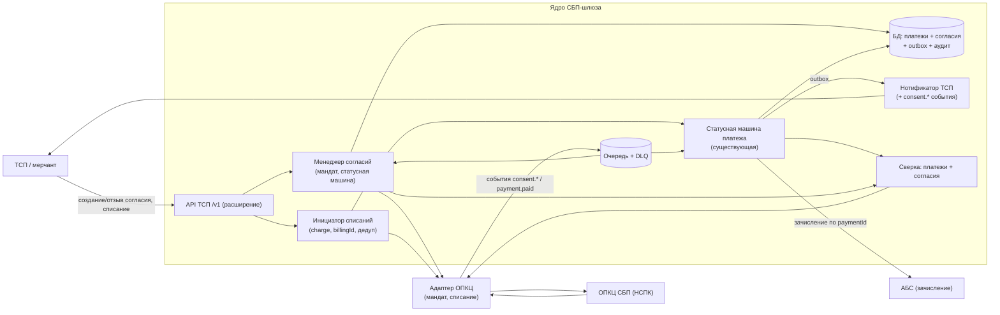
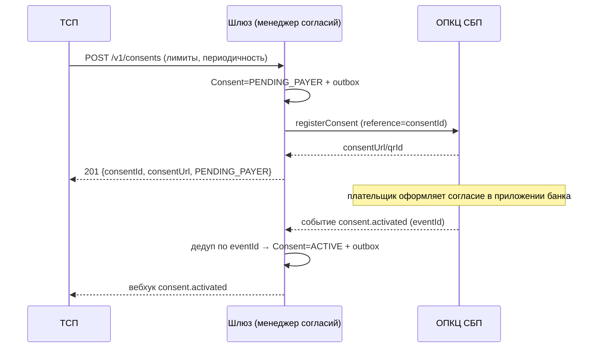
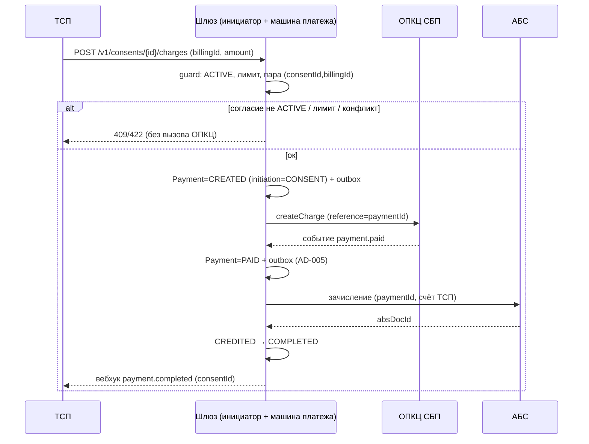
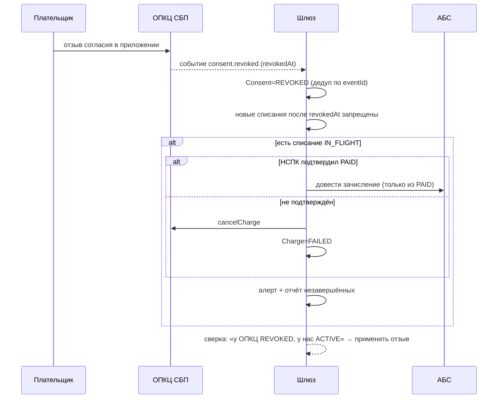

# Архитектурное решение изменения: рекуррентные C2B-списания (подписки СБП)

- Status: Proposed (для вынесения на архитектурное решение; A3 — по ADR-011)
- Owner: solution-architect (платёжный контур)
- Тип: изменение поверх принятого решения «Платёжный шлюз СБП (C2B-приём)»
- Связано: `DELTA.md`, `RISK.md`, `ACCEPTANCE.md`, `ROLLBACK.md`, `REVIEW.md`, ADR-008..011, `ARCHITECTURE-SPINE.md` (AD-009)

## 1. Что меняется и что нет

| Инвариант | Статус | Комментарий |
|---|---|---|
| AD-001 Изоляция платёжного контура | **без изменений** | Согласие и списания живут в ядре шлюза; АБС/ОПКЦ — только через адаптеры |
| AD-002 Единый источник истины | **расширен** | Согласие — второй агрегат с той же дисциплиной «переход = атомарно статус + outbox + аудит»; источник истины платежа не меняется |
| AD-003 Идемпотентность | **расширен** | Новые ключи: `Idempotency-Key` для согласия/отзыва, пара `(consentId, billingId)` для списания, дедуп `consent.*` по `eventId` |
| AD-004 Единственный адаптер ОПКЦ | **без изменений** | Протокол НСПК остаётся внутри адаптера; расширяется только внутренний контракт адаптера (новые операции) |
| AD-005 Зачисление только из `PAID` | **без изменений (ключевая линия)** | Рекуррентное списание зачисляется только из `PAID`; отказ по согласию/лимиту — до вызова ОПКЦ |
| AD-006 Trust-зоны и сегментация | **без изменений** | Данные плательщика остаются в платёжном контуре; классификация ПДн расширяется |
| AD-007 НПС / КИИ / ПДн | **расширен** | Согласие — юридическое основание; доказательство согласия и `revokedAt` — в неизменяемом аудите |
| AD-008 Стратегия реализации (ADOPTED) | **без изменений** | Рекуррентные операции — в вендорском адаптере ОПКЦ; ядро транспортно-независимо |
| AD-009 Рекуррентное списание по согласию | **новый** | Единственное основание списания, лимиты, дедуп, запрет после отзыва |

## 2. Компоненты изменения

Новые элементы (внутри существующего ядра — без нового деплоймента, ADR-010):
1. **Менеджер согласий** — агрегат `Consent`, его статусная машина (`docs/spec/consent-state-machine.md`), лимиты, аудит, доказательство согласия.
2. **Инициатор списаний** — приём charge-запроса, проверка `ACTIVE` и лимитов, ключ `(consentId, billingId)`, создание платежа в существующей статусной машине, очередь и выравнивание окна биллинга.
3. **Расширение контракта адаптера ОПКЦ** — операции мандата и списания (см. §5).
4. **Расширение сверки** — сверка согласий с ОПКЦ и поиск дублей списаний по `(consentId, billingId)`.

## 3. Модель данных (логическая)

| Сущность | Ключ | Ключевые поля |
|---|---|---|
| `Consent` | `consentId` | `tspId`, `status`, `amountType`, `maxAmountPerCharge`, `periodicity`, `validUntil`, `maxTotalAmount`, `opkcMandateRef`, `activatedAt`, `revokedAt`, доказательство согласия (канал, время, банк плательщика) |
| `Charge` | `(consentId, billingId)` | `chargeId`, `paymentId`, `amount`, `status`, `requestedAt`, `revokedRace` (`IN_FLIGHT`/`none`) |
| `Payment` | `paymentId` | расширен: `consentId?`, `initiation` (`QR`/`CONSENT`) |
| Аудит/outbox | — | без изменения схемы; новые типы событий (`consent.*`, `charge.*`) |

## 4. Потоки

### 4.1 Создание и активация согласия

### 4.2 Рекуррентное списание

### 4.3 Отзыв согласия

## 5. Расширение внутреннего контракта адаптера ОПКЦ

Добавляются операции (транспортные детали НСПК — внутри адаптера, AD-004): `registerConsent`, `getConsentStatus`, `revokeConsent`, `createCharge`, `getChargeStatus`; события `consent.activated`, `consent.revoked`, `consent.rejected`, `payment.paid` (для списания). Ядро по-прежнему не знает протокола НСПК. `reference` идемпотентности — `consentId`/`paymentId` (ADR-009).

## 6. Альтернативы (полностью — в ADR)

| Решение | ADR | Рассмотренные альтернативы (кратко) |
|---|---|---|
| Согласие — отдельный агрегат в ядре | ADR-008 | шаблон на стороне ТСП; мандат только в ОПКЦ; мандат на стороне ТСП |
| Дедуп списания по `(consentId, billingId)` | ADR-009 | только `Idempotency-Key`; дедуп по времени+сумме; только ОПКЦ |
| Аддитивное расширение `/v1` | ADR-010 | `/v2`; отдельный микросервис; ломающее изменение `/v1` |
| Правило «отзыв ↔ списание в полёте» | ADR-011 | отзыв всегда побеждает; отзыв со следующего периода; блокировка отзыва |

## 7. Открытые решения (человек-архитектор)

Полный перечень — `REVIEW.md` §«Что остаётся человеку». Ключевое: A3 по ADR-011 (юридическая семантика отзыва), утверждение лимитов/периодичности по протоколу НСПК, знаменатель метрики успеха подписки с бизнесом.
