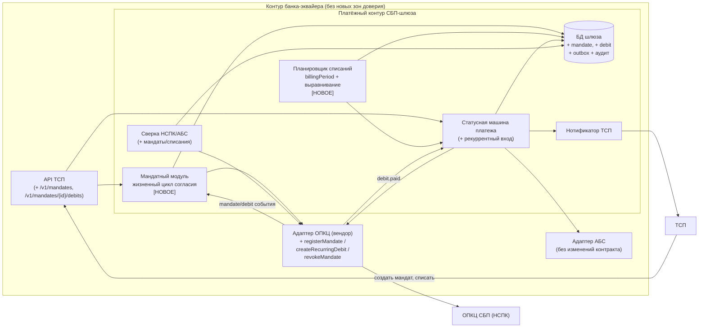
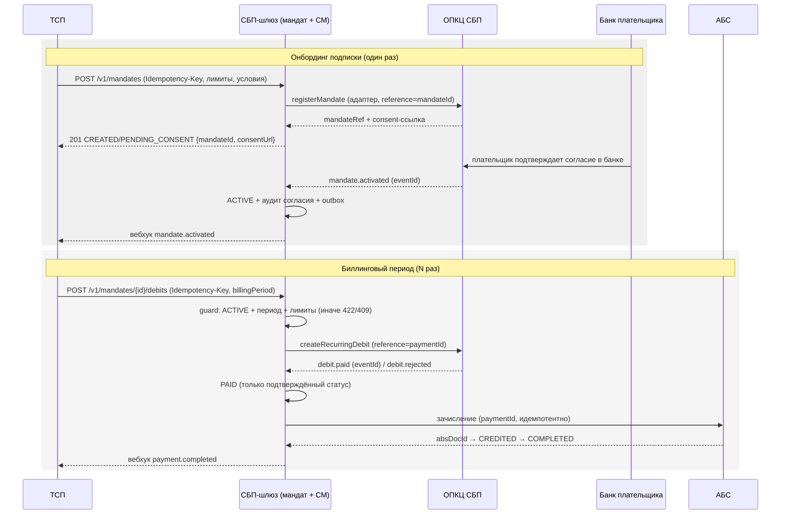

# Solutioning (дельта) — Рекуррентные C2B-списания СБП (подписки ТСП)

- Date: 2026-09-28
- Status: Proposed (для гейта A3; изменение поверх принятого решения `docs/solutioning.md`)
- Owner: solution-architect (платёжный контур)
- Route: **Critical** (значимость 9/15, `significance_score`)
- Связано: ADR-008…ADR-012, `docs/spec/mandate-state-machine.md`, `changes/sbp-subscriptions/DELTA.md`
- Родительское решение: `docs/solutioning.md`, `ARCHITECTURE-SPINE.md`, ADR-001…ADR-007 (не отменяются)

## 1. Контекст и границы изменения

Бизнес-драйвер: ТСП (онлайн-кинотеатры, ЖКХ, связь) просят **рекуррентные C2B-списания по согласию плательщика** (подписки СБП). Сегодня каждый платёж требует нового QR и действия клиента; при массовых подписках это неприменимо.

Изменение **не перепроектирует** принятое решение «Платёжный шлюз СБП (C2B-приём)» и **не отменяет** ни один AD-001…AD-008. Оно добавляет в тот же платёжный контур **новую доменную сущность — согласие плательщика (мандат)** и **новый вид платежа — рекуррентное списание**, переиспользуя существующую статусную машину, outbox, идемпотентность, сверку и АБС-интеграцию.

Границы:

- **В scope**: мандат (создание, активация плательщиком, изменение/приостановка, отзыв), рекуррентные списания по активному мандату, возвраты по ним (существующая сага), API ТСП, вебхуки, сверка, эксплуатация/откат.
- **Вне scope**: C2C, выплаты B2C/B2B, диспуты/претензии — по-прежнему Deferred (родительский spine).
- **Внешний вход `[ТРЕБУЕТ ПРОВЕРКИ]`**: точный протокол подписок/автоплатежей в ОПКЦ СБП (поля мандата, лимиты, обязанность уведомления плательщика, тайминги, поведение при отзыве во время списания) — из документации НСПК по договору. Публично полный контракт не раскрыт; все протокольные детали изолированы в адаптере ОПКЦ (AD-004, ADR-003, ADR-007).

### Чем этот случай отличается от «просто ещё одного платежа»

1. **Появляется долгоживущее согласие** (мандат) с юридическими последствиями: списание без действующего согласия — инцидент, а не баг. Мандат живёт дольше платежа и имеет собственный жизненный цикл.
2. **Плательщик действует асинхронно и вне сессии ТСП**: активация и отзыв происходят в приложении банка плательщика; шлюз узнаёт об этом событием. Появляются гонки «отзыв ↔ списание».
3. **Появляется массовая нагрузка** с предсказуемыми пиками (1-е число, зарплатные дни): тысячи списаний в узком окне. Это новый профиль нагрузки, которого у C2B-приёма не было.
4. **Дублирующее списание за один период** — финансово опаснее дубля QR: клиент видит списание, которого не ждал.

## 2. Компоненты (дельта к C4)

Новые/изменённые элементы внутри существующего платёжного контура (показаны как дельта к диаграмме `docs/solutioning.md` §2):

Ключевое: **новых trust-зон и новых внешних интеграций не появляется** (AD-006 не меняется) — ОПКЦ по-прежнему единственный адаптер (AD-004), АБС по-прежнему вызывается только по подтверждённому статусу (AD-005), зачисление — через существующий адаптер АБС.

## 3. Модель данных и жизненные циклы

### 3.1 Мандат (согласие плательщика)

Отдельная сущность `Mandate` в БД шлюза (единый источник истины, AD-002 распространяется на неё):

- `mandateId` (шлюз), `mandateRef` (ОПКЦ), `tspId`, `merchantSubscriptionId` (ТСП);
- плательщик: маскированный идентификатор (телефон/токен), **без хранения лишних ПДн** (AD-007);
- условия согласия: `maxAmountPerDebit`, `limit` (`amount` + `period`: `DAY`|`MONTH`|`TOTAL`), `frequency`, `validFrom`/`validUntil`, `purpose`;
- условия **иммутабельны после активации**: изменение = новый мандат с новым согласием плательщика;
- фиксируется ссылка на аудит-запись согласия (юридическое основание, 152-ФЗ).

Статусы мандата — `docs/spec/mandate-state-machine.md`:
`CREATED → PENDING_CONSENT → ACTIVE → SUSPENDED → REVOKED | EXPIRED`, терминальные `REJECTED`, `REVOKED`, `EXPIRED`.

### 3.2 Рекуррентное списание

Списание — **вид платежа** (`paymentType=recurring`), а не отдельный финансовый объект:

- те же состояния `PAID → CREDITED → COMPLETED` и те же инварианты зачисления (AD-002, AD-005, ADR-002, ADR-005);
- отличие входа: вместо `QR_ISSUED` (оплата клиентом) платёж привязан к мандату — техническое подсостояние `MANDATE_BOUND`/`DEBIT_SUBMITTED`, наружу не выставляется (контракт `Payment.status` не расширяется);
- уникальность периода: **резервация** периода при инициации — уникальный ключ БД на (`mandateId`, `billingPeriod`) для всех списаний, кроме отменённых до отправки (не «по успешным»); guard, резервация и расход счётчика лимита — в одной транзакции (ADR-009);
- ключ идемпотентности инициации: `Idempotency-Key` ТСП + (`mandateId`, `billingPeriod`);
- возвраты — существующая сага (ADR-005); транспортный возврат адресуется ссылкой списания (`debitRef`/`reference`), а не `qrId` (`docs/spec/mandate-state-machine.md` §4.1).

### 3.3 Ключевой поток

## 4. Затронутые инварианты и почему

| Инвариант | Влияние | Характер |
|---|---|---|
| AD-001 (изоляция платёжного контура) | Мандат и списания живут в том же шлюзе; новых обходов адаптеров нет | **без изменений** |
| AD-002 (единый источник истины, атомарные переходы) | Переходы мандата и списания — такие же атомарные транзакции «статус + outbox + аудит» | **расширение** (MODIFIED) |
| AD-003 (идемпотентность) | Новые ключи: (`mandateId`, `billingPeriod`), `mandateId`/`debitId` в адаптере; повтор отзыва идемпотентен | **расширение** (MODIFIED) |
| AD-004 (единственный адаптер ОПКЦ) | Адаптер расширяется мандатными операциями; по-прежнему единственная точка знания протокола НСПК | **расширение контракта** |
| AD-005 (зачисление только из PAID) | Сохраняется для списаний без исключений; добавлен guard «списание только по ACTIVE-мандату» | **усиление** (MODIFIED) |
| AD-006 (trust-зоны) | Новых зон и внешних интеграций нет | **без изменений** |
| AD-007 (НПС/КИИ/ПДн) | Согласие плательщика — ПДн и юридическое основание; аудит согласия обязателен | **распространение** (без новых правил) |
| AD-008 (гибрид, ядро независимо от транспорта) | Мандатная логика — в ядре; транспорт подписок — в адаптере вендора; контракт остаётся заменяемым | **подтверждение** |

Новые инварианты (spine, `[Proposed]` до A3):

- **AD-009. Рекуррентное списание — только по действующему согласию плательщика.**
- **AD-010. Аддитивная эволюция контракта API ТСП** (существующие пути/поля/enum не ломаются).
- **AD-011. Пиковые нагрузки биллинга выравниваются очередью, а не «всё сразу».**

## 5. Разбиение на решения (ADR)

| Решение | ADR | Spine | Совместимость с ADR-001…007 |
|---|---|---|---|
| Мандат как доменная сущность; списание как вид платежа | ADR-008 | AD-009 | Расширяет ADR-002/ADR-005, не отменяет |
| Консистентность и идемпотентность рекуррентных операций, отзыв согласия | ADR-009 | AD-003, AD-005, AD-009 | Развивает ADR-002/ADR-004/ADR-005 |
| Эволюция контракта ТСП (аддитивные минорные версии) | ADR-010 | AD-010 | Развивает ADR-002 и контракт v0.1 |
| Пиковая нагрузка биллинга (выравнивание + защита от перегрузки) | ADR-011 | AD-011 | Не противоречит ADR-001/ADR-004 |
| Внедрение, обратимость и откат | ADR-012 | AD-008 | Согласовано с ADR-007 (гибрид, A3) |

## 6. NFR

Измеримые цели нового функционала — `docs/nfr.md` §7 (новый раздел). Ключевое: **распространение отзыва ≤ 60 с (p95)**; защита от дублей за период — **0 дублей, 0 списаний без ACTIVE-мандата**; инициация списания p95 ≤ 300 мс; пик биллинга 1500 TPS burst ≥ 10 мин; доступность потоков ≥ 99,95 %; RPO=0 распространяется на мандаты и списания.

## 7. Гейты и критерии приёмки (дельта к A0–A5)

- **A2 дельта**: мандатная модель, план отката, пиковый профиль определены.
- **A3 (человеческое решение)**: выбор модели согласия и коммерческих условий подписки, политика dunning, версия контракта, политика пост-отзывного списания — **до реализации**. Машинно-читаемый пакет решения — `changes/sbp-subscriptions/PROPOSAL.md` §8.
- **A4 (conformance)**: fitness-правила `changes/sbp-subscriptions/DELTA.md` §Fitness; тесты «0 дублей за период», «0 списаний без ACTIVE-мандата», «отзыв блокирует новые списания», возврат; нагрузочный тест биллингового пика; ИБ-ревью ПДн мандата.
- **A5**: сверка мандатов/списаний в проде, SLO-отчёт через 30 дней, проверка дрейфа от новых инвариантов.

## 8. План отката (кратко; детали — `changes/sbp-subscriptions/PROPOSAL.md` §7)

- Фиче-флаг `recurring-debits` выключен по умолчанию; C2B-приём QR **не зависит** от него.
- **Kill-switch**: остановка инициации **новых** списаний без остановки уже открытых операций; отзыв мандатов и приём вебхуков продолжают работать.
- Откат релиза — rolling; данные мандатов/списаний сохраняются и остаются в сверке (не откатываются назад, аналогично родительскому решению §8).

## 9. Gaps и открытые вопросы

| Gap / открытый вопрос | Что закроет | Владелец |
|---|---|---|
| Точный протокол подписок/автоплатежей НСПК (поля мандата, лимиты, тайминги, поведение при отзыве) `[ТРЕБУЕТ ПРОВЕРКИ]` | Документация НСПК по договору | Проектный офис / НСПК |
| Обязанность уведомления плательщика перед списанием (и кто её исполняет) `[ТРЕБУЕТ ПРОВЕРКИ]` | Правила ОПКЦ СБП, ИБ/юристы | Комплаенс |
| Правовая модель согласия (161-ФЗ / Положение ЦБ, сроки и форма отзыва) `[ТРЕБУЕТ ПРОВЕРКИ]` | Юристы + ИБ | Юридическая служба |
| Поддерживает ли вендор мандатные операции и идемпотентность по `reference` | RFP §4а (дельта к `docs/rfp/vendor-rfp.md`) | Проектный офис / закупки |
| Политика dunning (число попыток, порог приостановки) | Бизнес + комплаенс (A3) | Продукт |
| Пиковый профиль биллинга (число ТСП/списаний в окне) | Бизнес-кейс (A3) | Продукт |
| Политика по списанию, «осевшему» после отзыва | Юристы + НСПК (A3) | Юридическая служба |
