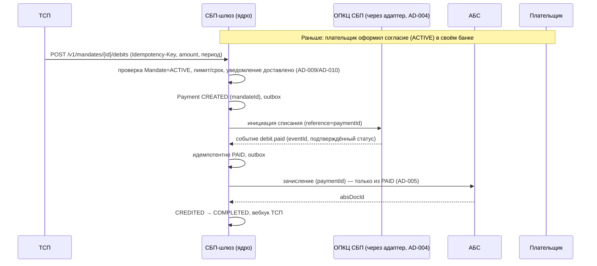

# CHANGE-001 — СБП-подписки (рекуррентные C2B-списания по согласию плательщика)

- Status: Proposed — выносится на архитектурное решение, затем на передачу исполнителям
- Owner: solution-architect (платёжный контур) + владелец продукта
- База: принятое решение «Платёжный шлюз СБП (C2B-приём)» — `ARCHITECTURE-SPINE.md`, `docs/solutioning.md`, ADR-001..007
- Решение изменения: `docs/adr/ADR-008-sbp-podpiski-rekurrentnye-spisaniya-po-soglasiyu-platelshchika.md` (Proposed)
- Связанные артефакты: `contracts-delta.md`, `acceptance-and-rollback.md`, `handoff/`, `docs/spec/mandate-debit-lifecycle.md`, `docs/nfr.md` §7

## 0. Что меняется (кратко)

Добавляется механизм, при котором **плательщик однократно оформляет согласие** (mandate) на списания в пользу ТСП, а **ТСП инициирует списания без QR и без действия клиента** — в пределах согласия. Механика строится **поверх** принятого решения: списание — это существующий платёж (ADR-002) с атрибутом `mandateId`, зачисление — по-прежнему только из подтверждённого `PAID` (AD-005), транспорт — через единственный адаптер ОПКЦ (AD-004).

## 1. Оценка значимости изменения и маршрута

Шкала та же, что применялась к базовому решению: 5 измерений × до 3 баллов = **15 баллов**; порог Critical — 11.

| # | Измерение | Балл | Обоснование |
|---|---|---|---|
| 1 | Бизнес-влияние и клиентский путь | 3 | Новый регулярный продукт и источник выручки; меняется клиентский путь плательщика (согласие/уведомления/отзыв) и модель работы ТСП; затрагивает тарифы и договоры с ТСП |
| 2 | Регуляторный/комплаенс-риск | 3 | Новый сервис НСПК, обязательные нотификации плательщику, право отзыва, согласие под 152-ФЗ; списание без действующего согласия — регуляторный инцидент (AD-007) |
| 3 | Архитектурная новизна/сложность | 3 | Новый агрегат (Mandate) со своей статусной машиной, durable-планировщик списаний, вариант платёжного цикла без QR, саговые компенсации при отзыве «в полёте» |
| 4 | Внешние интеграции и зависимости | 2 | Новые внешние системы не появляются (тот же ОПКЦ и АБС), но требуются новые операции/события в протоколе НСПК и в вендорском адаптере (ADR-007) |
| 5 | Данные, ИБ, ПДн | 2 | Согласие как юридически значимое состояние + данные плательщика; аудит отзыва; новых trust-зон не создаётся (ADR-006) |
| | **Итого** | **13/15** | |

**Маршрут: Critical.** Изменение затрагивает единый источник истины, финансовую модель зачисления и внешний транспортный контракт. Глубокое проектирование обязательно:

- невозможно переиспользовать разовый путь «QR → оплата» без явной модели согласия и проверок лимита/срока/отзыва;
- корректность зависит от внешнего регламента НСПК (внешний вход), который влияет на состояния, нотификации и тайминги;
- финансовое последствие ошибки (списание без согласия/двойное списание) недопустимо — нужны формальная спецификация переходов, fitness-тесты и сверка.

До реализации обязателен **человеческий гейт** (аналог A3 для базового решения): ратификация ADR-008 и новых инвариантов spine, а также получение регламента НСПК по подпискам.

## 2. Влияние на принятую архитектуру

### 2.1 Инварианты spine

| Инвариант | Влияние | Комментарий |
|---|---|---|
| AD-001 Изоляция платёжного контура | **Расширяется** | Агрегат Mandate и оркестратор списаний размещаются в том же платёжном контуре; новых прямых выходов к АБС/ОПКЦ мимо адаптеров не появляется |
| AD-002 Единый источник истины (статусная машина) | **Расширяется** | Mandate получает собственную статусную машину с тем же правилом «статус + outbox + аудит в одной транзакции»; списание переиспользует платёжную машину |
| AD-003 Идемпотентность | **Расширяется** | Новые ключи: согласие (`Idempotency-Key`), списание (`Idempotency-Key` + `mandateId`+период), нотификации ОПКЦ по списанию (`eventId`) |
| AD-004 Единственный адаптер ОПКЦ | **Расширяется** | Контракт адаптера дополняется операциями/событиями подписок; других точек знания протокола НСПК не возникает |
| AD-005 Зачисление только из подтверждённого статуса | **Без изменений — подтверждается** | Ключевое ограничение сохраняется в полном объёме: списание по подписке зачисляется только из `PAID`; предварительная авторизация согласия не является основанием для зачисления |
| AD-006 Trust-зоны и сегментация | **Без изменений** | Новых зон/каналов нет; применяются те же правила |
| AD-007 Соответствие НПС, КИИ, ПДн | **Расширяется** | Добавляются обязательные нотификации, право отзыва, правовое основание обработки данных плательщика |
| AD-008 Стратегия реализации (гибрид, ADOPTED) | **Не меняется по правилу, создаёт новый внешний вход** | Вендорский транспортный адаптер обязан реализовать операции подписок — требуется доработка/аддендум контракта; правило «реализация транспорта только после договора и документации НСПК» сохраняется |
| **AD-009 (новый, Proposed)** | **Добавляется** | Списание — только при действующем согласии (`ACTIVE`), в пределах лимита; отзыв немедленно блокирует новые списания |
| **AD-010 (новый, Proposed)** | **Добавляется** | Обязательные нотификации плательщику до списания и обратимость согласия; аудит |

Полные формулировки новых блоков — в `ARCHITECTURE-SPINE.md` (AD-009, AD-010).

### 2.2 Что меняется

1. **Модель данных**: новый агрегат Mandate (+ история переходов и аудит). Платёж получает атрибуты `mandateId` и источник инициации.
2. **Статусная машина**: новый цикл Mandate; у платежа появляется ветка списания (без `QR_ISSUED`) — см. `docs/spec/mandate-debit-lifecycle.md`.
3. **Оркестрация**: durable-планировщик списаний и обработка «по требованию»; проверки лимита/срока/отзыва перед каждым списанием.
4. **Нотификации**: новый контур обязательных уведомлений плательщику (отличается от вебхуков ТСП из ADR-004).
5. **Контракты**: аддитивные изменения API ТСП (`openapi/tsp-api.yaml`, `docs/contracts/tsp-api.md`) и контракта адаптера ОПКЦ (`docs/contracts/opkc-adapter.md`).
6. **NFR**: новые измеримые цели (`docs/nfr.md` §7).

### 2.3 Что НЕ меняется

- Путь разового C2B-платежа (QR/ссылка) и его контракт — без ломающих изменений.
- Архитектурный стиль: outbox, at-least-once нотификации, сверка, trust-зоны, СКЗИ/ГОСТ.
- Инвариант AD-005 «зачисление только из подтверждённого статуса» — не ослабляется.
- Стратегия реализации AD-008 (гибрид) — сохраняется; меняется только объём транспортного контракта.

### 2.4 Поток списания (дельта)

## 3. Архитектурное решение

Альтернативы, последствия и обратимость — `docs/adr/ADR-008-...md` (раздел Alternatives/Consequences/Reversibility). Выбран вариант **A** (расширение ядра шлюза); отклонены: отдельный сервис подписок (B), аутсорс вендору (C), списание без локального агрегата согласия (D).

## 4. Контракты

Аддитивные изменения без поломки существующих потребителей — обоснование и матрица совместимости в `contracts-delta.md`. Файлы: `openapi/tsp-api.yaml` (v0.1.0 → v0.2.0), `docs/contracts/tsp-api.md`, `docs/contracts/opkc-adapter.md`.

## 5. NFR

Измеримые цели для подписок — `docs/nfr.md` §7 (латентности, массовые списания, нотификации, отзыв, дубликаты, сверка).

## 6. Критерии приёмки и план отката

`acceptance-and-rollback.md` — проверяемые критерии (включая негативные сценарии) и пошаговый откат с сигналами и владельцем решения.

## 7. Что остаётся на решение человека-архитектора

| # | Решение | Почему на человека | Владелец |
|---|---|---|---|
| H1 | Ратификация ADR-008 (Proposed → Accepted) и новых инвариантов AD-009/AD-010 | Изменяет финансовую модель и инварианты принятого решения; требует архитектурного гейта | Архитектор + владелец продукта |
| H2 | Регламент/протокол НСПК по подпискам (состояния, тайминги нотификаций, лимиты, отзыв) | Внешний вход, публично не раскрыт `[ТРЕБУЕТ ПРОВЕРКИ]`; без него часть дизайна не финализируется | Проектный офис / НСПК |
| H3 | Правовая модель согласия (правовое основание 152-ФЗ, где хранится согласие, кто оператор, сроки хранения, тексты уведомлений) | Юридически значимое состояние; не техническое решение | Юристы + ИБ/комплаенс |
| H4 | Доработка контракта с вендором транспорта (ADR-007): поддержка операций подписок, бюджет/сроки, аддендум | Внешняя коммерческая и контрактная зависимость принятого решения AD-008 | Проектный офис / закупки + архитектор |
| H5 | Рамки раскатки: сегменты ТСП первой волны, лимиты и пороги AML | Бизнес- и риск-решение | Продукт + риск/AML |
| H6 | Размещение агрегата Mandate (в БД ядра vs отдельный сервис) — рекомендация: в ядре | Финализация границ компонентов и владения данными | Архитектор |
| H7 | Политика при недоставке обязательного уведомления (блокировать списание / ретраить / эскалация) | Баланс клиентского опыта и регуляторного риска | Продукт + архитектор |

## 8. Готовность к передаче исполнителям

Пакет передачи исполнителям — `handoff/` (epic-context, ограничения, рубрика приёмки, контракт результата) в формате `.arch-handoff/`. Он активируется **после** ратификации ADR-008 (H1) и получения регламента НСПК (H2). До этого — стадия архитектурного решения.

## 9. Открытые вопросы и внешние входы

1. Точный протокол/регламент НСПК по подпискам `[ТРЕБУЕТ ПРОВЕРКИ]` (H2): поля, тайминги нотификаций, сроки отзыва, лимиты.
2. Поддерживает ли текущий/выбранный вендор транспорта операции подписок — влияет на сроки (H4).
3. Модель частичного отзыва/пауз согласия (приостановка списаний без расторжения) — нужен ли бизнесу.
4. Диспуты/претензии по списаниям — в spine помечены Deferred; для подписок риск выше, возможно, потребуется пересмотр.
5. Механика уведомлений плательщику: канал (банк плательщика/НСПК/банк эквайер) и ответственность — по регламенту НСПК.
