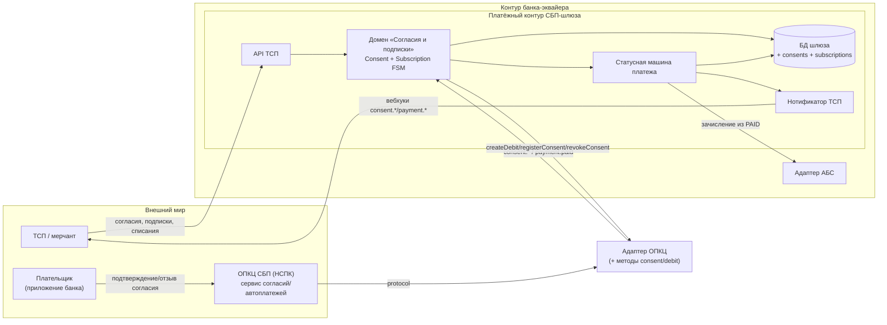

> СКОМПИЛИРОВАНО МАШИНОЙ из spine/ADR/NFR — требует авторской правки архитектора.
# SPEC — контракты интерфейсов компонента

> Собрано автоматически из спек, переданных архитектором (`--spec`),
> при генерации пакета. НЕ затирается при повторной генерации —
> правьте под фактические контракты эпика.


---

## Источник: ARCHITECTURE-SPINE.md

# ARCHITECTURE-SPINE — Платёжный шлюз СБП (C2B-приём)

Родительский spine: **initiative «Подключение банка к СБП (эквайринг C2B)»**. Данный spine — уровень feature. Локальное переопределение родительских ограничений запрещено; конфликт эскалируется наверх.

Статусы: блоки в статусе `Proposed` действуют после ратификации соответствующего ADR. Помеченные `[ADOPTED]` — ратифицированная реальность.

---

## AD-001. Изоляция платёжного контура

- Status: Proposed (ADR-001)
- **Binds**: СБП-шлюз, АБС-адаптер, адаптер ОПКЦ, очередь нотификаций.
- **Prevents**: встраивание финансовой логики СБП в произвольные сервисы банка; прямые обращения сервисов к АБС и ОПКЦ мимо шлюза; потерю зарегистрированных операций при сбое (RPO=0).
- **Rule**: Любое взаимодействие с АБС и ОПКЦ СБП — только через адаптеры СБП-шлюза (проверка: сетевые правила и код — единая точка вызова; fitness: отсутствие исходящих вызовов НСПК/АБС вне адаптеров).

## AD-002. Единый источник истины — статусная машина платежа

- Status: Proposed (ADR-002)
- **Binds**: БД шлюза (состояние платежа), outbox, аудит-лог.
- **Prevents**: расхождение «шлюз думает PAID, АБС не знает» без сверки; неатомарные обновления статуса.
- **Rule**: Изменение финансового статуса платежа и запись исходящего события (outbox) выполняются в одной локальной транзакции. Нарушение — дефект блокера (ревью + fitness-тест на каждый переход).

## AD-003. Идемпотентность финансовых операций

- Status: Proposed (ADR-002, ADR-004, ADR-005)
- **Binds**: вход ТСП (`Idempotency-Key`), нотификации НСПК (`eventId`), вызовы АБС (`paymentId`/`refundId`).
- **Prevents**: двойное зачисление, двойной возврат, дубли QR при ретрае клиента ТСП.
- **Rule**: Повторная доставка любого сообщения не изменяет уже завершённое состояние. Fitness: тест «повторная нотификация/повторный запрос → состояние не меняется, результат идемпотентен».

## AD-004. Единственный адаптер ОПКЦ СБП

- Status: Proposed (ADR-003)
- **Binds**: транспорт к НСПК (mTLS/ГОСТ, сертификаты УЦ НСПК, СКЗИ), контракт `docs/contracts/nspk-contract.md`.
- **Prevents**: расползание протокола НСПК по кодовой базе; несертифицированную криптографию; несоответствие тестовым испытаниям НСПК.
- **Rule**: Протокол НСПК знает только адаптер ОПКЦ; внутренний контракт шлюза — единственный интерфейс для остальных компонентов.

## AD-005. Зачисление только из подтверждённого статуса

- Status: Proposed (ADR-005)
- **Binds**: статусная машина (`PAID`), АБС-адаптер, сверка.
- **Prevents**: зачисление по факту создания QR/ссылки, «платежи из воздуха», двойные проводки при ретрае АБС.
- **Rule**: Вызов АБС на зачисление возможен только из состояния `PAID` (подтверждённый НСПК статус). Fitness: проверка недостижимости зачисления из `CREATED`/`QR_ISSUED`.

## AD-006. Trust-зоны и сегментация

- Status: Proposed (ADR-006)
- **Binds**: DMZ/адаптер ОПКЦ, платёжный контур шлюза, контур АБС, контур ТСП-API.
- **Prevents**: сквозной доступ из интернета/партнёрской сети во внутренний контур; компрометацию ключей СКЗИ.
- **Rule**: Сеть между зонами — только через межсетевые экраны по белому списку; ключевой материал — в сертифицированном СКЗИ/HSM; доступ операторов — привилегированный контур с 4-eyes для ручных операций.

## AD-007. Соответствие НПС, КИИ и ПДн

- Status: Proposed (ADR-006)
- **Binds**: криптография (только сертифицированные СКЗИ/ГОСТ), аудит-лог, интеграция с антифрод/AML.
- **Prevents**: использование несертифицированных средств; неустранимые нарушения 161-ФЗ, 152-ФЗ, 115-ФЗ, 187-ФЗ; неаудируемые финансовые переходы.
- **Rule**: Каждый финансовый переход и административное действие — в неизменяемом аудит-логе; все каналы к ОПКЦ — на сертифицированных СКЗИ. Проверка — ИБ-аудит и fitness.

## AD-008. Стратегия реализации — гибрид [ADOPTED]

- Status: Adopted (A3 от 2026-08-15, ADR-007 Accepted)
- **Binds**: ADR-007, ядро шлюза, вендорский транспортный адаптер ОПКЦ.
- **Prevents**: связывание ядра шлюза с конкретным транспортным адаптером; начало реализации транспорта до контракта с вендором и получения документации НСПК.
- **Rule**: Ядро шлюза проектируется контрактно-независимым от транспорта (внутренний контракт адаптера ОПКЦ — единственная зависимость). Вендор транспорта обязан предоставить сертификаты ФСТЭК/соответствие требованиям НСПК, тестовый контур, SLA. Реализация транспортного слоя начинается только после подписания контракта и получения документации НСПК.

---

## AD-009. Рекуррентное списание — только при активном согласии плательщика

- Status: Proposed (ADR-008, ADR-009; дельта `sbp-recurring-subscriptions`)
- **Binds**: домен «Согласия и подписки», статусная машина платежа, API ТСП, адаптер ОПКЦ, АБС-адаптер.
- **Prevents**: списание без правового основания (нет подтверждённого согласия); списание после отзыва согласия плательщиком; расхождение «ТСП считает согласие активным — шлюз уже отозвал».
- **Rule**: Рекуррентное списание возможно только при состоянии согласия `ACTIVE`; проверка состояния и создание платежа выполняются в одной транзакции; переход согласия в `REVOKED`/`EXPIRED`/`REJECTED` атомарно запрещает новые списания. Fitness: «после `REVOKED` любой запрос списания → отказ (`CONSENT_NOT_ACTIVE`), списаний 0».

## AD-010. Идемпотентность рекуррентного списания по `(consentId, billingKey)`

- Status: Proposed (ADR-008; дельта `sbp-recurring-subscriptions`)
- **Binds**: API ТСП (`POST /v1/subscriptions/{id}/debits`), домен «Согласия и подписки», статусная машина платежа, АБС-адаптер.
- **Prevents**: двойное списание/зачисление при ретрае ТСП, поздней нотификации НСПК или повторной доставке события; повторный период подписки.
- **Rule**: Для одной пары `(consentId, billingKey)` допускается не более одного платежа и одного финансового результата; повторный запрос возвращает ранее созданный `paymentId` без нового списания. Fitness: тест «повтор `(consentId, billingKey)` → тот же `paymentId`, зачисление одно».

---

## Deferred (с причиной и условием возврата)

- **Мультивалютность и иностранные платёжные системы**: не в scope C2B-приёма СБП; вернуть при расширении на валютные счета ТСП.
- **C2C-переводы и выплаты B2C/B2B**: roadmap после стабилизации C2B; вернуть как отдельный initiative (родительский spine изменится).
- **Диспуты/претензии (disputes)**: реализуются после базовых возвратов; вернуть по требованию бизнеса или регулятора.

## Контракты и версии

- Контракт НСПК: `docs/contracts/nspk-contract.md` — создаётся после получения документации НСПК; до этого все ссылки на протокол помечены `[ТРЕБУЕТ ПРОВЕРКИ]`.
- Внутренний контракт шлюза (API ТСП): версия 0.1 draft — `docs/contracts/tsp-api.md`; версия 0.2 draft (аддитивно: согласия/подписки/рекуррентные списания) — дельта `changes/sbp-recurring-subscriptions/`.
- Внутренний контракт адаптера ОПКЦ: `docs/contracts/opkc-adapter.md` v0.1 draft; v0.2 draft — методы/события согласий и списаний (та же дельта).
- Пиннинг версий зависимостей — в CONSTRAINTS.yaml (.arch-handoff) при передаче кодовому харнессу.


---

## Источник: docs/adr/ADR-008-podpiski-sbp-domen-soglasiy-i-podpisok-iniciaciya-rekurrentnyh-spisaniy.md

# ADR-008. Подписки СБП: домен согласий и подписок, инициация рекуррентных списаний

- Date: 2026-09-28
- Status: Proposed (ждёт A3)
- Owner: solution-architect (платёжный контур) + продукт/бизнес
- Related: ADR-001, ADR-002, ADR-004, ADR-005, ADR-009, AD-002, AD-003, AD-005, AD-009, AD-010

## Context

ТСП (онлайн-кинотеатры, ЖКХ, связь) просят рекуррентные C2B-списания по согласию плательщика (подписки СБП): плательщик один раз подтверждает согласие в приложении своего банка, далее ТСП периодически инициирует списания без QR и без действия клиента. Принятое решение (ADR-001…ADR-007) описывает только одноразовый C2B-приём: источник платежа — QR/ссылка, инициируемая плательщиком; платежа без QR-подтверждения в модели нет.

Силы:
- **Финансовые**: рекуррентное списание — деньги без участия клиента в момент списания; ошибочное/двойное списание — инцидент и регуляторный риск.
- **Регуляторные**: 161-ФЗ и правила СБП; право плательщика отозвать согласие; отдельный сервис автоплатежей/согласий у НСПК (точный протокол — внешний вход `[ТРЕБУЕТ ПРОВЕРКИ]`).
- **Согласованность**: жизненный цикл согласия и гонка «отзыв согласия ↔ in-flight списание».
- **Существующая архитектура**: AD-002 (атомарные переходы + outbox), AD-003 (идемпотентность), AD-005 (зачисление только из `PAID`), AD-008 (ядро контрактно-независимо от транспорта).

## Decision

1. **Домен «Согласия и подписки» — часть ядра СБП-шлюза** (не отдельный сетевой сервис): новые агрегаты `Consent` (согласие плательщика) и `Subscription` (условия ТСП) со своими конечными автоматами, подчинёнными правилам AD-002 (атомарный переход + outbox + аудит) и AD-003 (идемпотентность). Размещение внутри шлюза переиспользует статусную машину, outbox, аудит, сверку и не создаёт новую границу доверия.
2. **Инициация списания — pull со стороны ТСП** (первая волна): ТСП вызывает `POST /v1/subscriptions/{id}/debits`; банковский планировщик расписаний в первую волну **не строим**. Обязанности: ТСП владеет расписанием и моментом списания; шлюз владеет валидацией (согласие `ACTIVE`, лимиты), проведением платежа и идемпотентностью.
3. **Рекуррентное списание переиспользует автомат платежа** (ADR-002): платёж `paymentType=recurring` проходит `CREATED → PAID → CREDITED → COMPLETED`; QR-фазы (`QR_ISSUED`) нет. Зачисление — **только из `PAID`** (AD-005 не меняется).
4. **Идемпотентность списания — по `(consentId, billingKey)`** (`billingKey` — ключ периода/попытки, задаёт ТСП), в дополнение к `Idempotency-Key`. Повторная пара не создаёт второго списания/зачисления (AD-010).
5. **Валидация согласия — в одной транзакции с созданием платежа**: согласие должно быть `ACTIVE`; отзыв (`REVOKED`) атомарно запрещает новые списания (AD-009).
6. **Транспорт согласий — в существующем адаптере ОПКЦ** (AD-004/AD-008): новые методы `registerConsent`/`getConsentStatus`/`revokeConsent`/`createDebit` и события `consent.*` — аддитивное расширение внутреннего контракта `docs/contracts/opkc-adapter.md`; протокол НСПК знает только адаптер.

## Alternatives Considered

| Вариант | Плюсы | Минусы | Почему отвергнут |
|---------|-------|--------|------------------|
| **A. Pull ТСП + домен согласий в шлюзе (выбран)** | Быстрый вывод; узкий blast radius; переиспользует автомат/outbox/аудит; нет нового компонента и зоны | Расписание у ТСП — нужна дисциплина идемпотентности ключа у ТСП | — |
| B. Банковский планировщик расписаний в шлюзе | Полный контроль календаря и повторных попыток; единая наблюдаемость | Новый компонент/эксплуатация; дублирует системы ТСП; больше scope и рисков | Отложен во вторую волну: дороже и не требуется для первой ценности |
| C. Отдельный микросервис «Согласия/Подписки» | Независимый жизненный цикл и масштабирование | Новая граница доверия и сетевой контур; расщепление истины платежа/согласия; нарушает простоту AD-001 | Избыточно для текущего объёма; вернуться при росте |
| D. Полностью вендорское решение подписок | Быстрый старт | Vendor lock-in финансовой логики; сложный аудит для ЦБ; несогласованность с АБС | Противоречит AD-008 (ядро — собственная разработка) |
| E. Расширить QR-сценарий «предоплаченным мандатом» без сервиса согласий НСПК | Нет новой интеграции | Не соответствует продукту/правилам СБП; нет правового основания для списания | Регуляторно несостоятельно |

## Consequences

### Positive

- Вторая ценность для ТСП (подписки) без ломки одноразового C2B-приёма.
- Зачисление остаётся под AD-005: списание без подтверждённого НСПК статуса невозможно.
- Переиспользование outbox/аудита/идемпотентности — единая модель корректности и отчётности.
- Граница с транспортом (AD-008) не меняется — адаптер остаётся заменяемым.

### Negative

- **Новая модель согласованности**: гонка отзыва и списания требует явной policy по in-flight операции (решение человека).
- **Расширение поверхности ПДн**: согласие связывает плательщика и ТСП — рост требований 152-ФЗ (см. ADR-009).
- **Зависимость от НСПК-сервиса автоплатежей**: точный протокол — внешний вход, сроки подключения не под контролем банка.
- Идемпотентность частично делегирована ТСП (корректный `billingKey`) — нужны контрактные проверки и мониторинг.
- Рекуррентный трафик добавляет нагрузку и требует отдельных лимитов/антифрода.

## Reversibility

**reversible** на старте (до боевой эксплуатации): фича за фиче-флагом, выключение не мигрирует данные обратно. **costly** после боевой эксплуатации: согласия/подписки становятся обязательством перед плательщиками и ТСП, их отмена/перенос — с регуляторным согласованием. Триггеры пересмотра: (а) бизнес требует банковский планировщик (→ вариант B, отдельный ADR); (б) протокол НСПК делает pull невозможным; в) регуляторика требует иной модели согласия.

## References

- AD-009, AD-010 (spine, new); AD-002, AD-003, AD-005 (spine)
- ADR-001 (outbox/топология), ADR-002 (автомат), ADR-004 (нотификации), ADR-005 (АБС), ADR-007 (гибрид), ADR-009 (защита данных согласия)
- `changes/sbp-recurring-subscriptions/DELTA.md`, `SOLUTIONING.md`
- `docs/contracts/tsp-api.md`, `docs/contracts/opkc-adapter.md`, `docs/spec/state-machine.md`, `docs/nfr.md`


---

## Источник: docs/adr/ADR-009-zaschita-dannyh-soglasiya-platelschika-i-garantiya-zapreta-spisaniy-posle-otzyva.md

# ADR-009. Защита данных согласия плательщика и гарантия запрета списаний после отзыва

- Date: 2026-09-28
- Status: Proposed (ждёт A3)
- Owner: solution-architect (платёжный контур) + ИБ/КИИ/DPO
- Related: ADR-003, ADR-006, ADR-008, AD-006, AD-007, AD-009

## Context

Согласие плательщика на рекуррентные списания — новый чувствительный объект: он связывает физическое лицо (ПДн), ТСП и финансовый мандат. Хранение и обработка согласия попадают под 152-ФЗ, а сам механизм списаний — под 161-ФЗ и правила СБП; отзыв согласия — право плательщика, и его нарушение (списание после отзыва) — финансовый и регуляторный инцидент. Дополнительно появляется новый ключевой материал/канал к сервису согласий НСПК.

Силы: доверие плательщика и регулятора; необходимость доказать, что «после отзыва списаний нет»; уже принятые ADR-003 (транспорт/СКЗИ) и ADR-006 (trust-зоны, ПДн, аудит, 4-eyes).

## Decision

1. **Согласие — данные ограниченного состава** (data minimization): храним только необходимое для проведения и сверки списания (идентификаторы, маскированные реквизиты, лимиты, срок действия, статус, аудит). Полные реквизиты плательщика в шлюзе не хранятся; ссылки на них — в НСПК/банке плательщика.
2. **Шифрование в покое и в транзите**, маскирование в логах, журналирование доступа — по ADR-006. Данные согласия — в том же защищённом контуре шлюза, новых зон нет.
3. **Аудит жизненного цикла согласия неизменяем**: создание, активация, каждое отклонённое/проведённое списание, отзыв — в неизменяемом аудит-логе (AD-007).
4. **Гарантия «нет списаний после отзыва»**: проверка статуса согласия `ACTIVE` выполняется в одной транзакции с созданием платежа (ADR-008 п.5); отзыв (`REVOKED`) блокирует новые списания. Fitness-тест: «после `REVOKED` любой запрос списания → отказ, списаний 0».
5. **Канал согласий к НСПК** — через сертифицированный адаптер (ADR-003): mTLS/ГОСТ, ключи в СКЗИ/HSM, ротация; протокол — внешний вход `[ТРЕБУЕТ ПРОВЕРКИ]`.
6. **Права субъекта ПДн**: отзыв согласия на списание не смешивается с отзывом согласия на обработку ПДн; правовые основания и сроки хранения — по 152-ФЗ (согласует DPO/юристы).
7. **Повышенный контроль ручных операций** с согласиями/списаниями — 4-eyes (AD-006).

## Alternatives Considered

| Вариант | Плюсы | Минусы | Почему отвергнут |
|---------|-------|--------|------------------|
| **A. Минимизация + существующий защищённый контур + транзакционная проверка (выбран)** | Соответствие 152-ФЗ/161-ФЗ; нет новых зон; доказуемый запрет после отзыва | Требует дисциплины транзакций и мониторинга | — |
| B. Хранить полные реквизиты плательщика в шлюзе «для сверки» | Больше данных под рукой | Рост поверхности атаки, нарушение минимизации ПДн, дороже защита | Нарушает 152-ФЗ и ADR-006 |
| C. Проверка согласия «eventually» (вне транзакции платежа) | Проще код | Окно гонки → возможны списания после отзыва | Финансовый/регуляторный риск |
| D. Отдельное хранилище/сервис для согласий | Изоляция | Новая зона/контур, расщепление истины, избыточно | См. ADR-008 вариант C |

## Consequences

### Positive

- Регуляторно защищённый контур согласий; доказуемость «после отзыва — ноль списаний».
- Минимизация ПДн снижает стоимость защиты и поверхность атаки.
- Переиспользование существующих мер ADR-003/006 — без дублирования.

### Negative

- Ограниченный состав данных усложняет ручной разбор инцидентов (нужны запросы к НСПК/банку плательщика).
- Строгая транзакционная проверка согласия добавляет coupling между сервисом согласий и созданием платежа.
- Рост объёма аудита (жизненный цикл согласия) — эксплуатационная нагрузка.

## Reversibility

**reversible** по конкретным мерам (можно усилить контроль), но **irreversible** по существу: требования 152-ФЗ/161-ФЗ обязательны, откат к модели без гарантии запрета после отзыва невозможен. **costly** для отказа от минимизации (потребует нового согласования с DPO).

## References

- AD-006, AD-007 (spine); AD-009 (spine, new)
- ADR-003 (СКЗИ/транспорт), ADR-006 (trust-зоны/ПДн/аудит), ADR-008 (домен согласий)
- `docs/nfr.md` (раздел «Рекуррентные списания»), `changes/sbp-recurring-subscriptions/DELTA.md`


---

## Источник: docs/nfr.md

# NFR — Платёжный шлюз СБП (C2B-приём)

Целевые значения — **измеримые критерии приёмки** на гейтах A4/A5. Значения помечены как baseline; финальные согласуются с бизнесом и НСПК (регламенты оператора могут быть строже).

## 1. Доступность

| Метрика | Цель | Метод проверки |
|---|---|---|
| Доступность шлюза (месяц) | ≥ 99,95 % (плановая); целевая 99,99 % в часы пик | Uptime-мониторинг, синтетика на критичный путь |
| Недоступность регистрации QR (месяц) | ≤ 22 мин суммарно (для 99,95 %) | SLO-отчёт |
| Плановая недоступность | 0 при деплоях (rolling, без downtime) | CI/CD pipeline |

## 2. Производительность

| Метрика | Цель | Метод проверки |
|---|---|---|
| Latency API ТСП «регистрация QR» | p95 < 500 мс, p99 < 1 с (без учёта времени НСПК) | Нагрузочный тест, APM |
| Latency «запрос статуса» | p95 < 300 мс | Нагрузочный тест |
| Доставка нотификации ТСП от события НСПК | p95 < 5 с | Метрика лага очереди |
| Зачисление в АБС от подтверждения НСПК | p95 < 60 с (SLA с АБС) | Метрика процесса |
| Throughput sustained | 200 TPS | Нагрузочный тест |
| Throughput пик (burst) | 500 TPS, допустимый burst 1000 TPS на 1 мин | Нагрузочный тест |
| Масштабируемость | ×2 без изменения архитектуры (горизонтальное масштабирование) | Load-test на 400 TPS |

## 3. Надёжность и восстановление

| Метрика | Цель | Метод проверки |
|---|---|---|
| RPO | 0 (нет потери зарегистрированных операций, статусов, событий outbox) | Тест отключения ноды, сверка |
| RTO (восстановление обработки) | ≤ 1 час | Chaos-тест, DR-учения |
| Потеря нотификации НСПК | 0 (компенсируется сверкой и опросом статусов) | Сверка с НСПК |
| Двойное зачисление при повторах | 0 (идемпотентность) | Тест на повторную доставку |

## 4. Сверка и расхождения

| Метрика | Цель | Метод проверки |
|---|---|---|
| Сверка с НСПК | ежечасная; расхождений по завершённым операциям — 0 | Reconciliation-отчёт |
| Сверка с АБС | суточная; расхождений — 0 | Reconciliation-отчёт |
| Отработка расхождений | 100 % по runbook за ≤ 4 часа | KPI дежурной смены |

## 5. Безопасность и соответствие

| Метрика | Цель | Метод проверки |
|---|---|---|
| Каналы к ОПКЦ | 100 % на сертифицированных СКЗИ (ГОСТ, mTLS) | ИБ-аудит, конфигурация |
| Финансовые переходы в аудит-логе | 100 %, лог неизменяем | Аудит, SIEM |
| ПДн | хранение минимизировано, шифрование в покое, маскирование в логах | ИБ-ревью, тесты |
| Доступ операторов к ручным операциям | 4-eyes (два согласования) | RBAC-проверка |
| Интеграция с AML/антифрод | передача операций по порогам — 100 % | Тест-кейсы |

## 6. Наблюдаемость

| Метрика | Цель | Метод проверки |
|---|---|---|
| Trace id на операцию | 100 % операций | APM |
| Алерт на DLQ | DLQ > 0 → алерт за ≤ 5 мин | Мониторинг |
| Лаг очереди нотификаций | ≤ 60 с в норме | Мониторинг |
| Отчёт незавершённых операций | доступен всегда, актуален | Проверка |

## 6. Рекуррентные списания (подписки СБП) — v0.2

Дополняет §1–§5 для нового функционала (дельта `sbp-recurring-subscriptions`, ADR-008/ADR-009). Значения — baseline; финальные согласуются с бизнесом и НСПК.

| Метрика | Цель | Метод проверки |
|---|---|---|
| Регистрация согласия (`POST /v1/consents`) | p95 < 500 мс, p99 < 1 с (без времени НСПК) | Нагрузочный тест, APM |
| Доставка `consent.activated` / `consent.revoked` ТСП | p95 < 5 с | Метрика лага очереди |
| Запрет новых списаний после `REVOKED` | ≤ 5 с от фиксации отзыва; **нарушений 0** | Тест на отзыв + сверка |
| Списание при неактивном согласии | **0** (в т.ч. `REVOKED`/`EXPIRED`/`REJECTED`) | Негативный тест, мониторинг |
| Двойное списание по паре `(consentId, billingKey)` | **0** | Тест на повторный запрос/событие |
| Инициация списания (`POST .../debits`) | p95 < 500 мс (без времени НСПК) | Нагрузочный тест |
| Зачисление рекуррентного списания от `PAID` | p95 < 60 с (наследует §2/§3) | Метрика процесса |
| Рекуррентный трафик | ≥ 50 TPS sustained, пик 200 TPS burst; изоляция квот от одноразового приёма | Нагрузочный тест |
| Влияние на одноразовый приём | Доступность и лаги §1–§2 не ухудшаются (99,95 %, QR p95 < 500 мс) | Нагрузочный тест под смешанной нагрузкой |
| Проверка лимитов согласия | 100 % списаний (сумма на списание и за период) | Тест-кейсы |
| Аудит жизненного цикла согласия | 100 % переходов в неизменяемом логе | Аудит, SIEM |
| Данные согласия (ПДн) | Минимизированы, шифрование в покое, маскирование в логах; срок хранения — по требованию регулятора | ИБ-ревью, DPO |

**Зависимости (внешние входы):** регламент и тайминги сервиса согласий/автоплатежей НСПК [ТРЕБУЕТ ПРОВЕРКИ]; сроки уведомления плательщика и отзыва согласия — по правилам СБП; политика хранения данных согласия — DPO/юристы.

## Зависимости (внешние входы для NFR)

- Регламенты НСПК: таймауты, сроки уведомлений, требования к доступности [ТРЕБУЕТ ПРОВЕРКИ — из документации НСПК].
- SLA АБС на зачисление и списание (согласуется с владельцем АБС).
- Требования ЦБ к защите информации при переводах (номер Положения — уточнить у ИБ) [ТРЕБУЕТ ПРОВЕРКИ].


---

## Источник: docs/contracts/tsp-api.md

# Контракт API ТСП (мерчант-API) — v0.2 draft

- Status: Draft (v0.1 — для A1; v0.2 — дельта `sbp-recurring-subscriptions`, для A1/A3 изменения)
- Версия контракта: 0.2 (аддитивно к 0.1: согласия, подписки, рекуррентные списания; ломающих изменений нет)
- Owner: solution-architect (платёжный контур)
- Связано: ADR-002 (идемпотентность), ADR-004 (нотификации), ADR-008 (подписки), ADR-009 (защита данных согласия), AD-003, AD-009, AD-010

Назначение: контракт между **ТСП/мерчантом** и **СБП-шлюзом банка** (ядро, собственная разработка). Контракт **не зависит** от протокола ОПКЦ СБП (AD-008): адаптер НСПК скрыт за внутренним интерфейсом шлюза.

## 1. Общие положения

- Транспорт: **HTTPS, REST/JSON**, версия пути `/v1`.
- Кодировка: UTF-8. Числа сумм — **целые, в копейках** (minor units), валюта — `RUB` (ISO 4217: 643).
- Временные метки — ISO 8601 (UTC), формат `YYYY-MM-DDTHH:MM:SS.sssZ`.
- Авторизация ТСП: **mTLS** (сертификат ТСП, выпущенный УЦ банка) + `X-API-Key`. Детали финализирует ИБ на A4; для v0.1 — mTLS обязателен.
- Rate limiting: по умолчанию 50 req/s на ТСП (конфигурируемо); превышение — `429` + заголовок `Retry-After`.
- Корреляция: каждый ответ содержит `X-Trace-Id` (генерируется шлюзом, прокидывается в логи/SIEM).

## 2. Идемпотентность

- Заголовок `Idempotency-Key` **обязателен** для всех `POST`.
- Ключ генерирует ТСП (UUID); шлюз хранит маппинг ключ → ресурс **24 часа**.
- Повторный `POST` с тем же ключом и тем же телом → возвращается **тот же ресурс** (тот же `paymentId`/`refundId`), статус 200/201 без повторного действия.
- Повторный `POST` с тем же ключом, но **другим телом** → `409 IDEMPOTENCY_CONFLICT`.
- GET-запросы идемпотентны по своей природе, ключ не требуется.

## 3. Методы

### 3.1 Регистрация ТСП (онбординг)

`POST /v1/tsp`

Запрос:
```json
{
  "inn": "7701234567",
  "ogrn": "1027700132195",
  "name": "ООО «Ромашка»",
  "merchantType": "LE",            // LE | IE | SELF_EMPLOYED
  "mcc": "5411",
  "settlementAccount": "40702810900000000001",
  "pointsOfSale": [
    { "name": "Магазин на Тверской", "address": "Москва, ул. Тверская, 1", "phone": "+74950000000" }
  ],
  "webhookUrl": "https://merchant.example.com/hooks/sbp",
  "webhookSecret": "…"             // секрет для HMAC-подписи вебхуков (см. §5)
}
```

Ответ `201`:
```json
{
  "tspId": "tsp_9f3c2a1b",
  "status": "ACTIVE"
}
```

Примечания: регистрация ТСП в ОПКЦ выполняется асинхронно через адаптер; если ОПКЦ не подтвердил — ТСП получает статус `PENDING_OPKC`, приём платежей недоступен до подтверждения. Критерии отказа (ПОД/ФТ) — на этапе A4.

### 3.2 Создание платежа (динамический QR / ссылка)

`POST /v1/payments`

Запрос:
```json
{
  "tspId": "tsp_9f3c2a1b",
  "amount": 149990,                // копейки, int
  "currency": "RUB",
  "qrType": "dynamic",             // dynamic | static | link
  "paymentPurpose": "Заказ № 12345",
  "ttlSeconds": 900,               // опц.; лимит — по НСПК [ТРЕБУЕТ ПРОВЕРКИ]
  "redirectUrl": "https://merchant.example.com/order/12345/return",
  "merchantOrderId": "order-12345" // опц., сквозной для ТСП
}
```

Ответ `201`:
```json
{
  "paymentId": "pay_8d1e4f5a",
  "qrId": "QR-…",                  // id в ОПКЦ (сквозной для сверки)
  "qrUrl": "https://qr.nspk.ru/AS100001ORTF4GAF80KPJ53K186D9A3G?type=02&bank=…&crc=…",
  "qrImage": "data:image/png;base64,…", // опц., если ТСП не рендерит сам
  "status": "QR_ISSUED",
  "amount": 149990,
  "expiresAt": "2026-08-15T18:00:00.000Z"
}
```

Правила: `amount` > 0; для `qrType=static` сумма может отсутствовать (`amount` опц.); после создания **сумма и реквизиты иммутабельны** (ADR-002). Максимальная сумма — по лимитам НСПК [ТРЕБУЕТ ПРОВЕРКИ].

### 3.3 Запрос статуса платежа

`GET /v1/payments/{paymentId}`

Ответ `200`:
```json
{
  "paymentId": "pay_8d1e4f5a",
  "status": "COMPLETED",           // CREATED | QR_ISSUED | PAID | CREDITED | COMPLETED | FAILED | EXPIRED | REFUNDED
  "amount": 149990,
  "paidAt": "2026-08-15T17:31:02.000Z",
  "creditingStatus": "CREDITED",   // технический статус зачисления (для ТСП)
  "refunds": [
    { "refundId": "ref_1a2b3c", "amount": 149990, "status": "COMPLETED" }
  ],
  "errorCode": null,               // код отклонения НСПК, если статус FAILED
  "merchantOrderId": "order-12345"
}
```

### 3.4 Возврат (полный/частичный)

`POST /v1/payments/{paymentId}/refunds`

Запрос:
```json
{
  "amount": 149990,                // <= оплаченная сумма; опц. (по умолчанию — полный)
  "reason": "Возврат по заявлению клиента"
}
```

Ответ `201`:
```json
{ "refundId": "ref_1a2b3c", "paymentId": "pay_8d1e4f5a", "amount": 149990, "status": "PENDING" }
```

Правила: возврат возможен только если платёж в состоянии `CREDITED`/`COMPLETED` (ADR-005, сага). Полный возврат переводит платёж в `REFUNDED`; частичные — платёж остаётся `COMPLETED`, возврат виден в `refunds[]`. Статус возврата: `PENDING → COMPLETED | FAILED`.

### 3.5 Статус возврата

`GET /v1/payments/{paymentId}/refunds/{refundId}` → `200 { refundId, paymentId, amount, status, completedAt }`

### 3.6 Регистрация согласия плательщика (подписки СБП)

`POST /v1/consents` (v0.2; `Idempotency-Key` обязателен)

Запрос:
```json
{
  "tspId": "tsp_9f3c2a1b",
  "maxAmountPerDebit": 100000,      // копейки: максимум на одно списание
  "maxAmountPerPeriod": 1000000,    // копейки: максимум за период
  "period": "P1M",                  // ISO 8601 duration
  "paymentPurpose": "Подписка «Кино+»",
  "validUntil": "2027-08-15T00:00:00.000Z",
  "redirectUrl": "https://merchant.example.com/subscription/return"
}
```

Ответ `201`:
```json
{
  "consentId": "cns_7b2e1f0a",
  "status": "PENDING_PAYER",
  "confirmationUrl": "https://qr.nspk.ru/…",
  "validUntil": "2027-08-15T00:00:00.000Z"
}
```

Правила: согласие активируется только после подтверждения плательщиком в приложении его банка (переход в `ACTIVE`). Согласие — данные ограниченного состава (ADR-009): полные реквизиты плательщика шлюзом не хранятся. Статусы: `CREATED | PENDING_PAYER | ACTIVE | SUSPENDED | REVOKED | EXPIRED | REJECTED`.

### 3.7 Состояние и отзыв согласия

- `GET /v1/consents/{consentId}` → `200 { consentId, status, tspId, maxAmountPerDebit, maxAmountPerPeriod, period, validUntil, activatedAt, revokedAt }`.
- `POST /v1/consents/{consentId}/revoke` (v0.2; `Idempotency-Key`) → `200 { consentId, status: "REVOKED", revokedAt }`. Отзыв **необратим**; после него новые списания запрещены (AD-009). Плательщик также может отозвать согласие в своём банке — шлюз получит событие от НСПК.

### 3.8 Подписка

- `POST /v1/subscriptions` (v0.2; `Idempotency-Key`): `{ tspId, consentId, paymentPurpose, merchantOrderId? }` → `201 { subscriptionId, consentId, status: "ACTIVE", … }`. Требует согласие в состоянии `ACTIVE`; иначе `422 CONSENT_NOT_ACTIVE`.
- `GET /v1/subscriptions/{subscriptionId}` → `200 Subscription`.
- `PATCH /v1/subscriptions/{subscriptionId}` (v0.2; `Idempotency-Key`): `{ status?: ACTIVE|PAUSED|CANCELLED, amount?, paymentPurpose? }` → `200 Subscription`. Изменения — в пределах лимитов согласия.

### 3.9 Рекуррентное списание (pull ТСП)

`POST /v1/subscriptions/{subscriptionId}/debits` (v0.2; `Idempotency-Key` обязателен)

Запрос:
```json
{
  "billingKey": "2026-09",          // ключ периода/попытки; ТСП задаёт
  "amount": 99900,                  // опционально, если не задано в подписке
  "merchantOrderId": "sub-12345-2026-09"
}
```

Ответ `201` — объект `Payment` с `paymentType: "recurring"`, `consentId`, `subscriptionId`, `billingKey`.

Правила:
- Идемпотентность — по паре `(consentId, billingKey)` (AD-010) в дополнение к `Idempotency-Key`: повтор возвращает ранее созданный `paymentId`, новое списание не создаётся.
- Списание невозможно при согласии не в `ACTIVE` → `422 CONSENT_NOT_ACTIVE` (AD-009).
- Превышение лимитов согласия → `422 CONSENT_LIMIT_EXCEEDED`.
- **Зачисление — только по подтверждённому НСПК статусу `PAID`** (AD-005 не меняется). Рекуррентное списание проходит `CREATED → PAID → CREDITED → COMPLETED` без фазы `QR_ISSUED`.
- **Policy по in-flight списанию при отзыве согласия** — решение человека (A3), см. `changes/sbp-recurring-subscriptions/DELTA.md`.

## 4. Ошибки (RFC 9457, Problem Details)

```json
{
  "type": "https://api.bank.ru/sbp/errors/amount-exceeds-paid",
  "title": "Сумма возврата превышает оплаченную",
  "status": 422,
  "detail": "Доступная к возврату сумма: 149990",
  "code": "AMOUNT_EXCEEDS_PAID",
  "traceId": "…",
  "idempotencyKey": "…"
}
```

Канонические коды: `INVALID_REQUEST` (400), `UNAUTHORIZED` (401), `TSP_NOT_ACTIVE` (403), `NOT_FOUND` (404), `IDEMPOTENCY_CONFLICT` (409), `PAYMENT_NOT_REFUNDABLE` (422), `AMOUNT_EXCEEDS_PAID` (422), `CONSENT_NOT_ACTIVE` (422, v0.2), `CONSENT_LIMIT_EXCEEDED` (422, v0.2), `RATE_LIMITED` (429), `INTERNAL` (500). Идемпотентный повтор успешного запроса возвращает ресурс со статусом 200, а не ошибку.

## 5. Вебхуки (нотификации ТСП)

Шлюз доставляет события на `webhookUrl` ТСП (ADR-004: at-least-once, ретраи, DLQ).

Заголовки: `X-SBP-Event-Id` (uuid события — для дедупликации у ТСП), `X-SBP-Signature` (HMAC-SHA256 тела, ключ — `webhookSecret`), `Content-Type: application/json`.

События:
- `payment.completed` — платёж зачислен (`status: COMPLETED`)
- `payment.failed` — платёж отклонён/ошибка
- `payment.expired` — истёк TTL
- `refund.completed` / `refund.failed`
- `consent.activated` (v0.2) — согласие подтверждено плательщиком (`status: ACTIVE`)
- `consent.revoked` (v0.2) — согласие отозвано (плательщиком или ТСП)
- `consent.expired` (v0.2) — истёк срок действия согласия
- `subscription.updated` (v0.2) — изменено состояние подписки (пауза/возобновление/отмена)

Тело (`payment.completed`):
```json
{
  "eventId": "evt_…",
  "type": "payment.completed",
  "paymentId": "pay_8d1e4f5a",
  "status": "COMPLETED",
  "amount": 149990,
  "timestamp": "2026-08-15T17:32:00.000Z"
}
```

Доставка: ответ ТСП `2xx` = успех; иначе ретрай (экспоненциальная задержка + джиттер), после исчерпания — DLQ. ТСП обязан отвечать идемпотентно по `eventId`.

## 6. Версионирование и совместимость

- Путь `/v1`; изменения, ломающие контракт, — только в `/v2` с периодом поддержки обеих версий ≥ 6 мес.
- Добавление опциональных полей — обратно совместимо, не требует новой версии.
- Deprecation: заголовок `Deprecation` + `Sunset` в ответах старой версии.
- **v0.2 подтверждена как аддитивная**: `arch contract-diff openapi/tsp-api.yaml@v0.1 openapi/tsp-api.yaml@v0.2` → breaking: 0. Новые пути и необязательные поля; существующие потребители не затрагиваются.

## 7. Открытые вопросы (для A1/A3)

1. Необходимость отдельного метода «отмена QR до оплаты» (`POST /v1/payments/{paymentId}/cancel`) — roadmap, ждёт подтверждения от бизнеса.
2. Лимиты сумм и TTL — по документации НСПК [ТРЕБУЕТ ПРОВЕРКИ].
3. Модель подписи запросов ТСП (mTLS + подпись тела) — финализирует ИБ на A4.
4. Формат `qrImage` (PNG base64) и необходимость — на усмотрение продукта.
5. **(v0.2)** Точный протокол сервиса согласий/автоплатежей НСПК (поля, таймауты, события) — внешний вход [ТРЕБУЕТ ПРОВЕРКИ].
6. **(v0.2)** Policy по in-flight списанию при отзыве согласия (зачислить и вернуть vs отклонить) — решение человека (A3).
7. **(v0.2)** Владение расписанием списаний: pull ТСП (выбрано, ADR-008) vs банковский планировщик — подтверждение продукта.
8. **(v0.2)** Состав и срок хранения данных согласия (ПДн) — DPO/юристы (ADR-009).


---

## Источник: docs/contracts/opkc-adapter.md

# Контракт адаптера ОПКЦ (ядро шлюза ↔ транспорт) — v0.2 draft

- Status: Draft (v0.1 — для ревью на гейте A1, основа RFP; v0.2 — аддитивно: согласия и рекуррентные списания, дельта `sbp-recurring-subscriptions`)
- Owner: solution-architect (платёжный контур)
- Связано: ADR-003, ADR-004, ADR-008, ADR-009, AD-004, AD-008, AD-009, AD-010

## 1. Назначение и границы

Внутренний контракт между **ядром СБП-шлюза** (собственная разработка) и **транспортным адаптером ОПКЦ** (вендорский, сертифицированный; ADR-007 — гибрид). Это **единственная зависимость ядра от транспорта** (AD-008).

- Ядро **не знает** протокола НСПК: ни URL, ни полей, ни криптографии — всё это внутри адаптера.
- Адаптер **не знает** внутренней модели шлюза: оперирует только `qrId`/`refundId`/`tspId` (сквозные идентификаторы ОПКЦ) и `opaque`-ссылками ядра.
- Адаптер **реализует контракт поверх протокола участника НСПК**; протокольные детали адаптер получает от НСПК по договору (внешний вход `[ТРЕБУЕТ ПРОВЕРКИ]`).
- Все детали НСПК (форматы, тайминги, сертификаты) — внутри адаптера; наружу контракта — только то, что описано ниже.

## 2. Транспорт контракта

- Синхронные вызовы: **внутренний REST/JSON** (ядро → адаптер), mTLS внутри платёжного контура, таймауты по §6.
- Асинхронные события (адаптер → ядро): **очередь событий** (outbox-совместимая), at-least-once, дедупликация по `eventId` на стороне ядра (ADR-004).
- Идемпотентность: все мутирующие вызовы идемпотентны по передаваемому `reference` (см. §5).

## 3. Синхронные операции (ядро → адаптер)

| Метод | Направление смысла | Ключевые поля запроса | Ответ | Таймаут (p99.9) |
|---|---|---|---|---|
| `registerTsp` | регистрация/активация ТСП в ОПКЦ | `tspId` (ядро), реквизиты ТСП, `reference` | `jobId`, статус `ACCEPTED` (результат — событием) | 5 c |
| `createPaymentLink` | создание QR/ссылки | `reference` (= `paymentId` ядра), `amount` (копейки), `currency`, `qrType`, `ttlSeconds?`, `purpose?`, `redirectUrl?` | `qrId`, `qrUrl`, `expiresAt` | 3 c |
| `getPaymentStatus` | запрос статуса по `qrId` (сверка/опрос) | `qrId` | статус ОПКЦ: `PAID` / `PENDING` / `REJECTED` / `EXPIRED` / `UNKNOWN`, `paidAmount?`, `paidAt?` | 3 c |
| `cancelPaymentLink` | закрытие/отмена ссылки (TTL, отмена ТСП) | `qrId`, `reason` | `CANCELLED` | 3 c |
| `createRefund` | регистрация возврата в ОПКЦ | `reference` (= `refundId` ядра), `qrId`, `amount` | `ACCEPTED` (результат — событием) | 5 c |
| `getRefundStatus` | статус возврата | `refundId` (ОПКЦ) | `CONFIRMED` / `PENDING` / `REJECTED` | 3 c |
| `getReconciliationReport` | выписка операций за период (сверка) | `from`, `to`, `type?` | список операций: `qrId`, `status`, `amount`, `timestamp` | 10 c |
| `registerConsent` (v0.2) | регистрация согласия плательщика в ОПКЦ | `reference` (= `consentId` ядра), реквизиты/лимиты, `tspId` | `consentRef`, `confirmationUrl`, статус `ACCEPTED`/`PENDING` (результат — событием) | 5 c |
| `getConsentStatus` (v0.2) | статус согласия (сверка/опрос) | `consentId` | `ACTIVE` / `PENDING` / `REVOKED` / `EXPIRED` / `REJECTED`, `activatedAt?` | 3 c |
| `revokeConsent` (v0.2) | отзыв согласия | `consentId`, `reason` | `REVOKED` | 3 c |
| `createDebit` (v0.2) | инициация рекуррентного списания | `reference` (= `paymentId` ядра), `consentId`, `amount`, `billingKey` | `ACCEPTED` (результат — событием) | 5 c |

Статусные модели ОПКЦ (`PAID`, `REJECTED`, `EXPIRED`, `CONFIRMED`, `ACTIVE`, `REVOKED`) — **нормализованные адаптером** из протокола НСПК; ядро не зависит от конкретных значений НСПК.

## 4. Асинхронные события (адаптер → ядро)

Обязательные поля события: `eventId` (uuid, для дедупликации), `type`, `timestamp`, `correlationRef` (reference ядра, если применимо).

| Тип события | Смысл | Ключевые поля |
|---|---|---|
| `payment.paid` | платёж подтверждён ОПКЦ | `qrId`, `reference` (= `paymentId`), `amount`, `paidAt` |
| `payment.rejected` | платёж отклонён | `qrId`, `reference`, `reasonCode` (нормализованный), `reasonText` |
| `payment.expired` | ссылка истекла по TTL | `qrId`, `reference` |
| `tsp.registered` | ТСП активирован в ОПКЦ | `reference` (= `tspId` ядра) |
| `tsp.rejected` | ТСП отклонён ОПКЦ | `reference`, `reasonCode`, `reasonText` |
| `refund.confirmed` | возврат подтверждён | `refundRef` (= `refundId` ядра), `refundOpcId`, `qrId`, `amount` |
| `refund.rejected` | возврат отклонён | `refundRef`, `reasonCode`, `reasonText` |
| `transport.unavailable` | техническое: канал к НСПК недоступен/восстановлен | `state` (`DOWN`/`UP`), `detail` |
| `consent.activated` (v0.2) | согласие подтверждено плательщиком | `consentId`, `reference` (= `consentId` ядра), `activatedAt` |
| `consent.revoked` (v0.2) | согласие отозвано (плательщиком или в ОПКЦ) | `consentId`, `reference`, `reasonCode?` |
| `consent.rejected` (v0.2) | согласие отклонено | `consentId`, `reference`, `reasonCode`, `reasonText` |
| `consent.expired` (v0.2) | истёк срок действия согласия | `consentId`, `reference` |

> Результат рекуррентного списания приходит существующим событием `payment.paid` (с `reference` = `paymentId` ядра); отдельного события не вводится.

Гарантии: at-least-once (повторы возможны → ядро дедуплицирует по `eventId`); порядок по одному `qrId` — консервативный (строгий порядок не гарантируется, ядро должно быть устойчиво к поздним событиям; сверка страхует).

## 5. Идемпотентность и ссылки

- Ядро передаёт `reference` (свой `paymentId`/`refundId`/`tspId`) в каждый мутирующий вызов.
- **Адаптер обязан обеспечить идемпотентность**: повторный вызов с тем же `reference` возвращает тот же результат и **не создаёт дубль в ОПКЦ**. Если протокол НСПК не даёт идемпотентности «из коробки» — вендор реализует маппинг `reference → операция ОПКЦ` у себя. **Это обязательное требование RFP** (без него ретраи ядра дают двойные QR/возвраты).
- Повторная доставка события с тем же `eventId` — игнорируется ядром (ADR-003).

## 6. Таймауты, ретраи и circuit breaker

- Таймауты: см. таблицу §3 (p99.9). При превышении — ядро считает вызов «неизвестным исходом» и ретраит с идемпотентностью (§5), а не падает.
- Ретраи — **в одном слое**: внутри адаптера (транзиентные сбои, экспоненциальная задержка + джиттер); ядро ретраит только если адаптер ответил ошибкой/таймаутом, с ограниченным числом попыток, затем DLQ.
- Circuit breaker — внутри адаптера: при размыкании адаптер отвечает `503 TRANSPORT_UNAVAILABLE` + публикует `transport.unavailable`; ядро переходит в режим «приём продолжается, регистрация QR — в очередь/отклоняется по политике» (алерт).
- Ошибки адаптера: нормализованные коды — `TRANSPORT_UNAVAILABLE` (транзиентный), `NSPK_REJECTED` (не транзиентный, с `reasonCode`), `INVALID_REFERENCE`, `INTERNAL`. Ядро не разбирает протокольные тексты НСПК.

## 7. NFR контракта (требования к вендору)

| Метрика | Цель | Метод проверки |
|---|---|---|
| Пропускная способность адаптера | ≥ 200 TPS sustained, пик 500 TPS (соответствует NFR шлюза) | Нагрузочный тест на тестовом контуре НСПК |
| Latency `createPaymentLink` | p95 < 1 c (без учёта НСПК) | Нагрузочный тест |
| Потеря событий | 0 (at-least-once, повторы допустимы) | Тест на отказ |
| Дубли при ретрае | 0 (идемпотентность по `reference`) | Тест на повторный вызов |
| Дубли списаний при ретрае (v0.2) | 0 (идемпотентность `createDebit` по `reference` = `paymentId`) | Тест на повторный вызов |
| Доступность адаптера | ≥ 99,95 % | SLO-отчёт |
| Метрики/наблюдаемость | Prometheus-метрики: latency, errors, circuit state; trace id | Аудит интеграции |

## 8. Требования к вендору (для RFP)

1. Реализует настоящий контракт поверх протокола НСПК; нормализует статусы/ошибки.
2. Сертификаты ФСТЭК/соответствие требованиям НСПК; СКЗИ/HSM (ADR-003, ADR-006).
3. Тестовый контур НСПК: возможность гонять сценарии (paid/rejected/expired, повторы) — для тестов ядра.
4. Идемпотентность мутирующих операций по `reference` (§5) — **обязательно**.
5. SLA, поддержка, референсы в банках сопоставимого масштаба.
6. Эксплуатация: метрики, алерты, документация runbook.

## 9. Открытые вопросы

1. Нужен ли синхронный `getReconciliationReport` или сверку делать событиями/файлами — решить с вендором на RFP (формат выписки может диктовать НСПК).
2. Нормализованные `reasonCode` — расширяемый справочник, финализируется после получения протокола НСПК.
3. Поведение ядра при `transport.unavailable` (приём QR в очередь vs отклонение) — политика, утверждается на A2.
4. **(v0.2)** Наличие и точная семантика сервиса согласий/автоплатежей в протоколе НСПК (методы, события, идемпотентность `createDebit`, сроки) — внешний вход `[ТРЕБУЕТ ПРОВЕРКИ]`.
5. **(v0.2)** Может ли ОПКЦ сам инициировать/подтверждать отзыв согласия плательщиком (событие `consent.revoked`) и в какие сроки — влияет на гарантию AD-009.


---

## Источник: docs/spec/state-machine.md

# Статусная машина платежа — спецификация переходов

- Status: Draft (для ревью на гейте A1)
- Owner: solution-architect (платёжный контур)
- Связано: ADR-002, ADR-005, AD-002, AD-003, AD-005

Единый источник истины состояния платежа — БД шлюза (ADR-002). Каждый переход — **атомарная транзакция** «смена статуса + запись в outbox + аудит-лог» (AD-002). Повторные триггеры идемпотентны (AD-003).

## 1. Состояния

### Финансовые (видны ТСП в API)

| Состояние | Смысл | Виден ТСП |
|---|---|---|
| `CREATED` | Платёж зарегистрирован в шлюзе, запрос к ОПКЦ в процессе | да |
| `QR_ISSUED` | QR/ссылка получена от ОПКЦ, ожидается оплата | да |
| `PAID` | **Подтверждённый НСПК статус** оплаты (нотификация или сверка) | да |
| `CREDITED` | Зачисление в АБС выполнено (получен `absDocId`) | да (как `creditingStatus`) |
| `COMPLETED` | Доведено до ТСП (вебхук доставлен/в очереди) | да |
| `FAILED` | Регистрация QR не удалась / платёж отклонён НСПК | да |
| `EXPIRED` | TTL истёк, оплата не наступила | да |
| `REFUNDED` | **Полный** возврат завершён | да |

### Технические (внутренние, наружу не выставляются)

| Состояние | Смысл |
|---|---|
| `ABS_PENDING` | Зачисление в АБС инициировано, ждём подтверждения (ретраи) |
| `NOTIFY_PENDING` | Вебхук ТСП поставлен в очередь (доставка — outbox/нотификатор) |

## 2. Таблица переходов

| № | From | To | Триггер | Guard (условие) | Действие при переходе |
|---|---|---|---|---|---|
| T1 | — | `CREATED` | `POST /v1/payments` (новый `paymentId`) | валидный запрос, ТСП активен | запись платежа + outbox-событие «регистрация в ОПКЦ» |
| T2 | `CREATED` | `QR_ISSUED` | ответ адаптера ОПКЦ: `qrId` получен | `qrId` непустой | сохранить `qrId/qrUrl`, outbox-нотификация «создан» |
| T3 | `CREATED` | `FAILED` | ошибка регистрации в ОПКЦ (исчерпаны ретраи/DLQ) | ошибка не транзиентная | `errorCode`, outbox, вебхук `payment.failed` |
| T4 | `QR_ISSUED` | `PAID` | нотификация НСПК `PAID` (или подтверждение сверкой) | **сумма и получатель совпадают** (иначе → T7) | outbox-событие «зачисление в АБС» |
| T5 | `QR_ISSUED` | `EXPIRED` | таймер TTL | `PAID` не наступил | закрытие/отмена в ОПКЦ (по протоколу), вебхук `payment.expired` |
| T6 | `QR_ISSUED` | `FAILED` | нотификация НСПК об отклонении | — | `errorCode`, вебхук `payment.failed` |
| T7 | `QR_ISSUED` | `FAILED` | расхождение суммы/получателя в нотификации | платёж ещё не `PAID` | **зачисление запрещено** (AD-005), алерт + runbook |
| T8 | `PAID` | `CREDITED` | подтверждение АБС (`absDocId`) | вызов АБС идемпотентен по `paymentId` | сохранить `absDocId`, outbox-событие «доставка ТСП» |
| T9 | `PAID` | (остаётся `PAID`) | АБС недоступна / ретраи | — | подсостояние `ABS_PENDING`, ретраи, сверка; **финансовый статус не меняется** |
| T10 | `CREDITED` | `COMPLETED` | вебхук ТСП доставлен (или поставлен в очередь `NOTIFY_PENDING`) | — | outbox, аудит; вебхук `payment.completed` |
| T11 | `COMPLETED` | `REFUNDED` | сага возврата завершена (АБС списала + НСПК подтвердила) | **полный** возврат, платёж был зачислен | outbox, вебхук `refund.completed` |
| T12 | `COMPLETED` | (остаётся `COMPLETED`) | **частичный** возврат завершён | сумма возврата < суммы платежа | запись в `refunds[]`, вебхук `refund.completed` |

## 3. Запрещённые переходы (инварианты)

- **Зачисление в АБС невозможно из любого состояния, кроме `PAID`** (AD-005). Из `CREATED`/`QR_ISSUED` — недостижимо; проверяется fitness-тестом.
- `FAILED`/`EXPIRED`/`REFUNDED` — терминальные: из них переходов нет (повторные триггеры идемпотентны, AD-003).
- `REFUNDED` достижим **только** из `COMPLETED` (только после зачисления).
- Сумма и реквизиты платежа иммутабельны после `QR_ISSUED` (T2).
- `PAID` не может «откатиться» в `QR_ISSUED` — подтверждённый НСПК статус необратим; корректировки — только возвратом (сага).

## 4. Обработка повторных триггеров (идемпотентность)

| Триггер | Ключ идемпотентности | Поведение при повторе |
|---|---|---|
| API ТСП `POST /payments` | `Idempotency-Key` | возврат того же `paymentId`, состояние не меняется |
| Нотификация НСПК `PAID` | `eventId` | обработанный `eventId` игнорируется; новый `eventId` по завершённому переходу — алерт, состояние не меняется |
| Подтверждение АБС | `paymentId` | повторное подтверждение не создаёт вторую проводку (маппинг `paymentId → absDocId`) |
| Сага возврата | `refundId` | повторная инициация возврата возвращает существующий `refundId` |

## 5. Сверка и восстановление

- Открытые состояния (`QR_ISSUED`, `PAID`, `ABS_PENDING`) — кандидаты для сверки с НСПК и АБС (ADR-004, ADR-005): ежечасная сверка с НСПК, суточная с АБС.
- «У НСПК `PAID`, у нас нет» → дозапрос статуса → T4.
- «У нас `PAID`, у НСПК нет» → стоп-сигнал, эскалация.
- Платёж в `PAID` с недоступной АБС — остаётся `PAID`, виден в отчёте незавершённых операций, зачисление гарантируется сверкой (не «забывается»).

## 6. Согласованность с API ТСП

Маппинг статусов наружу (TSP API §3.3): `CREATED`, `QR_ISSUED`, `PAID`, `CREDITED`, `COMPLETED`, `FAILED`, `EXPIRED`, `REFUNDED` — без технических подсостояний (`ABS_PENDING`, `NOTIFY_PENDING` наружу не выставляются; `ABS_PENDING` отражается как `PAID` + поле `creditingStatus`).

## 7. Автомат согласия (Consent) — v0.2 (дельта `sbp-recurring-subscriptions`)

Согласие плательщика на рекуррентные списания — отдельный агрегат со своим автоматом; подчиняется тем же правилам AD-002 (атомарный переход + outbox + аудит) и AD-003 (идемпотентность). Списание возможно только из состояния `ACTIVE` (AD-009).

### 7.1 Состояния

| Состояние | Смысл | Виден ТСП |
|---|---|---|
| `CREATED` | Согласие зарегистрировано ТСП, запрос к ОПКЦ в процессе | да |
| `PENDING_PAYER` | Ссылка/QR выдана, ждём подтверждения плательщика | да |
| `ACTIVE` | Плательщик подтвердил согласие; списания разрешены | да |
| `SUSPENDED` | Пауза по инициативе ТСП (списания запрещены) | да |
| `REVOKED` | Согласие отозвано (плательщиком или ТСП) — **терминальное** | да |
| `EXPIRED` | Истёк срок действия — **терминальное** | да |
| `REJECTED` | Плательщик/ОПКЦ отклонили — **терминальное** | да |

### 7.2 Переходы согласия

| № | From | To | Триггер | Guard | Действие |
|---|---|---|---|---|---|
| C1 | — | `CREATED` | `POST /v1/consents` | ТСП активен, лимиты заданы | запись согласия + outbox «регистрация в ОПКЦ» |
| C2 | `CREATED` | `PENDING_PAYER` | ответ ОПКЦ: `confirmationUrl` получен | — | сохранить ссылку; вебхук не требуется |
| C3 | `PENDING_PAYER` | `ACTIVE` | событие ОПКЦ `consent.activated` | `eventId` новый | outbox, аудит, вебхук `consent.activated` |
| C4 | `PENDING_PAYER` | `REJECTED` | событие ОПКЦ `consent.rejected` | — | причина, вебхук |
| C5 | `PENDING_PAYER` | `EXPIRED` | таймер TTL подтверждения | не `ACTIVE` | закрытие в ОПКЦ, вебхук |
| C6 | `ACTIVE` | `SUSPENDED` | `PATCH /v1/subscriptions` / пауза согласия | — | списания запрещены, вебхук `subscription.updated` |
| C7 | `SUSPENDED` | `ACTIVE` | возобновление | срок не истёк | списания снова разрешены |
| C8 | `ACTIVE`/`SUSPENDED` | `REVOKED` | `POST /v1/consents/{id}/revoke` или событие ОПКЦ `consent.revoked` | — | **необратимо**, outbox, вебхук `consent.revoked`, запрет новых списаний |
| C9 | `ACTIVE` | `EXPIRED` | `validUntil` наступил / событие `consent.expired` | — | запрет списаний, вебхук |

### 7.3 Инварианты согласия

- **Списание невозможно ни из одного состояния, кроме `ACTIVE`** (AD-009); проверка — в одной транзакции с созданием платежа.
- `REVOKED`/`EXPIRED`/`REJECTED` — терминальные; повторные триггеры идемпотентны (AD-003).
- `REVOKED` необратим: возврат согласия в работу невозможен — только новое согласие.
- Лимиты согласия (`maxAmountPerDebit`, `maxAmountPerPeriod`) проверяются при каждом списании.

## 8. Рекуррентное списание — v0.2

Рекуррентное списание **переиспользует автомат платежа** (T1…T12) с отличиями:

- Платёж создаётся с `paymentType=recurring`, `consentId`, `subscriptionId`, `billingKey`.
- **Фаза `QR_ISSUED` отсутствует**: платёж инициируется ТСП (`POST /v1/subscriptions/{id}/debits`), а не сканированием QR; переход T2 заменён вызовом `createDebit` и ожиданием `payment.paid`.
- После получения `PAID` действуют те же T4, T8, T10: зачисление — **только из `PAID`** (AD-005 не меняется).

| № | From | To | Триггер | Guard | Действие |
|---|---|---|---|---|---|
| R1 | — | `CREATED` | `POST /v1/subscriptions/{id}/debits` | согласие `ACTIVE`; пара `(consentId, billingKey)` новая; лимиты не превышены | запись платежа + outbox «createDebit» |
| R2 | `CREATED` | `FAILED` | согласие перестало быть `ACTIVE` / отказ ОПКЦ | ошибка не транзиентная | `errorCode`, алерт |
| R3 | `CREATED` | `PAID` | событие ОПКЦ `payment.paid` | `eventId` новый; сумма в лимитах | outbox-событие «зачисление в АБС» |

Далее — T8 (`PAID → CREDITED`) и T10 (`CREDITED → COMPLETED`) без изменений.

### Запрещённые переходы и идемпотентность (v0.2)

- Списание при согласии не в `ACTIVE` — недостижимо (AD-009); fitness-тест.
- Повтор пары `(consentId, billingKey)` — не создаёт второго платежа; возвращается ранее созданный `paymentId` (AD-010).
- Позднее `payment.paid` по списанию, чьё согласие уже `REVOKED`: нового списания не создаёт; попадает в сверку/отчёт. Policy по in-flight — решение человека (A3).

## Проблема

Рекуррентные списания требуют корректной обработки согласия плательщика и запрета списаний после отзыва при сохранении строгой идемпотентности платежа — иначе финансовый и регуляторный риск.

## Критерии приёмки

- [ ] Списание при `REVOKED`/`EXPIRED`/`REJECTED`-согласии → отказ, списаний 0.
- [ ] Повтор `(consentId, billingKey)` → тот же `paymentId`, зачисление одно.
- [ ] Рекуррентное списание зачисляется только из `PAID`.
- [ ] Полный аудит жизненного цикла согласия.

## Риски

- Гонка «отзыв согласия ↔ in-flight списание» — митигация транзакционной проверкой (AD-009) и policy (A3).
- Неверный `billingKey` у ТСП — митигация контрактными проверками и отчётом пропущенных периодов.


---

## Источник: changes/sbp-recurring-subscriptions/DELTA.md

# Дельта: sbp-recurring-subscriptions
- Route: **Critical** (полный Solutioning; дельты Fast/Standard недостаточно — см. §1)
- Created: 2026-09-28
- Status: Proposed (ждёт человеческого решения A3 по ADR-008/ADR-009)
- Owner: solution-architect (платёжный контур)
- Связано: AD-001…AD-008, ADR-001…ADR-007, ADR-008 (new), ADR-009 (new)

## Проблема

ТСП (онлайн-кинотеатры, ЖКХ, связь) просят **рекуррентные C2B-списания по согласию плательщика (подписки СБП)**: после однократного подтверждения плательщиком согласия последующие списания идут без QR и без действия клиента. Сегодня принятое решение умеет только одноразовый C2B-приём (динамический/статический QR, ссылки, возвраты); рекуррентного согласия, подписки и инициируемого ТСП списания в нём нет.

Изменение добавляет в шлюз **второй источник платежей** (согласие плательщика и подписка вместо QR) и новый поддомен «Согласия и подписки», не ломая работающий C2B-приём.

## 1. Оценка значимости и маршрут

- `arch control score` → **Score: 8 → маршрут Critical**.

| Триггер | Почему срабатывает |
|---|---|
| `api_contract_change` | Новые эндпоинты/поля в API ТСП (согласия, подписки, списания) — `openapi/tsp-api.yaml` |
| `data_contract_change` | Новые сущности и данные согласия/подписки в модели и контракте адаптера ОПКЦ |
| `cross_domain_integration` | Новый сервис СБП (автоплатежи/согласия) у НСПК, ТСП, АБС, антифрод |
| `consistency_model_change` | Жизненный цикл согласия, гонка «отзыв согласия ↔ списание», идемпотентность по `(consentId, billingKey)` |
| `financial_impact` | Рекуррентные списания денежных средств без действия клиента |
| `significant_nfr` | Новые измеримые бюджеты (активация согласия, отзыв, отсутствие списаний после отзыва) |
| `security_boundary_change` | Новый чувствительный контур: мандат плательщика (ПДн/реквизиты), новый канал и ключи к НСПК |
| `criticality_or_exception` | Платёжный/КИИ-контур; наследуется от родительской инициативы |

Почему недостаточно дельты: рекуррентное списание денег без клиента — финансовое и регуляторное (161-ФЗ, права плательщика на отзыв, правила СБП по автоплатежам), меняет модель согласованности и границу доверия. Навык `significance-routing`: Critical = полный Solutioning (spine + ADR + NFR), обязательная человеческая точка A3. Полный пакет — `changes/sbp-recurring-subscriptions/SOLUTIONING.md`.

## 2. Влияние на принятую архитектуру

### Затронуто, но Rule не меняется (расширение области действия)

- **AD-001 (изоляция контура)** — согласия/подписки живут внутри СБП-шлюза; новые вызовы к НСПК и АБС идут только через существующие адаптеры. Новых прямых каналов нет.
- **AD-002 (единый источник истины)** — согласие/подписка получают собственный автомат, но подчиняются тому же правилу: смена статуса + outbox + аудит в одной локальной транзакции.
- **AD-003 (идемпотентность)** — расширяется ключом рекуррентного списания `(consentId, billingKey)`; повторная доставка не создаёт второе списание/зачисление.
- **AD-004 (единственный адаптер ОПКЦ)** — новые методы/события согласий и списаний добавляются в тот же внутренний контракт; протокол НСПК знает только адаптер.
- **AD-005 (зачисление только из `PAID`)** — **не меняется**: рекуррентное списание тоже зачисляется лишь по подтверждённому НСПК статусу. Согласие — условие *инициации*, а не основание зачисления.
- **AD-006/AD-007 (trust-зоны, НПС/КИИ/ПДн)** — без новых зон; данные согласия (ПДн/мандат) попадают под существующие требования защиты, шифрование, аудит, 4-eyes.
- **AD-008 (гибрид) [ADOPTED]** — **не меняется**: согласия/подписки — часть ядра (собственная разработка), транспорт согласий к НСПК — в вендорском адаптере.

### Добавляется (новые инварианты)

- **AD-009 (new)**: рекуррентное списание невозможно без `ACTIVE`-согласия плательщика; отзыв согласия атомарно запрещает новые списания.
- **AD-010 (new)**: рекуррентное списание идемпотентно по `(consentId, billingKey)`; для одной пары — не более одного финансового результата.

### Что НЕ меняется

- Статусная модель одноразового платежа и переходы T1–T12 (кроме расширения входа для рекуррентного типа).
- RPO=0/RTO≤1 ч, доступность 99,95 %, сверка, outbox, DLQ.
- Граница «ядро ↔ транспортный адаптер» (AD-008) и вендорская стратегия.

## ADDED

- **Требование SUB-1 (согласие).** When ТСП регистрирует согласие плательщика (`POST /v1/consents`), the шлюз shall создать согласие в состоянии `CREATED` и вернуть ссылку/QR подтверждения для приложения банка плательщика ≤ 500 мс (без времени НСПК).
- **Требование SUB-2 (активация согласия).** When НСПК подтверждает согласие (событие `consent.activated`), the шлюз shall перевести согласие в `ACTIVE` одной транзакцией «статус + outbox + аудит» и уведомить ТСП вебхуком `consent.activated` ≤ 5 с (p95).
- **Требование SUB-3 (подписка).** When согласие `ACTIVE` и ТСП регистрирует подписку (`POST /v1/subscriptions`), the шлюз shall создать подписку `ACTIVE`, связанную с `consentId`, с проверкой лимитов (сумма/период) и вернуть `subscriptionId`.
- **Требование SUB-4 (списание).** When ТСП инициирует рекуррентное списание (`POST /v1/subscriptions/{id}/debits`) с новым `billingKey`, the шлюз shall создать платёж `paymentType=recurring` и провести его по существующему автомату `CREATED → PAID → CREDITED → COMPLETED`.
- **Требование SUB-5 (идемпотентность списания).** When приходит повторное списание с той же парой `(consentId, billingKey)`, the шлюз shall вернуть ранее созданный `paymentId` и не создать повторного списания/зачисления.
- **Требование SUB-6 (запрет после отзыва).** While согласие в состоянии `REVOKED`/`EXPIRED`, if приходит запрос списания, then the шлюз shall отклонить его (`CONSENT_NOT_ACTIVE`) и не инициировать списание.
- **Требование SUB-7 (отзыв).** When плательщик или ТСП отзывает согласие (`POST /v1/consents/{id}/revoke`), the шлюз shall перевести согласие в `REVOKED` (необратимо), запретить новые списания и уведомить ТСП вебхуком `consent.revoked`.
- **Требование SUB-8 (осведомлённость ТСП).** When состояние подписки/согласия меняется, the шлюз shall доставить ТСП соответствующее событие at-least-once с `eventId` для дедупликации.

### Изменения контрактов

- `openapi/tsp-api.yaml` (аддитивно, без ломающих изменений):
  - `POST /v1/consents`, `GET /v1/consents/{consentId}`, `POST /v1/consents/{consentId}/revoke`;
  - `POST /v1/subscriptions`, `GET /v1/subscriptions/{subscriptionId}`, `PATCH /v1/subscriptions/{subscriptionId}`;
  - `POST /v1/subscriptions/{subscriptionId}/debits`;
  - `PaymentRequest`/`Payment` получают **необязательные** `paymentType`, `consentId`, `subscriptionId`, `billingKey`;
  - новые схемы `Consent`, `Subscription`, `DebitRequest`;
  - вебхуки `consent.activated`, `consent.revoked`, `subscription.updated` — аддитивно к `payment.*`/`refund.*`.
- `docs/contracts/tsp-api.md` — разделы согласий/подписок (аддитивно).
- `docs/contracts/opkc-adapter.md` — новые методы (`registerConsent`, `getConsentStatus`, `revokeConsent`, `createDebit`) и события (`consent.activated/revoked/rejected`; `payment.paid` переиспользуется), аддитивно к v0.1.
- `docs/spec/state-machine.md` — автомат согласия/подписки и переходы рекуррентного списания.

### Нормативные документы

- `docs/nfr.md` — новый раздел «Рекуррентные списания (подписки)» с измеримыми целями.
- `ARCHITECTURE-SPINE.md` — новые блоки AD-009, AD-010.
- `.arch-handoff/` — перегенерированный handoff-пакет для исполнителей.
- `README.md` — ссылка на пакет изменения.

## MODIFIED

- **Требование ADR-002/T4 (инициация зачисления).** Было: зачисление инициируется нотификацией НСПК по QR-платежу. Стало: то же, но к платежам добавляется `paymentType=recurring` с `consentId`/`subscriptionId`/`billingKey`; правила идемпотентности и атомарности сохраняются. Причина: рекуррентный вход.
- **Требование API ТСП §3.2/§3.3.** Было: `POST /v1/payments` без типа. Стало: необязательное поле `paymentType` (`oneoff` по умолчанию) — обратно совместимо.

## REMOVED

- Нет. Существующие требования и эндпоинты не удаляются; изменение чисто аддитивное.

## Затронутые защищённые файлы (для `delta guard`)

- `ARCHITECTURE-SPINE.md` — добавление AD-009, AD-010.
- `docs/adr/` — новые ADR-008, ADR-009 (новые файлы).
- `.arch-handoff/` — перегенерация пакета передачи исполнителям.
- `CONSTRAINTS.yaml` — fitness-правила для новых инвариантов (через handoff).

## План отката

- **До боевой эксплуатации**: откат = не включать. ADR-008 `reversible` на старте.
- **После включения**: фиче-флаг `recurring_enabled` (глобально и по ТСП). `stop-new` — запрет `POST /v1/consents` и `POST .../debits`, обработка уже открытых платежей и согласий продолжается до завершения; контур одноразовых QR не затрагивается.
- **Данные не мигрируются обратно**: согласия/подписки остаются как исторические записи; при отзыве — `REVOKED`.
- **Сигналы-триггеры отката**: двойное списание по паре `(consentId, billingKey)` > 0; списание после отзыва > 0; расхождение сверки по рекуррентным операциям; рост инцидентов НСПК по автоплатежам.
- **Владелец решения об откате**: дежурная смена (stop-new) + архитектор/бизнес (A3) для выключения фичи.
- **Критерий успешного отката**: новые согласия/списания не создаются, открытые операции доведены до терминального состояния, паритет одноразового C2B не нарушен.

## Критерии приёмки

- [ ] `arch delta validate sbp-recurring-subscriptions` — PASS; `arch delta guard` — PASS (защищённые файлы упомянуты).
- [ ] `arch contract-diff` старого и нового `openapi/tsp-api.yaml` — без ломающих изменений (CD-* отсутствуют).
- [ ] Существующий одноразовый QR-сценарий проходит регрессионный набор без изменений поведения.
- [ ] Happy-path: `ACTIVE`-согласие + новое списание → ровно одно зачисление, платёж `COMPLETED`.
- [ ] Идемпотентность: повтор списания с той же `(consentId, billingKey)` → тот же `paymentId`, одно зачисление.
- [ ] Негатив: списание при `REVOKED`/`EXPIRED` → `CONSENT_NOT_ACTIVE`, списаний 0.
- [ ] Гонка: отзыв согласия одновременно с in-flight списанием → новых списаний 0; policy по in-flight зафиксирована, двойных зачислений 0.
- [ ] Лимиты: превышение суммы/периода согласия → отклонение, списаний 0.
- [ ] Вебхуки `consent.activated`/`consent.revoked` доставлены at-least-once и дедуплицируемы ТСП по `eventId`.
- [ ] Откат (репетиция): включение/выключение флага не оставляет необработанных открытых операций, паритет одноразового приёма сохранён.
- [ ] Рубрика `handoff_quality` ≥ 4/5 для обновлённого `.arch-handoff/`.

## Что решает человек (A3)

1. Утверждение ADR-008 и ADR-009 (Critical — обязательная человеческая точка).
2. Модель инициации списания: **pull ТСП** (первая волна) vs банковский планировщик — продуктово-архитектурный выбор.
3. Policy по in-flight списанию при отзыве согласия (зачислить и вернуть vs отклонить) — комплаенс/бизнес.
4. Точный продукт/редакция СБП-автоплатежей и протокол согласий (внешний вход НСПК `[ТРЕБУЕТ ПРОВЕРКИ]`).
5. Владение сущностью «подписка» (банк vs ТСП) и состав хранимых ПДн.
6. Лимиты/тарифы и коммерческая модель.
7. Inclusion в текущую инициативу или отдельная инициатива (меняет родительский spine).


---

## Источник: changes/sbp-recurring-subscriptions/SOLUTIONING.md

# Solutioning (delta) — Подписки СБП: рекуррентные C2B-списания по согласию плательщика

- Status: Draft (гейт A1/A2 изменения; ждёт человеческого A3 по ADR-008/ADR-009)
- Route: **Critical** (значимость 8/15 → Critical)
- Owner: solution-architect (платёжный контур)
- Связано: `changes/sbp-recurring-subscriptions/DELTA.md`, `docs/adr/ADR-008-*.md`, `docs/adr/ADR-009-*.md`, AD-001…AD-010

> Это **дельта** к принятому `docs/solutioning.md`, а не его замена. Описано только изменение; неизменённые части (одноразовый C2B, возвраты, отчётность, стратегия ADR-007) — в исходном документе.

## 1. Оценка значимости и маршрут

- `arch control score` → **Score: 8 (Critical)**. Триггеры: `api_contract_change`, `data_contract_change`, `cross_domain_integration`, `consistency_model_change`, `financial_impact`, `significant_nfr`, `security_boundary_change`, `criticality_or_exception`.
- **Маршрут: Critical.** Навык `significance-routing`: Critical = полный Solutioning (spine + ADR + NFR), обязательная человеческая точка A3, walking skeleton до массовой генерации, evidence-гейты. Здесь это оправдано: рекуррентное списание денег без клиента, регуляторные права плательщика, новая модель согласованности и расширение чувствительного контура.
- Изменение **не понижается** до Standard: `security_boundary_change` и `criticality_or_exception` — hard-critical триггеры.
- Гейты изменения: **A1** (контракты + автомат согласия), **A2** (plan/tasks, walking skeleton: `consent → ACTIVE → debit → PAID → CREDITED`), **A3** (человек: ADR-008/009 + policy отзыва), **A4** (fitness + нагрузка + ИБ), **A5** (сверка и дрейф в проде).

## 2. Влияние на принятую архитектуру

Инварианты **не переопределяются**, а расширяются: AD-001…AD-008 сохраняют Rule; добавляются AD-009, AD-010. Детальный разбор «затронуто / не меняется» — в `DELTA.md` §2.

Итог:
- **Меняется (добавляется)**: два новых агрегата (`Consent`, `Subscription`), новые эндпоинты API ТСП, новые методы/события контракта адаптера, новые вебхуки, расширение платежа типом `recurring`, два новых spine-блока.
- **Не меняется**: топология и outbox (AD-001/002), идемпотентность как принцип (AD-003), единственный адаптер (AD-004), **зачисление только из `PAID` (AD-005)**, trust-зоны (AD-006), НПС/КИИ/ПДн (AD-007), гибридная стратегия (AD-008).

## 3. Архитектурное решение (кратко; полностью — ADR-008/ADR-009)

- **Что**: домен «Согласия и подписки» внутри ядра шлюза; инициация списаний — pull со стороны ТСП; рекуррентное списание переиспользует автомат платежа; зачисление по AD-005; идемпотентность по `(consentId, billingKey)`; защита данных согласия — минимизация + существующий защищённый контур + транзакционная проверка «нет списаний после отзыва».
- **Рассмотренные альтернативы** (детали и причины отказа — в ADR-008 §Alternatives): банковский планировщик расписаний; отдельный микросервис согласий; вендорское решение; «QR-мандат» без сервиса согласий. Для защиты данных — полнота реквизитов, eventually-проверка, отдельное хранилище (ADR-009).
- **Последствия и обратимость**: ADR-008 — `reversible` на старте, `costly` после боевой эксплуатации; ADR-009 — меры обратимы, требования регулятора — нет.

### 3.1 Контейнеры (дельта к C4 из solutioning.md)



### 3.2 Автомат согласия (Consent)

```
CREATED ──► PENDING_PAYER ──► ACTIVE ──► REVOKED  (терминальный, необратимый)
                 │              │  ▲         
                 ▼              ▼  │
             REJECTED        EXPIRED ──► SUSPENDED ──► ACTIVE
             (терминальный)               (пауза)
```

- `ACTIVE` — единственное состояние, разрешающее списания (AD-009).
- `REVOKED`/`EXPIRED`/`REJECTED` — терминальные для списаний.
- Переходы атомарны (статус + outbox + аудит), как в AD-002.

### 3.3 Поток рекуррентного списания (счастливый путь)

```mermaid
sequenceDiagram
    participant T as ТСП
    participant G as СБП-шлюз (API + Домен согласий)
    participant S as Статусная машина
    participant N as Адаптер ОПКЦ
    participant NSPK as ОПКЦ СБП
    participant A as АБС
    T->>G: POST /v1/subscriptions/{id}/debits (Idempotency-Key, billingKey)
    G->>G: проверка consent=ACTIVE, лимитов; дедуп (consentId,billingKey)
    G->>S: создать платёж paymentType=recurring (CREATED)
    S->>N: createDebit(reference=paymentId, consentId)
    N->>NSPK: initiate debit
    NSPK-->>N: payment.paid (eventId)
    N-->>G: событие payment.paid
    G->>G: дедуп по eventId; статус PAID (атомарно + outbox)
    G->>A: зачисление (paymentId)
    A-->>G: absDocId
    G->>S: CREDITED → COMPLETED
    G-->>T: вебхук payment.completed
```

### 3.4 Гонка «отзыв согласия ↔ списание»

- Проверка `ACTIVE` и создание платежа — **в одной транзакции**; отзыв переводит согласие в `REVOKED` атомарно.
- In-flight списание, уже получившее `PAID` до отзыва: деньги переведены — отменить нельзя; policy (зачислить и вернуть / отклонить) — **решение человека** (DELTA §Что решает человек, п.3). В обоих вариантах двойных зачислений 0.
- Поздний `payment.paid` по отозванному согласию — не создаёт нового списания; попадает в сверку и отчёт.

## 4. Изменения контрактов

Аддитивно, без поломки потребителей (проверено `arch contract-diff`):
- `openapi/tsp-api.yaml` — новые пути `/v1/consents*`, `/v1/subscriptions*`; необязательные поля `paymentType`/`consentId`/`subscriptionId`/`billingKey`; новые схемы `Consent`, `Subscription`, `DebitRequest`; вебхуки `consent.*`, `subscription.updated`.
- `docs/contracts/tsp-api.md` — новые разделы; `docs/contracts/opkc-adapter.md` — новые методы/события (v0.1 → v0.2 draft); `docs/spec/state-machine.md` — автомат согласия и переходы рекуррентного списания.

Правила совместимости (сохраняются из tsp-api §6): добавление необязательных полей и новых путей — обратно совместимо, версия `/v1` не меняется; ломающие изменения — только `/v2`.

## 5. NFR для нового функционала

Полный набор — `docs/nfr.md`, раздел «Рекуррентные списания (подписки)». Ключевое: регистрация согласия p95 < 500 мс; доставка `consent.activated` p95 < 5 с; запрет списаний после отзыва — **0 нарушений**; двойное списание по `(consentId, billingKey)` — **0**; зачисление от `PAID` p95 < 60 с; отдельные лимиты/ratе-limiting на рекуррентный трафик; полный аудит жизненного цикла согласия.

## 6. Критерии приёмки и план отката

- Критерии приёмки (EARS, негативные сценарии, откат) — в `DELTA.md` §Критерии приёмки.
- План отката — в `DELTA.md` §План отката: фиче-флаг `recurring_enabled`, `stop-new`, доведение открытых операций, отсутствие обратной миграции, владелец решения, критерий успешного отката.

## 7. Готовность (readiness-гейт, навык `readiness-gate`)

```
VERDICT: CONCERNS (до A3)
Пробелы:
1. [CONCERN] Точный протокол сервиса согласий НСПК — внешний вход [ТРЕБУЕТ ПРОВЕРКИ]
   → чинить: получение документации НСПК; ADR-003 не реализуется до этого.
2. [CONCERN] Policy по in-flight списанию при отзыве не выбрана
   → чинить: решение человека (A3), затем фиксация в state-machine.md и тесте.
3. [CONCERN] Модель инициации (pull ТСП vs планировщик) требует подтверждения продукта
   → чинить: A3 по ADR-008; при выборе планировщика — отдельный ADR.
4. [PASS] Контракты описаны аддитивно и проверяемы `contract-diff`.
5. [PASS] NFR измеримы; негативные сценарии (дубль, отзыв, гонка) перечислены.
Трассируемость: SUB-1…SUB-8 → критерии приёмки в DELTA.md; сирот нет.
```

## 8. Риски изменения

| Риск | Влияние | Митигация |
|---|---|---|
| Списание после отзыва (гонка) | Финансовый/регуляторный инцидент | Транзакционная проверка `ACTIVE` (ADR-009), fitness-тест, мониторинг |
| Двойное списание при ретрае | Двойное зачисление | Идемпотентность `(consentId, billingKey)` (AD-010), сверка |
| Неверный `billingKey` у ТСП | Пропуск/дубль периода | Контрактные проверки, отчёт пропущенных периодов, документация ТСП |
| Протокол НСПК иной, чем предполагается | Переработка адаптера | Контракт адаптера — единственная зависимость (AD-008), внешний вход закрывается документацией |
| Рост ПДн/поверхности атаки | Нарушение 152-ФЗ | Минимизация данных, шифрование, аудит (ADR-009) |
| Рекуррентный трафик деградирует одноразовый приём | Падение SLO | Отдельные лимиты/квоты, нагрузочные тесты, изоляция очередей |
