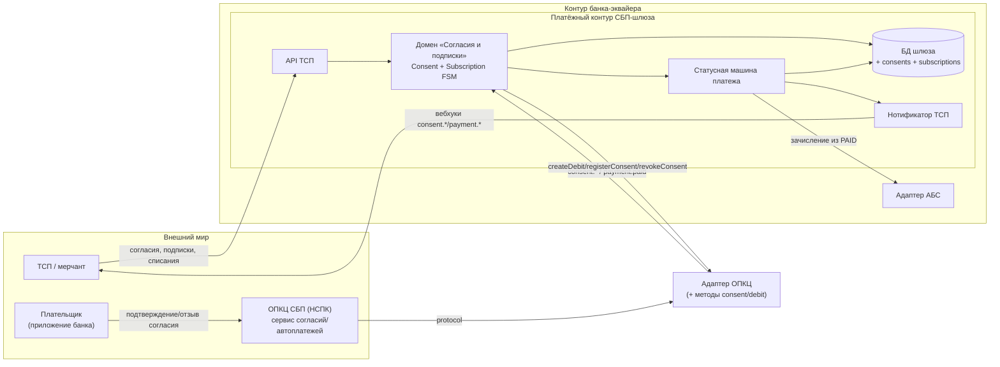

# Solutioning (delta) — Подписки СБП: рекуррентные C2B-списания по согласию плательщика

- Status: Draft (гейт A1/A2 изменения; ждёт человеческого A3 по ADR-008/ADR-009)
- Route: **Critical** (значимость 8/15 → Critical)
- Owner: solution-architect (платёжный контур)
- Связано: `changes/sbp-recurring-subscriptions/DELTA.md`, `docs/adr/ADR-008-*.md`, `docs/adr/ADR-009-*.md`, AD-001…AD-010

> Это **дельта** к принятому `docs/solutioning.md`, а не его замена. Описано только изменение; неизменённые части (одноразовый C2B, возвраты, отчётность, стратегия ADR-007) — в исходном документе.

## 1. Оценка значимости и маршрут

- `arch control score` → **Score: 8 (Critical)**. Триггеры: `api_contract_change`, `data_contract_change`, `cross_domain_integration`, `consistency_model_change`, `financial_impact`, `significant_nfr`, `security_boundary_change`, `criticality_or_exception`.
- **Маршрут: Critical.** Навык `significance-routing`: Critical = полный Solutioning (spine + ADR + NFR), обязательная человеческая точка A3, walking skeleton до массовой генерации, evidence-гейты. Здесь это оправдано: рекуррентное списание денег без клиента, регуляторные права плательщика, новая модель согласованности и расширение чувствительного контура.
- Изменение **не понижается** до Standard: `security_boundary_change` и `criticality_or_exception` — hard-critical триггеры.
- Гейты изменения: **A1** (контракты + автомат согласия), **A2** (plan/tasks, walking skeleton: `consent → ACTIVE → debit → PAID → CREDITED`), **A3** (человек: ADR-008/009 + policy отзыва), **A4** (fitness + нагрузка + ИБ), **A5** (сверка и дрейф в проде).

## 2. Влияние на принятую архитектуру

Инварианты **не переопределяются**, а расширяются: AD-001…AD-008 сохраняют Rule; добавляются AD-009, AD-010. Детальный разбор «затронуто / не меняется» — в `DELTA.md` §2.

Итог:
- **Меняется (добавляется)**: два новых агрегата (`Consent`, `Subscription`), новые эндпоинты API ТСП, новые методы/события контракта адаптера, новые вебхуки, расширение платежа типом `recurring`, два новых spine-блока.
- **Не меняется**: топология и outbox (AD-001/002), идемпотентность как принцип (AD-003), единственный адаптер (AD-004), **зачисление только из `PAID` (AD-005)**, trust-зоны (AD-006), НПС/КИИ/ПДн (AD-007), гибридная стратегия (AD-008).

## 3. Архитектурное решение (кратко; полностью — ADR-008/ADR-009)

- **Что**: домен «Согласия и подписки» внутри ядра шлюза; инициация списаний — pull со стороны ТСП; рекуррентное списание переиспользует автомат платежа; зачисление по AD-005; идемпотентность по `(consentId, billingKey)`; защита данных согласия — минимизация + существующий защищённый контур + транзакционная проверка «нет списаний после отзыва».
- **Рассмотренные альтернативы** (детали и причины отказа — в ADR-008 §Alternatives): банковский планировщик расписаний; отдельный микросервис согласий; вендорское решение; «QR-мандат» без сервиса согласий. Для защиты данных — полнота реквизитов, eventually-проверка, отдельное хранилище (ADR-009).
- **Последствия и обратимость**: ADR-008 — `reversible` на старте, `costly` после боевой эксплуатации; ADR-009 — меры обратимы, требования регулятора — нет.

### 3.1 Контейнеры (дельта к C4 из solutioning.md)



### 3.2 Автомат согласия (Consent)

```
CREATED ──► PENDING_PAYER ──► ACTIVE ──► REVOKED  (терминальный, необратимый)
                 │              │  ▲         
                 ▼              ▼  │
             REJECTED        EXPIRED ──► SUSPENDED ──► ACTIVE
             (терминальный)               (пауза)
```

- `ACTIVE` — единственное состояние, разрешающее списания (AD-009).
- `REVOKED`/`EXPIRED`/`REJECTED` — терминальные для списаний.
- Переходы атомарны (статус + outbox + аудит), как в AD-002.

### 3.3 Поток рекуррентного списания (счастливый путь)

```mermaid
sequenceDiagram
    participant T as ТСП
    participant G as СБП-шлюз (API + Домен согласий)
    participant S as Статусная машина
    participant N as Адаптер ОПКЦ
    participant NSPK as ОПКЦ СБП
    participant A as АБС
    T->>G: POST /v1/subscriptions/{id}/debits (Idempotency-Key, billingKey)
    G->>G: проверка consent=ACTIVE, лимитов; дедуп (consentId,billingKey)
    G->>S: создать платёж paymentType=recurring (CREATED)
    S->>N: createDebit(reference=paymentId, consentId)
    N->>NSPK: initiate debit
    NSPK-->>N: payment.paid (eventId)
    N-->>G: событие payment.paid
    G->>G: дедуп по eventId; статус PAID (атомарно + outbox)
    G->>A: зачисление (paymentId)
    A-->>G: absDocId
    G->>S: CREDITED → COMPLETED
    G-->>T: вебхук payment.completed
```

### 3.4 Гонка «отзыв согласия ↔ списание»

- Проверка `ACTIVE` и создание платежа — **в одной транзакции**; отзыв переводит согласие в `REVOKED` атомарно.
- In-flight списание, уже получившее `PAID` до отзыва: деньги переведены — отменить нельзя; policy (зачислить и вернуть / отклонить) — **решение человека** (DELTA §Что решает человек, п.3). В обоих вариантах двойных зачислений 0.
- Поздний `payment.paid` по отозванному согласию — не создаёт нового списания; попадает в сверку и отчёт.

## 4. Изменения контрактов

Аддитивно, без поломки потребителей (проверено `arch contract-diff`):
- `openapi/tsp-api.yaml` — новые пути `/v1/consents*`, `/v1/subscriptions*`; необязательные поля `paymentType`/`consentId`/`subscriptionId`/`billingKey`; новые схемы `Consent`, `Subscription`, `DebitRequest`; вебхуки `consent.*`, `subscription.updated`.
- `docs/contracts/tsp-api.md` — новые разделы; `docs/contracts/opkc-adapter.md` — новые методы/события (v0.1 → v0.2 draft); `docs/spec/state-machine.md` — автомат согласия и переходы рекуррентного списания.

Правила совместимости (сохраняются из tsp-api §6): добавление необязательных полей и новых путей — обратно совместимо, версия `/v1` не меняется; ломающие изменения — только `/v2`.

## 5. NFR для нового функционала

Полный набор — `docs/nfr.md`, раздел «Рекуррентные списания (подписки)». Ключевое: регистрация согласия p95 < 500 мс; доставка `consent.activated` p95 < 5 с; запрет списаний после отзыва — **0 нарушений**; двойное списание по `(consentId, billingKey)` — **0**; зачисление от `PAID` p95 < 60 с; отдельные лимиты/ratе-limiting на рекуррентный трафик; полный аудит жизненного цикла согласия.

## 6. Критерии приёмки и план отката

- Критерии приёмки (EARS, негативные сценарии, откат) — в `DELTA.md` §Критерии приёмки.
- План отката — в `DELTA.md` §План отката: фиче-флаг `recurring_enabled`, `stop-new`, доведение открытых операций, отсутствие обратной миграции, владелец решения, критерий успешного отката.

## 7. Готовность (readiness-гейт, навык `readiness-gate`)

```
VERDICT: CONCERNS (до A3)
Пробелы:
1. [CONCERN] Точный протокол сервиса согласий НСПК — внешний вход [ТРЕБУЕТ ПРОВЕРКИ]
   → чинить: получение документации НСПК; ADR-003 не реализуется до этого.
2. [CONCERN] Policy по in-flight списанию при отзыве не выбрана
   → чинить: решение человека (A3), затем фиксация в state-machine.md и тесте.
3. [CONCERN] Модель инициации (pull ТСП vs планировщик) требует подтверждения продукта
   → чинить: A3 по ADR-008; при выборе планировщика — отдельный ADR.
4. [PASS] Контракты описаны аддитивно и проверяемы `contract-diff`.
5. [PASS] NFR измеримы; негативные сценарии (дубль, отзыв, гонка) перечислены.
Трассируемость: SUB-1…SUB-8 → критерии приёмки в DELTA.md; сирот нет.
```

## 8. Риски изменения

| Риск | Влияние | Митигация |
|---|---|---|
| Списание после отзыва (гонка) | Финансовый/регуляторный инцидент | Транзакционная проверка `ACTIVE` (ADR-009), fitness-тест, мониторинг |
| Двойное списание при ретрае | Двойное зачисление | Идемпотентность `(consentId, billingKey)` (AD-010), сверка |
| Неверный `billingKey` у ТСП | Пропуск/дубль периода | Контрактные проверки, отчёт пропущенных периодов, документация ТСП |
| Протокол НСПК иной, чем предполагается | Переработка адаптера | Контракт адаптера — единственная зависимость (AD-008), внешний вход закрывается документацией |
| Рост ПДн/поверхности атаки | Нарушение 152-ФЗ | Минимизация данных, шифрование, аудит (ADR-009) |
| Рекуррентный трафик деградирует одноразовый приём | Падение SLO | Отдельные лимиты/квоты, нагрузочные тесты, изоляция очередей |
