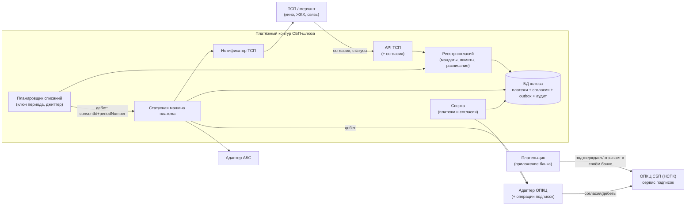
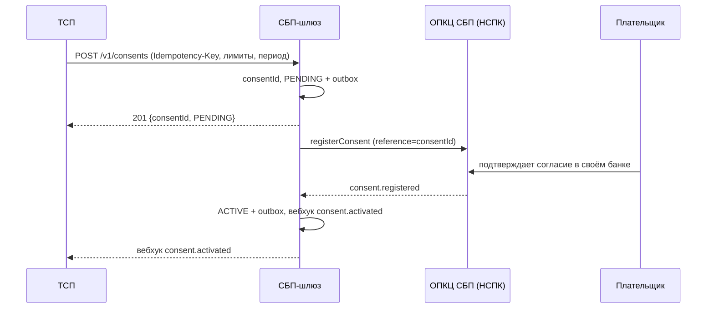
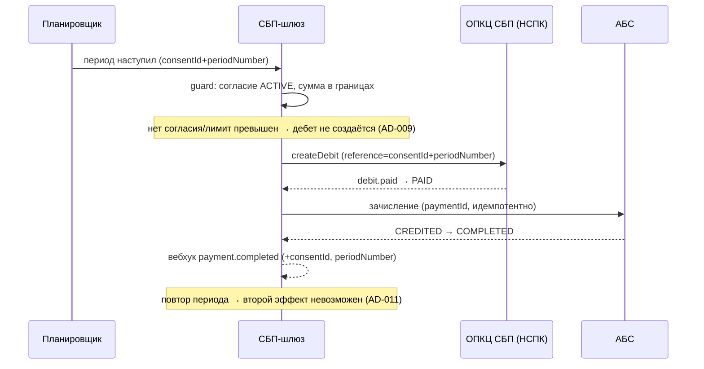

# Solutioning (дополнение) — подписки СБП: рекуррентные C2B-списания по согласию плательщика

- Status: Draft (для вынесения на архитектурное решение A3 и последующей передачи исполнителям)
- Owner: solution-architect (платёжный контур) + бизнес
- Связано: ADR-008, ADR-009, ADR-010, ADR-011; AD-009, AD-010, AD-011 (Proposed)
- База: принятое решение «Платёжный шлюз СБП (C2B-приём)» — `ARCHITECTURE-SPINE.md` (AD-001…AD-008), `docs/solutioning.md`, `docs/nfr.md`, `docs/adr/ADR-001…007`, `openapi/tsp-api.yaml` v0.1.0
- Дельта изменения: `changes/sbp-recurring-c2b/DELTA.md`

Настоящий документ — **инкремент** поверх принятого решения. Он не переписывает `docs/solutioning.md`: меняет только одну границу (автоплатежи переводились из roadmap в scope) и добавляет подписки. Принятые решения ADR-001…007 и инварианты AD-001…008 не редактируются; новые решения фиксируются отдельными ADR-008…011 со статусом Proposed.

## 1. Оценка значимости и маршрут

Маршрут определён механически, не «на глаз»: `arch-be control score` → **Score 11 → Critical** (тот же маршрут, что у базового решения — 11/15). Изменение финансового контура, затрагивающее авторизацию плательщика, не может идти по дельте-Fast: нужен полный Solutioning, обязательная человеческая точка A3 и evidence-гейты.

| Триггер | Почему сработал |
|---|---|
| `new_component` | Реестр согласий и планировщик списаний — новые компоненты ядра шлюза. |
| `domain_ownership_change` | Возникает домен «согласия/мандаты» со своим жизненным циклом, владельцем и аудитом. |
| `cross_domain_integration` | Согласие живёт в ином ритме, чем платёж: связка согласие ↔ платёж ↔ НСПК ↔ АБС. |
| `api_contract_change` | Новые пути и схемы API ТСП; расширение контракта адаптера ОПКЦ. |
| `data_contract_change` | Новый контракт данных согласия (поля, статусы, ключ периода `consentId+periodNumber`, вебхуки). |
| `security_boundary_change` | Авторизация отделяется от момента платежа: мандат позволяет списание без действия клиента — согласие становится объектом защиты. |
| `consistency_model_change` | Двухдоменная согласованность (согласие + платёж) и семантика «локально немедленно, к НСПК асинхронно». |
| `significant_nfr` | Новые измеримые бюджеты: точность расписания, нагрузка на границе периода, доступность контура согласий. |
| `rto_rpo_targets` | RPO=0 и RTO ≤ 1 ч для реестра согласий: отзыв нельзя потерять. |
| `financial_impact` | Автосписания без действия клиента — новый класс финансового риска (двойное списание, списание после отзыва). |
| `criticality_or_exception` | Финансовый/регулируемый контур, КИИ; санкции за нарушение прав плательщика. |

Следствия маршрута: полное Solutioning (этот документ + 4 ADR + дельта), обязательное человеческое решение A3 по ADR-008…011 **до** реализации транспорта и автосписаний, walking skeleton до массовой генерации, гейты A4 (fitness + ИБ + нагрузка) и A5 (дрейф).

## 2. Влияние на принятую архитектуру

| Инвариант | Влияние | Что именно меняется / не меняется |
|---|---|---|
| AD-001 Изоляция платёжного контура | **не меняется** | Новые компоненты (реестр согласий, планировщик) — внутри платёжного контура; обращения к АБС/НСПК по-прежнему только через адаптеры. |
| AD-002 Единый источник истины | **расширяется** | Тем же правилом «статус + outbox + аудит в одной транзакции» покрывается реестр согласий (ADR-009). |
| AD-003 Идемпотентность | **расширяется** | Добавляется ключ периода (`consentId+periodNumber`) для дебета; механика дедупликации — прежняя. |
| AD-004 Единственный адаптер ОПКЦ | **расширяется** | Контракт адаптера дополняется операциями подписок; второй адаптер не создаётся (ADR-010). |
| AD-005 Зачисление только из PAID | **не меняется** | Каждый дебет — обычный платёж, проходящий `PAID → CREDITED`; инвариант сохранён и проверяется. |
| AD-006 Trust-зоны | **не меняется** | Данные согласия — в том же платёжном контуре; доступ операторов — 4-eyes. |
| AD-007 НПС/КИИ/ПДн | **не меняется** | Требования те же; добавляются обязательства по доказательствам согласия и уведомлению плательщика. |
| AD-008 Гибрид «ядро + вендорский транспорт» | **не меняется** | Ядро расширяется (реестр/планировщик), объём контракта с вендором растёт. |
| AD-009/AD-010/AD-011 | **новые (Proposed)** | Согласие до автосписания; согласие как источник истины с RPO=0 и необратимым отзывом; идемпотентность периода. |

Что НЕ меняется: топология шлюза и изоляция; конечный автомат платежа; outbox и нотификатор; правило «зачисление только из PAID»; trust-зоны; стратегия реализации. Что меняется в принятых документах — по дельте: спайн (ADDED AD-009…011), реестр правил (ADDED C-100…C-105), контракт ТСП (аддитивно, v0.2.0). `docs/solutioning.md` не редактируется; `docs/spec/state-machine.md` — только аддитивно (добавлены обязательные для Critical-маршрута секции «Проблема/Критерии приёмки/Риски»; переходы и инварианты не изменены). Решение о переносе «автоплатежей» из roadmap в scope фиксируется здесь и в дельте.

## 3. Архитектурное решение

### 3.1 Компоненты (дополнение к C4 базового решения)



### 3.2 Поток: регистрация согласия



### 3.3 Поток: плановое списание



### 3.4 Поток: отзыв согласия

```mermaid
sequenceDiagram
    participant T as ТСП / Плательщик
    participant G as СБП-шлюз
    participant S as Планировщик
    participant N as ОПКЦ СБП (НСПК)
    T->>G: POST /v1/consents/{id}/revoke
    G->>G: REVOKED (локально, сразу) + outbox + аудит
    G-->>S: списания по согласию запрещены (0 будущих дебетов)
    G->>N: revokeConsent (асинхронно, ретраи)
    G-->>T: 200 {REVOKED}; вебхук consent.revoked
```

### 3.5 Рассмотренные альтернативы

Альтернативы рассматриваются на уровне отдельных решений (полные таблицы — в ADR):

- **Модель подписок (ADR-008):** сущность-мандат в шлюзе (выбрано) vs подписка на стороне ТСП vs вендорская «коробка» подписок vs «повтор платежа» без сущности.
- **Жизненный цикл/отзыв (ADR-009):** локально немедленный отзыв + асинхронная регистрация у НСПК (выбрано) vs проверка только в момент дебета vs единственный источник истины у НСПК с кэшем vs синхронный отзыв с блокировкой.
- **Транспорт (ADR-010):** расширение контракта существующего адаптера (выбрано) vs второй адаптер vs вендорская коробка vs отложить контракт.
- **Идемпотентность/расписание (ADR-011):** планировщик шлюза + ключ периода (выбрано) vs инициатива ТСП vs `Idempotency-Key` запроса vs без дедупликации vs слепой ретрай при `UNKNOWN`.

## 4. Изменения контрактов

### 4.1 API ТСП (`openapi/tsp-api.yaml`) — только аддитивно

- Новые пути: `POST /v1/consents`, `GET /v1/consents/{consentId}`, `POST /v1/consents/{consentId}/revoke`.
- Новые схемы: `ConsentRequest`, `Consent`, `ConsentStatus`, `Periodicity`, `AmountType`.
- Новые необязательные поля в существующих схемах: `Payment.consentId`, `Payment.paymentType`, `Payment.periodNumber`; `PaymentRequest.consentId`.
- Новые ошибки (RFC 9457): `CONSENT_NOT_ACTIVE` (409), `CONSENT_LIMIT_EXCEEDED` (422), `CONSENT_EXPIRED` (422).
- Новые вебхуки: `consent.activated`, `consent.rejected`, `consent.revoked`, `consent.expired`.

### 4.2 Гарантия отсутствия поломок

- Путь остаётся `/v1`; `info.version` `0.1.0 → 0.2.0` (minor). Ломающее изменение потребовало бы `/v2` (`docs/contracts/tsp-api.md` §6).
- Существующие пути, схемы, обязательные поля и значения перечислений v0.1 не изменяются и не удаляются.
- Новые поля — необязательные; существующие потребители их игнорируют. Новые пути — opt-in.
- **Доказательство (машина, не на словах):** `contract_diff` старой и новой версии — `changes/sbp-recurring-c2b/evidence/contract-diff.md`; `openapi_lint` — `changes/sbp-recurring-c2b/evidence/openapi-lint.md`. Ломающих изменений нет.

### 4.3 Контракт адаптера ОПКЦ

Аддитивно, `docs/contracts/opkc-adapter-recurring.md` (v0.2-draft) — дополнение, не замена `docs/contracts/opkc-adapter.md`: методы `registerConsent`, `getConsentStatus`, `revokeConsent`, `createDebit`, `getDebitStatus`, `getConsentReconciliationReport`; события `consent.registered`, `consent.rejected`, `consent.revoked`, `debit.paid`, `debit.rejected`; идемпотентность по `reference`. Обязательства вендора и сценарии POC — дополнение к `docs/rfp/vendor-rfp.md`.

## 5. NFR нового функционала

Полный набор с целями и методами проверки — `docs/nfr-subscriptions.md`. Ключевое: доступность контура согласий **≥ 99,95 %**; RPO=0 и RTO ≤ 1 ч для реестра согласий; точность расписания ≥ 99,9 % дебетов в допуске окна; 0 списаний после отзыва; 0 двойных списаний за период; пик на границе периода ≥ 300 TPS в течение 2 ч без деградации базового приёма; лаг нотификаций ТСП p95 < 5 с; зачисление p95 < 60 с.

## 6. Критерии приёмки и план отката

### 6.1 Критерии приёмки (EARS; проверяемые)

- **REQ-SUB-1.** When ТСП регистрирует согласие, the шлюз shall вернуть `consentId` в состоянии `PENDING` и не создавать списаний до подтверждения.
- **REQ-SUB-2.** While согласие не в состоянии `ACTIVE`, the шлюз shall не создавать автоматических списаний.
- **REQ-SUB-3.** When наступает плановый период, the планировщик shall инициировать ровно одно списание в допуске окна.
- **REQ-SUB-4.** If период `consentId+periodNumber` инициируется повторно, then the шлюз shall обеспечить ровно один финансовый эффект.
- **REQ-SUB-5.** When согласие отозвано, the шлюз shall прекратить все будущие списания (0 после подтверждённого отзыва).
- **REQ-SUB-6.** If НСПК отклоняет согласие/дебет, then the шлюз shall перевести операцию в терминальный отказ без финансового эффекта.
- **REQ-SUB-7.** When сумма/период выходит за границы согласия, the шлюз shall не создавать списание и записать находку в аудит.

Негативные сценарии, обязательные к проверке: дубль нотификации/ретрай; гонка двух экземпляров планировщика; отзыв в момент списания; недоступность НСПК и АБС; `UNKNOWN`-исход вызова; пик на границе периода; расхождение согласий по сверке. Машинно проверяемое ядро: `arch-be gate` (PASS), `consent_before_auto_action` и `debit_period_idempotency` зелёные на эталоне и красные на нарушении (`arch-be rules template verify --dir .`).

### 6.2 План отката

- **До боевой эксплуатации:** откат = не включать; все работы обратимы.
- **После включения:** фиче-флаг; запрет регистрации **новых** согласий; отзыв согласий и исполнение действующих обязательств **не отключаются** (право на отзыв и финансовые обязательства сохраняются); перед заморозкой — синхронная сверка согласий с НСПК.
- **Критерий успешного отката:** 0 новых согласий; 0 несанкционированных списаний; каждое действующее согласие либо исполняется по runbook, либо корректно приостановлено с уведомлением ТСП; отзыв работает.
- **Сигналы отката:** >0 списаний после отзыва; >0 дублей за период; расхождения согласий с НСПК; недоступность контура согласий; каскадные ошибки протокола.
- **Владелец решения об откате:** solution-архитектор совместно с бизнесом (закрепляется на A3).
- Детали и шаги — `changes/sbp-recurring-c2b/handoff/ROLLBACK.yaml`.

## 7. Что остаётся на решение человека-архитектора

Ниже — то, что **нельзя** закрыть механически и что требует A3/бизнеса/ИБ. Эти пункты намеренно не «додуманы» агентом.

1. **Ратификация ADR-008…011 (A3).** Выбор модели мандата, семантика отзыва, расширение транспорта, механика расписания. Спайн-блоки AD-009…011 остаются `Proposed` до этого решения.
2. **Объём первой волны.** Фиксированная сумма / переменная с лимитом / гибкая без уведомления; расписание шлюза vs ad-hoc дебет ТСП (ad-hoc вынесен в Deferred).
3. **Регуляторика и комплаенс.** Юридическая форма согласия, обязанности уведомления плательщика, применимость 161-ФЗ и 152-ФЗ к мандату, срок хранения доказательств согласия — ИБ/комплаенс.
4. **Протокол НСПК.** Точные поля, тайминги, профили TLS, ограничения по типам списаний — внешний вход `[ТРЕБУЕТ ПРОВЕРКИ]`.
5. **Вендор и закупка.** Расширение объёма RFP/контракта, обязательный proof идемпотентности дебета, SLA, стоимость и сроки — проектный офис/закупки.
6. **Бизнес-модель.** Тарифы на подписки, правила при пропущенном периоде, пороги AML/антифрода, состав уведомлений ТСП.

## 8. Гейты, трассируемость и доказательства

- Гейт изменения: `changes/sbp-recurring-c2b/evidence/gate.txt` (`arch-be gate --route auto --base bench-baseline`).
- Проверка зубов правил: `changes/sbp-recurring-c2b/evidence/rules-verify.txt`.
- Контракты: `changes/sbp-recurring-c2b/evidence/contract-diff.md`, `.../openapi-lint.md`.
- Трассируемость: REQ-SUB-n → NFR (`docs/nfr-subscriptions.md`) → AD-009…011 → правила C-100…C-105.
- Пакет исполнителю (после A3): `changes/sbp-recurring-c2b/handoff/` + команда `arch-be handoff … qwen-code --route critical` (генерируется после ратификации, чтобы нести Accepted-инварианты).

## 9. Gaps и открытые вопросы

- Протокол НСПК по подпискам (внешний вход) — блокирует ADR-010 и часть NFR.
- Требования ЦБ/152-ФЗ к хранению доказательств согласия.
- SLA АБС на массовые списания на границе периода.
- Политика пропущенного периода и поведения при длительном `UNKNOWN`.
- Правовая форма согласия и уведомлений плательщика.
