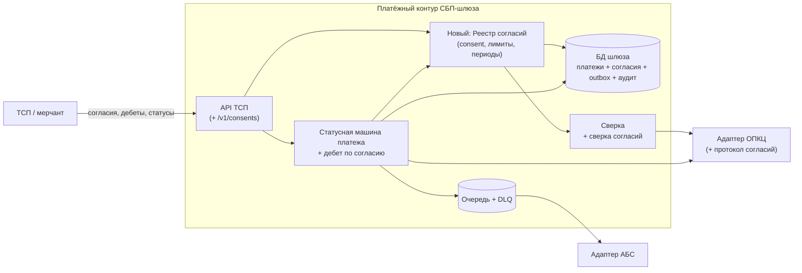
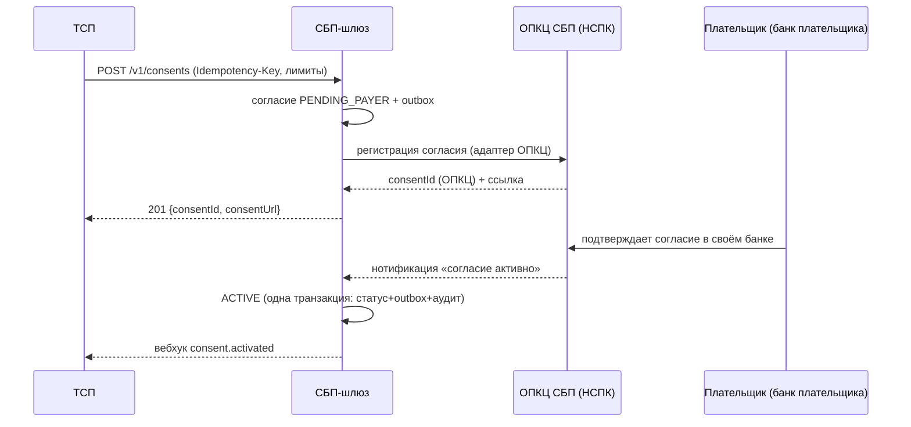
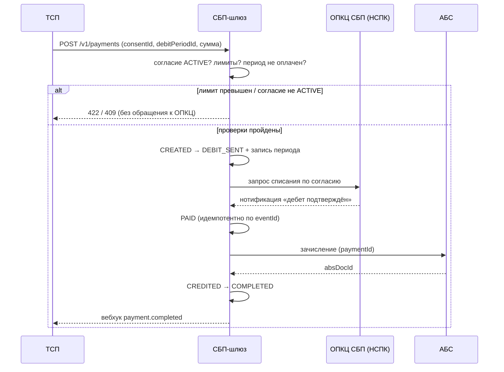
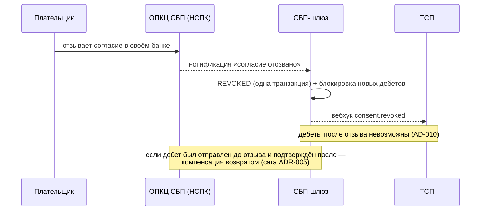

# Solutioning — Подписки СБП (рекуррентные C2B-списания по согласию плательщика)

- Status: Draft — **ожидает человеческого решения A3** по ADR-008 и ADR-009
- Маршрут: **Critical** (значимость 8/15 по декларированным триггерам)
- Owner: solution-architect (платёжный контур) + продукт/бизнес ТСП
- Изменение: `changes/spb-subscriptions/DELTA.md` (дельта, покрывающая правки спайна)
- Связано: ADR-008, ADR-009, ADR-001…ADR-007, AD-001…AD-011

Настоящий документ — полное Solutioning изменения поверх принятого решения
`docs/solutioning.md` (базовый C2B-приём). Он не переписывает базовое решение, а
дополняет его сценарием подписок: согласие плательщика и списания по согласию.

## 1. Значимость и маршрут

### Триггеры (декларированные)

| Триггер | Сработал | Основание (свидетельство) |
|---|---|---|
| `api_contract_change` | да | новые методы `/v1/consents`, поля `consentId`/`debitPeriodId`, события `consent.*` |
| `data_contract_change` | да | новая модель данных — согласие (мандат) и учёт периодов списаний |
| `financial_impact` | да | рекуррентные списания без действия клиента в момент списания |
| `criticality_or_exception` | да | расширение платёжного контура (КИИ) и сервиса, признанного критичным |
| `cross_domain_integration` | да | новый домен «согласие» во взаимодействии с банком плательщика через ОПКЦ |
| `consistency_model_change` | да | реестр согласий (локальная истина) ↔ статус мандата у ОПКЦ (ADR-009) |
| `new_datastore` | да | реестр согласий как новый набор данных в БД шлюза |
| `significant_nfr` | да | новые измеримые NFR: блокировка списаний после отзыва, идемпотентность периода |

**Score = 8/15 → маршрут Critical** (порог Fast ≤ 1, Standard 2–4). Триггеры
`security_boundary_change`, `irreversible_migration` — не сработали: граница
безопасности (trust-зоны, AD-006) и транспорт ОПКЦ не меняются, необратимых
миграций нет.

### Почему маршрут Critical и что это влечёт

- Работаем в платёжном контуре (КИИ): ошибка — финансовые потери и нарушение прав
  плательщика, поэтому процесс полный, а не дельта.
- Полный Solutioning: spine (AD-009…AD-011) + ADR (ADR-008, ADR-009) + измеримые
  NFR + обязательная человеческая точка **A3** + walking skeleton до отгрузки +
  evidence-гейты (A4 — conformance, A5 — post-deploy drift).
- Дельты недостаточно (границы применения дельты — Fast/Standard): дельта здесь
  выполняет только механическую роль — покрывает правки защищённых файлов спайна.

### Механический маршрут гейта и его честная граница

Гейт по диффу (`arch-be gate --route auto`) видит только контрактное изменение и
выводит **Fast (score 1, `api_contract_change`)**; полная значимость выведена
декларированными триггерами. Расхождение осознанно и объяснено:

- механика оценивает **состав диффа** (правку контракта), а не архитектурный смысл;
  anti-bypass floor по построению только расширяет множество триггеров и не
  заменяет суждение архитектора;
- заявить маршрут `critical` через `.arch-handoff/ROUTE.lock` **сейчас нельзя
  честно**: на маршруте Critical гейт требует входов, которых у этапа решения нет
  (`model/` → `trace_check`/`nfr`/`model_validate`; `EVIDENCE.yaml` с записью A3,
  walking skeleton, состязательным ревью и репетицией отката → `evidence_verify`),
  и вердикт становится `INCOMPLETE` (exit 3), то есть гейт перестаёт быть
  исполнимым на текущем этапе. Поэтому `ROUTE.lock` ставится **после A3** вместе с
  моделью и первым evidence-бандлом — тогда маршрут и механика совпадут.

До этого момента маршрут Critical зафиксирован там, где живёт решение: в дельте,
в этом документе, в ADR и в спайне (AD-009…AD-011 — `Proposed`).

## 2. Влияние на принятое архитектурное решение

### Что **не** меняется

- Топология и изоляция платёжного контура (AD-001), trust-зоны и сегментация
  (AD-006), единственный адаптер ОПКЦ (AD-004), стратегия реализации (AD-008).
- Базовая статусная машина разового платежа: `CREATED → QR_ISSUED → PAID →
  CREDITED → COMPLETED`; возвраты-сага; сверка с НСПК/АБС; нотификатор вебхуков.
- Контракт API ТСП v0.1: методы, поля и события сохраняют смысл (только добавления).
- Интеграционный контракт с АБС: зачисление/списание идемпотентны по
  `paymentId`/`refundId`; для дебета по согласию новых полей АБС не требуется.

### Матрица по инвариантам спайна

| Инвариант | Влияние | Как именно |
|---|---|---|
| AD-001 Изоляция платёжного контура | **Не меняется** | Реестр согласий — в существующем контуре; новых обращений к АБС/ОПКЦ мимо адаптеров нет |
| AD-002 Единый источник истины, атомарные переходы | **Расширяется** | Правило распространено на согласие: «статус + outbox + аудит» в одной транзакции (AD-010) |
| AD-003 Идемпотентность финансовых операций | **Расширяется** | Добавлена идентичность дебета (`consentId`, `debitPeriodId`) — AD-011 |
| AD-004 Единственный адаптер ОПКЦ | **Не меняется** | Адаптер обязан поддержать протокол согласий (расширение constraints ADR-007, RFP) |
| AD-005 Зачисление только из подтверждённого статуса | **Не меняется** | Дебет зачисляется только из `PAID` (подтверждённый ОПКЦ дебет) — AD-009 |
| AD-006 Trust-зоны и сегментация | **Не меняется** | Идентификатор плательщика — в платёжном контуре, минимизация и защита; новых зон нет |
| AD-007 Соответствие НПС, КИИ, ПДн | **Расширяется** | Согласие — правовое основание списания: аудит, сроки хранения, уведомление плательщика |
| AD-008 Стратегия реализации (гибрид) `[ADOPTED]` | **Не меняется** | Ядро владеет согласием; вендорский транспорт обязан поддержать подписки (проверка на этапе RFP) |
| AD-009…AD-011 (новые) | **Добавляются** | `Proposed`, привязаны к ADR-008/ADR-009 |

Ни один принятый инвариант не переопределяется и не отменяется: изменение
аддитивно. Конфликт с принятым решением — сигнал остановки и эскалации, а не
повод «подправить» AD-001…AD-008 (при необходимости — новый ADR со статусом
`Supersedes`).

### Изменение контейнеров (C4, delta)



Новое: **реестр согласий** (таблица в БД шлюза + логика), методы API согласий,
протокол согласий в адаптере ОПКЦ, сверка согласий. Переиспользовано: статусная
машина, outbox, нотификатор, DLQ, сага возвратов, контур сверки.

## 3. Потоки

### 3.1 Регистрация и активация согласия



### 3.2 Дебет по согласию



### 3.3 Отзыв согласия и гонка



Состояния согласия, переходы, лимиты и правила дебета — `docs/spec/subscription-consent.md`.

## 4. Архитектурные решения

| Решение | ADR | Альтернативы (отвергнуты) | Обратимость |
|---|---|---|---|
| Подписка = согласие плательщика + дебет, инициируемый ТСП (pull) | ADR-008 | подтверждение каждого списания; собственный мандат банка без ОПКЦ; предоплаченный баланс; пакетный клиринговый файл | reversible до боевых согласий, costly после |
| Реестр согласий как локальная истина валидации + ОПКЦ как истина исполнения, отзыв приоритетен | ADR-009 | ОПКЦ — единственный источник; только локальный реестр; отдельный контур/БД согласий | costly (до боевых согласий — reversible) |

Оба ADR — в статусе `Proposed`; ратификация — за человеческой точкой A3
(см. §10). Разбор альтернатив, последствий (плюсы/минусы) и условий пересмотра —
в самих ADR.

## 5. Изменения контракта (без поломки потребителей)

- Контракт: `docs/contracts/tsp-api.md` v0.1 → **v0.2 draft**; машиночитаемый —
  `openapi/tsp-api.yaml` `0.1.0` → `0.2.0`.
- Добавлено: `POST /v1/consents`, `GET /v1/consents/{consentId}`,
  `DELETE /v1/consents/{consentId}`; опциональные `consentId`/`debitPeriodId` в
  `POST /v1/payments`; события `consent.activated|revoked|expired|rejected`;
  коды ошибок согласия.
- **Доказательство совместимости** (механическое): `contract_diff` v0.1 → v0.2 —
  **breaking: 0**, non-breaking: 5 (добавленные путь и коды ответов);
  `openapi_lint` — PASS. Потребители v0.1 не мигрируют; ломающие изменения в этой
  версии запрещены (правило `CD-007`: ломающий дифф без смены major).

## 6. NFR (delta)

Полные измеримые цели — `docs/nfr.md` §7. Ключевое:

| Метрика | Цель |
|---|---|
| Регистрация согласия | p95 < 500 мс (без ОПКЦ) |
| Активация согласия (нотификация → `consent.activated`) | p95 < 5 с |
| Блокировка списаний после отзыва | p95 ≤ 5 с, p99 ≤ 15 с |
| Списаний по отозванному/истёкшему согласию | **0** |
| Двойное списание за период | **0** (`consentId`+`debitPeriodId`) |
| Превышение лимитов согласия | **0** (проверка до ОПКЦ) |
| Сверка согласий с ОПКЦ | ежечасная, расхождений 0 |
| RPO согласий | 0 |

Базовые NFR (доступность ≥ 99,95 %, RPO=0, RTO ≤ 1 ч, 200/500 TPS) сохраняются:
подписки используют общие каналы, АБС и сверку.

## 7. Критерии приёмки

Полный перечень в EARS-нотации — `docs/spec/subscription-consent.md` §«Критерии
приёмки». Обязательный минимум (выполним на моках, гейт A4):

1. **Позитивные**: регистрация → активация → дебет в пределах лимитов → зачисление
   только из подтверждённого статуса → вебхук.
2. **Негативные** (обязательны):
   - дебет по не-`ACTIVE` согласию отклонён;
   - дебет сверх лимита отклонён **без обращения к ОПКЦ**;
   - повтор дебета с тем же `debitPeriodId` → один платёж;
   - дубль нотификации ОПКЦ → состояние не меняется;
   - отзыв согласия → 0 дебетов после отзыва (включая гонку с in-flight дебетом);
   - недоступность ОПКЦ → согласие не активируется, состояние не искажается.
3. **Критерий отката**: после `stop-new` новые согласия и дебеты не принимаются,
   уже начатые операции корректно завершаются, сверка не находит расхождений.

## 8. План отката

- **Решение об откате**: владелец — дежурный руководитель (P0: списание по
  отозванному согласию, двойное списание), иначе архитектор контура + продукт.
- **Сигналы-триггеры**: P0-инцидент; расхождение сверки согласий > 0; доля отказов
  дебетов выше согласованного порога; инцидент ИБ.
- **Пошагово**: (1) фиче-флаг `stop-new` — запрет новых согласий и дебетов;
  (2) обработка уже начатых операций штатно (без «обрыва»); (3) откат релиза —
  rolling; (4) сверка с ОПКЦ и АБС; (5) при полной декомиссии — прекращение
  действующих согласий с уведомлением плательщиков, реестр сохраняется для аудита.
- Данные не мигрируются обратно: реестр согласий — источник истины до полной
  сверки. Обратимость согласована с ADR-008/ADR-009.

## 9. Gaps и внешние входы

| Gap / внешний вход | Что закроет | Владелец |
|---|---|---|
| Протокол согласий ОПКЦ (поля, тайминги, лимиты по умолчанию, нотификации) | Документация НСПК по договору | Проектный офис / НСПК |
| Поддержка согласий вендорским транспортом | Уточнение RFP-критериев (ADR-007) | Проектный офис / закупки |
| Правовая модель согласия и уведомлений плательщика | Юристы + комплаенс банка | Комплаенс |
| Сроки хранения и минимизация идентификатора плательщика | ИБ/ПДн | ИБ |
| Лимиты и частота по умолчанию, политика возврата лимита периода | Бизнес + регламент ОПКЦ | Продукт |

## 10. Что остаётся на решение человека-архитектора (точка A3)

Механике недоступно и не должно решаться агентом: правовые/регуляторные вопросы,
риск-аппетит и внешний протокол. Требуется человеческое решение по ADR-008 и
ADR-009 в машинно-читаемой форме:

```yaml
a3_decision:
  subject: "Подписки СБП — рекуррентные C2B-списания по согласию плательщика"
  choice: "<принять ADR-008 и ADR-009 | отклонить | отложить>"   # решение человека
  rationale: "<почему: бизнес-эффект против риска прав плательщика и регуляторики>"
  constraints:
    - "списание только при ACTIVE-согласии; отзыв необратим и приоритетен"
    - "зачисление только из подтверждённого статуса (AD-005)"
    - "протокол согласий ОПКЦ — внешний вход, детали [ТРЕБУЕТ ПРОВЕРКИ]"
  rejected_options:
    - "подтверждение каждого списания (не решает задачу)"
    - "предоплаченный баланс ТСП (иная правовая модель)"
    - "ОПКЦ как единственный источник согласий (RPO/доступность)"
  open_for_human:
    - "объём первой волны: только подписки или сразу с C2C/выплатами"
    - "приемлемое окно блокировки списаний после отзыва (SLO от 5 с)"
    - "обязательность и канал уведомления плательщика о каждом списании"
    - "лимиты и частота по умолчанию; политика возврата лимита периода"
    - "сроки хранения согласий (ПДн/аудит)"
    - "допуск конкретных категорий ТСП к сценарию подписок"
  expiry: "12 месяцев эксплуатации или первый P0-инцидент со списанием"
```

**Почему это только человек:** (1) правовое основание списания и уведомление
плательщика — регуляторный риск, а не техническая развилка; (2) риск-аппетит по
остаточному окну гонки «отзыв ↔ дебет» задаёт бизнес, а не механика; (3) выбор
вендора и готовность протокола ОПКЦ — внешняя зависимость. ADR-008/ADR-009
остаются `Proposed` до записи решения; до этого реализация подписок не начинается
(как и реализация транспорта по AD-008).

## 11. Порядок передачи исполнителям (после A3)

1. Записать решение A3; перевести ADR-008/ADR-009 в `Accepted`, AD-009…AD-011 — в
   `Accepted` (блоки спайна действуют после ратификации).
2. Перегенерировать handoff-пакет `.arch-handoff/` (`arch-be handoff`) уже под
   подписанное решение: актуализировать `TASK.md`, `ARCHITECTURE.md`, `adr/`,
   `MANIFEST.json`; добавить шаблоны исполняемых проверок для AD-009…AD-011
   (`arch-be rules template apply`) — чтобы инварианты подписок имели не только
   текстовое правило.
3. Walking skeleton (сквозной путь на моках): ТСП → согласие → мок ОПКЦ →
   активация → дебет → мок АБС → вебхук; плюс негативный путь «отзыв → дебет
   отклонён».
4. Гейты: A4 — conformance (fitness, property-тесты идемпотентности/лимитов/отзыва,
   ИБ-аудит, нагрузочные NFR); A5 — post-deploy drift (сверка согласий, SLO-отчёт).

## 12. Открытые вопросы

1. Объём первой волны: только подписки или сразу C2C/выплаты (влияет на адаптеры,
   не на ядро).
2. Поддерживает ли протокол ОПКЦ изменение согласия без повторного подтверждения
   (сейчас — нет, см. Deferred в spine).
3. Восстанавливается ли лимит периода при возврате дебета.
4. Требуется ли отдельное согласие на разовые списания сверх подписки.
