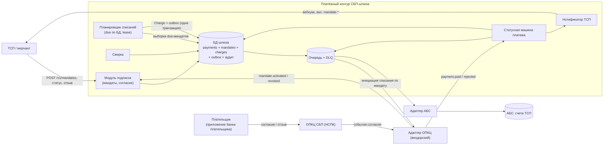

# Влияние на принятую архитектуру — СБП-подписки

- Изменение: `recurring-c2b-mandates` · Дата: 2026-09-28 · Статус: Proposed
- Связано: `ARCHITECTURE-SPINE.md` (AD-001…AD-008), `docs/solutioning.md`, ADR-008, ADR-009

## 1. Главный вывод

Изменение — **расширение существующего платёжного контура, а не новая подсистема**. Осознанно **не создаются** новый сервис и новое хранилище: второй денежный путь и второй источник истины нарушили бы AD-001 и AD-002. Рекуррентность добавляется двумя новыми сущностями (мандат, списание) и одним внутренним компонентом (планировщик), а исполнение списания переиспользует существующий платёж.

## 2. Влияние на инварианты спайна

| Инвариант | Статус | Что именно меняется |
|---|---|---|
| **AD-001** Изоляция платёжного контура | Сохраняется, **усиливается** | Модуль подписок и планировщик — часть шлюза; списания к ОПКЦ/АБС идут только через адаптеры. Новый запрет: планировщик не вызывает ОПКЦ/АБС напрямую от своего имени |
| **AD-002** Единый источник истины | Сохраняется, **расширяется** | Мандат, расписание и списание — сущности БД шлюза; переходы мандата и создание списания — атомарно «статус + outbox + аудит». Расписание не живёт в планировщике/очереди (AD-011) |
| **AD-003** Идемпотентность финансовых операций | **Расширяется** | Новые ключи: `(mandateId, billingPeriod)` — списание; `reference` — регистрация мандата/списание в адаптере; `eventId` — события мандата. `UNKNOWN` по списанию разрешается сверкой, не повтором |
| **AD-004** Единственный адаптер ОПКЦ | Сохраняется, **расширяется контракт** | Новые методы адаптера: регистрация мандата, списание по мандату, отзыв мандата, статус мандата; новые события. Протокол НСПК по-прежнему знает только адаптер |
| **AD-005** Зачисление только из `PAID` | Сохраняется | Списание идёт тем же путём `PAID → CREDITED → COMPLETED`; добавляется **предусловие** — списание возможно только при `ACTIVE`-мандате (AD-009), но зачисление по-прежнему только из `PAID` |
| **AD-006** Trust-зоны и сегментация | Сохраняется, **уточняется** | Новый внешний стык не появляется; мандат/согласие — чувствительные данные (ПДн); ручные операции с мандатами — 4-eyes; планировщик — внутренний контур |
| **AD-007** Соответствие НПС, КИИ, ПДн | **Расширяется** | Согласие и его отзыв аудируемы; предупреждение плательщика до списания и лимиты — по регламенту ОПКЦ `[ТРЕБУЕТ ПРОВЕРКИ]`; ПДн плательщика в шлюзе минимизируются (обезличенная ссылка ОПКЦ) |
| **AD-008** Стратегия реализации — гибрид `[ADOPTED]` | Сохраняется, **затрагивает RFP** | Транспорт подписок принадлежит вендорскому адаптеру (ядро остаётся контрактно-независимым). Требуется подтверждение поддержки операций согласия/списания вендором — дополнение к RFP. Если вендор не умеет — эскалация на A3, а не расширение ядра в транспорт |

**Новые инварианты (предлагаются, вступают после ратификации):** AD-009 «согласие — предусловие автодействия», AD-010 «идемпотентность периода», AD-011 «планировщик не источник истины расписания». Дословные формулировки — в `DELTA.md`.

## 3. Что меняется и что нет

**Меняется:**

- **Сущности:** `Mandate` (согласие) и `Charge` (списание за период); расширение `Payment` полями `mandateId`, `billingPeriod`, `source`.
- **Компоненты:** модуль подписок (API мандатов, жизненный цикл согласия) и планировщик списаний (внутри платёжного контура).
- **Контракты:** `openapi/tsp-api.yaml` v0.2 (аддитивно), внутренний контракт адаптера ОПКЦ (новые методы), новые вебхук-события.
- **NFR:** своевременность списания, пиковая пропускная способность планировщика, лаг и backlog, доля «одно списание на период» (см. `NFR.md`).
- **Аудит/наблюдаемость:** аудит инициации и отзыва согласия; метрики планировщика.

**Не меняется:**

- Статусная машина платежа и её инварианты (AD-002/003/005) — списание переиспользует существующие переходы.
- Модель интеграции с АБС (ADR-005) и возвраты-сага — те же.
- Периметр trust-зон (AD-006) и принципы AD-001/AD-004.
- Контракт v0.1: существующие операции и потребители не мигрируют (аддитивность, `contract_diff` breaking = 0).
- Roadmap: C2C, выплаты B2C/B2B, диспуты остаются вне scope.

## 4. Компоненты (дельта к C4-диаграмме solutioning)



Новое выделено смыслом: `MND`, `SCHED`, таблицы `mandates`/`charges`; всё остальное — существующие компоненты (переиспользование).

## 5. Поток: оформление мандата

```mermaid
sequenceDiagram
    participant T as ТСП
    participant G as СБП-шлюз (модуль подписок)
    participant N as ОПКЦ СБП
    participant P as Плательщик (банк плательщика)
    T->>G: POST /v1/mandates (Idempotency-Key, параметры)
    G->>G: Mandate = PENDING_CONSENT (+ outbox, аудит)
    G->>N: регистрация согласия (адаптер)
    N-->>G: ссылка на согласие (consentRef)
    G-->>T: 201 {mandateId, status: PENDING_CONSENT}
    P->>N: даёт согласие в приложении своего банка
    N-->>G: событие mandate.activated (eventId)
    G->>G: дедуп по eventId; Mandate = ACTIVE (одна транзакция)
    G-->>T: вебхук mandate.activated
```

## 6. Поток: рекуррентное списание

```mermaid
sequenceDiagram
    participant S as Планировщик
    participant G as СБП-шлюз
    participant N as ОПКЦ СБП
    participant A as АБС
    S->>G: мандат ACTIVE и nextChargeAt <= now
    G->>G: создать Charge (mandateId, billingPeriod) + outbox — одна транзакция
    Note over G: уникальный ключ (mandateId, billingPeriod): повтор не создаёт второе списание
    G->>N: списание по мандату (reference = paymentId)
    N-->>G: payment.paid (eventId)
    G->>G: дедуп; Payment = PAID
    G->>A: зачисление (paymentId) — только из PAID
    A-->>G: absDocId
    G->>G: CREDITED -> COMPLETED
    G-->>S: nextChargeAt = следующий период
    Note over G,N: таймаут инициации -> UNKNOWN, разрешение сверкой, без повторного списания
```

## 7. Статусная машина мандата

```
PENDING_CONSENT ──► ACTIVE ──► REVOKED      (плательщик или ТСП; терминальное)
                      │  └───► EXPIRED      (endAt; терминальное)
                      │  └───► SUSPENDED ⇄ ACTIVE   (опц.: пауза/возобновление)
PENDING_CONSENT ──► REJECTED                (согласие не дано / ОПКЦ отказал)
```

- `PENDING_CONSENT` — мандат создан, согласие ожидается; списания не создаются.
- `ACTIVE` — предусловие списания (AD-009). Отзыв/истечение останавливает следующее списание.
- Инварианты: терминальные состояния без переходов; повторные события идемпотентны по `eventId`; переходы — атомарно с outbox и аудитом (AD-002).

## 8. Стыки, требующие согласования

| Стык | Что меняется | С кем согласовывать |
|---|---|---|
| Внутренний контракт адаптера ОПКЦ | Новые методы и события подписок; идемпотентность по `reference` | Вендор транспорта (RFP-дополнение), НСПК `[ТРЕБУЕТ ПРОВЕРКИ]` |
| Контракт API ТСП (v0.2) | Аддитивные пути `/v1/mandates*`, события `mandate.*` | Потребители ТСП, продукт, ИБ |
| АБС | Без изменений по существу (тот же идемпотентный путь); меняется профиль нагрузки в пиковые дни | Владелец АБС (SLA, пиковые окна) |
| Сверка | Новый объект — мандаты/списания; сверка согласий с ОПКЦ | Эксплуатация, НСПК |

## 9. Состязательная линза (независимый контур)

Проверка «построй две единицы, соблюдающие все AD, но несовместимые»:

1. **Два планировщика при разъезде аренды** могут одновременно увидеть один due-мандат. Инвариант спасён только тем, что уникальность списания обеспечивает БД (`mandateId, billingPeriod`), а не lease. → Требование к тесту на «два планировщика — одно списание».
2. **Отзыв согласия в момент инициации**: планировщик создал списание, затем пришёл `mandate.revoked`. Нужна явная семантика: уже начатая операция доводится, следующая не создаётся (отражено в ADR-008 п.3). → Тест на гонку «отзыв ‖ инициация».
3. **Подмена понятий «мандат активен»**: адаптер может вернуть статус мандата, отличный от локального (рассинхрон). Нужна сверка согласий и трактовка «локальный ACTIVE недостаточен без подтверждения ОПКЦ при сомнении». → Тест сверки.
4. **UNKNOWN по списанию** может быть разрешён как «не списано» и повторён → двойное списание. Инвариант: UNKNOWN не повторяем, только сверка. → Тест `unknown-outcome-no-resend`.

Эти четыре сценария — кандидаты в негативные критерии приёмки (`ACCEPTANCE.md`).
