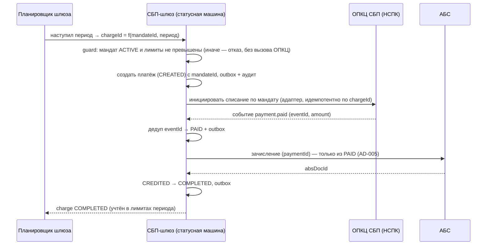

# Solutioning изменения — СБП-подписки (рекуррентные C2B-списания по согласию плательщика)

- Статус: Draft (Proposed) — выносится на архитектурное решение A3′ вместе с `docs/adr/ADR-008-sbp-subscriptions-mandates-scheduler.md`
- Дельта: `changes/sbp-subscriptions/DELTA.md`
- Owner: solution-architect (платёжный контур) + бизнес-владелец продукта ТСП + ИБ/КИИ
- Связано: ADR-008 (новое), AD-009 (spine, новый), ADR-001, ADR-002, ADR-004, ADR-005, ADR-007, ADR-008 [ADOPTED = стратегия гибрида]
- Дата: 2026-09-28

---

## 1. Оценка значимости и маршрута

**Score: 7/15 → маршрут Critical** (`arch control score --trigger …`).

| Триггер | Взведён | Почему |
|---|---|---|
| `new_component` | да | в контуре шлюза появляются новые компоненты: реестр мандатов и планировщик рекуррентных списаний |
| `api_contract_change` | да | API ТСП расширяется до v0.2 (подписки, мандаты, списания) |
| `data_contract_change` | да | новые сущности и новые типы событий вебхуков; новые поля платежа |
| `consistency_model_change` | да | новый асинхронный триггер (расписание) и новый агрегат (мандат) со своей согласованностью относительно НСПК |
| `significant_nfr` | да | новые измеримые цели: точность расписания, время stop-new при отзыве, «одно списание на период» |
| `financial_impact` | да | повторяющееся реальное взимание средств плательщика; цена ошибки — двойное списание |
| `security_boundary_change` | да | появляются данные согласия плательщика (ПДн) и доказательство согласия; меняется профиль ПДн и аудита |

Не взведены: `new_datastore` (расширение существующей БД шлюза), `new_vendor` (вендор транспорта тот же, расширяется лишь объём контракта), `trust_zone_change`, `cross_domain_integration`, `domain_ownership_change`, `rto_rpo_targets`, `irreversible_migration`, `criticality_or_exception`.

Сравнение с исходным решением: принятое решение имело 11/15 (Critical). Изменение — 7/15, тоже Critical: 5 триггеров уже превышают порог Critical, а финансовое влияние и новый внешний протокол не позволяют отнести его к Standard.

**Насколько глубокое проектирование нужно и почему.**

Дельты недостаточно. Причины:

1. **Новый агрегат со своим жизненным циклом.** Мандат (согласие) — не поле платежа, а самостоятельная сущность с состояниями, лимитами, сроком и правом отзыва. Его модель — это новый инвариант (AD-009), а не правка существующего.
2. **Новый внешний протокол.** Рекуррентное списание и мандат обслуживаются на стороне ОПКЦ СБП; точные операции и семантика — внешний вход `[ТРЕБУЕТ ПРОВЕРКИ]` (документация НСПК). Это прямо продлевает ограничение ADR-007/AD-008: транспортный слой не реализуется до получения документации.
3. **Финансовое и регуляторное влияние.** Регулярное взимание без участия клиента — самая чувствительная к ошибкам механика: двойное взимание, взимание после отзыва, превышение лимита. Требуется правовое основание согласия (152-ФЗ), аудит (161-ФЗ/НПС), интеграция с AML (115-ФЗ).
4. **Человеческая развилка.** Границы «что держит банк, что делегируется НСПК/вендору» — стратегическое решение уровня A3, его нельзя принять в дельте.

Всё это — маршрут Critical: полный Solutioning (настоящий документ), ADR, A3′ до реализации, A4 conformance (fitness + нагрузка + ИБ-аудит), A5 drift.

---

## 2. Влияние на принятую архитектуру

### 2.1 Инварианты spine

| Инвариант | Статус | Что происходит |
|---|---|---|
| AD-001 Изоляция платёжного контура | не меняется | новые компоненты (реестр мандатов, планировщик) живут в том же платёжном контуре и общаются с АБС/ОПКЦ только через существующие адаптеры |
| AD-002 Единый источник истины — статусная машина | не меняется, расширяется по смыслу | переходы мандата — такие же атомарные транзакции «состояние + outbox + аудит»; единый источник истины для списаний остаётся в БД шлюза |
| AD-003 Идемпотентность финансовых операций | не меняется, расширяется | новый ключ идемпотентности `chargeId` добавляется к существующим (`Idempotency-Key`, `eventId`, `paymentId`/`refundId`) |
| AD-004 Единственный адаптер ОПКЦ СБП | не меняется | операции мандатов и списаний добавляются **в тот же** адаптер (opkc-adapter §10), протокол НСПК по-прежнему знает только он |
| AD-005 Зачисление только из подтверждённого статуса | не меняется (ключевой) | рекуррентное списание — это платёж и проходит ту же цепочку `PAID → CREDITED`; «списать» ≠ «зачислить»: списание инициируется планировщиком, но зачисление ТСП по-прежнему невозможно из `CREATED`/`QR_ISSUED` |
| AD-006 Trust-зоны и сегментация | не меняется | новых зон нет; данные согласия размещаются в уже изолированном платёжном контуре |
| AD-007 Соответствие НПС, КИИ и ПДн | не меняется, расширяется | к аудиту финансовых переходов добавляется аудит согласий; расширяется состав ПДн (идентификатор плательщика в мандате) |
| AD-008 Стратегия реализации (гибрид) | не меняется | ядро остаётся контрактно-независимым: рекуррентные операции входят в тот же внутренний контракт адаптера; смена вендора возможна |
| **AD-009 (новый)** | **добавляется** | «списание только по действующему мандату в пределах лимитов; отзыв немедленно блокирует новые списания» |

**Ни один существующий инвариант не изменяется и не удаляется.** Изменение аддитивно: новые состояния/сущности/операции, но та же модель консистентности.

### 2.2 Компоненты

| Компонент | Изменение |
|---|---|
| API ТСП | аддитивно: подписки и мандаты (v0.2) |
| Статусная машина платежа | **не меняется**; рекуррентное списание — обычный платёж с новым триггером и полем `mandateId` |
| Транзакционный outbox | **не меняется**; новые типы событий |
| Нотификатор ТСП | аддитивно: новые типы событий (`subscription.*`, `charge.*`) |
| Адаптер АБС | **не меняется**: зачисление по `paymentId`, списание по `refundId` |
| Адаптер ОПКЦ | расширяется: операции мандата и рекуррентного списания (вендорский объём — дельта RFP) |
| **Реестр мандатов** | **новый** компонент платёжного контура |
| **Планировщик списаний** | **новый** компонент платёжного контура |
| Сверка | расширяется: сверка мандатов и списаний к существующей сверке платежей |

### 2.3 Что НЕ меняется (важно для оценки риска)

- Финансовая модель зачисления: только из `PAID` (AD-005).
- Контракт адаптера АБС и его идемпотентность по `paymentId`/`refundId`.
- Модель консистентности ядра: конечный автомат + outbox + аудит, строгая согласованность внутри шлюза.
- Статусы и enum платежа в API ТСП (v0.1-потребители не затронуты).
- Стратегия гибрида (ADR-007/AD-008) и trust-зоны (ADR-006).

---

## 3. Архитектурное решение

### 3.1 Решение (кратко)

В ядре шлюза (собственная разработка) добавляются **реестр мандатов** и **планировщик рекуррентных списаний**; протокольная часть (мандат и списание на стороне ОПКЦ) реализуется расширением **того же** вендорского адаптера. Рекуррентное списание — это **платёж**, проходящий существующую статусную машину; меняется только триггер (расписание вместо сканирования QR) и добавляется проверка мандата. Полное решение — `docs/adr/ADR-008-sbp-subscriptions-mandates-scheduler.md`.

### 3.2 Модель мандата (согласия плательщика)

Мандат — согласие плательщика на повторяющиеся списания в пользу конкретного ТСП. Хранится в реестре мандатов платёжного контура; **операционный источник истины для планирования и лимитов** — реестр, **авторитетный источник для действительности согласия** — ОПКЦ/банк плательщика; расхождение разрешается сверкой и трактуется в пользу плательщика (см. 3.5).

Состояния мандата (детали — `docs/spec/subscription-model.md`):

```
CREATED ──► PENDING_AUTH ──► ACTIVE ──► SUSPENDED ──► ACTIVE
   │             │              │            │
   ▼             ▼              ▼            ▼
 REJECTED     EXPIRED        REVOKED ◄──────┘   (терминальные: REJECTED, EXPIRED, REVOKED)
```

- `CREATED` — мандат зарегистрирован в шлюзе, запрос в ОПКЦ в процессе.
- `PENDING_AUTH` — ОПКЦ зарегистрировал запрос, ожидается подтверждение плательщика в его банке.
- `ACTIVE` — согласие подтверждено; списания разрешены в пределах лимитов.
- `SUSPENDED` — приостановлен (ТСП или шлюзом по правилам/антифроду); новые списания запрещены, возобновляем.
- `REVOKED` — отозван плательщиком или закрыт; **терминальный, новые списания запрещены безусловно**.
- `EXPIRED` / `REJECTED` — терминальные.

Атрибуты мандата: `mandateId`, `tspId`, идентификатор плательщика в маскированном виде (минимизация ПДн), реквизиты для сверки, лимиты (разовое списание, сумма за период, совокупный лимит, число списаний), период и срок действия, назначение, идентификатор согласия в ОПКЦ, ссылка на доказательство согласия, история состояний (аудит).

### 3.3 Поток создания согласия

```mermaid
sequenceDiagram
    participant T as ТСП
    participant G as СБП-шлюз (реестр мандатов)
    participant N as ОПКЦ СБП (НСПК)
    participant P as Плательщик (банк плательщика)

    T->>G: POST /v1/subscriptions (Idempotency-Key, реквизиты, лимиты, расписание)
    G->>G: создать мандат CREATED + outbox + аудит
    G->>N: регистрация мандата (адаптер ОПКЦ)
    N-->>G: mandateRef, статус PENDING_AUTH
    G->>G: PENDING_AUTH, outbox; SHALL вернуть ТСП ссылку/идентификатор
    P->>N: плательщик подтверждает согласие в приложении своего банка
    N-->>G: событие mandate.activated (eventId)
    G->>G: дедуп по eventId → ACTIVE + outbox + аудит
    G-->>T: вебхук subscription.activated
```

Альтернатива без подтверждения плательщиком (молчаливое согласие) не рассматривается: согласие должно быть доказанным и отзываемым.

### 3.4 Поток рекуррентного списания



Инварианты потока:

- Списание невозможно без `ACTIVE`-мандата и вне лимитов — проверка **до** вызова ОПКЦ и до регистрации списания.
- `chargeId` детерминирован от (`mandateId`, период) → повторный запуск планировщика, ретрай или повторная доставка события не создают второе списание (AD-003).
- Зачисление — только из `PAID` (AD-005), тем же кодом, что и разовый платёж.
- Учёт лимитов («сумма за период», «совокупный лимит») — атомарно вместе с переходом платежа, чтобы гонка двух списаний в одном периоде не превысила лимит.

### 3.5 Отзыв мандата и «списания в полёте»

Отзыв — приоритетное событие: мандат переходит в `REVOKED` в той же транзакции; новые списания запрещаются немедленно (цель stop-new — `docs/nfr.md` §7). Для списания, уже инициированного в ОПКЦ, но не завершённого, действует политика (утверждается человеком, §7): базовый вариант — **довести до конца уже подтверждённое НСПК списание и не начинать новые**, а спорные случаи разрешать возвратом (сага ADR-005). Вариант «прервать всё в полёте» отклонён как нереализуемый надёжно (частичные состояния в ОПКЦ/АБС) и как источник расхождений.

При расхождении «у нас `ACTIVE`, в ОПКЦ отозван» — стоп-сигнал, немедленный перевод в `SUSPENDED`/`REVOKED` и алерт: запрет списаний важнее доступности функции.

### 3.6 Рассмотренные альтернативы

| # | Вариант | Плюсы | Минусы | Критерии сравнения |
|---|---|---|---|---|
| A1 | **Ядро держит мандаты и планировщик (выбран)** | локальный источник истины (RPO=0), лимиты и аудит под контролем банка, сохранение AD-002/AD-005, вендор заменяем | новый компонент и его эксплуатация; согласованность с ОПКЦ требует сверки | контроль, аудит, обратимость, регуляторный риск |
| A2 | Тонкий прокси: состояние мандата только в НСПК/у вендора | меньше кода | нет локального источника истины → нельзя гарантировать лимиты/идемпотентность/аудит; противоречит духу AD-001/AD-002 | RPO=0, доказуемость, аудит |
| A3 | Расписание на стороне ТСП (ТСП сам вызывает списание каждый период) | минимум изменений в шлюзе | нет гарантии и контроля взимания, нет защиты плательщика, отзыв не управляется банком; бизнес-ценность «подписки» теряется | защита плательщика, регуляторный риск |
| A4 | Полностью вендорский модуль подписок «коробка» | быстрый старт | vendor lock-in, закрытая финансовая логика, дорогая кастомизация под АБС, сложный аудит — отклонено ещё в ADR-007 | AD-008, контроль, аудит |
| A5 | Переиспользовать один бессрочный QR/ссылку на период | почти нет изменений | требует действия клиента каждый раз → не решает задачу; не является рекуррентным списанием по согласию | соответствие требованию |

Сравнение A1/A2/A3 — ключевая развилка; она уходит человеку-архитектору (§7), потому что затрагивает границу с вендором и регуляторную ответственность банка.

### 3.7 Последствия

**Положительные**

- Банк сохраняет контроль над финансовой логикой и аудитом взимания; AD-002/AD-005 не пересматриваются.
- Плательщик защищён: лимиты, срок, явный подтверждаемый мандат, немедленный отзыв.
- Транспорт остаётся заменяемым (граница контракта адаптера), стратегия ADR-007 не пересматривается.
- Рекуррентное списание переиспользует существующие машину состояний, outbox, сверку, нотификации — минимальный новый код ядра.

**Отрицательные / цена**

- Новые компоненты: эксплуатация, мониторинг расписания, дрейф расписаний, резервирование планировщика (нельзя «пропустить» период).
- Новый внешний протокол — задержка до получения документации НСПК и дельта RFP к вендору.
- Расширение ПДн и требований аудита → дополнительные согласования ИБ/регуляторики.
- Рост сложности сверки: мандаты + списания + платежи.
- Пиковая нагрузка «по календарю» (начало месяца у ЖКХ/связи) — нужен запас по TPS и приоритеты очередей.

### 3.8 Обратимость

| Часть изменения | Обратимость | Обоснование |
|---|---|---|
| Контракт API ТСП v0.2 | **reversible** | аддитивный; старые потребители не затронуты |
| Планировщик и реестр мандатов | **reversible** до включения | отключается фиче-флагом |
| Расширение адаптера ОПКЦ | **reversible** | та же граница контракта (AD-008) |
| Модель мандата в целом | **costly после первых реальных мандатов** | согласие плательщика — регуляторно значимый факт: действующие мандаты нельзя «удалить», их нужно исполнять или закрывать упорядоченно; данные ПДн требуют порядка уничтожения |
| Инвариант AD-009 | **costly** | отказ от «списание только по действующему мандату» — отказ от защиты плательщика; несовместим с ожиданиями НПС |

Итог: до боевой эксплуатации — reversible; после появления действующих мандатов — costly. Необратимых миграций нет.

---

## 4. Изменения контрактов

### 4.1 API ТСП — `openapi/tsp-api.yaml` 0.1.0 → 0.2.0

Принцип: **только аддитивные изменения**. Ни один существующий путь, обязательное поле, код ответа или значение enum не изменяются и не удаляются.

Добавляется:

| Метод | Назначение |
|---|---|
| `POST /v1/subscriptions` | создание подписки/мандата (Idempotency-Key обязателен) |
| `GET /v1/subscriptions/{subscriptionId}` | состояние подписки и мандата |
| `POST /v1/subscriptions/{subscriptionId}/revoke` | отзыв/приостановка подписки со стороны ТСП |
| `GET /v1/subscriptions/{subscriptionId}/charges` | список рекуррентных списаний и их статусов |

Аддитивные поля существующих схем:

- `Payment.mandateId` (опционально) — ссылка на мандат для платежа-списания;
- `Payment.initiationType` (опционально, enum `qr | recurring`) — по умолчанию `qr`, что сохраняет семантику для существующих потребителей.

`PaymentRequest` не меняется (списание инициирует шлюз, а не ТСП).

Новые события вебхуков: `subscription.created`, `subscription.activated`, `subscription.suspended`, `subscription.revoked`, `charge.completed`, `charge.failed`. Существующие события не изменяются.

### 4.2 Совместимость

- Потребитель v0.1 не знает новых полей и путей и продолжает работать без изменений.
- Enum статусов платежа не расширяется и не сужается (важно: удаление значений — ломающее изменение).
- Новые поля опциональны и не входят в `required`.
- Доказательство: `arch contract-diff <v0.1> <v0.2>` — ломающих изменений нет (CD-001..CD-007).

### 4.3 Внутренний контракт адаптера ОПКЦ — `docs/contracts/opkc-adapter.md` §10 (v0.2 proposed)

Добавляются операции и события (все — `[ТРЕБУЕТ ПРОВЕРКИ]` до получения документации НСПК): регистрация мандата, запрос статуса мандата, инициация списания по мандату, отмена/отзыв, события `mandate.activated` / `mandate.revoked` / `mandate.rejected`. Идемпотентность по `reference` (`mandateId`/`chargeId`) — по-прежнему **обязательное требование**, без него рекуррентные ретраи дадут двойное взимание. §1–§9 не изменяются.

Следствие: объём поставки вендора расширяется → **дельта RFP** (`docs/rfp/vendor-rfp.md`) добавляет критерий допуска «рекуррентные операции» и POC-сценарий «повтор списания по одному `chargeId` → одно взимание». Правка RFP выполняется отдельным шагом после A3′, чтобы не менять документ до решения.

### 4.4 Внутренние документы

- `docs/spec/subscription-model.md` (новый) — модель мандата и жизненный цикл списания.
- `docs/spec/state-machine.md` — ссылка на новый документ; переходы платежа не изменяются.
- `docs/nfr.md` §7 — измеримые NFR рекуррентного функционала.
- `docs/solutioning.md` §1 — «автоплатежи» переходят в scope.

---

## 5. Измеримые NFR для нового функционала

Добавляются в `docs/nfr.md` §7; базовые NFR шлюза (доступность 99,95 %, RPO=0, RTO ≤ 1 ч, 200/500 TPS) действуют и на новый функционал.

| Метрика | Цель | Метод проверки |
|---|---|---|
| Точность планировщика (отклонение инициации списания от планового времени) | p95 ≤ 60 с, p99 ≤ 300 с | метрика лага планировщика, нагрузочный тест «пик календаря» |
| Пропуск периода списания | 0 (ни один плановый период не пропущен без явного статуса отказа) | отчёт планировщика, сверка |
| Дублей списания на один `chargeId` | 0 | тест повторного запуска и повторной доставки события |
| Отклонение списания вне лимитов/без `ACTIVE`-мандата | 100 % отклонений до вызова ОПКЦ/АБС | fitness + негативные тесты |
| Время stop-new после отзыва мандата | p99 ≤ 30 с от получения отзыва/сверки; после — 0 списаний | тест отзыва, метрика распространения |
| Актуальность статуса мандата относительно ОПКЦ | кэш ≤ 60 с; сверка ежечасная; расхождений по завершённым операциям 0 | reconciliation-отчёт |
| Инициация списания (до ответа адаптера) | p95 < 1 с | APM/нагрузочный тест |
| Зачисление по списанию от подтверждения НСПК | p95 < 60 с (как для разового платежа) | метрика процесса |
| Уведомление ТСП о результате списания | p95 < 5 с | метрика лага очереди |
| Пиковая пропускная способность рекуррентных списаний | sustained 200 TPS, пик 500 TPS (burst 1000 TPS/мин) — в общем бюджете шлюза | нагрузочный тест «дата массовых списаний» |
| Деградация функции подписок | не влияет на разовый C2B-приём (изоляция очередей/приоритеты) | chaos-тест, отказ планировщика |
| Аудит согласий и списаний | 100 % переходов мандата и 100 % списаний в неизменяемом логе | аудит, SIEM |
| ПДн в мандате | минимизация, шифрование в покое, маскирование в логах, срок хранения определен | ИБ-ревью, тесты |
| Интеграция с AML/антифрод по рекуррентным списаниям | передача по порогам — 100 %; авто-стоп мандата по правилам | тест-кейсы |

Зависимости (внешние входы): регламенты НСПК по мандатам/списаниям (таймауты, сроки уведомления плательщика) — `[ТРЕБУЕТ ПРОВЕРКИ]`; SLA АБС; правовые требования к форме согласия.

---

## 6. Критерии приёмки и план отката

### 6.1 Критерии приёмки (позитивные и негативные)

| # | Сценарий | Ожидаемый результат | Тип |
|---|---|---|---|
| A1 | Создание подписки → подтверждение плательщиком | мандат `ACTIVE`, вебхук `subscription.activated`, событие в аудите | позитивный |
| A2 | Плановое списание в пределах лимитов | ровно одно списание, `PAID → CREDITED → COMPLETED`, учтено в лимитах периода | позитивный |
| N1 | **Дубль**: повторный запуск планировщика / повтор события ОПКЦ по одному `chargeId` | второго списания и второго зачисления нет (AD-003) | негативный |
| N2 | **Превышение лимита**: сумма больше разового/периодного/совокупного лимита | списание отклонено до вызова ОПКЦ/АБС; ТСП уведомлён; мандат не изменён | негативный |
| N3 | **Отзыв**: плательщик отзывает мандат | новые списания не инициируются в пределах stop-new; отзыв в аудите | негативный |
| N4 | **Гонка**: два списания в одном периоде одновременно | лимит не превышен, дедупликация по `chargeId` не пропускает второе | негативный |
| N5 | **Отказ соседа**: недоступна АБС / недоступен ОПКЦ | списание не теряется: ретраи/очередь/DLQ, сверка компенсирует; зачисление не «изобретается» | негативный |
| N6 | **Отзыв в полёте**: отзыв приходит между инициацией и подтверждением списания | применяется утверждённая политика (§3.5); расхождения объяснены и попадают в отчёт | негативный |
| N7 | **Совместимость**: клиент v0.1 выполняет старый сценарий | поведение и ответы не изменились; `contract-diff` — без ломающих изменений | негативный (регресс) |
| N8 | **Инвариант**: попытка зачисления по списанию из `CREATED`/`QR_ISSUED` | недостижимо (fitness AD-005 остаётся зелёным) | негативный |

Критерий успешного отката: после выключения функции (stop-new) новые подписки и списания не создаются; открытые операции завершаются или переходят в объяснённое состояние; разовый C2B-приём работает без изменений; сверка не показывает новых расхождений; действующие мандаты не потеряны и исполняются/закрываются по утверждённой политике.

### 6.2 План отката

**До боевой эксплуатации:** откат = не включать. Работы обратимы (см. §3.8); правки контрактов аддитивны.

**После включения:**

1. **Сигналы-триггеры отката:** любой подтверждённый случай двойного списания; списание после отзыва мандата; превышение лимита в проде; расхождение сверки мандатов сверх порога; несовместимость с протоколом НСПК; предписание ИБ/регулятора; деградация разового C2B-приёма из-за функции подписок.
2. **Немедленные действия (SRE по runbook):** включить stop-new (запрет новых подписок и новых списаний) фиче-флагом; не останавливать обработку уже открытых операций; оповестить ТСП; эскалация дежурному платёжному мониторингу.
3. **Разбор:** сверка мандатов/списаний с ОПКЦ и АБС; спорные взимания — возврат по саге (ADR-005); отчёт незавершённых операций.
4. **Откат релиза:** rolling-откат кода; **данные не мигрируются обратно**; действующие мандаты сохраняются и обслуживаются (или закрываются упорядоченно) — удаление мандатов без исполнения обязательств недопустимо.
5. **Владелец решения об откате:** решение об откате функции/релиза принимает архитектор совместно с бизнес-владельцем продукта и ИБ (для регуляторных сигналов — ИБ с немедленным действием); исполнение — SRE/дежурная смена по runbook. Планировщик останавливается отдельным флагом (не трогая приём платежей).

---

## 7. Что остаётся на решение человека-архитектора и почему

| # | Вопрос | Почему не решается в рамках изменения | Кто решает |
|---|---|---|---|
| 1 | **Стратегия и граница «банк ↔ вендор»**: ядро держит мандаты и планировщик (A1) или делегирует НСПК/вендору (A2), или расписание у ТСП (A3) | это развилка уровня A3: затрагивает контрактную границу AD-008, стоимость, сроки и регуляторную ответственность банка за взимание | архитектор + бизнес/CIO (+ закупки) |
| 2 | **Источник истины мандата** (реестр банка vs ОПКЦ) и правила разрешения расхождений | регуляторно чувствительно: от этого зависит, кто отвечает за ошибочное взимание | архитектор + ИБ + юридическая служба |
| 3 | **Политика «списания в полёте» при отзыве** | баланс между защитой плательщика, технической реализуемостью и предотвращением расхождений; имеет правовые последствия | архитектор + юридическая служба + бизнес |
| 4 | **Форма и содержание согласия плательщика**: лимиты, срок, обязательные уведомления о списании, порядок отзыва | правовое основание (152-ФЗ, НПС), не выводится из технических документов | юридическая служба + ИБ + бизнес |
| 5 | **Протокол НСПК по мандатам/списаниям** `[ТРЕБУЕТ ПРОВЕРКИ]` | внешний вход; публично не раскрыт, получается по договору — до этого транспорт не реализуется (AD-008) | проектный офис / НСПК + архитектор |
| 6 | **Объём дельты RFP** (рекуррентные операции вендору) и сроки | закупочное решение и бюджет | проектный офис / закупки + архитектор |
| 7 | **Бизнес-модель**: тарифы, комиссии, политика неуспешных списаний (dunning), retry-политика для ТСП | коммерческое решение | бизнес-владелец |
| 8 | **Категорирование КИИ/ПДн и состав мер** для новых данных согласия | компетенция ИБ/КИИ, внешние согласования | ИБ/КИИ |
| 9 | **Приоритеты очередей** (рекуррентные списания vs разовый приём) и режим деградации | эксплуатационная политика с бизнес-приоритетами; кандидат в ADR | архитектор + эксплуатация (SRE) |

Ни один из этих вопросов не блокирует подготовку пакета: решение ADR-008 имеет статус Proposed и вступает в силу после человеческого решения A3′.

---

## 8. Гейты

- **A0′ (readiness):** дельта + design + ADR-008 + обновлённый spine (AD-009) + контракты + NFR; fitness по AD-009 добавлены. Критерий: `arch gate` без FAIL, `arch delta validate` без error, `arch contract-diff` без ломающих изменений. Фактически на 2026-09-28: auto-маршрут — PASS; маршрут Critical — 0 FAIL, но INCOMPLETE по составляющим `trace_check`, `nfr`, `model_validate`, `evidence_verify` (нет каталога `model/` и выпускного evidence-бандла — унаследованное свойство документного пакета; evidence-бандл собирается после A3′, см. `DELTA.md` «Гейт и evidence»).
- **A1′ (Spec):** `docs/spec/subscription-model.md`, `openapi/tsp-api.yaml` v0.2 (contract-diff чист), дельта opkc-adapter §10, дельта RFP.
- **A2′ (Plan):** задачи реализации и walking skeleton рекуррентного сценария (мок мандата + мок планировщика на существующих моках ОПКЦ/АБС).
- **A3′ (человеческое решение):** ответы на §7 — **обязательно до реализации транспорта** (мандатные операции НСПК).
- **A4′ (conformance):** fitness AD-009, тесты идемпотентности/лимитов/отзыва, нагрузочный «пик календаря», ИБ-аудит согласий.
- **A5′ (post-deploy drift):** сверка мандатов/списаний в проде, SLO-отчёт, проверка отсутствия дрейфа от spine.
