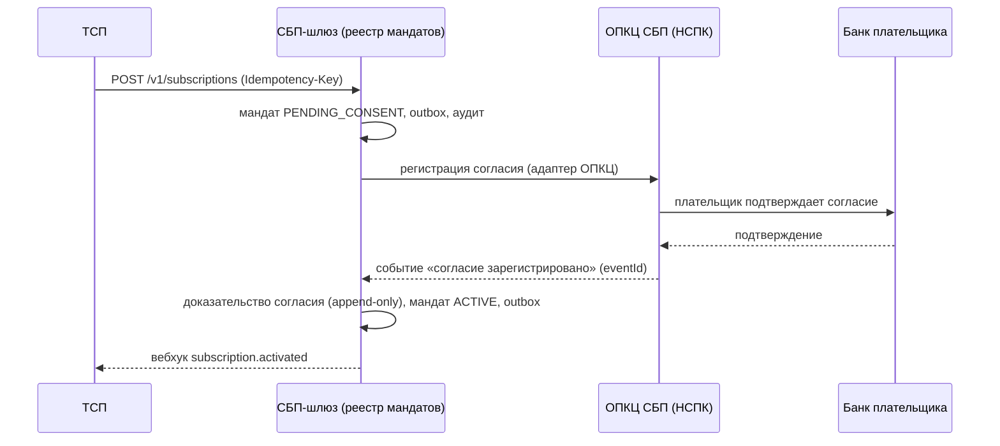
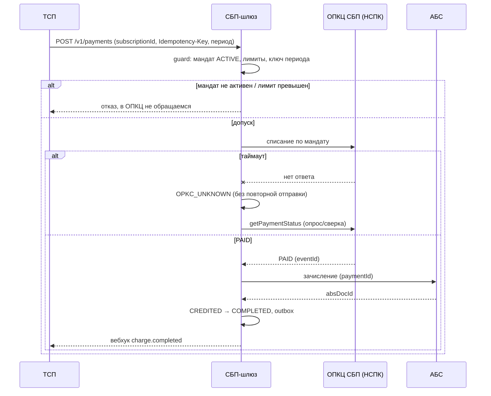

# Solutioning — Подписки СБП (рекуррентные C2B-списания) поверх принятого решения

- Status: Proposed (пакет изменения к гейту A3 — человеческое архитектурное решение)
- Owner: solution-architect (платёжный контур)
- Базовое решение: `docs/solutioning.md` (C2B-приём), `ARCHITECTURE-SPINE.md` (AD-001..AD-008)
- Изменение: `changes/sbp-subscriptions/DELTA.md`, ADR-008..ADR-010
- Маршрут: **Critical** (значимость 10/15; с учётом `criticality_or_exception` — 11/15)

## Проблема

ТСП (онлайн-кинотеатры, ЖКХ, связь) просят рекуррентные C2B-списания по согласию плательщика — подписки СБП. Сегодня каждый платёж требует действия плательщика (QR/ссылка + подтверждение), что не подходит для подписочных моделей. Нужна возможность: плательщик подтверждает согласие один раз, далее ТСП инициирует списания по расписанию без участия плательщика, а отзыв согласия прекращает списания. Принятое решение C2B-приёма относило автоплатежи к roadmap **вне scope** — изменение возвращает отложенный пункт в scope и потому оформлено поверх принятого решения, без его переписывания.

## 1. Оценка значимости изменения и маршрута

Прогон `arch control score` (инструмент харнесса) по заявленным триггерам дал **10/15 → маршрут Critical**:

| # | Триггер | Почему срабатывает |
|---|---|---|
| 1 | `new_component` | новый логический компонент в платёжном контуре — реестр мандатов (подписок) |
| 2 | `new_datastore` | новое хранилище: мандаты + доказательства согласия (RPO=0, аудит) |
| 3 | `domain_ownership_change` | новый домен «согласия/подписки» с владельцем и жизненным циклом (банк владеет авторизацией) |
| 4 | `cross_domain_integration` | поток пересекает ТСП → шлюз → ОПКЦ → банк плательщика; подтверждение согласия — в банке плательщика |
| 5 | `api_contract_change` | расширение `docs/contracts/tsp-api.md` и `openapi/tsp-api.yaml` |
| 6 | `data_contract_change` | новые сущности/состояния/события (мандат, списание, `OPKC_UNKNOWN`, `subscription.*`) |
| 7 | `security_boundary_change` | меняется модель авторизации: списание без участия плательщика, ПДн и доказательство согласия |
| 8 | `consistency_model_change` | новая модель согласованности: мандат + расписание ТСП + неопределённый исход |
| 9 | `significant_nfr` | новые измеримые цели (доля успешных списаний, лаг отзыва, идемпотентность списаний) |
| 10 | `financial_impact` | реальные деньги: многократные списания со счетов плательщиков |

Дополнительно `criticality_or_exception` (11/15): изменение затрагивает критичный платёжный контур/КИИ и меняет семантику авторизации дебетования. Маршрут **Critical** устойчив: порог — 5+ триггеров, при любом из наборов (10 или 11) он превышен.

**Почему нужен полный Solutioning, а не дельта:** на Critical требуется полное проектирование и обязательное человеческое решение A3 (маршрутизация по значимости, `architect.md` п.3; `gate.decision_policy.critical = human`). Изменение затрагивает финансовую модель авторизации (кто вправе списать деньги без плательщика) и внешний вход (сервис мандатов СБП), поэтому не может быть проведено как Fast/Standard-дельта: дельты недостаточно (шаблон дельты прямо оговаривает, что Critical — это полный Solutioning).

**Цена бездействия:** бизнес теряет подписочный сценарий (уход ТСП к конкурентам-эквайерам), а попытка решить это вне архитектуры (силами ТСП или точечными доработками) создаёт неавторизованные списания — регуляторный и репутационный риск.

## 2. Влияние на принятую архитектуру

Матрица по инвариантам spine (что меняется, что — нет):

| Инвариант | Влияние | Суть |
|---|---|---|
| AD-001. Изоляция платёжного контура | **не меняется** | Взаимодействие с ОПКЦ/АБС — по-прежнему только через адаптеры шлюза; новых прямых вызовов нет |
| AD-002. Единый источник истины — статусная машина | **расширяется** | Правило атомарных переходов распространяется на новый автомат мандата; у списания путь без `QR_ISSUED`; добавлено техническое подсостояние `OPKC_UNKNOWN` |
| AD-003. Идемпотентность финансовых операций | **расширяется** | К `Idempotency-Key` добавляется бизнес-ключ периода; вводится правило «неопределённый исход — без повторной отправки» |
| AD-004. Единственный адаптер ОПКЦ | **не меняется** | Протокол сервиса мандатов СБП остаётся внутри адаптера; ядро работает по внутреннему контракту (расширяется аддитивно) |
| AD-005. Зачисление только из `PAID` | **не меняется** (усиливается) | `OPKC_UNKNOWN` ≠ `PAID`: зачисление по неопределённому списанию запрещено; отзыв до зачисления запрещает зачисление |
| AD-006. Trust-зоны и сегментация | **не меняется** | Новых trust-зон и каналов нет; меры по ПДн/аудиту расширяются в рамках ADR-006 (см. ADR-009) |
| AD-007. НПС, КИИ, ПДн | **расширяется** | Добавляются доказательство согласия, append-only аудит согласий, уведомление плательщика, новый класс ПДн |
| AD-008. Стратегия реализации (гибрид) [ADOPTED] | **не меняется** | Ядро остаётся контрактно-независимым; в RFP вендора добавляются операции сервиса мандатов |

**Что не меняется вовсе:** топология и число контуров, trust-зоны и сетевые правила, транспорт к НСПК (mTLS/ГОСТ/СКЗИ), интеграция с АБС и сага возвратов, механизм сверки, нотификатор вебхуков, стратегия реализации (гибрид).

**Новое:** реестр мандатов как компонент платёжного контура, его хранилище и автомат; операции/события списания по мандату в контрактах; модель авторизации «согласие до автодействия».

## 3. Компоненты и потоки

Новые элементы (внутри существующего платёжного контура, новых зон нет):

- **Реестр мандатов (подписки)** — владелец состояния согласия, единый источник истины; ведёт автомат `PENDING_CONSENT → ACTIVE → PAUSED → REVOKED | EXPIRED`.
- **Хранилище мандатов** — записи мандатов и доказательств согласия (append-only аудит), RPO=0.
- **Расширение оркестрации списания** — проверка мандата/лимитов/периода перед отправкой в ОПКЦ; списание ведётся существующей статусной машиной платежа.
- **Расширение контракта адаптера ОПКЦ** — операции/события сервиса мандатов (аддитивно; протокол НСПК `[ТРЕБУЕТ ПРОВЕРКИ]`).

Поток настройки (согласие):

Поток списания:

## 4. Разбиение на решения (ADR)

| Решение | ADR | Spine |
|---|---|---|
| Мандат — сущность ядра; списание инициирует ТСП; шлюз — валидатор и исполнитель | ADR-008 (Proposed) | AD-009, AD-011 |
| Согласие: захват через банк плательщика, append-only доказательство, немедленный отзыв, минимизация ПДн | ADR-009 (Proposed) | AD-009 |
| Идемпотентность списания: ключ + период; неопределённый исход — без повторной отправки | ADR-010 (Proposed) | AD-010 |

## 5. Контракты

- `openapi/tsp-api.yaml` — **аддитивное** расширение v0.1 → v0.2: новые пути `/v1/subscriptions*`, опциональное поле `subscriptionId` в `POST /v1/payments`, новые схемы и события. Ломающих изменений нет (проверяется `arch contract-diff` в гейте).
- `docs/contracts/tsp-api.md` §8 — спецификация подписок (методы, ошибки, вебхуки, идемпотентность).
- `docs/contracts/opkc-adapter.md` — новые операции/события сервиса мандатов; протокольные детали `[ТРЕБУЕТ ПРОВЕРКИ]` (документация НСПК).
- `docs/rfp/vendor-rfp.md` — критерии допуска и POC-сценарии по операциям мандатов для вендора транспорта.

## 6. NFR

Измеримые цели — `docs/nfr.md` §7 «Рекуррентные списания (подписки)»: доля успешных списаний, лаг применения отзыва, latency списания, нулевые двойные списания, RPO=0 для мандатов, полнота аудита согласий, наблюдаемость.

## 7. Гейты и критерии приёмки

- **A0 (readiness)**: ADR-008..010 заполнены, spine AD-009..011 пролинтован, дельта валидна, контракт обратно совместим.
- **A1 (Spec)**: `docs/spec/subscriptions.md`, контракты ТСП/адаптера, NFR §7, RFP-дельта — зафиксированы.
- **A2 (Plan)**: разбивка задач, walking skeleton подписок (ТСП → шлюз → мок сервиса мандатов → мок АБС → событие).
- **A3 (человеческое решение)**: пакет ниже (§10) — обязательно до реализации.
- **A4 (conformance)**: fitness-проверки новых инвариантов, негативные тесты (см. `changes/sbp-subscriptions/DELTA.md`), нагрузочные тесты NFR §7, ИБ-аудит согласия/ПДн.
- **A5 (post-deploy drift)**: сверка мандатов с СБП, SLO-отчёт, проверка отсутствия списаний без согласия.

Критерии приёмки (проверяемые, включая негативные) и план отката — в `changes/sbp-subscriptions/DELTA.md`; откат согласован с оценкой обратимости ADR-008.

## 8. План отката

1. **Триггеры отката:** доля успешных списаний ниже порога; любое списание без действующего согласия; рост жалоб/споров; расхождение мандатов со СБП; недоступность/Vendor-инцидент адаптера.
2. **Мгновенный стоп:** feature-флаг `subscriptions.charges=off` — новые списания не создаются, мандаты и история остаются читаемыми; списания в полёте доводятся или компенсируются возвратом.
3. **Пошаговый откат:** отключить создание мандатов → отключить списания → вернуть ТСП на разовые QR (базовая способность не затронута) → оставить записи согласий/операций на хранении (регуляторно, удаление запрещено).
4. **Владелец решения об отказе:** владелец продукта «СБП-приём» + ИБ (при риске для ПДн); фиксация в аудите.
5. **Критерий успешного отката:** после выключения флага новых списаний нет, мандаты читаемы, сверка чистая, незавершённых списаний нет; разовые платежи работают штатно.

## Риски

- **Внешний вход недоступен:** сервис мандатов СБП/документация НСПК не подтверждены — сроки и состав полей неопределённы (блокер, как и для базового транспорта). Митигация: ранний запрос документации, проектирование ядра на моке адаптера.
- **Незаконное списание** при ошибке проверки мандата/гонке отзыва — финансовый и регуляторный инцидент. Митигация: `consent-before-auto-action`, fitness-тесты, сверка, немедленный отзыв.
- **Двойное списание** при ретраях/пересозданном ключе ТСП. Митигация: ADR-010 (ключ + период + запрет повторной отправки при `OPKC_UNKNOWN`).
- **ПДн и доказательство согласия** расширяют поверхность защиты. Митигация: ADR-009 (минимизация, append-only аудит, RBAC/4-eyes, шифрование).
- **Ответственность за календарь у ТСП** даёт риск пропусков/дублей на стороне ТСП. Митигация: наблюдаемость, понятная модель ошибок, лимиты мандата.
- **Вендор транспорта** может не поддержать операции мандатов. Митигация: RFP-критерии и POC по мандатам, kill criteria.

## 9. Gaps и внешние входы

| Gap | Что закроет | Владелец |
|---|---|---|
| Сервис рекуррентных платежей/мандатов СБП: наличие, протокол, поля, лимиты, требования к уведомлению | Документация НСПК по договору (Портал поддержки НСПК) `[ТРЕБУЕТ ПРОВЕРКИ]` | Проектный офис / НСПК |
| Формат ключа периода и правила повторных списаний в сервисе СБП | Документация НСПК; согласование с ТСП `[ТРЕБУЕТ ПРОВЕРКИ]` | Архитектор + продукт |
| Правовая модель согласия и уведомлений (152-ФЗ/161-ФЗ/НПС) | Заключение юристов/комплаенса | Юристы / комплаенс |
| Поддержка операций мандатов вендором транспорта | RFP-дельта, POC `docs/rfp/vendor-rfp.md` | Проектный офис / закупки |
| Политика лимитов по умолчанию и по сегментам (кино/ЖКХ/связь) | Решение владельца продукта + риск-функция | Продукт / риск |

## 10. Что остаётся на решение человека-архитектора (A3)

1. **Ратифицировать модель** `tsp-pull-mandate-registry` (ADR-008) — кто владеет мандатом и кто инициирует списание; это определяет границы компонентов и финансовый риск.
2. **Подтвердить готовность банка владеть доказательством согласия** (юридическая модель, ADR-009) — с юристами/комплаенсом; при отказе модель меняется на `tsp-held-consent` (противоречит регуляторной доказуемости, но решение — человеческое).
3. **Решить вопрос внешнего входа** — начинать ли проектирование/реализацию до получения документации НСПК по сервису мандатов, или держать фичу в ожидании (влияет на сроки, а не на ядро).
4. **Утвердить политику лимитов и уведомлений** (значения по умолчанию, каналы, сроки) — бизнес-риск и регуляторные сроки.
5. **Согласовать RFP-дельту** по операциям мандатов с вендором транспорта (критерии допуска, POC, kill criteria).
6. **Подтвердить обратимость и режим хранения данных** при откате (согласия не удаляются).
7. **Выбрать первую волну ТСП** (онлайн-кинотеатры/ЖКХ/связь) и объём пилота.

Машинно-читаемый пакет решения (choice/rationale/constraints/rejected/expiry) — в ADR-008, раздел «A3 Decision».

## Критерии приёмки

- When ТСП инициирует списание по мандату, the СБП-шлюз shall допустить его только при мандате `ACTIVE` и в пределах лимитов, иначе отклонить без обращения в ОПКЦ.
- While мандат находится в `PAUSED`, the СБП-шлюз shall отклонять новые списания, не отзывая согласие.
- If приходит повторная нотификация с уже обработанным `eventId`, the СБП-шлюз shall не изменять завершённое состояние.
- Where вызов ОПКЦ по списанию завершился таймаутом, the СБП-шлюз shall зафиксировать неопределённый исход без повторной отправки до разрешения исхода опросом статуса/сверкой.
- Инвариант AD-009 (согласие до автодействия) и AD-010 (неопределённый исход — без повторной отправки) проверяются исполняемыми fitness-правилами на гейте A4; негативные сценарии (`changes/sbp-subscriptions/DELTA.md`) дают ожидаемые отказы.
- Контракт `openapi/tsp-api.yaml` расширен без ломающих изменений (`arch contract-diff` — PASS на существующих потребителях).
- NFR §7 измеримы и имеют метод проверки (нагрузочный/chaos-тест, телеметрия, сверка).
- План отката выполним через feature-флаг с симулированным откатом на A4 (критерий успешного отката — §8.5).

## Риски

См. раздел «Риски» выше: внешний вход НСПК, незаконное/двойное списание, ПДн согласия, ответственность за календарь у ТСП, поддержка вендором. Каждый риск имеет митигацию и владельца; ни один не снимается молча.

## References

- `docs/solutioning.md` — базовое принятое решение C2B-приёма
- `ARCHITECTURE-SPINE.md` — AD-001..AD-008 (принятые) и AD-009..AD-011 (предлагаемые, Proposed)
- `docs/adr/ADR-008`, `ADR-009`, `ADR-010`
- `docs/spec/subscriptions.md`, `docs/nfr.md` §7, `docs/contracts/tsp-api.md` §8, `openapi/tsp-api.yaml`
- `changes/sbp-subscriptions/DELTA.md` — дельта-запись изменения
